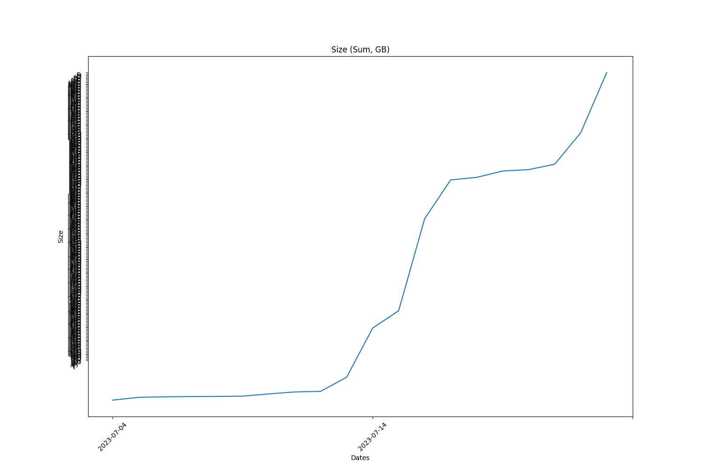
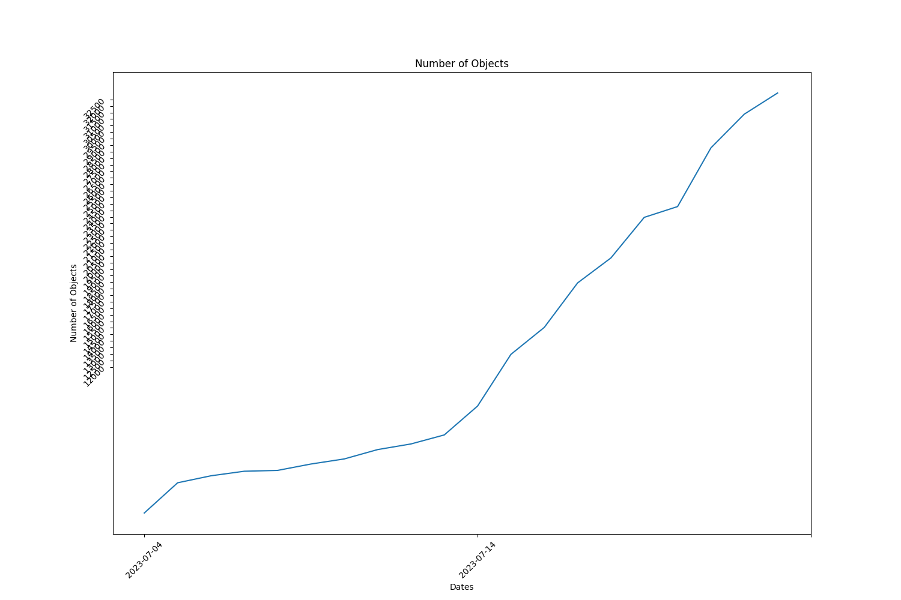

Full report for the Term: 15 

Start date: 2023-08-01  

End date: 2023-08-16 

Start Block: 3369615 

End Block: 3585616 

# Opening 
Number of openings: 1 
| id                     | createdAt                |
|------------------------|--------------------------|
| storageWorkingGroup-21 | 2023-08-05T17:14:30.000Z |
# Hiring
Number of hired works: 1
| id                     |   membershipId | createdAt                |
|------------------------|----------------|--------------------------|
| storageWorkingGroup-12 |           2502 | 2023-08-05T17:10:18.000Z |
# Terminated workers 
Number of terminated workers: 0 
# Slashed workers 
Number of slashed workers: 0 
# Rewards
Total Rewards: 1841073792077140
| workerId               |    worker_total |
|------------------------|-----------------|
| storageWorkingGroup-0  | 417459000000000 |
| storageWorkingGroup-10 | 155771605287200 |
| storageWorkingGroup-11 | 166898148522000 |
| storageWorkingGroup-12 |  99556147135940 |
| storageWorkingGroup-2  | 166898148522000 |
| storageWorkingGroup-4  | 166898148522000 |
| storageWorkingGroup-6  | 166898148522000 |
| storageWorkingGroup-7  | 166898148522000 |
| storageWorkingGroup-8  | 166898148522000 |
| storageWorkingGroup-9  | 166898148522000 |
# BUCKETS Info  
|   id |   dataObjectsSize |   dataObjectsSizeLimit |   dataObjectsCount |   bags |   Utilization |   dataObjectsSize, GB |
|------|-------------------|------------------------|--------------------|--------|---------------|-----------------------|
|   11 |     2135802861963 |         36000000000000 |              47212 |    756 |    0.0593279  |              1987.18  |
|   12 |      416238757722 |         50000000000000 |              13710 |    407 |    0.00832478 |               387.274 |
|    7 |     2815332095042 |          6700000000000 |              71420 |   8765 |    0.420199   |              2619.42  |
|    8 |    10290337608835 |         20000000000000 |              42876 |    743 |    0.514517   |              9574.27  |
|   10 |      815471106437 |         22000000000000 |              27794 |    657 |    0.0370669  |               758.726 |
|    2 |     5998428287542 |         21000000000000 |             102632 |  26087 |    0.285639   |              5581.02  |
|    4 |    13132614276979 |         28000000000000 |             121816 |  26403 |    0.469022   |             12218.8   |
|    0 |     9979390592748 |         28000000000000 |             118500 |  26263 |    0.356407   |              9284.96  |
|    3 |     7377047854182 |         28500000000000 |              85188 |  13844 |    0.258844   |              6863.71  |
|    1 |     4977054618418 |         21000000000000 |             103078 |   8750 |    0.237003   |              4630.72  |
## BUCKETS CREATED
Bucket Created: 1
|   id |   dataObjectsSize |   dataObjectsSizeLimit |   dataObjectsCount |   bags |   Utilization |   dataObjectsSize, GB |
|------|-------------------|------------------------|--------------------|--------|---------------|-----------------------|
|   12 |      416238757722 |         50000000000000 |              13710 |    407 |    0.00832478 |               387.274 |
## BUCKETS DELETED
Bucket Deleted: 0
## Bags
Bags Created: 775 

Bags Deleted: 0 

# Objects Info during this Council Period 
Total Objects Size: 49085 

Total Objects Size: 1948701325398 bytes 

## Objects Size Distribution
|   <10 MB |   <100 MB |   <1000 MB |   <10000 MB |   <100000 MB |   <1000000 MB |
|----------|-----------|------------|-------------|--------------|---------------|
|    29343 |     46191 |      48782 |       49085 |        49085 |         49085 |
 
|   0-10 MB |   10-100 MB |   100-1000 MB |   1000-10000 MB |   10000-100000 MB |   100000-10000000 MB |
|-----------|-------------|---------------|-----------------|-------------------|----------------------|
|     29343 |       16848 |          2591 |             303 |                 0 |                    0 |
## Objects Size Distribution Per Bag 
|   0-10 MB |   10-100 MB |   100-1000 MB |   1000-10000 MB |   10000-100000 MB |   100000-10000000 MB |
|-----------|-------------|---------------|-----------------|-------------------|----------------------|
|     29343 |       16848 |          2591 |             303 |                 0 |                    0 |
# Total object Info 
Total Objects: 183199 

Total Objects Size: 12560453776599 bytes

Total Number of Bags in use: 1664 bytes

Grand Total Number of Bags: 28172 bytes

## Objects Size Distribution 
|   <10 MB |   <100 MB |   <1000 MB |   <10000 MB |   <100000 MB |   <1000000 MB |
|----------|-----------|------------|-------------|--------------|---------------|
|   125546 |    170898 |     181338 |      183037 |       183199 |        183199 |
 
|   0-10 MB |   10-100 MB |   100-1000 MB |   1000-10000 MB |   10000-100000 MB |   100000-10000000 MB |
|-----------|-------------|---------------|-----------------|-------------------|----------------------|
|    125546 |       45352 |         10440 |            1699 |               162 |                    0 |
## Objects Size Distribution Per Bag 
|   0-10 MB |   10-100 MB |   100-1000 MB |   1000-10000 MB |   10000-100000 MB |   100000-10000000 MB |
|-----------|-------------|---------------|-----------------|-------------------|----------------------|
|    125546 |       45352 |         10440 |            1699 |               162 |                    0 |

 
  
# Lost Objects - GraphQl 
Total Objects: 49085 

Total Lost Objects: 172 

Percentage Lost Objects: %0.35041254965875523 

|     id | createdAt                |      size |   storageBagId |
|--------|--------------------------|-----------|----------------|
| 104532 | 2023-08-01T20:40:00.000Z |    216489 |          26812 |
| 104531 | 2023-08-01T20:40:00.000Z |    109057 |          26812 |
| 105524 | 2023-08-02T11:41:30.001Z |     88876 |          26738 |
| 106143 | 2023-08-02T14:36:42.000Z |      4968 |          26236 |
| 107588 | 2023-08-02T21:02:00.000Z |    112547 |          26814 |
| 112412 | 2023-08-03T19:01:06.000Z |    347412 |          26819 |
| 116887 | 2023-08-05T04:58:18.000Z |    360786 |          26862 |
| 115931 | 2023-08-04T17:35:42.001Z |    274429 |          26833 |
| 115930 | 2023-08-04T17:35:42.001Z |     73162 |          26833 |
| 115877 | 2023-08-04T16:57:06.001Z |    298191 |          26828 |
| 115876 | 2023-08-04T16:57:06.001Z |     65824 |          26828 |
| 116886 | 2023-08-05T04:58:18.000Z |     63044 |          26862 |
| 117309 | 2023-08-05T07:34:54.000Z |    236102 |          26869 |
| 117308 | 2023-08-05T07:34:54.000Z |     41774 |          26869 |
| 119856 | 2023-08-05T17:03:06.000Z |    319598 |          26890 |
| 118869 | 2023-08-05T13:20:24.000Z |    207966 |          26883 |
| 118868 | 2023-08-05T13:20:24.000Z |     62681 |          26883 |
| 118259 | 2023-08-05T11:07:12.000Z |    110716 |          26877 |
| 118258 | 2023-08-05T11:07:12.000Z |     74952 |          26877 |
| 118351 | 2023-08-05T11:26:36.000Z |    189485 |          26879 |
| 118350 | 2023-08-05T11:26:36.000Z |     55432 |          26879 |
| 119693 | 2023-08-05T16:27:24.001Z |    305415 |          26889 |
| 119692 | 2023-08-05T16:27:24.001Z |     82766 |          26889 |
| 119855 | 2023-08-05T17:03:06.000Z |     86359 |          26890 |
| 120440 | 2023-08-05T19:12:36.000Z |    191189 |          26899 |
| 120750 | 2023-08-05T20:14:36.001Z |    304534 |          26900 |
| 120749 | 2023-08-05T20:14:36.001Z |     80724 |          26900 |
| 120838 | 2023-08-05T20:33:18.000Z |    193416 |          26902 |
| 120764 | 2023-08-05T20:20:36.000Z |    306810 |          26901 |
| 120763 | 2023-08-05T20:20:36.000Z |     72646 |          26901 |
| 120837 | 2023-08-05T20:33:18.000Z |     59240 |          26902 |
| 128551 | 2023-08-07T12:16:36.000Z |    251959 |          26961 |
| 123291 | 2023-08-06T04:52:48.000Z |    333189 |          26909 |
| 123290 | 2023-08-06T04:52:48.000Z |     56223 |          26909 |
| 128200 | 2023-08-06T22:08:36.000Z |    124063 |          26942 |
| 128199 | 2023-08-06T22:08:36.000Z |     61984 |          26942 |
| 124944 | 2023-08-06T11:07:36.001Z |      4054 |          26918 |
| 129972 | 2023-08-07T16:53:00.001Z |    223651 |          27009 |
| 129410 | 2023-08-07T14:59:00.000Z |    305091 |          26977 |
| 129858 | 2023-08-07T16:29:18.001Z |    298470 |          26998 |
| 129857 | 2023-08-07T16:29:18.001Z |     76794 |          26998 |
| 129919 | 2023-08-07T16:45:54.000Z |    167305 |          27002 |
| 129918 | 2023-08-07T16:45:54.000Z |     44870 |          27002 |
| 129937 | 2023-08-07T16:48:18.000Z |     83739 |          27005 |
| 129936 | 2023-08-07T16:48:18.000Z |     56916 |          27005 |
| 129971 | 2023-08-07T16:53:00.001Z |     56316 |          27009 |
| 130080 | 2023-08-07T17:09:12.000Z |    258891 |          27024 |
| 130014 | 2023-08-07T16:59:18.000Z |     65606 |          27015 |
| 130013 | 2023-08-07T16:59:18.000Z |     20941 |          27015 |
| 130079 | 2023-08-07T17:09:12.000Z |     94387 |          27024 |
| 130412 | 2023-08-07T18:15:06.000Z |    307911 |          27043 |
| 130156 | 2023-08-07T17:25:30.001Z |    351919 |          27030 |
| 130155 | 2023-08-07T17:25:30.001Z |     81302 |          27030 |
| 130179 | 2023-08-07T17:28:36.000Z |    253871 |          27033 |
| 130178 | 2023-08-07T17:28:36.000Z |     62938 |          27033 |
| 130411 | 2023-08-07T18:15:06.000Z |     60625 |          27043 |
| 130426 | 2023-08-07T18:17:06.001Z |    242360 |          27045 |
| 130425 | 2023-08-07T18:17:06.001Z |     39099 |          27045 |
| 134511 | 2023-08-08T07:54:18.001Z |     94338 |          27101 |
| 130774 | 2023-08-07T19:36:48.000Z |    138450 |          27057 |
| 130773 | 2023-08-07T19:36:48.000Z |     79269 |          27057 |
| 130776 | 2023-08-07T19:38:18.001Z |    435114 |          27058 |
| 130775 | 2023-08-07T19:38:18.001Z |     96435 |          27058 |
| 131535 | 2023-08-07T22:15:54.000Z |     41573 |          27077 |
| 131534 | 2023-08-07T22:15:54.000Z |     49918 |          27077 |
| 131626 | 2023-08-07T22:33:42.001Z |     66733 |          27078 |
| 131627 | 2023-08-07T22:33:42.001Z |    255346 |          27078 |
| 132248 | 2023-08-08T00:34:30.000Z |     56374 |          27081 |
| 132720 | 2023-08-08T02:10:54.000Z |    303296 |          27083 |
| 134510 | 2023-08-08T07:54:18.001Z |     49236 |          27101 |
| 134897 | 2023-08-08T09:01:54.001Z |     62014 |          26986 |
| 134548 | 2023-08-08T08:00:24.000Z |      3002 |          27073 |
| 134896 | 2023-08-08T09:01:54.001Z |      7462 |          26986 |
| 135111 | 2023-08-08T09:41:42.000Z |     53872 |          27098 |
| 136531 | 2023-08-08T14:17:36.001Z |    370647 |          27142 |
| 136530 | 2023-08-08T14:17:36.001Z |     82773 |          27142 |
| 136539 | 2023-08-08T14:18:48.000Z |    258164 |          27143 |
| 136538 | 2023-08-08T14:18:48.000Z |     76475 |          27143 |
| 137551 | 2023-08-08T17:49:42.000Z |     14196 |          27149 |
| 137114 | 2023-08-08T16:15:12.001Z |    358987 |          27150 |
| 137113 | 2023-08-08T16:15:12.001Z |     80242 |          27150 |
| 137352 | 2023-08-08T17:10:06.000Z |      8796 |          27155 |
| 137971 | 2023-08-08T19:19:30.000Z |    270166 |          27164 |
| 137970 | 2023-08-08T19:19:30.000Z |     17527 |          27164 |
| 139003 | 2023-08-08T22:41:06.001Z |    378153 |          27170 |
| 138173 | 2023-08-08T19:58:06.000Z |    271352 |          27167 |
| 138172 | 2023-08-08T19:58:06.000Z |     76297 |          27167 |
| 139002 | 2023-08-08T22:41:06.001Z |     64833 |          27170 |
| 140640 | 2023-08-09T06:58:54.000Z |    179741 |          27177 |
| 140639 | 2023-08-09T06:58:54.000Z |     46171 |          27177 |
| 140723 | 2023-08-09T09:48:00.000Z |     55745 |          27185 |
| 140722 | 2023-08-09T09:48:00.000Z |     78475 |          27185 |
| 140673 | 2023-08-09T07:53:24.000Z |    377209 |          27180 |
| 140672 | 2023-08-09T07:53:24.000Z |     55821 |          27180 |
| 141307 | 2023-08-09T17:33:06.000Z |     23634 |          27204 |
| 140698 | 2023-08-09T08:47:36.000Z |     99022 |          26678 |
| 140697 | 2023-08-09T08:47:36.000Z |      4768 |          26678 |
| 141306 | 2023-08-09T17:33:06.000Z |      5920 |          27204 |
| 142448 | 2023-08-10T19:28:42.000Z |    224311 |          27238 |
| 142417 | 2023-08-10T16:56:30.000Z |    191656 |          27233 |
| 142459 | 2023-08-10T19:49:48.000Z |    339636 |          27240 |
| 142458 | 2023-08-10T19:49:48.000Z |     82405 |          27240 |
| 142461 | 2023-08-10T20:05:12.001Z |      4736 |          27233 |
| 142577 | 2023-08-11T12:07:18.000Z |   2182546 |          26279 |
| 142514 | 2023-08-11T07:12:06.000Z |    304186 |          27245 |
| 142578 | 2023-08-11T12:07:18.000Z |      7850 |          26279 |
| 142850 | 2023-08-11T19:19:18.000Z |    135382 |          27279 |
| 142849 | 2023-08-11T19:19:18.000Z |     55204 |          27279 |
| 142848 | 2023-08-11T19:19:00.000Z |    362163 |          27278 |
| 142847 | 2023-08-11T19:19:00.000Z |     60477 |          27278 |
| 142596 | 2023-08-11T13:12:42.000Z |    140706 |          27263 |
| 143612 | 2023-08-12T11:09:18.000Z |    239933 |          27338 |
| 143083 | 2023-08-12T08:11:48.001Z |     30676 |          27320 |
| 143082 | 2023-08-12T08:11:48.001Z |     30975 |          27320 |
| 142873 | 2023-08-11T20:41:30.000Z |    160719 |          27293 |
| 142872 | 2023-08-11T20:41:30.000Z |     24752 |          27293 |
| 142865 | 2023-08-11T20:00:54.001Z |     49594 |          27288 |
| 142864 | 2023-08-11T20:00:54.001Z |     44007 |          27288 |
| 142874 | 2023-08-11T20:42:54.000Z |     11084 |          27294 |
| 142880 | 2023-08-11T21:12:30.000Z |      7182 |          26977 |
| 142887 | 2023-08-11T22:11:24.001Z | 180300574 |          27233 |
| 142888 | 2023-08-11T22:11:24.001Z |     35298 |          27233 |
| 142893 | 2023-08-12T02:52:12.001Z |    360459 |          27307 |
| 142892 | 2023-08-12T02:52:12.001Z |     93411 |          27307 |
| 143001 | 2023-08-12T07:42:48.000Z |    253096 |          27318 |
| 143611 | 2023-08-12T11:09:18.000Z |     10945 |          27338 |
| 144561 | 2023-08-13T11:54:48.000Z |     70179 |          27407 |
| 144225 | 2023-08-12T16:25:54.001Z |    360076 |          27365 |
| 144220 | 2023-08-12T15:57:42.000Z |    425264 |          27359 |
| 144224 | 2023-08-12T16:25:54.001Z |     73632 |          27365 |
| 144464 | 2023-08-13T08:47:18.000Z |     32146 |          27382 |
| 144467 | 2023-08-13T08:54:48.000Z |     11078 |          27392 |
| 144245 | 2023-08-12T20:22:18.001Z | 425138958 |          27374 |
| 144256 | 2023-08-12T23:37:36.000Z |    349039 |          27377 |
| 144255 | 2023-08-12T23:37:36.000Z |     77317 |          27377 |
| 144607 | 2023-08-13T14:20:42.001Z |    303114 |          27421 |
| 144606 | 2023-08-13T14:20:42.001Z |     86409 |          27421 |
| 144609 | 2023-08-13T14:33:00.000Z |    175973 |          27423 |
| 144608 | 2023-08-13T14:33:00.000Z |     52291 |          27423 |
| 144623 | 2023-08-13T14:55:42.000Z |    293103 |          27427 |
| 144622 | 2023-08-13T14:55:42.000Z |     85446 |          27427 |
| 144595 | 2023-08-13T13:51:36.000Z |    128908 |          27417 |
| 144594 | 2023-08-13T13:51:36.000Z |     54597 |          27417 |
| 144562 | 2023-08-13T11:54:48.000Z |     80485 |          27407 |
| 144597 | 2023-08-13T14:02:12.000Z |     96237 |          27418 |
| 144670 | 2023-08-13T16:45:00.001Z |    207601 |          27436 |
| 144748 | 2023-08-13T19:57:42.000Z |    134879 |          27453 |
| 144669 | 2023-08-13T16:45:00.001Z |     62423 |          27436 |
| 144694 | 2023-08-13T18:05:24.000Z |    114338 |          27369 |
| 144693 | 2023-08-13T18:05:24.000Z |     12644 |          27369 |
| 144747 | 2023-08-13T19:57:42.000Z |     36079 |          27453 |
| 145014 | 2023-08-14T15:05:18.001Z | 467858724 |          27483 |
| 144895 | 2023-08-14T10:54:18.000Z |    321687 |          27474 |
| 145037 | 2023-08-14T15:17:06.000Z |     23460 |          27492 |
| 145036 | 2023-08-14T15:17:06.000Z |     75619 |          27492 |
| 145075 | 2023-08-14T15:26:36.000Z |    192763 |          27494 |
| 145074 | 2023-08-14T15:26:36.000Z |     47337 |          27494 |
| 146226 | 2023-08-14T20:17:18.000Z |    251687 |          27511 |
| 146551 | 2023-08-14T21:28:24.001Z |      5006 |          27518 |
| 146237 | 2023-08-14T20:19:00.000Z |    209160 |          27512 |
| 148812 | 2023-08-15T13:17:06.000Z |    172100 |          27537 |
| 148570 | 2023-08-15T12:08:24.000Z |     25144 |          26940 |
| 148505 | 2023-08-15T06:39:42.013Z |     35474 |          27487 |
| 148811 | 2023-08-15T13:17:06.000Z |     79551 |          27537 |
| 149605 | 2023-08-15T18:04:48.000Z |    133507 |          27546 |
| 149604 | 2023-08-15T18:04:48.000Z |     85756 |          27546 |
| 151001 | 2023-08-16T01:10:42.002Z |    433978 |          27551 |
| 151000 | 2023-08-16T01:10:42.002Z |     81113 |          27551 |
| 151708 | 2023-08-16T04:36:12.000Z |     19522 |          27553 |
| 152367 | 2023-08-16T07:45:54.000Z |      1142 |          27573 |
| 152057 | 2023-08-16T06:19:00.001Z |  66693362 |          27557 |
| 152355 | 2023-08-16T07:40:48.000Z |    315626 |          27573 | 
