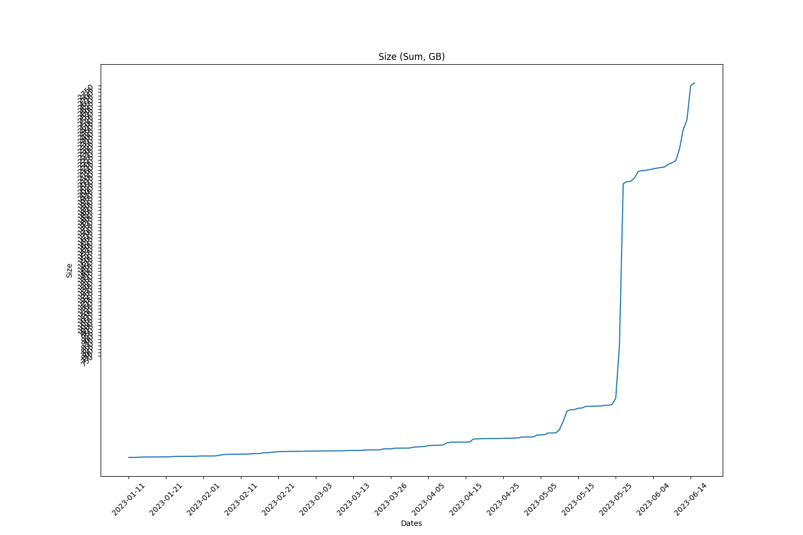
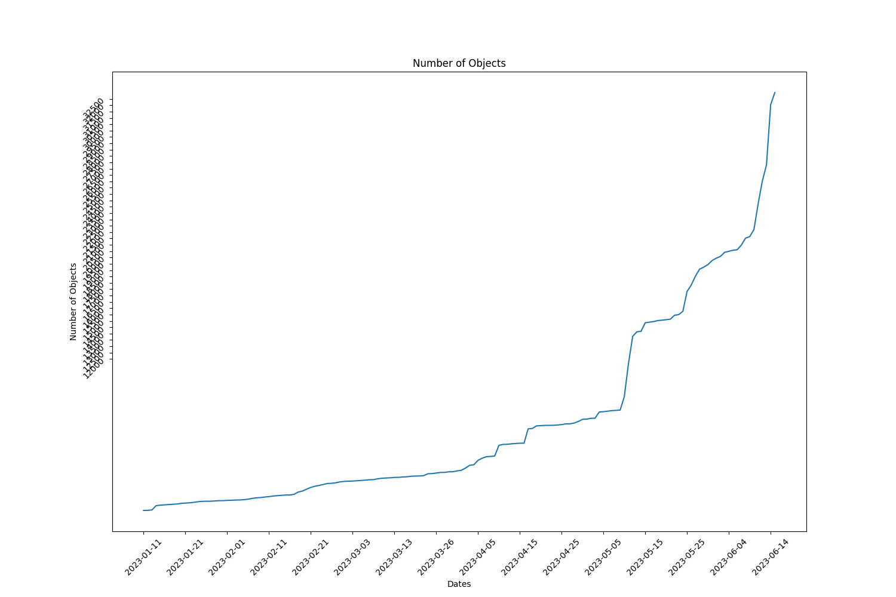

Full report for the Term: 16 

Start date: 2023-08-16  

End date: 2023-08-31 

Start Block: 3585616 

End Block: 3801617 

# Opening 
Number of openings: 0 
# Hiring
Number of hired works: 0
# Terminated workers 
Number of terminated workers: 0 
# Slashed workers 
Number of slashed workers: 0 
# Rewards
Total Rewards: 1919542336698000
| workerId               |    worker_total |
|------------------------|-----------------|
| storageWorkingGroup-0  | 417459000000000 |
| storageWorkingGroup-10 | 166898148522000 |
| storageWorkingGroup-11 | 166898148522000 |
| storageWorkingGroup-12 | 166898148522000 |
| storageWorkingGroup-2  | 166898148522000 |
| storageWorkingGroup-4  | 166898148522000 |
| storageWorkingGroup-6  | 166898148522000 |
| storageWorkingGroup-7  | 166898148522000 |
| storageWorkingGroup-8  | 166898148522000 |
| storageWorkingGroup-9  | 166898148522000 |
# BUCKETS Info  
|   id |   dataObjectsSize |   dataObjectsSizeLimit |   dataObjectsCount |   bags |   Utilization |   dataObjectsSize, GB |
|------|-------------------|------------------------|--------------------|--------|---------------|-----------------------|
|   12 |      658180363167 |         50000000000000 |              20332 |    601 |     0.0131636 |                612.38 |
|    7 |     2856411566807 |         21500000000000 |              72617 |   8778 |     0.132856  |               2657.65 |
|    8 |    10609274995960 |         20000000000000 |              52157 |    932 |     0.530464  |               9871.02 |
|   11 |     2391038031782 |         36000000000000 |              54550 |    947 |     0.0664177 |               2224.66 |
|   10 |     1022470006070 |         22000000000000 |              33774 |    857 |     0.0464759 |                951.32 |
|    4 |    13276079581973 |         28000000000000 |             128392 |  26601 |     0.474146  |              12352.2  |
|    0 |    10248974223282 |         28000000000000 |             127490 |  26463 |     0.366035  |               9535.79 |
|    2 |     6249826632055 |         21000000000000 |             110815 |  26297 |     0.297611  |               5814.93 |
|    1 |     5131855626111 |         21000000000000 |             109269 |   8948 |     0.244374  |               4774.75 |
|    3 |     7513712095414 |         28500000000000 |              90500 |  14027 |     0.263639  |               6990.86 |
## BUCKETS CREATED
Bucket Created: 0
## BUCKETS DELETED
Bucket Deleted: 0
## Bags
Bags Created: 627 

Bags Deleted: 0 

# Objects Info during this Council Period 
Total Objects Size: 34445 

Total Objects Size: 847875710049 bytes 

## Objects Size Distribution
|   <10 MB |   <100 MB |   <1000 MB |   <10000 MB |   <100000 MB |   <1000000 MB |
|----------|-----------|------------|-------------|--------------|---------------|
|    21581 |     33177 |      34394 |       34445 |        34445 |         34445 |
 
|   0-10 MB |   10-100 MB |   100-1000 MB |   1000-10000 MB |   10000-100000 MB |   100000-10000000 MB |
|-----------|-------------|---------------|-----------------|-------------------|----------------------|
|     21581 |       11596 |          1217 |              51 |                 0 |                    0 |
## Objects Size Distribution Per Bag 
|   0-10 MB |   10-100 MB |   100-1000 MB |   1000-10000 MB |   10000-100000 MB |   100000-10000000 MB |
|-----------|-------------|---------------|-----------------|-------------------|----------------------|
|     21581 |       11596 |          1217 |              51 |                 0 |                    0 |
# Total object Info 
Total Objects: 199610 

Total Objects Size: 15635353647331 bytes

Total Number of Bags in use: 2625 bytes

Grand Total Number of Bags: 28616 bytes

## Objects Size Distribution 
|   <10 MB |   <100 MB |   <1000 MB |   <10000 MB |   <100000 MB |   <1000000 MB |
|----------|-----------|------------|-------------|--------------|---------------|
|   126620 |    185506 |     197354 |      199433 |       199610 |        199610 |
 
|   0-10 MB |   10-100 MB |   100-1000 MB |   1000-10000 MB |   10000-100000 MB |   100000-10000000 MB |
|-----------|-------------|---------------|-----------------|-------------------|----------------------|
|    126620 |       58886 |         11848 |            2079 |               177 |                    0 |
## Objects Size Distribution Per Bag 
|   0-10 MB |   10-100 MB |   100-1000 MB |   1000-10000 MB |   10000-100000 MB |   100000-10000000 MB |
|-----------|-------------|---------------|-----------------|-------------------|----------------------|
|    126620 |       58886 |         11848 |            2079 |               177 |                    0 |

 
  
# Lost Objects - GraphQl 
Total Objects: 34445 

Total Lost Objects: 92 

Percentage Lost Objects: %0.26709246625054434 

|     id | createdAt                |       size |   storageBagId |
|--------|--------------------------|------------|----------------|
| 153325 | 2023-08-16T12:29:54.000Z |      76007 |          27606 |
| 153324 | 2023-08-16T12:29:54.000Z |      71979 |          27606 |
| 154223 | 2023-08-16T16:40:18.000Z |      28056 |          27629 |
| 154107 | 2023-08-16T16:08:24.000Z |      14352 |          27625 |
| 155287 | 2023-08-16T23:03:30.001Z |      23681 |          27666 |
| 155175 | 2023-08-16T20:58:00.001Z |     291677 |          27654 |
| 155174 | 2023-08-16T20:58:00.001Z |      62024 |          27654 |
| 156917 | 2023-08-17T18:38:48.000Z |       5714 |          27727 |
| 155356 | 2023-08-17T05:44:06.001Z |     317778 |          27680 |
| 156003 | 2023-08-17T13:27:00.001Z |       5520 |          27702 |
| 155343 | 2023-08-17T04:17:54.001Z |     326654 |          27676 |
| 155342 | 2023-08-17T04:17:54.001Z |       6773 |          27676 |
| 156478 | 2023-08-17T15:54:18.001Z |   46022168 |          27716 |
| 156928 | 2023-08-17T20:45:48.000Z |      92103 |          27732 |
| 161519 | 2023-08-18T20:12:18.000Z |      85988 |          27767 |
| 156942 | 2023-08-17T22:39:18.001Z |     102551 |          27738 |
| 158497 | 2023-08-18T12:16:48.000Z |     193416 |          27747 |
| 158496 | 2023-08-18T12:16:48.000Z |      59240 |          27747 |
| 160337 | 2023-08-18T17:13:42.000Z |     304185 |          27757 |
| 160336 | 2023-08-18T17:13:42.000Z |      32143 |          27757 |
| 161520 | 2023-08-18T20:12:18.000Z |     398469 |          27767 |
| 162182 | 2023-08-20T16:11:36.000Z |     394303 |          27815 |
| 162210 | 2023-08-20T19:26:18.000Z |     165826 |          27434 |
| 162209 | 2023-08-20T19:26:18.000Z |       9056 |          27434 |
| 163239 | 2023-08-22T11:33:30.001Z |     124520 |          27866 |
| 162538 | 2023-08-22T02:47:24.000Z |     197239 |          27861 |
| 162537 | 2023-08-22T02:47:24.000Z |      59857 |          27861 |
| 162327 | 2023-08-21T10:52:30.001Z |      11552 |          27830 |
| 163238 | 2023-08-22T11:33:30.001Z |      30067 |          27866 |
| 164429 | 2023-08-22T17:45:18.000Z |      81524 |          27882 |
| 163326 | 2023-08-22T11:54:54.000Z |    9296540 |          27736 |
| 163327 | 2023-08-22T11:54:54.000Z |      10008 |          27736 |
| 166943 | 2023-08-23T06:01:00.000Z |     345432 |          27921 |
| 164626 | 2023-08-22T18:39:48.000Z |      28666 |          27893 |
| 165075 | 2023-08-22T20:42:36.000Z |      30769 |          27908 |
| 165074 | 2023-08-22T20:42:36.000Z |      54131 |          27908 |
| 165162 | 2023-08-22T21:04:12.000Z |       2644 |          27877 |
| 164554 | 2023-08-22T18:16:24.000Z |      92256 |          27888 |
| 164569 | 2023-08-22T18:21:42.000Z |     282860 |          27890 |
| 164555 | 2023-08-22T18:16:24.000Z |     179425 |          27888 |
| 164568 | 2023-08-22T18:21:42.000Z |      76476 |          27890 |
| 164854 | 2023-08-22T19:42:24.000Z |      58867 |          27902 |
| 165188 | 2023-08-22T21:11:06.000Z |     414341 |          27911 |
| 165187 | 2023-08-22T21:11:06.000Z |      53340 |          27911 |
| 166942 | 2023-08-23T06:01:00.000Z |       9098 |          27921 |
| 168409 | 2023-08-23T13:50:00.000Z |     270563 |          27952 |
| 167471 | 2023-08-23T08:33:12.000Z |     198037 |          27927 |
| 167644 | 2023-08-23T09:24:36.000Z |     239329 |          27930 |
| 167643 | 2023-08-23T09:24:36.000Z |      29549 |          27930 |
| 167945 | 2023-08-23T10:45:48.000Z |     162280 |          27935 |
| 167944 | 2023-08-23T10:45:48.000Z |      89537 |          27935 |
| 168408 | 2023-08-23T13:50:00.000Z |      67038 |          27952 |
| 169603 | 2023-08-23T19:10:12.005Z |      66174 |          27968 |
| 168508 | 2023-08-23T14:18:48.001Z |     279450 |          27954 |
| 168507 | 2023-08-23T14:18:48.001Z |      98713 |          27954 |
| 169602 | 2023-08-23T19:10:12.005Z |      74695 |          27968 |
| 170007 | 2023-08-23T21:20:24.001Z | 1081610423 |          27975 |
| 169977 | 2023-08-23T21:08:42.000Z |  639369216 |          27967 |
| 170258 | 2023-08-23T23:09:30.000Z | 1081610423 |          27975 |
| 171106 | 2023-08-24T08:31:42.000Z |      62882 |          27998 |
| 171127 | 2023-08-24T12:55:18.001Z |      47927 |          28006 |
| 170494 | 2023-08-24T00:43:54.000Z |     489680 |          27985 |
| 170493 | 2023-08-24T00:43:54.000Z |      70775 |          27985 |
| 171105 | 2023-08-24T08:31:42.000Z |      44669 |          27998 |
| 172700 | 2023-08-25T14:07:48.035Z |      26470 |          27772 |
| 171143 | 2023-08-24T15:21:30.000Z |      86574 |          28014 |
| 171142 | 2023-08-24T15:21:30.000Z |      16632 |          28014 |
| 171581 | 2023-08-24T18:45:48.000Z |      36611 |          28021 |
| 173004 | 2023-08-25T17:58:42.000Z |     149749 |          28054 |
| 177788 | 2023-08-27T21:32:24.000Z |      32013 |          28110 |
| 177787 | 2023-08-27T21:32:24.000Z |      98135 |          28110 |
| 173998 | 2023-08-26T07:42:06.000Z |     191359 |          28065 |
| 173997 | 2023-08-26T07:42:06.000Z |      19743 |          28065 |
| 174749 | 2023-08-26T14:36:06.000Z |      48742 |          28079 |
| 174748 | 2023-08-26T14:36:06.000Z |      35530 |          28079 |
| 175704 | 2023-08-26T23:35:54.000Z |   59796440 |          27692 |
| 180087 | 2023-08-28T16:04:18.000Z |       9040 |          28124 |
| 178908 | 2023-08-28T05:51:24.000Z |  378186739 |          28116 |
| 183082 | 2023-08-29T18:09:36.000Z |      90254 |          28150 |
| 180073 | 2023-08-28T15:58:54.000Z |  718988364 |          28084 |
| 180074 | 2023-08-28T15:58:54.000Z |      25918 |          28084 |
| 180088 | 2023-08-28T16:04:18.000Z |     304763 |          28124 |
| 183327 | 2023-08-29T20:12:48.000Z |      12688 |          26517 |
| 184166 | 2023-08-30T12:18:12.000Z |     132436 |          28171 |
| 183445 | 2023-08-29T21:20:06.000Z |      87183 |          28153 |
| 183777 | 2023-08-30T03:19:18.000Z |      18684 |          27488 |
| 184165 | 2023-08-30T12:18:12.000Z |      79793 |          28171 |
| 185279 | 2023-08-30T18:08:12.001Z |     306453 |          28182 |
| 185278 | 2023-08-30T18:08:12.001Z |      96829 |          28182 |
| 186970 | 2023-08-31T06:01:48.000Z |      16966 |          28200 |
| 187007 | 2023-08-31T08:36:48.001Z |      20122 |          28205 |
| 186414 | 2023-08-30T23:47:18.001Z |      12697 |          28192 | 
