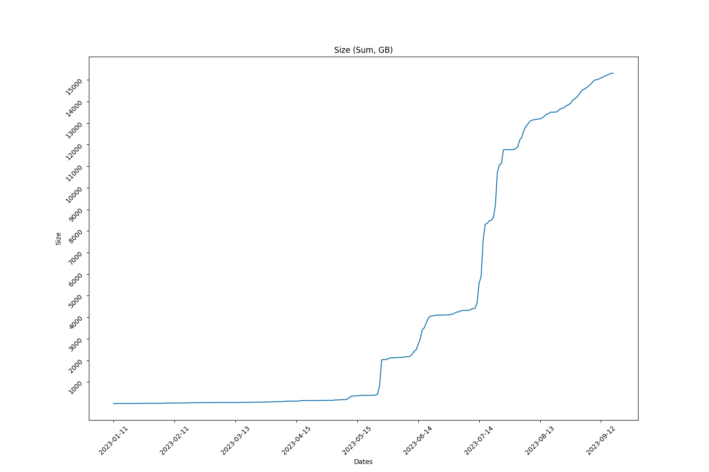
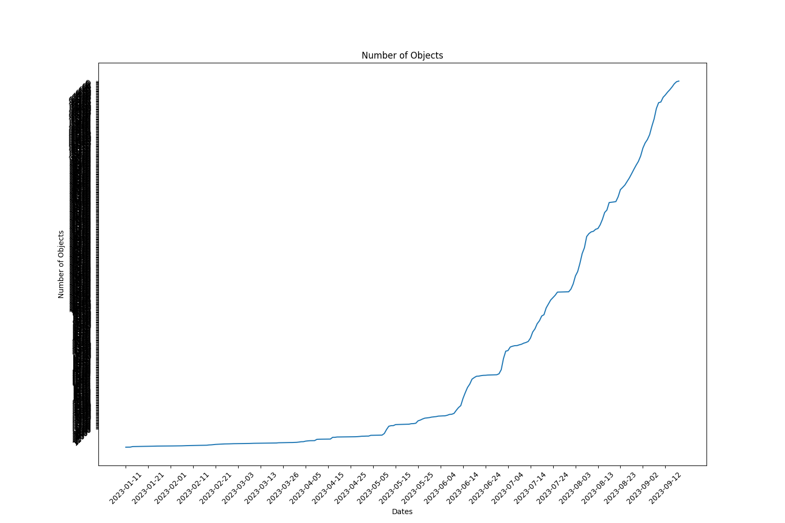

Full report for the Term: 17 

Start date: 2023-08-31  

End date: 2023-09-15 

Start Block: 3801617 

End Block: 4017618 

# Opening 
Number of openings: 0 
# Hiring
Number of hired works: 0
# Terminated workers 
Number of terminated workers: 0 
# Slashed workers 
Number of slashed workers: 0 
# Rewards
Total Rewards: 1837403902447592
| workerId               |    worker_total |
|------------------------|-----------------|
| storageWorkingGroup-0  | 389628400000000 |
| storageWorkingGroup-10 | 155771605287200 |
| storageWorkingGroup-11 | 166898148522000 |
| storageWorkingGroup-12 | 155771605287200 |
| storageWorkingGroup-2  | 155771605287200 |
| storageWorkingGroup-4  | 166898148522000 |
| storageWorkingGroup-6  | 166898148522000 |
| storageWorkingGroup-7  | 157096487210792 |
| storageWorkingGroup-8  | 166898148522000 |
| storageWorkingGroup-9  | 155771605287200 |
# BUCKETS Info  
|   id |   dataObjectsSize |   dataObjectsSizeLimit |   dataObjectsCount |   bags |   Utilization |   dataObjectsSize, GB |
|------|-------------------|------------------------|--------------------|--------|---------------|-----------------------|
|    7 |     3098319942286 |         21500000000000 |              85452 |   9080 |     0.144108  |               2882.72 |
|   11 |     2669078846777 |         36000000000000 |              70316 |   1246 |     0.0741411 |               2483.35 |
|   10 |     1406708461938 |         22000000000000 |              51179 |   1167 |     0.0639413 |               1308.82 |
|   12 |     1005896681422 |         50000000000000 |              35222 |    887 |     0.0201179 |                935.9  |
|    8 |    10830022740497 |         20000000000000 |              60758 |    979 |     0.541501  |              10076.4  |
|    0 |    10687559094818 |         28000000000000 |             150227 |  26778 |     0.381699  |               9943.85 |
|    4 |    13589105418508 |         28000000000000 |             146564 |  26898 |     0.485325  |              12643.5  |
|    2 |     6609388637385 |         21000000000000 |             125748 |  26586 |     0.314733  |               6149.47 |
|    3 |     7837152965318 |         28500000000000 |             107528 |  14348 |     0.274988  |               7291.8  |
|    1 |     5479777412761 |         21000000000000 |             127780 |   9246 |     0.260942  |               5098.46 |
## BUCKETS CREATED
Bucket Created: 0
## BUCKETS DELETED
Bucket Deleted: 0
## Bags
Bags Created: 967 

Bags Deleted: 0 

# Objects Info during this Council Period 
Total Objects Size: 49548 

Total Objects Size: 1149922668842 bytes 

## Objects Size Distribution
|   <10 MB |   <100 MB |   <1000 MB |   <10000 MB |   <100000 MB |   <1000000 MB |
|----------|-----------|------------|-------------|--------------|---------------|
|    29084 |     47604 |      49526 |       49546 |        49548 |         49548 |
 
|   0-10 MB |   10-100 MB |   100-1000 MB |   1000-10000 MB |   10000-100000 MB |   100000-10000000 MB |
|-----------|-------------|---------------|-----------------|-------------------|----------------------|
|     29084 |       18520 |          1922 |              20 |                 2 |                    0 |
## Objects Size Distribution Per Bag 
|   0-10 MB |   10-100 MB |   100-1000 MB |   1000-10000 MB |   10000-100000 MB |   100000-10000000 MB |
|-----------|-------------|---------------|-----------------|-------------------|----------------------|
|     29084 |       18520 |          1922 |              20 |                 2 |                    0 |
# Total object Info 
Total Objects: 239822 

Total Objects Size: 16448695942890 bytes

Total Number of Bags in use: 3194 bytes

Grand Total Number of Bags: 29307 bytes

## Objects Size Distribution 
|   <10 MB |   <100 MB |   <1000 MB |   <10000 MB |   <100000 MB |   <1000000 MB |
|----------|-----------|------------|-------------|--------------|---------------|
|   150629 |    224599 |     237550 |      239644 |       239822 |        239822 |
 
|   0-10 MB |   10-100 MB |   100-1000 MB |   1000-10000 MB |   10000-100000 MB |   100000-10000000 MB |
|-----------|-------------|---------------|-----------------|-------------------|----------------------|
|    150629 |       73970 |         12951 |            2094 |               178 |                    0 |
## Objects Size Distribution Per Bag 
|   0-10 MB |   10-100 MB |   100-1000 MB |   1000-10000 MB |   10000-100000 MB |   100000-10000000 MB |
|-----------|-------------|---------------|-----------------|-------------------|----------------------|
|    150629 |       73970 |         12951 |            2094 |               178 |                    0 |

 
  
# Lost Objects - GraphQl 
Total Objects: 49548 

Total Lost Objects: 185 

Percentage Lost Objects: %0.3733753128279648 

|     id | createdAt                |      size |   storageBagId |
|--------|--------------------------|-----------|----------------|
| 187520 | 2023-08-31T13:31:12.000Z |    281348 |          28212 |
| 187519 | 2023-08-31T13:31:12.000Z |     45436 |          28212 |
| 190544 | 2023-09-01T12:56:24.000Z |    306630 |          28245 |
| 190464 | 2023-09-01T12:30:06.000Z |    101597 |          28244 |
| 190463 | 2023-09-01T12:30:06.000Z |     28282 |          28244 |
| 190543 | 2023-09-01T12:56:24.000Z |     92674 |          28245 |
| 190550 | 2023-09-01T13:01:18.001Z |    132942 |          28139 |
| 190565 | 2023-09-01T13:07:00.001Z |     12856 |          28139 |
| 191356 | 2023-09-01T17:36:12.000Z |    240157 |          28261 |
| 191136 | 2023-09-01T16:27:00.000Z |     60418 |          28253 |
| 191355 | 2023-09-01T17:36:12.000Z |     63807 |          28261 |
| 191616 | 2023-09-01T18:59:42.001Z |      6052 |          28274 |
| 191471 | 2023-09-01T18:11:30.000Z |    115215 |          28267 |
| 191470 | 2023-09-01T18:11:30.000Z |     13224 |          28267 |
| 193318 | 2023-09-02T04:34:00.000Z |    101387 |          28302 |
| 194451 | 2023-09-02T10:20:54.000Z |    143421 |          28345 |
| 193547 | 2023-09-02T06:03:06.000Z |      7174 |          28307 |
| 194450 | 2023-09-02T10:20:54.000Z |     32473 |          28345 |
| 197163 | 2023-09-02T21:47:48.000Z |    104875 |          28434 |
| 195295 | 2023-09-02T13:37:36.001Z |    290884 |          28389 |
| 196905 | 2023-09-02T20:48:48.001Z |    199246 |          28428 |
| 196904 | 2023-09-02T20:48:48.001Z |     54310 |          28428 |
| 195163 | 2023-09-02T13:08:42.000Z |     53305 |          28384 |
| 195162 | 2023-09-02T13:08:42.000Z |     35010 |          28384 |
| 195433 | 2023-09-02T14:13:36.000Z |    490311 |          28394 |
| 195432 | 2023-09-02T14:13:36.000Z |     83419 |          28394 |
| 195511 | 2023-09-02T14:45:48.001Z |    170963 |          28399 |
| 195508 | 2023-09-02T14:45:12.000Z |    227437 |          28398 |
| 195507 | 2023-09-02T14:45:12.000Z |     62246 |          28398 |
| 196925 | 2023-09-02T20:53:06.001Z |    309586 |          28430 |
| 196924 | 2023-09-02T20:53:06.001Z |     83787 |          28430 |
| 197162 | 2023-09-02T21:47:48.000Z |     31870 |          28434 |
| 200240 | 2023-09-03T10:14:00.000Z |     34338 |          28458 |
| 200151 | 2023-09-03T09:54:06.000Z |     27374 |          28461 |
| 200150 | 2023-09-03T09:54:06.000Z |     26505 |          28461 |
| 200913 | 2023-09-03T13:27:06.001Z |     54433 |          28517 |
| 200888 | 2023-09-03T12:55:06.000Z |     86773 |          28502 |
| 200887 | 2023-09-03T12:55:06.000Z |     67537 |          28502 |
| 200893 | 2023-09-03T12:57:00.000Z |     26598 |          28501 |
| 200892 | 2023-09-03T12:57:00.000Z |      2784 |          28501 |
| 200842 | 2023-09-03T12:27:12.000Z |    148230 |          28486 |
| 200841 | 2023-09-03T12:27:12.000Z |     70032 |          28486 |
| 200853 | 2023-09-03T12:32:54.000Z |    286998 |          28491 |
| 200852 | 2023-09-03T12:32:54.000Z |     54833 |          28491 |
| 200857 | 2023-09-03T12:39:30.000Z |     83715 |          28493 |
| 200856 | 2023-09-03T12:39:30.000Z |     39427 |          28493 |
| 200942 | 2023-09-03T14:48:54.001Z |    232600 |          28528 |
| 200941 | 2023-09-03T14:48:54.001Z |     70878 |          28528 |
| 200958 | 2023-09-03T15:18:54.001Z |      3189 |          28532 |
| 200906 | 2023-09-03T13:11:12.000Z |    285760 |          28511 |
| 200905 | 2023-09-03T13:11:12.000Z |     50227 |          28511 |
| 200908 | 2023-09-03T13:12:00.000Z |    142499 |          28512 |
| 200907 | 2023-09-03T13:12:00.000Z |     83273 |          28512 |
| 200914 | 2023-09-03T13:27:06.001Z |    218332 |          28517 |
| 200918 | 2023-09-03T13:51:12.000Z |    235201 |          28519 |
| 201015 | 2023-09-03T17:39:30.000Z |    168122 |          28553 |
| 201021 | 2023-09-03T17:49:36.000Z |    109572 |          28556 |
| 201020 | 2023-09-03T17:49:36.000Z |     42600 |          28556 |
| 201022 | 2023-09-03T18:02:54.001Z |     68745 |          28558 |
| 201024 | 2023-09-03T18:04:42.000Z |     51705 |          28559 |
| 200989 | 2023-09-03T17:06:06.000Z |      4541 |          28546 |
| 200997 | 2023-09-03T17:12:42.000Z |    212230 |          28549 |
| 200917 | 2023-09-03T13:51:12.000Z |    103089 |          28519 |
| 201214 | 2023-09-04T12:37:12.000Z |     15326 |          28601 |
| 201102 | 2023-09-04T07:08:06.000Z |     92438 |          28579 |
| 201103 | 2023-09-04T07:08:06.000Z |    301918 |          28579 |
| 201200 | 2023-09-04T12:18:18.000Z |     24816 |          28595 |
| 201242 | 2023-09-04T13:34:36.002Z |    368040 |          28613 |
| 201241 | 2023-09-04T13:34:36.002Z |     65936 |          28613 |
| 201429 | 2023-09-04T16:20:42.000Z |    148167 |          28636 |
| 201299 | 2023-09-04T14:54:48.004Z |    209269 |          28625 |
| 201298 | 2023-09-04T14:54:48.004Z |     88065 |          28625 |
| 201428 | 2023-09-04T16:20:42.000Z |     67731 |          28636 |
| 202375 | 2023-09-04T20:12:54.001Z |    165020 |          28648 |
| 203521 | 2023-09-05T00:46:48.000Z |     52795 |          28666 |
| 202747 | 2023-09-04T21:38:54.000Z |    345674 |          28659 |
| 202924 | 2023-09-04T22:23:42.000Z |    306453 |          28662 |
| 202923 | 2023-09-04T22:23:42.000Z |     96829 |          28662 |
| 203009 | 2023-09-04T22:42:18.001Z |      5642 |          28664 |
| 203520 | 2023-09-05T00:46:48.000Z |     16966 |          28666 |
| 206026 | 2023-09-05T16:49:18.000Z |     64106 |          28718 |
| 204485 | 2023-09-05T04:36:54.001Z |    374563 |          28668 |
| 204484 | 2023-09-05T04:36:54.001Z |     84112 |          28668 |
| 206055 | 2023-09-05T21:23:00.000Z |     45495 |          28737 |
| 205999 | 2023-09-05T11:41:48.000Z |    403315 |          28702 |
| 206025 | 2023-09-05T16:49:18.000Z |     40625 |          28718 |
| 206044 | 2023-09-05T20:06:12.000Z |     26438 |          28729 |
| 207524 | 2023-09-06T03:14:24.001Z |    194859 |          28743 |
| 206097 | 2023-09-05T22:19:06.001Z |     35206 |          28739 |
| 206096 | 2023-09-05T22:19:06.001Z |     46913 |          28739 |
| 207523 | 2023-09-06T03:14:24.001Z |     54296 |          28743 |
| 207714 | 2023-09-06T03:55:30.000Z |    408221 |          28746 |
| 207713 | 2023-09-06T03:55:30.000Z |     32298 |          28746 |
| 208454 | 2023-09-06T06:25:18.001Z |    236191 |          28754 |
| 208453 | 2023-09-06T06:25:18.001Z |     18974 |          28754 |
| 208805 | 2023-09-06T07:47:48.000Z |    223285 |          28759 |
| 208804 | 2023-09-06T07:47:48.000Z |     34983 |          28759 |
| 208819 | 2023-09-06T09:01:06.000Z |     11521 |          28764 |
| 208824 | 2023-09-06T09:13:30.000Z |    220541 |          28767 |
| 208816 | 2023-09-06T08:45:00.000Z |    334975 |          28763 |
| 208823 | 2023-09-06T09:13:30.000Z |     71563 |          28767 |
| 209899 | 2023-09-06T16:27:12.000Z |    392583 |          28802 |
| 208858 | 2023-09-06T10:49:42.000Z |    111728 |          28777 |
| 208857 | 2023-09-06T10:49:42.000Z |     25571 |          28777 |
| 209286 | 2023-09-06T14:25:18.000Z |      7344 |          28791 |
| 209898 | 2023-09-06T16:27:12.000Z |     81769 |          28802 |
| 211636 | 2023-09-06T22:29:06.000Z |  49948919 |          28731 |
| 211706 | 2023-09-06T22:44:36.001Z |    322689 |          28731 |
| 211707 | 2023-09-06T22:44:36.001Z |      4550 |          28731 |
| 211580 | 2023-09-06T22:16:48.001Z |   1335219 |          28731 |
| 211581 | 2023-09-06T22:16:48.001Z |     34744 |          28731 |
| 211680 | 2023-09-06T22:40:06.000Z |   1640969 |          28731 |
| 211681 | 2023-09-06T22:40:06.000Z |      4498 |          28731 |
| 211779 | 2023-09-06T22:57:12.005Z |    387348 |          28819 |
| 211778 | 2023-09-06T22:57:12.005Z |     18173 |          28819 |
| 211637 | 2023-09-06T22:29:06.000Z |     12436 |          28731 |
| 211955 | 2023-09-06T23:29:24.001Z |     38735 |          28822 |
| 211954 | 2023-09-06T23:29:24.001Z |     72433 |          28822 |
| 214833 | 2023-09-07T16:22:18.001Z |      4430 |          28763 |
| 214786 | 2023-09-07T16:13:54.000Z |    188589 |          28860 |
| 214785 | 2023-09-07T16:13:54.000Z |     81837 |          28860 |
| 213048 | 2023-09-07T09:00:30.001Z |     56632 |          28836 |
| 213218 | 2023-09-07T10:36:06.000Z | 672995906 |          28552 |
| 213670 | 2023-09-07T12:10:42.000Z |     67967 |          28846 |
| 213669 | 2023-09-07T12:10:42.000Z |     53792 |          28846 |
| 215515 | 2023-09-07T18:48:00.000Z |     97608 |          28868 |
| 215480 | 2023-09-07T18:42:00.000Z |    227378 |          28867 |
| 215479 | 2023-09-07T18:42:00.000Z |     63377 |          28867 |
| 215604 | 2023-09-07T19:04:00.000Z |     32990 |          28870 |
| 215603 | 2023-09-07T19:04:00.000Z |      6086 |          28870 |
| 215895 | 2023-09-07T20:06:42.000Z |     74453 |          28874 |
| 215894 | 2023-09-07T20:06:42.000Z |     57792 |          28874 |
| 218741 | 2023-09-08T06:23:18.000Z |    134014 |          28881 |
| 218740 | 2023-09-08T06:23:18.000Z |      8994 |          28881 |
| 221656 | 2023-09-08T16:32:54.000Z |    158319 |          28906 |
| 218749 | 2023-09-08T06:24:18.000Z |    134014 |          28882 |
| 218748 | 2023-09-08T06:24:18.000Z |      8994 |          28882 |
| 219868 | 2023-09-08T10:21:48.000Z |    102164 |          28892 |
| 222681 | 2023-09-08T20:10:54.000Z |    106388 |          28913 |
| 222373 | 2023-09-08T19:07:36.000Z |      3514 |          28555 |
| 222680 | 2023-09-08T20:10:54.000Z |     75000 |          28913 |
| 223216 | 2023-09-08T22:03:54.001Z |     41420 |          28877 |
| 222815 | 2023-09-08T20:41:48.000Z |    212049 |          28916 |
| 222814 | 2023-09-08T20:41:48.000Z |     12891 |          28916 |
| 224524 | 2023-09-09T02:38:18.000Z |    240675 |          28930 |
| 223440 | 2023-09-08T22:53:30.000Z |    253868 |          28924 |
| 223439 | 2023-09-08T22:53:30.000Z |     66151 |          28924 |
| 224523 | 2023-09-09T02:38:18.000Z |     62858 |          28930 |
| 228265 | 2023-09-10T18:35:12.001Z |     41710 |          29031 |
| 226454 | 2023-09-09T13:00:42.000Z |    334890 |          28959 |
| 226453 | 2023-09-09T13:00:42.000Z |     77419 |          28959 |
| 227144 | 2023-09-09T17:56:18.000Z |     29840 |          28964 |
| 227143 | 2023-09-09T17:56:18.000Z |      6826 |          28964 |
| 226315 | 2023-09-09T11:53:24.000Z |    123654 |          28952 |
| 226314 | 2023-09-09T11:53:24.000Z |     68745 |          28952 |
| 229341 | 2023-09-11T09:47:36.004Z |      4062 |          29043 |
| 229232 | 2023-09-11T09:20:42.000Z |    163371 |          29043 |
| 232463 | 2023-09-12T18:02:06.000Z |     64848 |          29076 |
| 232462 | 2023-09-12T18:02:06.000Z |     57926 |          29076 |
| 234749 | 2023-09-13T16:39:30.001Z | 374055876 |          29121 |
| 233472 | 2023-09-13T10:22:12.001Z |    136407 |          29106 |
| 233471 | 2023-09-13T10:22:12.001Z |     55001 |          29106 |
| 234629 | 2023-09-13T14:35:12.000Z |   6157976 |          28648 |
| 234630 | 2023-09-13T14:35:12.000Z |      8880 |          28648 |
| 232893 | 2023-09-12T20:42:42.002Z |     15312 |          26517 |
| 233034 | 2023-09-12T22:29:00.001Z |      3104 |          28287 |
| 233036 | 2023-09-12T22:29:42.000Z |      8112 |          29057 |
| 233042 | 2023-09-12T23:01:48.001Z |     60738 |          28182 |
| 233051 | 2023-09-13T00:58:18.001Z |  10350061 |          29087 |
| 233056 | 2023-09-13T01:48:30.001Z |    248078 |          29089 |
| 233055 | 2023-09-13T01:48:30.001Z |     57284 |          29089 |
| 234796 | 2023-09-13T17:09:36.000Z |     47018 |          28287 |
| 234802 | 2023-09-13T17:38:18.000Z |    269369 |          29128 |
| 234801 | 2023-09-13T17:38:18.000Z |     81882 |          29128 |
| 234750 | 2023-09-13T16:39:30.001Z |     31610 |          29121 |
| 235025 | 2023-09-14T10:36:42.000Z |     68695 |          29142 |
| 235026 | 2023-09-14T10:36:42.000Z |    297432 |          29142 |
| 235029 | 2023-09-14T11:05:00.000Z |     29970 |          29135 |
| 235749 | 2023-09-14T15:56:30.001Z |    302801 |          29149 |
| 235748 | 2023-09-14T15:56:30.001Z |     20490 |          29149 |
| 235852 | 2023-09-14T19:32:12.001Z |     27901 |          29156 |
| 235851 | 2023-09-14T19:32:12.001Z |     14102 |          29156 |
| 236493 | 2023-09-15T06:59:06.001Z |    214847 |          29168 |
| 235345 | 2023-09-14T14:12:18.001Z |     23250 |          29148 |
| 236492 | 2023-09-15T06:59:06.001Z |     77760 |          29168 | 
