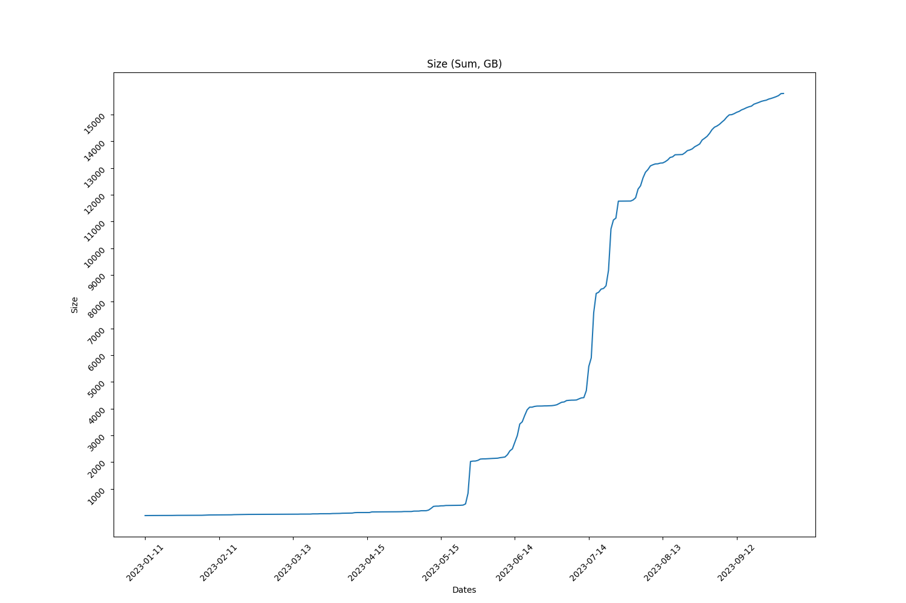
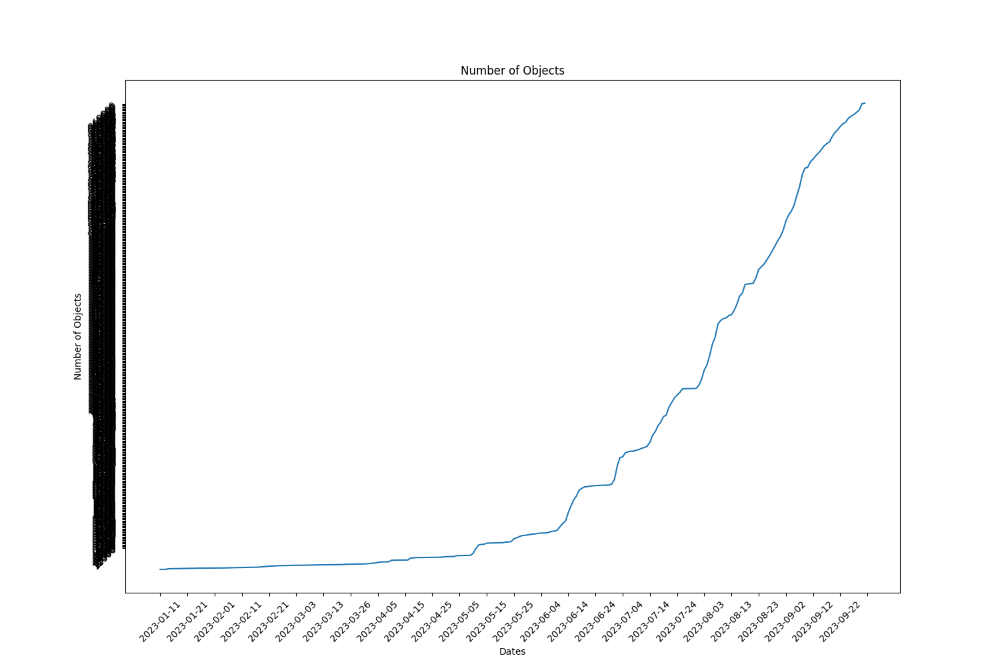

Full report for the Term: 18 

Start date: 2023-09-15  

End date: 2023-09-30 

Start Block: 4017618 

End Block: 4233619 

# Opening 
Number of openings: 0 
# Hiring
Number of hired works: 0
# Terminated workers 
Number of terminated workers: 0 
# Slashed workers 
Number of slashed workers: 0 
# Rewards
Total Rewards: 2000000000000000
| workerId               |    worker_total |
|------------------------|-----------------|
| storageWorkingGroup-0  | 445289600000000 |
| storageWorkingGroup-10 | 178024691756800 |
| storageWorkingGroup-11 | 166898148522000 |
| storageWorkingGroup-12 | 178024691756800 |
| storageWorkingGroup-2  | 176343920808392 |
| storageWorkingGroup-4  | 166898148522000 |
| storageWorkingGroup-6  | 166898148522000 |
| storageWorkingGroup-7  | 176699809833208 |
| storageWorkingGroup-8  | 166898148522000 |
| storageWorkingGroup-9  | 178024691756800 |
# BUCKETS Info  
|   id |   dataObjectsSize |   dataObjectsSizeLimit |   dataObjectsCount |   bags |   Utilization |   dataObjectsSize, GB |
|------|-------------------|------------------------|--------------------|--------|---------------|-----------------------|
|   10 |     1733203400512 |         22000000000000 |              63486 |   1322 |     0.078782  |               1612.6  |
|   12 |     1167888576421 |         50000000000000 |              42755 |   1029 |     0.0233578 |               1086.62 |
|    7 |     3292409766219 |         21500000000000 |              96771 |   9243 |     0.153135  |               3063.3  |
|    8 |    10910286640161 |         20000000000000 |              62304 |    979 |     0.545514  |              10151.1  |
|   11 |     2909618447711 |         36000000000000 |              81391 |   1396 |     0.0808227 |               2707.15 |
|    0 |    10917561787778 |         28000000000000 |             160701 |  26927 |     0.389913  |              10157.9  |
|    4 |    13850446670506 |         28000000000000 |             156514 |  27030 |     0.494659  |              12886.6  |
|    2 |     6839519929807 |         21000000000000 |             134387 |  26729 |     0.325691  |               6363.58 |
|    3 |     8031588761935 |         28500000000000 |             116591 |  14478 |     0.28181   |               7472.7  |
|    1 |     5661068336988 |         21000000000000 |             135816 |   9382 |     0.269575  |               5267.14 |
## BUCKETS CREATED
Bucket Created: 0
## BUCKETS DELETED
Bucket Deleted: 0
## Bags
Bags Created: 448 

Bags Deleted: 0 

# Objects Info during this Council Period 
Total Objects Size: 23713 

Total Objects Size: 567499764710 bytes 

## Objects Size Distribution
|   <10 MB |   <100 MB |   <1000 MB |   <10000 MB |   <100000 MB |   <1000000 MB |
|----------|-----------|------------|-------------|--------------|---------------|
|    14122 |     22826 |      23687 |       23713 |        23713 |         23713 |
 
|   0-10 MB |   10-100 MB |   100-1000 MB |   1000-10000 MB |   10000-100000 MB |   100000-10000000 MB |
|-----------|-------------|---------------|-----------------|-------------------|----------------------|
|     14122 |        8704 |           861 |              26 |                 0 |                    0 |
## Objects Size Distribution Per Bag 
|   0-10 MB |   10-100 MB |   100-1000 MB |   1000-10000 MB |   10000-100000 MB |   100000-10000000 MB |
|-----------|-------------|---------------|-----------------|-------------------|----------------------|
|     14122 |        8704 |           861 |              26 |                 0 |                    0 |
# Total object Info 
Total Objects: 262305 

Total Objects Size: 16973792725557 bytes

Total Number of Bags in use: 3466 bytes

Grand Total Number of Bags: 29632 bytes

## Objects Size Distribution 
|   <10 MB |   <100 MB |   <1000 MB |   <10000 MB |   <100000 MB |   <1000000 MB |
|----------|-----------|------------|-------------|--------------|---------------|
|   163819 |    246301 |     260009 |      262127 |       262305 |        262305 |
 
|   0-10 MB |   10-100 MB |   100-1000 MB |   1000-10000 MB |   10000-100000 MB |   100000-10000000 MB |
|-----------|-------------|---------------|-----------------|-------------------|----------------------|
|    163819 |       82482 |         13708 |            2118 |               178 |                    0 |
## Objects Size Distribution Per Bag 
|   0-10 MB |   10-100 MB |   100-1000 MB |   1000-10000 MB |   10000-100000 MB |   100000-10000000 MB |
|-----------|-------------|---------------|-----------------|-------------------|----------------------|
|    163819 |       82482 |         13708 |            2118 |               178 |                    0 |

 
  
# Lost Objects - GraphQl 
Total Objects: 23713 

Total Lost Objects: 90 

Percentage Lost Objects: %0.37953864968582635 

|     id | createdAt                |       size |   storageBagId |
|--------|--------------------------|------------|----------------|
| 239980 | 2023-09-16T18:40:36.000Z |  353497345 |          29238 |
| 237278 | 2023-09-15T17:06:30.001Z |      65446 |          29188 |
| 240012 | 2023-09-16T18:52:36.000Z |   39722255 |          29238 |
| 237311 | 2023-09-15T18:43:30.000Z |      53932 |          29193 |
| 237312 | 2023-09-15T18:50:54.001Z |    7468366 |          29193 |
| 237313 | 2023-09-15T18:50:54.001Z |      61998 |          29193 |
| 240427 | 2023-09-17T02:41:06.000Z |      43688 |          29250 |
| 240421 | 2023-09-17T00:33:30.000Z |      18884 |          29246 |
| 240420 | 2023-09-17T00:33:30.000Z |      92833 |          29246 |
| 240428 | 2023-09-17T02:41:06.000Z |     330332 |          29250 |
| 241898 | 2023-09-18T13:00:24.000Z |  308283008 |          29240 |
| 241751 | 2023-09-17T20:36:12.000Z |     369376 |          29283 |
| 241828 | 2023-09-18T09:05:06.001Z |     327188 |          29291 |
| 241827 | 2023-09-18T09:05:06.001Z |      95991 |          29291 |
| 241840 | 2023-09-18T09:32:12.000Z |      14850 |          29292 |
| 241839 | 2023-09-18T09:32:12.000Z |       4578 |          29292 |
| 241779 | 2023-09-18T02:28:00.000Z |      26054 |          28927 |
| 241778 | 2023-09-18T02:28:00.000Z |       4258 |          28927 |
| 243631 | 2023-09-19T14:14:54.000Z | 1421901716 |           7905 |
| 241980 | 2023-09-18T16:10:12.001Z |     230616 |          29311 |
| 241979 | 2023-09-18T16:10:12.001Z |      87147 |          29311 |
| 242744 | 2023-09-19T07:00:48.001Z | 1421901716 |           7905 |
| 242741 | 2023-09-19T05:29:36.000Z |      63864 |          29323 |
| 242740 | 2023-09-19T05:29:36.000Z |      38237 |          29323 |
| 245126 | 2023-09-19T19:46:54.001Z |      97189 |          29353 |
| 243980 | 2023-09-19T15:30:12.000Z |      31610 |          26528 |
| 243680 | 2023-09-19T14:24:18.000Z |     115236 |          29338 |
| 246518 | 2023-09-20T11:10:06.001Z | 1421901716 |           7905 |
| 246492 | 2023-09-20T11:05:42.000Z | 1421901716 |           7905 |
| 246493 | 2023-09-20T11:05:42.000Z |      21110 |           7905 |
| 245148 | 2023-09-19T19:55:24.000Z |   32975762 |          29353 |
| 245598 | 2023-09-19T21:35:00.000Z |      48038 |          29356 |
| 245597 | 2023-09-19T21:35:00.000Z |       3224 |          29356 |
| 246668 | 2023-09-20T11:54:54.000Z | 1421901716 |           7905 |
| 246689 | 2023-09-20T14:03:18.000Z |     122019 |          29376 |
| 246688 | 2023-09-20T14:03:18.000Z |      69031 |          29376 |
| 247665 | 2023-09-20T17:34:30.000Z |       7058 |          29384 |
| 247706 | 2023-09-20T17:37:18.001Z |     376281 |          29386 |
| 247692 | 2023-09-20T17:36:42.001Z |      73921 |          29385 |
| 247705 | 2023-09-20T17:37:18.001Z |      25157 |          29386 |
| 248789 | 2023-09-21T14:08:18.000Z | 1421901716 |           7905 |
| 248357 | 2023-09-21T09:44:18.000Z |       9248 |          29366 |
| 248794 | 2023-09-21T15:00:18.000Z |      79365 |          29408 |
| 248793 | 2023-09-21T15:00:18.000Z |      46814 |          29408 |
| 252003 | 2023-09-23T02:12:30.001Z |      74644 |          29447 |
| 248855 | 2023-09-21T16:46:00.000Z |      12420 |          29411 |
| 250156 | 2023-09-22T14:49:54.001Z |      51189 |          29432 |
| 250155 | 2023-09-22T14:49:54.001Z |      32656 |          29432 |
| 252004 | 2023-09-23T02:12:30.001Z |     503590 |          29447 |
| 252801 | 2023-09-23T12:44:18.001Z |      31526 |          29469 |
| 252630 | 2023-09-23T11:35:12.001Z |   36771838 |          29425 |
| 252631 | 2023-09-23T11:35:12.001Z |      18736 |          29425 |
| 253832 | 2023-09-24T19:28:42.000Z |      30664 |          29492 |
| 253257 | 2023-09-24T05:36:18.000Z | 1421901716 |           7905 |
| 253351 | 2023-09-24T12:16:12.000Z |     340281 |          29484 |
| 253350 | 2023-09-24T12:16:12.000Z |      73310 |          29484 |
| 252839 | 2023-09-23T15:21:54.000Z |    9199385 |          29425 |
| 252840 | 2023-09-23T15:21:54.000Z |      14008 |          29425 |
| 253488 | 2023-09-24T16:51:24.000Z | 4512887593 |          29495 |
| 253490 | 2023-09-24T17:00:18.000Z |      37252 |          29495 |
| 253853 | 2023-09-24T21:38:00.001Z |      47144 |          29504 |
| 253852 | 2023-09-24T21:38:00.001Z |      16317 |          29504 |
| 253863 | 2023-09-25T00:04:42.001Z |     221551 |          29506 |
| 253862 | 2023-09-25T00:04:42.001Z |      15101 |          29506 |
| 254516 | 2023-09-25T13:32:18.001Z |      15672 |          29516 |
| 254480 | 2023-09-25T09:30:36.001Z |     125148 |          29515 |
| 253896 | 2023-09-25T05:46:54.000Z |  164071171 |          29510 |
| 256250 | 2023-09-26T04:35:24.001Z |      15034 |          29536 |
| 256055 | 2023-09-25T20:56:36.000Z |     286890 |          29533 |
| 256054 | 2023-09-25T20:56:36.000Z |      48555 |          29533 |
| 257273 | 2023-09-26T20:36:24.000Z |  210844264 |          27625 |
| 256347 | 2023-09-26T06:24:06.001Z |       1026 |          29539 |
| 256222 | 2023-09-25T22:19:00.001Z |  178849448 |          29454 |
| 257367 | 2023-09-27T06:45:12.000Z |  210844264 |          27625 |
| 257302 | 2023-09-26T22:22:18.001Z |     156114 |          29556 |
| 257301 | 2023-09-26T22:22:18.001Z |      48793 |          29556 |
| 257329 | 2023-09-27T02:45:54.000Z |     331034 |          29558 |
| 257328 | 2023-09-27T02:45:54.000Z |      61271 |          29558 |
| 258090 | 2023-09-27T15:59:18.001Z |   34991402 |          29568 |
| 258091 | 2023-09-27T15:59:18.001Z |      61210 |          29568 |
| 259495 | 2023-09-28T21:02:18.000Z |      43752 |          29587 |
| 260838 | 2023-09-29T23:01:24.006Z | 1550828785 |          27483 |
| 258944 | 2023-09-28T16:34:06.000Z |   33728682 |          27916 |
| 258946 | 2023-09-28T16:35:12.000Z |   25114780 |          27916 |
| 258967 | 2023-09-28T16:48:54.000Z |   61339703 |          26231 |
| 258968 | 2023-09-28T16:48:54.000Z |       5624 |          26231 |
| 259532 | 2023-09-29T08:01:06.000Z |   47680221 |          29565 |
| 259795 | 2023-09-29T11:09:24.000Z |     111573 |          29604 |
| 259794 | 2023-09-29T11:09:24.000Z |      49481 |          29604 |
| 260660 | 2023-09-29T16:08:30.000Z |      27976 |          29469 | 
