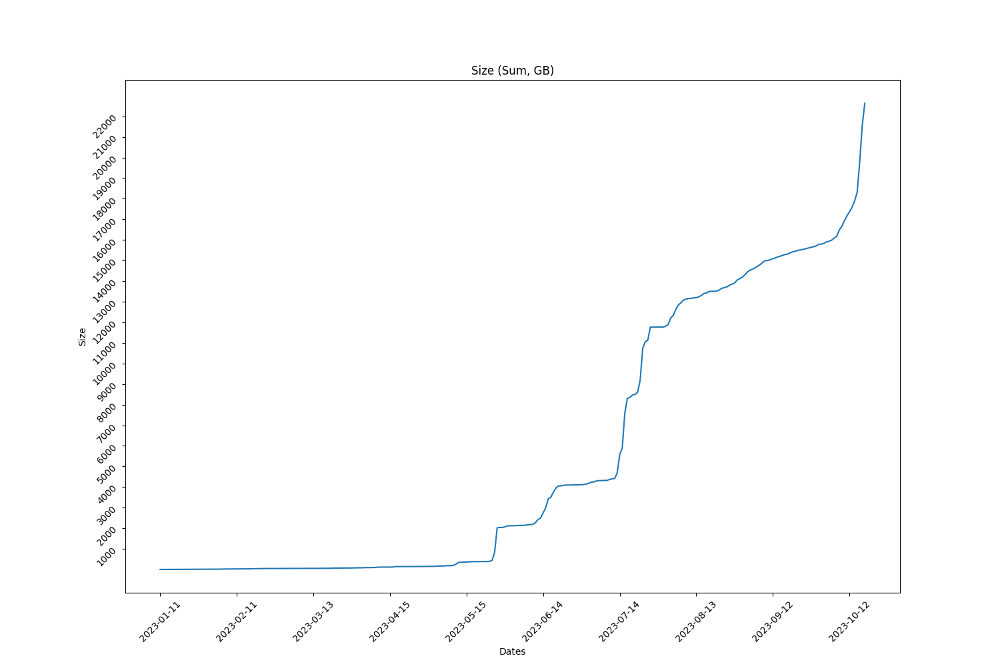
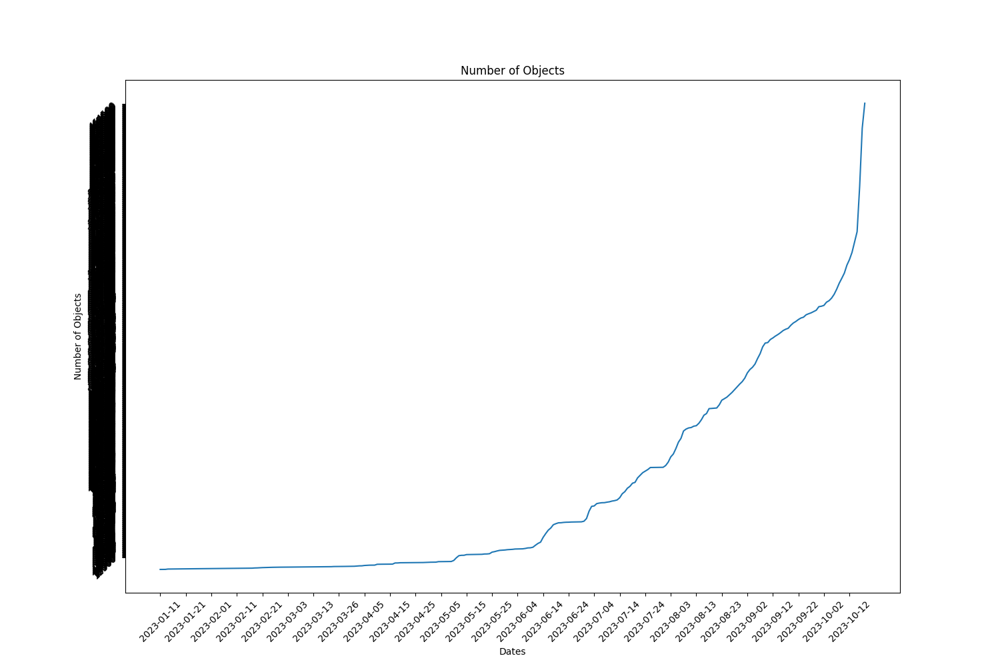

Full report for the Term: 19 

Start date: 2023-09-30  

End date: 2023-10-15 

Start Block: 4233619 

End Block: 4449620 

# Opening 
Number of openings: 0 
# Hiring
Number of hired works: 0
# Terminated workers 
Number of terminated workers: 0 
# Slashed workers 
Number of slashed workers: 0 
# Rewards
Total Rewards: 1917329707646408
| workerId               |    worker_total |
|------------------------|-----------------|
| storageWorkingGroup-0  | 413565600000000 |
| storageWorkingGroup-10 | 166898148522000 |
| storageWorkingGroup-11 | 166898148522000 |
| storageWorkingGroup-12 | 166898148522000 |
| storageWorkingGroup-2  | 168578919470408 |
| storageWorkingGroup-4  | 166898148522000 |
| storageWorkingGroup-6  | 166898148522000 |
| storageWorkingGroup-7  | 166898148522000 |
| storageWorkingGroup-8  | 166898148522000 |
| storageWorkingGroup-9  | 166898148522000 |
# BUCKETS Info  
|   id |   dataObjectsSize |   dataObjectsSizeLimit |   dataObjectsCount |   bags |   Utilization |   dataObjectsSize, GB |
|------|-------------------|------------------------|--------------------|--------|---------------|-----------------------|
|    4 |    16477015558022 |         28000000000000 |             225092 |  27095 |     0.588465  |              15330.4  |
|    2 |    10036400111872 |         21000000000000 |             216375 |  27307 |     0.477924  |               9338.01 |
|   10 |     4698593080496 |         22000000000000 |             160612 |   1892 |     0.213572  |               4371.64 |
|   12 |     4064553510871 |         50000000000000 |             122769 |   1627 |     0.0812911 |               3781.72 |
|    7 |     5613987355562 |         21500000000000 |             165450 |   9812 |     0.261116  |               5223.33 |
|   11 |     6192409574702 |         36000000000000 |             180225 |   1995 |     0.172011  |               5761.5  |
|    0 |    14525064299862 |         28000000000000 |             253427 |  27470 |     0.518752  |              13514.3  |
|    8 |    12861483211811 |         20000000000000 |             103416 |    980 |     0.643074  |              11966.5  |
|    3 |    11107899867230 |         28500000000000 |             204550 |  15081 |     0.389751  |              10334.9  |
|    1 |     9152191413983 |         21000000000000 |             228967 |   9957 |     0.435819  |               8515.33 |
## BUCKETS CREATED
Bucket Created: 0
## BUCKETS DELETED
Bucket Deleted: 0
## Bags
Bags Created: 353 

Bags Deleted: 0 

# Objects Info during this Council Period 
Total Objects Size: 73557 

Total Objects Size: 2490925753853 bytes 

## Objects Size Distribution
|   <10 MB |   <100 MB |   <1000 MB |   <10000 MB |   <100000 MB |   <1000000 MB |
|----------|-----------|------------|-------------|--------------|---------------|
|    46978 |     68250 |      73396 |       73557 |        73557 |         73557 |
 
|   0-10 MB |   10-100 MB |   100-1000 MB |   1000-10000 MB |   10000-100000 MB |   100000-10000000 MB |
|-----------|-------------|---------------|-----------------|-------------------|----------------------|
|     46978 |       21272 |          5146 |             161 |                 0 |                    0 |
## Objects Size Distribution Per Bag 
|   0-10 MB |   10-100 MB |   100-1000 MB |   1000-10000 MB |   10000-100000 MB |   100000-10000000 MB |
|-----------|-------------|---------------|-----------------|-------------------|----------------------|
|     46978 |       21272 |          5146 |             161 |                 0 |                    0 |
# Total object Info 
Total Objects: 464879 

Total Objects Size: 24328739990263 bytes

Total Number of Bags in use: 4609 bytes

Grand Total Number of Bags: 30807 bytes

## Objects Size Distribution 
|   <10 MB |   <100 MB |   <1000 MB |   <10000 MB |   <100000 MB |   <1000000 MB |
|----------|-----------|------------|-------------|--------------|---------------|
|   300609 |    433770 |     462004 |      464688 |       464879 |        464879 |
 
|   0-10 MB |   10-100 MB |   100-1000 MB |   1000-10000 MB |   10000-100000 MB |   100000-10000000 MB |
|-----------|-------------|---------------|-----------------|-------------------|----------------------|
|    300609 |      133161 |         28234 |            2684 |               191 |                    0 |
## Objects Size Distribution Per Bag 
|   0-10 MB |   10-100 MB |   100-1000 MB |   1000-10000 MB |   10000-100000 MB |   100000-10000000 MB |
|-----------|-------------|---------------|-----------------|-------------------|----------------------|
|    300609 |      133161 |         28234 |            2684 |               191 |                    0 |

 
  
# Lost Objects - GraphQl 
Total Objects: 73557 

Total Lost Objects: 1447 

Percentage Lost Objects: %1.9671819133461126 

|     id | createdAt                |       size |   storageBagId |
|--------|--------------------------|------------|----------------|
| 265707 | 2023-10-03T00:52:36.001Z |   38916575 |          28691 |
| 264814 | 2023-10-01T19:38:30.001Z |   18803119 |          29644 |
| 264815 | 2023-10-01T19:38:30.001Z |      40162 |          29644 |
| 265681 | 2023-10-02T22:17:36.001Z |  313887768 |          29677 |
| 265872 | 2023-10-03T05:28:42.000Z |      17310 |          27874 |
| 263435 | 2023-09-30T20:36:00.000Z |     122167 |          29628 |
| 263434 | 2023-09-30T20:36:00.000Z |      73071 |          29628 |
| 264632 | 2023-10-01T11:03:36.000Z |     133870 |          29636 |
| 264631 | 2023-10-01T11:03:36.000Z |      64621 |          29636 |
| 264864 | 2023-10-01T23:37:24.000Z |     157712 |          29659 |
| 264859 | 2023-10-01T22:43:30.000Z |     232619 |          29658 |
| 264858 | 2023-10-01T22:43:30.000Z |      62187 |          29658 |
| 264860 | 2023-10-01T22:48:24.001Z |      72198 |          29657 |
| 264863 | 2023-10-01T23:37:24.000Z |      54246 |          29659 |
| 265006 | 2023-10-02T13:33:54.001Z |      37353 |          29674 |
| 265005 | 2023-10-02T13:33:54.001Z |      14162 |          29674 |
| 266015 | 2023-10-03T11:10:24.001Z |     112859 |          29691 |
| 266469 | 2023-10-03T13:54:12.001Z |  233113933 |          29693 |
| 269071 | 2023-10-04T11:26:24.000Z |     274323 |          29718 |
| 268932 | 2023-10-04T02:53:48.001Z |     182316 |          29708 |
| 268931 | 2023-10-04T02:53:48.001Z |      62483 |          29708 |
| 269012 | 2023-10-04T09:08:00.000Z |       4615 |          29204 |
| 269023 | 2023-10-04T10:33:30.001Z |      72964 |          29717 |
| 269074 | 2023-10-04T12:03:48.001Z |       7554 |          29718 |
| 269442 | 2023-10-04T14:45:48.001Z |     101980 |          29719 |
| 269441 | 2023-10-04T14:45:48.001Z |      31347 |          29719 |
| 270148 | 2023-10-04T18:53:12.000Z |       4546 |          29724 |
| 270093 | 2023-10-04T17:22:18.001Z |      39332 |          29722 |
| 270095 | 2023-10-04T17:53:54.047Z |      49709 |          29723 |
| 270094 | 2023-10-04T17:53:54.047Z |      52445 |          29723 |
| 270683 | 2023-10-05T05:40:54.000Z |  208042386 |          29730 |
| 270375 | 2023-10-04T22:25:42.000Z |   79935297 |          29727 |
| 270376 | 2023-10-04T22:25:42.000Z |      26256 |          29727 |
| 270684 | 2023-10-05T05:40:54.000Z |      44394 |          29730 |
| 270681 | 2023-10-05T05:39:18.001Z |  208042386 |          29730 |
| 270682 | 2023-10-05T05:39:18.001Z |      44394 |          29730 |
| 270693 | 2023-10-05T06:57:18.000Z | 1421901716 |           7905 |
| 270726 | 2023-10-05T09:39:06.000Z |     261032 |          29736 |
| 273485 | 2023-10-06T17:36:30.000Z |   46564909 |          29766 |
| 270978 | 2023-10-05T12:49:42.001Z |      50393 |          29745 |
| 270782 | 2023-10-05T11:38:54.001Z |      47882 |          29738 |
| 272343 | 2023-10-05T17:36:42.000Z |     114953 |          29752 |
| 272342 | 2023-10-05T17:36:42.000Z |      51910 |          29752 |
| 272707 | 2023-10-05T18:49:12.000Z |      14348 |          29753 |
| 273071 | 2023-10-06T07:58:30.000Z |  167132741 |          29743 |
| 273074 | 2023-10-06T08:49:30.001Z |     142657 |          29757 |
| 273084 | 2023-10-06T11:22:00.000Z |       1676 |          29760 |
| 273470 | 2023-10-06T17:08:48.000Z |     309410 |          29767 |
| 273469 | 2023-10-06T17:08:48.000Z |      43803 |          29767 |
| 275122 | 2023-10-06T21:18:54.000Z |   29988395 |          29773 |
| 274619 | 2023-10-06T20:18:12.001Z |     124197 |          29773 |
| 274618 | 2023-10-06T20:18:12.001Z |      80861 |          29773 |
| 275123 | 2023-10-06T21:18:54.000Z |      23622 |          29773 |
| 275371 | 2023-10-06T21:44:06.000Z |      17485 |          29767 |
| 275353 | 2023-10-06T21:42:18.001Z |      16381 |          29767 |
| 275357 | 2023-10-06T21:42:48.001Z |      19883 |          29767 |
| 275456 | 2023-10-06T21:52:48.001Z |   49080405 |          29773 |
| 275422 | 2023-10-06T21:49:06.000Z |  132320805 |          29646 |
| 275423 | 2023-10-06T21:49:06.000Z |      15164 |          29646 |
| 275432 | 2023-10-06T21:50:18.000Z |  147888261 |          29646 |
| 275433 | 2023-10-06T21:50:18.000Z |      18821 |          29646 |
| 275412 | 2023-10-06T21:48:18.001Z |  158705274 |          29646 |
| 275413 | 2023-10-06T21:48:18.001Z |       9897 |          29646 |
| 275457 | 2023-10-06T21:52:48.001Z |      20771 |          29773 |
| 275915 | 2023-10-06T22:38:24.000Z |      20408 |          29773 |
| 275857 | 2023-10-06T22:32:36.000Z |      17830 |          29767 |
| 275856 | 2023-10-06T22:32:36.000Z |   36359591 |          29767 |
| 275922 | 2023-10-06T22:39:12.000Z |   29160457 |          29773 |
| 275923 | 2023-10-06T22:39:12.000Z |      24501 |          29773 |
| 275924 | 2023-10-06T22:39:12.000Z |   38991411 |          29773 |
| 275948 | 2023-10-06T22:41:24.001Z |   10155840 |          29768 |
| 275949 | 2023-10-06T22:41:24.001Z |      12566 |          29768 |
| 275925 | 2023-10-06T22:39:12.000Z |      22886 |          29773 |
| 275957 | 2023-10-06T22:42:18.000Z |      17653 |          29768 |
| 276152 | 2023-10-06T23:00:42.001Z |   35408843 |          29767 |
| 276153 | 2023-10-06T23:00:42.001Z |      16904 |          29767 |
| 276154 | 2023-10-06T23:00:42.001Z |   22420928 |          29767 |
| 276155 | 2023-10-06T23:00:42.001Z |      17838 |          29767 |
| 276156 | 2023-10-06T23:01:06.001Z |   70427267 |          29767 |
| 276157 | 2023-10-06T23:01:06.001Z |      20131 |          29767 |
| 276476 | 2023-10-06T23:30:24.000Z |   23084213 |          29767 |
| 276457 | 2023-10-06T23:28:18.000Z |      18679 |          29767 |
| 276452 | 2023-10-06T23:27:54.001Z |   28798803 |          29767 |
| 276453 | 2023-10-06T23:27:54.001Z |      20755 |          29767 |
| 276464 | 2023-10-06T23:29:12.000Z |   21827953 |          29767 |
| 276456 | 2023-10-06T23:28:18.000Z |   21424925 |          29767 |
| 276465 | 2023-10-06T23:29:12.000Z |      14881 |          29767 |
| 276470 | 2023-10-06T23:29:36.001Z |   42263790 |          29767 |
| 276471 | 2023-10-06T23:29:36.001Z |      17899 |          29767 |
| 276222 | 2023-10-06T23:06:54.000Z |   41680134 |          29773 |
| 276223 | 2023-10-06T23:06:54.000Z |      25498 |          29773 |
| 276477 | 2023-10-06T23:30:24.000Z |      17422 |          29767 |
| 276493 | 2023-10-06T23:31:42.000Z |      22203 |          29773 |
| 276494 | 2023-10-06T23:31:42.000Z |   31691285 |          29773 |
| 276495 | 2023-10-06T23:31:42.000Z |      28448 |          29773 |
| 276492 | 2023-10-06T23:31:42.000Z |   31562344 |          29773 |
| 276500 | 2023-10-06T23:32:30.001Z |   20069008 |          29773 |
| 276501 | 2023-10-06T23:32:30.001Z |      20774 |          29773 |
| 276825 | 2023-10-07T00:02:12.002Z |      17901 |          29767 |
| 276600 | 2023-10-06T23:41:54.000Z |  141993323 |          29646 |
| 276601 | 2023-10-06T23:41:54.000Z |      20736 |          29646 |
| 276752 | 2023-10-06T23:55:36.000Z |   16410591 |          29773 |
| 276753 | 2023-10-06T23:55:36.000Z |      20843 |          29773 |
| 276754 | 2023-10-06T23:55:36.000Z |   20690912 |          29773 |
| 276755 | 2023-10-06T23:55:36.000Z |      19180 |          29773 |
| 276762 | 2023-10-06T23:56:24.000Z |   29278887 |          29773 |
| 276763 | 2023-10-06T23:56:24.000Z |      22570 |          29773 |
| 276766 | 2023-10-06T23:56:48.001Z |   32917146 |          29773 |
| 276767 | 2023-10-06T23:56:48.001Z |      19737 |          29773 |
| 276834 | 2023-10-07T00:03:00.001Z |   14354586 |          29767 |
| 276835 | 2023-10-07T00:03:00.001Z |      17621 |          29767 |
| 276842 | 2023-10-07T00:03:48.001Z |   13642392 |          29767 |
| 276843 | 2023-10-07T00:03:48.001Z |      18319 |          29767 |
| 276844 | 2023-10-07T00:04:12.000Z |   17136318 |          29767 |
| 276845 | 2023-10-07T00:04:12.000Z |      16446 |          29767 |
| 276848 | 2023-10-07T00:04:36.000Z |   18220126 |          29767 |
| 276849 | 2023-10-07T00:04:36.000Z |      17204 |          29767 |
| 277096 | 2023-10-07T00:27:00.001Z |   21020767 |          29767 |
| 277097 | 2023-10-07T00:27:00.001Z |      20752 |          29767 |
| 277130 | 2023-10-07T00:30:00.000Z |    8696712 |          29774 |
| 277131 | 2023-10-07T00:30:00.000Z |       4876 |          29774 |
| 277132 | 2023-10-07T00:30:24.000Z |   10430088 |          29774 |
| 277133 | 2023-10-07T00:30:24.000Z |       7954 |          29774 |
| 277234 | 2023-10-07T00:39:12.000Z |   31124611 |          29773 |
| 277235 | 2023-10-07T00:39:12.000Z |      21134 |          29773 |
| 277242 | 2023-10-07T00:40:00.000Z |   25232298 |          29773 |
| 277243 | 2023-10-07T00:40:00.000Z |      26780 |          29773 |
| 277414 | 2023-10-07T00:55:48.006Z |   42263174 |          29767 |
| 277415 | 2023-10-07T00:55:48.006Z |      17386 |          29767 |
| 276772 | 2023-10-06T23:57:36.001Z |   35355845 |          29773 |
| 276773 | 2023-10-06T23:57:36.001Z |      24240 |          29773 |
| 276780 | 2023-10-06T23:58:24.000Z |   25536234 |          29773 |
| 276781 | 2023-10-06T23:58:24.000Z |      21297 |          29773 |
| 277119 | 2023-10-07T00:29:06.000Z |      16770 |          29767 |
| 277114 | 2023-10-07T00:28:42.001Z |   21357469 |          29767 |
| 277115 | 2023-10-07T00:28:42.001Z |      18418 |          29767 |
| 277118 | 2023-10-07T00:29:06.000Z |   49802852 |          29767 |
| 277194 | 2023-10-07T00:35:48.001Z |   13938155 |          29768 |
| 277195 | 2023-10-07T00:35:48.001Z |      18454 |          29768 |
| 277200 | 2023-10-07T00:36:36.000Z |    6050897 |          29768 |
| 277201 | 2023-10-07T00:36:36.000Z |      17810 |          29768 |
| 277252 | 2023-10-07T00:41:12.001Z |   18530062 |          29773 |
| 277253 | 2023-10-07T00:41:12.001Z |      21448 |          29773 |
| 277396 | 2023-10-07T00:54:12.000Z |   26410698 |          29767 |
| 277397 | 2023-10-07T00:54:12.000Z |      17894 |          29767 |
| 277398 | 2023-10-07T00:54:12.000Z |   12484451 |          29767 |
| 277399 | 2023-10-07T00:54:12.000Z |      17466 |          29767 |
| 277484 | 2023-10-07T01:02:30.001Z |   27732182 |          29773 |
| 277485 | 2023-10-07T01:02:30.001Z |      24557 |          29773 |
| 277500 | 2023-10-07T01:04:06.000Z |   28272689 |          29773 |
| 277501 | 2023-10-07T01:04:06.000Z |      19977 |          29773 |
| 277502 | 2023-10-07T01:04:06.000Z |   27059051 |          29773 |
| 277503 | 2023-10-07T01:04:06.000Z |      22020 |          29773 |
| 277506 | 2023-10-07T01:04:30.000Z |   33564112 |          29773 |
| 277507 | 2023-10-07T01:04:30.000Z |      22551 |          29773 |
| 276816 | 2023-10-07T00:01:24.001Z |   20859607 |          29767 |
| 276817 | 2023-10-07T00:01:24.001Z |      15405 |          29767 |
| 276818 | 2023-10-07T00:01:24.001Z |   14754371 |          29767 |
| 276819 | 2023-10-07T00:01:24.001Z |      16898 |          29767 |
| 276822 | 2023-10-07T00:01:48.000Z |   22889165 |          29767 |
| 277622 | 2023-10-07T01:15:06.000Z |   34384731 |          29767 |
| 277623 | 2023-10-07T01:15:06.000Z |      15143 |          29767 |
| 276823 | 2023-10-07T00:01:48.000Z |      17638 |          29767 |
| 276824 | 2023-10-07T00:02:12.002Z |   18966263 |          29767 |
| 277624 | 2023-10-07T01:15:30.000Z |  135966101 |          29767 |
| 277625 | 2023-10-07T01:15:30.000Z |      16907 |          29767 |
| 277630 | 2023-10-07T01:15:54.000Z |   17085856 |          29767 |
| 277631 | 2023-10-07T01:15:54.000Z |      12086 |          29767 |
| 277638 | 2023-10-07T01:16:42.000Z |    3548206 |          29767 |
| 283155 | 2023-10-08T11:34:18.000Z |  622908767 |          27947 |
| 278970 | 2023-10-07T10:38:48.001Z |    1165958 |          29785 |
| 278971 | 2023-10-07T10:38:48.001Z |        996 |          29785 |
| 282656 | 2023-10-08T08:03:48.001Z |       3172 |          29806 |
| 277639 | 2023-10-07T01:16:42.000Z |      16433 |          29767 |
| 277640 | 2023-10-07T01:17:06.005Z |   42342728 |          29767 |
| 277641 | 2023-10-07T01:17:06.005Z |      17040 |          29767 |
| 283156 | 2023-10-08T11:34:18.000Z |       4732 |          27947 |
| 286292 | 2023-10-08T16:58:36.001Z |   10200298 |          29817 |
| 285257 | 2023-10-08T14:54:36.001Z |      29808 |          29806 |
| 286293 | 2023-10-08T16:58:36.001Z |      12768 |          29817 |
| 286400 | 2023-10-08T17:20:24.000Z |  201311594 |          29233 |
| 286401 | 2023-10-08T17:20:24.000Z |      12038 |          29233 |
| 286538 | 2023-10-08T17:46:24.001Z |     222014 |          29821 |
| 288533 | 2023-10-09T02:00:18.000Z | 5577180243 |          27046 |
| 286744 | 2023-10-08T18:29:24.002Z |   56729430 |          29324 |
| 286778 | 2023-10-08T18:35:24.001Z |  208097805 |          29233 |
| 286779 | 2023-10-08T18:35:24.001Z |      12038 |          29233 |
| 287571 | 2023-10-08T22:36:30.000Z |     251253 |          29826 |
| 288534 | 2023-10-09T02:00:18.000Z |      23083 |          27046 |
| 288511 | 2023-10-09T01:56:36.001Z | 1978745116 |          27046 |
| 288512 | 2023-10-09T01:56:36.001Z |      20532 |          27046 |
| 288517 | 2023-10-09T01:57:36.001Z | 3745790497 |          27046 |
| 288518 | 2023-10-09T01:57:36.001Z |      22137 |          27046 |
| 288519 | 2023-10-09T01:58:06.000Z | 3788630195 |          27046 |
| 288520 | 2023-10-09T01:58:06.000Z |      23124 |          27046 |
| 289873 | 2023-10-09T06:52:48.000Z |       9156 |          29821 |
| 291022 | 2023-10-09T12:30:30.000Z |  940806688 |          29617 |
| 290180 | 2023-10-09T07:50:30.000Z |     175074 |          29829 |
| 290179 | 2023-10-09T07:50:30.000Z |      45744 |          29829 |
| 290715 | 2023-10-09T10:10:30.000Z |   23569508 |          29831 |
| 290716 | 2023-10-09T10:10:30.000Z |      23680 |          29831 |
| 290865 | 2023-10-09T11:57:12.000Z |  116114485 |          29231 |
| 290866 | 2023-10-09T11:57:12.000Z |      16312 |          29231 |
| 290873 | 2023-10-09T11:57:36.000Z |   45210057 |          27038 |
| 290874 | 2023-10-09T11:57:36.000Z |      21483 |          27038 |
| 290877 | 2023-10-09T11:57:48.000Z |  354934117 |          27084 |
| 290878 | 2023-10-09T11:57:48.000Z |       3483 |          27084 |
| 290891 | 2023-10-09T11:59:18.002Z |  375936582 |          29396 |
| 290892 | 2023-10-09T11:59:18.002Z |      14545 |          29396 |
| 290960 | 2023-10-09T12:16:30.001Z |   23170808 |          29120 |
| 290961 | 2023-10-09T12:16:30.001Z |      15950 |          29120 |
| 290966 | 2023-10-09T12:24:24.001Z |    8283554 |          26813 |
| 290967 | 2023-10-09T12:24:24.001Z |      10972 |          26813 |
| 291179 | 2023-10-09T13:18:06.001Z |    7790203 |          26813 |
| 291180 | 2023-10-09T13:18:06.001Z |      10704 |          26813 |
| 291237 | 2023-10-09T13:37:06.000Z |     281988 |          29511 |
| 291238 | 2023-10-09T13:37:06.000Z |       3785 |          29511 |
| 290765 | 2023-10-09T11:33:18.000Z |  142715602 |          27381 |
| 290766 | 2023-10-09T11:33:18.000Z |      14560 |          27381 |
| 291088 | 2023-10-09T12:51:12.000Z |    6598548 |          26813 |
| 291089 | 2023-10-09T12:51:12.000Z |      10900 |          26813 |
| 291129 | 2023-10-09T13:04:30.000Z |    5263226 |          26813 |
| 291130 | 2023-10-09T13:04:30.000Z |      10795 |          26813 |
| 291205 | 2023-10-09T13:23:48.000Z |     184196 |          28091 |
| 291206 | 2023-10-09T13:23:48.000Z |       5049 |          28091 |
| 291209 | 2023-10-09T13:31:00.000Z |    6765577 |          26813 |
| 291210 | 2023-10-09T13:31:00.000Z |      11174 |          26813 |
| 291242 | 2023-10-09T13:44:18.000Z |    8832986 |          26813 |
| 291243 | 2023-10-09T13:44:18.000Z |       7956 |          26813 |
| 291281 | 2023-10-09T13:50:24.000Z |  321115214 |          29186 |
| 291282 | 2023-10-09T13:50:24.000Z |      26161 |          29186 |
| 291023 | 2023-10-09T12:30:30.000Z |      22341 |          29617 |
| 291028 | 2023-10-09T12:38:00.000Z |    7845216 |          26813 |
| 291029 | 2023-10-09T12:38:00.000Z |      11122 |          26813 |
| 291393 | 2023-10-09T14:31:18.003Z |   19828760 |          26727 |
| 291363 | 2023-10-09T14:25:06.001Z |    8786658 |          26813 |
| 291364 | 2023-10-09T14:25:06.001Z |      10751 |          26813 |
| 291359 | 2023-10-09T14:17:24.001Z |   17723754 |          28422 |
| 291360 | 2023-10-09T14:17:24.001Z |       7498 |          28422 |
| 291315 | 2023-10-09T14:10:48.000Z |    6400813 |          26813 |
| 291316 | 2023-10-09T14:10:48.000Z |       6188 |          26813 |
| 291394 | 2023-10-09T14:31:18.003Z |      10702 |          26727 |
| 291429 | 2023-10-09T14:42:00.001Z |  444415020 |          29690 |
| 291430 | 2023-10-09T14:42:00.001Z |      12811 |          29690 |
| 291435 | 2023-10-09T14:42:36.001Z |  289009362 |          26320 |
| 291436 | 2023-10-09T14:42:36.001Z |      21088 |          26320 |
| 291443 | 2023-10-09T14:45:06.001Z |   11004169 |          26830 |
| 291444 | 2023-10-09T14:45:06.001Z |      18417 |          26830 |
| 291587 | 2023-10-09T15:25:42.000Z |   39336620 |          29558 |
| 291484 | 2023-10-09T14:59:30.001Z |      19833 |          28677 |
| 291483 | 2023-10-09T14:59:30.001Z |   31718928 |          28677 |
| 291527 | 2023-10-09T15:10:06.001Z |  355781330 |          26809 |
| 291528 | 2023-10-09T15:10:06.001Z |      18995 |          26809 |
| 291531 | 2023-10-09T15:10:18.001Z |   52139814 |          26234 |
| 291532 | 2023-10-09T15:10:18.001Z |      16458 |          26234 |
| 291585 | 2023-10-09T15:25:36.000Z |   60900912 |          29692 |
| 291586 | 2023-10-09T15:25:36.000Z |      14246 |          29692 |
| 291588 | 2023-10-09T15:25:42.000Z |      20208 |          29558 |
| 291780 | 2023-10-09T16:03:48.001Z |      18187 |          25948 |
| 291718 | 2023-10-09T15:51:42.000Z |      26791 |          27781 |
| 291715 | 2023-10-09T15:51:36.000Z |      12276 |          26759 |
| 291710 | 2023-10-09T15:51:24.000Z |   44231257 |          26728 |
| 291711 | 2023-10-09T15:51:24.000Z |      12459 |          26728 |
| 291712 | 2023-10-09T15:51:31.673Z |   20688310 |          29802 |
| 291774 | 2023-10-09T16:03:30.001Z |      22151 |          28328 |
| 291769 | 2023-10-09T16:03:18.001Z |   95490142 |          29675 |
| 291713 | 2023-10-09T15:51:31.673Z |       8039 |          29802 |
| 291714 | 2023-10-09T15:51:36.000Z |   28085496 |          26759 |
| 291717 | 2023-10-09T15:51:42.000Z |   67652741 |          27781 |
| 291770 | 2023-10-09T16:03:18.001Z |      12453 |          29675 |
| 291771 | 2023-10-09T16:03:24.001Z |   82459322 |          26627 |
| 291835 | 2023-10-09T16:16:00.000Z | 1506753364 |          28084 |
| 291836 | 2023-10-09T16:16:00.000Z |      26757 |          28084 |
| 291772 | 2023-10-09T16:03:24.001Z |      17275 |          26627 |
| 291829 | 2023-10-09T16:15:00.001Z |  903489571 |          27466 |
| 291830 | 2023-10-09T16:15:00.001Z |      16926 |          27466 |
| 291773 | 2023-10-09T16:03:30.001Z |   49856866 |          28328 |
| 291845 | 2023-10-09T16:36:36.000Z |    2666125 |          28487 |
| 291846 | 2023-10-09T16:36:36.000Z |       5772 |          28487 |
| 291847 | 2023-10-09T16:36:42.002Z |    3424333 |          26837 |
| 291848 | 2023-10-09T16:36:42.002Z |       7189 |          26837 |
| 291775 | 2023-10-09T16:03:36.000Z |   43297778 |          26072 |
| 291776 | 2023-10-09T16:03:36.000Z |      13081 |          26072 |
| 291777 | 2023-10-09T16:03:42.000Z |   73697077 |          26988 |
| 291778 | 2023-10-09T16:03:42.000Z |      22737 |          26988 |
| 291779 | 2023-10-09T16:03:48.001Z |   27798805 |          25948 |
| 291781 | 2023-10-09T16:03:54.000Z |   73848318 |          26986 |
| 291782 | 2023-10-09T16:03:54.000Z |      21708 |          26986 |
| 291957 | 2023-10-09T17:14:18.000Z |    5654939 |          29105 |
| 291887 | 2023-10-09T16:47:06.001Z |  102730582 |          27379 |
| 291888 | 2023-10-09T16:47:06.001Z |       9537 |          27379 |
| 291958 | 2023-10-09T17:14:18.000Z |      13564 |          29105 |
| 291979 | 2023-10-09T17:23:06.000Z |  164661435 |          28696 |
| 291980 | 2023-10-09T17:23:06.000Z |      13794 |          28696 |
| 292066 | 2023-10-09T17:49:48.000Z |  134417811 |          27344 |
| 291981 | 2023-10-09T17:23:12.001Z |   34137739 |          28501 |
| 291982 | 2023-10-09T17:23:12.001Z |      11560 |          28501 |
| 292067 | 2023-10-09T17:49:48.000Z |      12563 |          27344 |
| 292074 | 2023-10-09T17:52:48.000Z |  290440741 |          27344 |
| 292075 | 2023-10-09T17:52:48.000Z |      10626 |          27344 |
| 292571 | 2023-10-09T21:22:42.000Z |   26746280 |          27373 |
| 292305 | 2023-10-09T19:23:12.001Z |  119582506 |          27329 |
| 292306 | 2023-10-09T19:23:12.001Z |      11391 |          27329 |
| 292295 | 2023-10-09T19:14:54.000Z |    4645098 |          28487 |
| 292296 | 2023-10-09T19:14:54.000Z |      10120 |          28487 |
| 292572 | 2023-10-09T21:22:42.000Z |       7910 |          27373 |
| 292563 | 2023-10-09T21:14:18.001Z |    1006930 |          28653 |
| 292564 | 2023-10-09T21:14:18.001Z |       8466 |          28653 |
| 292580 | 2023-10-09T21:29:42.000Z |       8287 |          27373 |
| 292638 | 2023-10-09T21:53:24.001Z |      52330 |          29835 |
| 292639 | 2023-10-09T21:53:36.002Z |   26202441 |          29201 |
| 292640 | 2023-10-09T21:53:36.002Z |      10711 |          29201 |
| 292597 | 2023-10-09T21:41:36.000Z |   43322041 |          27373 |
| 292598 | 2023-10-09T21:41:36.000Z |       8398 |          27373 |
| 292577 | 2023-10-09T21:23:00.001Z |    8733105 |          27400 |
| 292578 | 2023-10-09T21:23:00.001Z |       7840 |          27400 |
| 292579 | 2023-10-09T21:29:42.000Z |   35397656 |          27373 |
| 292693 | 2023-10-09T22:26:48.001Z |    1712778 |          28487 |
| 292694 | 2023-10-09T22:26:48.001Z |       8227 |          28487 |
| 292715 | 2023-10-09T22:38:54.000Z |   33410088 |          27038 |
| 292716 | 2023-10-09T22:38:54.000Z |      18605 |          27038 |
| 292657 | 2023-10-09T22:04:30.000Z |   17800290 |          27373 |
| 292658 | 2023-10-09T22:04:30.000Z |       7185 |          27373 |
| 292779 | 2023-10-09T23:07:30.000Z |   14390400 |          28659 |
| 292780 | 2023-10-09T23:07:30.000Z |      10012 |          28659 |
| 292781 | 2023-10-09T23:15:48.000Z |   19542016 |          27373 |
| 292782 | 2023-10-09T23:15:48.000Z |       7704 |          27373 |
| 293606 | 2023-10-10T09:15:00.001Z |   21082105 |          28463 |
| 292829 | 2023-10-09T23:34:06.000Z |   17569590 |          28761 |
| 292830 | 2023-10-09T23:34:06.000Z |      16758 |          28761 |
| 293506 | 2023-10-10T08:47:54.000Z |   11729914 |          28604 |
| 293507 | 2023-10-10T08:47:54.000Z |       4237 |          28604 |
| 293510 | 2023-10-10T08:48:18.001Z |  259221283 |          27027 |
| 293511 | 2023-10-10T08:48:18.001Z |      10317 |          27027 |
| 293085 | 2023-10-10T04:04:06.001Z |      41404 |          29844 |
| 293607 | 2023-10-10T09:15:00.001Z |       8028 |          28463 |
| 293608 | 2023-10-10T09:15:48.000Z |   20445542 |          28463 |
| 293609 | 2023-10-10T09:15:48.000Z |       4252 |          28463 |
| 293620 | 2023-10-10T09:19:06.008Z |   27988434 |          29240 |
| 293622 | 2023-10-10T09:19:12.001Z |   44296946 |          29710 |
| 293623 | 2023-10-10T09:19:12.001Z |      25137 |          29710 |
| 293624 | 2023-10-10T09:19:30.002Z |   19391573 |          29240 |
| 293626 | 2023-10-10T09:20:42.001Z |   35779085 |          29710 |
| 293627 | 2023-10-10T09:20:42.001Z |       8596 |          29710 |
| 293630 | 2023-10-10T09:23:18.001Z |   34337248 |          29710 |
| 293631 | 2023-10-10T09:23:18.001Z |       6787 |          29710 |
| 293854 | 2023-10-10T10:24:42.000Z |   29618119 |          28944 |
| 293855 | 2023-10-10T10:24:42.000Z |      17113 |          28944 |
| 294146 | 2023-10-10T11:38:18.000Z |  153058432 |          28566 |
| 294147 | 2023-10-10T11:38:18.000Z |      17577 |          28566 |
| 294300 | 2023-10-10T12:10:36.000Z |       6844 |          26490 |
| 294072 | 2023-10-10T11:23:06.001Z |    7651484 |          29713 |
| 294073 | 2023-10-10T11:23:06.001Z |       7369 |          29713 |
| 294217 | 2023-10-10T11:59:18.000Z |      17661 |          25965 |
| 294379 | 2023-10-10T12:25:12.001Z |     240989 |          27610 |
| 294380 | 2023-10-10T12:25:12.001Z |       8105 |          27610 |
| 294713 | 2023-10-10T13:39:00.001Z |   14978630 |          29206 |
| 294427 | 2023-10-10T12:38:18.000Z |   14411239 |          27335 |
| 294428 | 2023-10-10T12:38:18.000Z |      21289 |          27335 |
| 294423 | 2023-10-10T12:37:18.000Z |    2099006 |          27335 |
| 294424 | 2023-10-10T12:37:18.000Z |      19855 |          27335 |
| 294429 | 2023-10-10T12:39:24.000Z |     841552 |          27335 |
| 294430 | 2023-10-10T12:39:24.000Z |      19855 |          27335 |
| 294714 | 2023-10-10T13:39:00.001Z |      13593 |          29206 |
| 294716 | 2023-10-10T13:40:42.000Z |     226271 |          29849 |
| 294715 | 2023-10-10T13:40:42.000Z |      94803 |          29849 |
| 295013 | 2023-10-10T15:14:24.000Z | 1142201216 |          27593 |
| 295014 | 2023-10-10T15:14:24.000Z |      14892 |          27593 |
| 295025 | 2023-10-10T15:19:12.000Z | 1038989019 |          27593 |
| 295832 | 2023-10-10T20:04:18.001Z |    2632710 |          26723 |
| 295026 | 2023-10-10T15:19:12.000Z |      15636 |          27593 |
| 295029 | 2023-10-10T15:20:48.000Z | 1998600447 |          27593 |
| 295030 | 2023-10-10T15:20:48.000Z |      12889 |          27593 |
| 295483 | 2023-10-10T17:06:48.001Z |  293448780 |          28590 |
| 295484 | 2023-10-10T17:06:48.001Z |      14492 |          28590 |
| 295822 | 2023-10-10T19:57:30.000Z |   40435647 |          28849 |
| 295833 | 2023-10-10T20:04:18.001Z |       5658 |          26723 |
| 295823 | 2023-10-10T19:57:30.000Z |       8190 |          28849 |
| 295840 | 2023-10-10T20:04:48.001Z |   64185586 |          26723 |
| 295841 | 2023-10-10T20:04:48.001Z |      13214 |          26723 |
| 297009 | 2023-10-10T22:14:54.000Z |   10740173 |          26815 |
| 296105 | 2023-10-10T20:36:00.000Z |   28035663 |          28028 |
| 296106 | 2023-10-10T20:36:00.000Z |      11921 |          28028 |
| 296107 | 2023-10-10T20:36:00.000Z |   17785064 |          28028 |
| 296108 | 2023-10-10T20:36:00.000Z |      13736 |          28028 |
| 296729 | 2023-10-10T21:48:30.000Z |      18646 |          28819 |
| 296728 | 2023-10-10T21:48:30.000Z |   21106424 |          28819 |
| 297010 | 2023-10-10T22:14:54.000Z |      13355 |          26815 |
| 297105 | 2023-10-10T22:23:42.000Z |    1860696 |          28407 |
| 297106 | 2023-10-10T22:23:42.000Z |       3279 |          28407 |
| 297111 | 2023-10-10T22:25:12.001Z |    2099891 |          27415 |
| 297113 | 2023-10-10T22:25:12.001Z |    1806063 |          27415 |
| 297114 | 2023-10-10T22:25:12.001Z |       4467 |          27415 |
| 297115 | 2023-10-10T22:25:12.001Z |     880931 |          27415 |
| 297116 | 2023-10-10T22:25:12.001Z |       4921 |          27415 |
| 297112 | 2023-10-10T22:25:12.001Z |       4787 |          27415 |
| 297650 | 2023-10-10T23:23:12.000Z |     357002 |          29860 |
| 297577 | 2023-10-10T23:13:06.000Z |  158911600 |          27606 |
| 297578 | 2023-10-10T23:13:06.000Z |      16891 |          27606 |
| 297649 | 2023-10-10T23:23:12.000Z |      62257 |          29860 |
| 298426 | 2023-10-11T00:36:00.001Z |  219126159 |          28098 |
| 298395 | 2023-10-11T00:31:00.000Z |      54809 |          29863 |
| 298377 | 2023-10-11T00:29:30.000Z |  284810792 |          28098 |
| 298378 | 2023-10-11T00:29:30.000Z |      12260 |          28098 |
| 298427 | 2023-10-11T00:36:00.001Z |      17515 |          28098 |
| 299281 | 2023-10-11T02:28:24.000Z |      10612 |          29861 |
| 299078 | 2023-10-11T02:03:12.000Z |  596224039 |          28170 |
| 299079 | 2023-10-11T02:03:12.000Z |      12069 |          28170 |
| 299092 | 2023-10-11T02:04:48.000Z |  403296493 |          28170 |
| 299093 | 2023-10-11T02:04:48.000Z |      13014 |          28170 |
| 302310 | 2023-10-11T13:23:06.000Z |   34254227 |          28454 |
| 300700 | 2023-10-11T09:42:36.000Z |  478438169 |          27291 |
| 300701 | 2023-10-11T09:42:36.000Z |       8654 |          27291 |
| 300706 | 2023-10-11T09:42:42.000Z |  228527247 |          29540 |
| 300707 | 2023-10-11T09:42:42.000Z |      18347 |          29540 |
| 302236 | 2023-10-11T13:11:48.000Z |   88432581 |          29870 |
| 300999 | 2023-10-11T10:20:42.001Z |    3208535 |          29698 |
| 301000 | 2023-10-11T10:20:42.001Z |      10546 |          29698 |
| 301442 | 2023-10-11T11:24:06.000Z |  114558974 |          28681 |
| 301443 | 2023-10-11T11:24:06.000Z |      19361 |          28681 |
| 302126 | 2023-10-11T12:57:06.000Z | 7459910858 |          29653 |
| 302127 | 2023-10-11T12:57:06.000Z |      11030 |          29653 |
| 302318 | 2023-10-11T13:23:42.002Z |   30081457 |          28454 |
| 302319 | 2023-10-11T13:23:42.002Z |      16919 |          28454 |
| 302396 | 2023-10-11T13:34:30.000Z |  310169713 |          29861 |
| 302397 | 2023-10-11T13:34:30.000Z |      10612 |          29861 |
| 302311 | 2023-10-11T13:23:06.000Z |      14153 |          28454 |
| 302312 | 2023-10-11T13:23:06.000Z |   36475349 |          28454 |
| 302313 | 2023-10-11T13:23:06.000Z |      15677 |          28454 |
| 303261 | 2023-10-11T15:29:12.000Z |  393392611 |          28544 |
| 303215 | 2023-10-11T15:23:12.000Z |    2492297 |          28878 |
| 303216 | 2023-10-11T15:23:12.000Z |      13764 |          28878 |
| 302722 | 2023-10-11T14:22:42.000Z |  105673755 |          27518 |
| 302723 | 2023-10-11T14:22:42.000Z |      19610 |          27518 |
| 302716 | 2023-10-11T14:21:30.002Z |  110066353 |          27518 |
| 302717 | 2023-10-11T14:21:30.002Z |      21205 |          27518 |
| 303262 | 2023-10-11T15:29:12.000Z |      12965 |          28544 |
| 304155 | 2023-10-11T17:28:00.000Z |  183757028 |          28607 |
| 303440 | 2023-10-11T15:55:24.000Z |      69655 |          29875 |
| 303575 | 2023-10-11T16:10:54.001Z |     187970 |          29877 |
| 303574 | 2023-10-11T16:10:54.001Z |      72792 |          29877 |
| 304156 | 2023-10-11T17:28:00.000Z |      14118 |          28607 |
| 304550 | 2023-10-11T18:18:36.001Z |  181700792 |          29509 |
| 304551 | 2023-10-11T18:18:36.001Z |      18683 |          29509 |
| 306013 | 2023-10-11T21:23:36.001Z |      12724 |          27951 |
| 304570 | 2023-10-11T18:23:30.000Z |  141977292 |          29509 |
| 304571 | 2023-10-11T18:23:30.000Z |      18263 |          29509 |
| 304942 | 2023-10-11T19:08:00.001Z |      32342 |          29867 |
| 305212 | 2023-10-11T19:42:42.001Z |       6204 |          29049 |
| 305199 | 2023-10-11T19:41:30.000Z |    6797180 |          26815 |
| 305200 | 2023-10-11T19:41:30.000Z |      16492 |          26815 |
| 305209 | 2023-10-11T19:42:42.001Z |   10056355 |          26815 |
| 305210 | 2023-10-11T19:42:42.001Z |      17396 |          26815 |
| 305211 | 2023-10-11T19:42:42.001Z |     922684 |          29049 |
| 305483 | 2023-10-11T20:11:06.001Z |      86525 |          29883 |
| 305484 | 2023-10-11T20:11:30.001Z |  446203569 |          29019 |
| 305485 | 2023-10-11T20:11:30.001Z |      13187 |          29019 |
| 306089 | 2023-10-12T07:37:54.001Z |  750490970 |          29882 |
| 306090 | 2023-10-12T07:37:54.001Z |      16847 |          29882 |
| 306004 | 2023-10-11T21:18:36.001Z |  176698704 |          27951 |
| 306005 | 2023-10-11T21:18:36.001Z |       8797 |          27951 |
| 306012 | 2023-10-11T21:23:36.001Z |   96816101 |          27951 |
| 306167 | 2023-10-12T07:44:18.001Z | 1413429654 |          28500 |
| 306168 | 2023-10-12T07:44:18.001Z |      12301 |          28500 |
| 306157 | 2023-10-12T07:43:48.001Z | 1219841231 |          28500 |
| 306158 | 2023-10-12T07:43:48.001Z |      12089 |          28500 |
| 306381 | 2023-10-12T08:20:00.000Z |    9765552 |          26815 |
| 306382 | 2023-10-12T08:20:00.000Z |      17468 |          26815 |
| 306385 | 2023-10-12T08:20:00.000Z |    9520654 |          26815 |
| 306386 | 2023-10-12T08:20:00.000Z |      18616 |          26815 |
| 306357 | 2023-10-12T08:11:48.000Z |   35991911 |          29878 |
| 306427 | 2023-10-12T08:22:18.000Z |    4311206 |          27547 |
| 306358 | 2023-10-12T08:11:48.000Z |      27696 |          29878 |
| 306389 | 2023-10-12T08:20:00.000Z |    9520654 |          26815 |
| 306390 | 2023-10-12T08:20:00.000Z |      13447 |          26815 |
| 306428 | 2023-10-12T08:22:18.000Z |       6574 |          27547 |
| 306429 | 2023-10-12T08:22:18.000Z |   54175840 |          27547 |
| 306430 | 2023-10-12T08:22:18.000Z |      21536 |          27547 |
| 306433 | 2023-10-12T08:22:18.000Z |  142824416 |          27547 |
| 306434 | 2023-10-12T08:22:18.000Z |      11863 |          27547 |
| 306435 | 2023-10-12T08:22:18.000Z |    2021335 |          27547 |
| 306467 | 2023-10-12T08:33:18.001Z |    5253601 |          26815 |
| 306468 | 2023-10-12T08:33:18.001Z |      16587 |          26815 |
| 306436 | 2023-10-12T08:22:18.000Z |      16451 |          27547 |
| 306437 | 2023-10-12T08:24:18.000Z |    3993237 |          27547 |
| 306438 | 2023-10-12T08:24:18.000Z |      11041 |          27547 |
| 306465 | 2023-10-12T08:33:12.000Z |   19209428 |          27400 |
| 306466 | 2023-10-12T08:33:12.000Z |       8624 |          27400 |
| 306441 | 2023-10-12T08:24:18.000Z |  155275083 |          27547 |
| 306517 | 2023-10-12T08:52:36.001Z |    4250769 |          29892 |
| 306518 | 2023-10-12T08:52:36.001Z |       5345 |          29892 |
| 306519 | 2023-10-12T08:52:36.001Z |    2069417 |          29892 |
| 306523 | 2023-10-12T08:53:06.001Z |    7265253 |          29892 |
| 306524 | 2023-10-12T08:53:06.001Z |       4572 |          29892 |
| 306442 | 2023-10-12T08:24:18.000Z |       5837 |          27547 |
| 306515 | 2023-10-12T08:52:36.001Z |    3148777 |          29892 |
| 306516 | 2023-10-12T08:52:36.001Z |       5585 |          29892 |
| 306520 | 2023-10-12T08:52:36.001Z |       6142 |          29892 |
| 306521 | 2023-10-12T08:52:36.001Z |    1089964 |          29892 |
| 306522 | 2023-10-12T08:52:36.001Z |       6380 |          29892 |
| 306525 | 2023-10-12T08:53:06.001Z |    4541630 |          29892 |
| 306526 | 2023-10-12T08:53:06.001Z |       4395 |          29892 |
| 306527 | 2023-10-12T08:53:06.001Z |    4241093 |          29892 |
| 306528 | 2023-10-12T08:53:06.001Z |       4483 |          29892 |
| 306529 | 2023-10-12T08:53:06.001Z |    1189678 |          29892 |
| 306530 | 2023-10-12T08:53:06.001Z |       1277 |          29892 |
| 306531 | 2023-10-12T08:53:06.001Z |    6129753 |          29892 |
| 306532 | 2023-10-12T08:53:06.001Z |       8400 |          29892 |
| 306553 | 2023-10-12T09:02:24.000Z |    9516132 |          26815 |
| 306554 | 2023-10-12T09:02:24.000Z |      15062 |          26815 |
| 306711 | 2023-10-12T09:38:00.000Z |    1527620 |          27379 |
| 306573 | 2023-10-12T09:19:54.000Z |    2809460 |          26815 |
| 306574 | 2023-10-12T09:19:54.000Z |      16523 |          26815 |
| 306712 | 2023-10-12T09:38:00.000Z |       8681 |          27379 |
| 306681 | 2023-10-12T09:36:36.000Z |    2138579 |          27379 |
| 306682 | 2023-10-12T09:36:36.000Z |       9886 |          27379 |
| 306683 | 2023-10-12T09:36:36.000Z |    1752017 |          27379 |
| 306684 | 2023-10-12T09:36:36.000Z |       8349 |          27379 |
| 306685 | 2023-10-12T09:37:06.000Z | 1036058372 |          27884 |
| 306686 | 2023-10-12T09:37:06.000Z |       7829 |          27884 |
| 306687 | 2023-10-12T09:37:06.000Z |    1122604 |          27379 |
| 306688 | 2023-10-12T09:37:06.000Z |       6852 |          27379 |
| 306689 | 2023-10-12T09:37:06.000Z |    2144309 |          27379 |
| 306690 | 2023-10-12T09:37:06.000Z |      11256 |          27379 |
| 306691 | 2023-10-12T09:37:06.000Z |    1195005 |          27379 |
| 306692 | 2023-10-12T09:37:06.000Z |       5014 |          27379 |
| 306697 | 2023-10-12T09:37:30.000Z |    3698862 |          27379 |
| 306698 | 2023-10-12T09:37:30.000Z |       9194 |          27379 |
| 306677 | 2023-10-12T09:36:36.000Z |    1807360 |          27379 |
| 306678 | 2023-10-12T09:36:36.000Z |       9407 |          27379 |
| 306679 | 2023-10-12T09:36:36.000Z |    1824772 |          27379 |
| 306680 | 2023-10-12T09:36:36.000Z |       5985 |          27379 |
| 306779 | 2023-10-12T10:06:30.001Z |  164319432 |          27851 |
| 306780 | 2023-10-12T10:06:30.001Z |      24400 |          27851 |
| 306785 | 2023-10-12T10:07:48.000Z |  266807666 |          29540 |
| 306786 | 2023-10-12T10:07:48.000Z |      20966 |          29540 |
| 306705 | 2023-10-12T09:37:36.000Z | 1018627495 |          27884 |
| 306706 | 2023-10-12T09:37:36.000Z |       7680 |          27884 |
| 306709 | 2023-10-12T09:38:00.000Z |    1117291 |          27379 |
| 306710 | 2023-10-12T09:38:00.000Z |       5545 |          27379 |
| 306713 | 2023-10-12T09:38:00.000Z |    1564805 |          27379 |
| 306714 | 2023-10-12T09:38:00.000Z |      10664 |          27379 |
| 306715 | 2023-10-12T09:38:00.000Z |    1214993 |          27379 |
| 306880 | 2023-10-12T10:42:30.000Z |      63220 |          28897 |
| 306881 | 2023-10-12T10:42:30.000Z |       5765 |          28897 |
| 306716 | 2023-10-12T09:38:00.000Z |       4889 |          27379 |
| 306974 | 2023-10-12T11:33:30.000Z |    2704779 |          26815 |
| 306953 | 2023-10-12T11:20:48.002Z |      13729 |          26815 |
| 306948 | 2023-10-12T11:20:18.001Z |    2809460 |          26815 |
| 306949 | 2023-10-12T11:20:18.001Z |       7365 |          26815 |
| 306950 | 2023-10-12T11:20:48.002Z |    2026093 |          26815 |
| 306951 | 2023-10-12T11:20:48.002Z |       6947 |          26815 |
| 306952 | 2023-10-12T11:20:48.002Z |    3707447 |          26815 |
| 306975 | 2023-10-12T11:33:30.000Z |      13729 |          26815 |
| 306976 | 2023-10-12T11:34:00.001Z |    2704779 |          26815 |
| 306977 | 2023-10-12T11:34:00.001Z |      15713 |          26815 |
| 307300 | 2023-10-12T12:24:12.000Z |  540811387 |          29038 |
| 307278 | 2023-10-12T12:23:30.001Z |  127450262 |          29038 |
| 307279 | 2023-10-12T12:23:30.001Z |      14444 |          29038 |
| 307301 | 2023-10-12T12:24:12.000Z |      26219 |          29038 |
| 307302 | 2023-10-12T12:24:12.000Z |  119096478 |          29038 |
| 307303 | 2023-10-12T12:24:12.000Z |      20945 |          29038 |
| 307588 | 2023-10-12T12:37:24.000Z |  109447245 |          28291 |
| 307560 | 2023-10-12T12:36:06.000Z |     728536 |          27393 |
| 307561 | 2023-10-12T12:36:06.000Z |       5634 |          27393 |
| 307568 | 2023-10-12T12:36:48.000Z |    1035414 |          27393 |
| 307569 | 2023-10-12T12:36:48.000Z |       7453 |          27393 |
| 307570 | 2023-10-12T12:36:48.000Z |     769057 |          27393 |
| 307571 | 2023-10-12T12:36:48.000Z |       7093 |          27393 |
| 307572 | 2023-10-12T12:36:48.000Z |     954016 |          27393 |
| 307573 | 2023-10-12T12:36:48.000Z |       5509 |          27393 |
| 307574 | 2023-10-12T12:36:48.000Z |     890662 |          27393 |
| 307575 | 2023-10-12T12:36:48.000Z |       7444 |          27393 |
| 307576 | 2023-10-12T12:36:54.000Z |  177119333 |          28291 |
| 307577 | 2023-10-12T12:36:54.000Z |      22584 |          28291 |
| 307578 | 2023-10-12T12:36:54.000Z |  178154176 |          28291 |
| 307579 | 2023-10-12T12:36:54.000Z |      22241 |          28291 |
| 307580 | 2023-10-12T12:37:18.000Z |     220727 |          27393 |
| 307581 | 2023-10-12T12:37:18.000Z |       4552 |          27393 |
| 307582 | 2023-10-12T12:37:18.000Z |     314765 |          27393 |
| 307583 | 2023-10-12T12:37:18.000Z |       5844 |          27393 |
| 307584 | 2023-10-12T12:37:18.000Z |     422704 |          27393 |
| 307585 | 2023-10-12T12:37:18.000Z |       5426 |          27393 |
| 307586 | 2023-10-12T12:37:18.000Z |    2506089 |          27393 |
| 307587 | 2023-10-12T12:37:18.000Z |       6574 |          27393 |
| 307534 | 2023-10-12T12:35:18.002Z |  203231012 |          28291 |
| 307535 | 2023-10-12T12:35:18.002Z |      17417 |          28291 |
| 307556 | 2023-10-12T12:36:06.000Z |    2751611 |          27393 |
| 307557 | 2023-10-12T12:36:06.000Z |       3199 |          27393 |
| 307558 | 2023-10-12T12:36:06.000Z |     650504 |          27393 |
| 307559 | 2023-10-12T12:36:06.000Z |       5700 |          27393 |
| 307589 | 2023-10-12T12:37:24.000Z |      24242 |          28291 |
| 307594 | 2023-10-12T12:37:54.000Z |  268494169 |          28291 |
| 307595 | 2023-10-12T12:37:54.000Z |      22324 |          28291 |
| 307596 | 2023-10-12T12:37:54.000Z |  224504393 |          28291 |
| 307597 | 2023-10-12T12:37:54.000Z |      22952 |          28291 |
| 307598 | 2023-10-12T12:38:24.000Z |  223357893 |          28291 |
| 307599 | 2023-10-12T12:38:24.000Z |      27596 |          28291 |
| 307600 | 2023-10-12T12:38:24.000Z |  258928354 |          28291 |
| 307601 | 2023-10-12T12:38:24.000Z |      23726 |          28291 |
| 307602 | 2023-10-12T12:38:24.000Z |  228553717 |          28291 |
| 307603 | 2023-10-12T12:38:24.000Z |      23732 |          28291 |
| 307604 | 2023-10-12T12:38:48.000Z |  182178730 |          28291 |
| 307605 | 2023-10-12T12:38:48.000Z |      17212 |          28291 |
| 307606 | 2023-10-12T12:39:24.000Z |  311789545 |          28291 |
| 307607 | 2023-10-12T12:39:24.000Z |      22980 |          28291 |
| 307608 | 2023-10-12T12:40:00.000Z |  364538135 |          28291 |
| 307609 | 2023-10-12T12:40:00.000Z |      21480 |          28291 |
| 307610 | 2023-10-12T12:40:36.000Z |  293401758 |          28291 |
| 307611 | 2023-10-12T12:40:36.000Z |      23445 |          28291 |
| 307804 | 2023-10-12T12:52:30.000Z |     466577 |          29591 |
| 307754 | 2023-10-12T12:51:12.001Z |    2267250 |          29591 |
| 307755 | 2023-10-12T12:51:12.001Z |      17411 |          29591 |
| 307756 | 2023-10-12T12:51:12.001Z |    2776693 |          29591 |
| 307757 | 2023-10-12T12:51:12.001Z |      19420 |          29591 |
| 307758 | 2023-10-12T12:51:12.001Z |    1641033 |          29591 |
| 307759 | 2023-10-12T12:51:12.001Z |      20372 |          29591 |
| 307760 | 2023-10-12T12:51:12.001Z |     720689 |          29591 |
| 307761 | 2023-10-12T12:51:12.001Z |      18073 |          29591 |
| 307762 | 2023-10-12T12:51:12.001Z |    2709895 |          29591 |
| 307763 | 2023-10-12T12:51:12.001Z |      17389 |          29591 |
| 307805 | 2023-10-12T12:52:30.000Z |       5954 |          29591 |
| 307784 | 2023-10-12T12:51:54.000Z |    1961020 |          29591 |
| 307785 | 2023-10-12T12:51:54.000Z |      22266 |          29591 |
| 307788 | 2023-10-12T12:51:54.000Z |    4000899 |          29591 |
| 307789 | 2023-10-12T12:51:54.000Z |      21448 |          29591 |
| 307806 | 2023-10-12T12:52:30.000Z |    1762324 |          29591 |
| 307807 | 2023-10-12T12:52:30.000Z |       5229 |          29591 |
| 307810 | 2023-10-12T12:53:00.001Z |    1171095 |          29591 |
| 307811 | 2023-10-12T12:53:00.001Z |       7525 |          29591 |
| 307812 | 2023-10-12T12:53:00.001Z |    1508253 |          29591 |
| 307813 | 2023-10-12T12:53:00.001Z |       5302 |          29591 |
| 308020 | 2023-10-12T13:03:30.001Z |     504848 |          27522 |
| 307868 | 2023-10-12T12:56:54.001Z |    4368362 |          29494 |
| 307869 | 2023-10-12T12:56:54.001Z |      11047 |          29494 |
| 308031 | 2023-10-12T13:04:12.001Z |      14477 |          29034 |
| 307986 | 2023-10-12T13:01:36.002Z |    5519571 |          29034 |
| 307987 | 2023-10-12T13:01:36.002Z |      12456 |          29034 |
| 307988 | 2023-10-12T13:02:00.000Z |    1311431 |          27522 |
| 307989 | 2023-10-12T13:02:00.000Z |       2914 |          27522 |
| 308097 | 2023-10-12T13:08:54.000Z |    9081190 |          27522 |
| 308098 | 2023-10-12T13:08:54.000Z |       2800 |          27522 |
| 308101 | 2023-10-12T13:09:24.000Z |     812412 |          27522 |
| 308102 | 2023-10-12T13:09:24.000Z |      15579 |          27522 |
| 308151 | 2023-10-12T13:10:54.000Z |     810433 |          27522 |
| 308152 | 2023-10-12T13:10:54.000Z |       5157 |          27522 |
| 308153 | 2023-10-12T13:10:54.000Z |    1367805 |          27522 |
| 308154 | 2023-10-12T13:10:54.000Z |      14525 |          27522 |
| 308048 | 2023-10-12T13:06:12.000Z |  154962700 |          29034 |
| 308049 | 2023-10-12T13:06:12.000Z |      12748 |          29034 |
| 308061 | 2023-10-12T13:07:24.000Z |    1374893 |          27522 |
| 308062 | 2023-10-12T13:07:24.000Z |      10447 |          27522 |
| 308135 | 2023-10-12T13:10:42.000Z |   67827904 |          29184 |
| 308136 | 2023-10-12T13:10:42.000Z |      18438 |          29184 |
| 308021 | 2023-10-12T13:03:30.001Z |       7652 |          27522 |
| 308022 | 2023-10-12T13:03:30.001Z |     609795 |          27522 |
| 308023 | 2023-10-12T13:03:30.001Z |       3606 |          27522 |
| 308024 | 2023-10-12T13:03:42.000Z |    8337060 |          29034 |
| 308185 | 2023-10-12T13:12:12.000Z |   25062516 |          29184 |
| 308186 | 2023-10-12T13:12:12.000Z |      16009 |          29184 |
| 308195 | 2023-10-12T13:12:24.000Z |    5531496 |          27522 |
| 308196 | 2023-10-12T13:12:24.000Z |       9909 |          27522 |
| 308025 | 2023-10-12T13:03:42.000Z |      11665 |          29034 |
| 308207 | 2023-10-12T13:12:48.000Z |   19918136 |          29034 |
| 308208 | 2023-10-12T13:12:48.000Z |       7307 |          29034 |
| 308028 | 2023-10-12T13:04:12.001Z |    8777867 |          29034 |
| 308029 | 2023-10-12T13:04:12.001Z |       9980 |          29034 |
| 308030 | 2023-10-12T13:04:12.001Z |   16709149 |          29034 |
| 308304 | 2023-10-12T13:24:36.001Z |     345495 |          29184 |
| 308305 | 2023-10-12T13:24:36.001Z |       6583 |          29184 |
| 308380 | 2023-10-12T13:28:06.000Z |    1375184 |          28275 |
| 308381 | 2023-10-12T13:28:06.000Z |       5935 |          28275 |
| 308382 | 2023-10-12T13:28:06.000Z |    1119503 |          28275 |
| 308383 | 2023-10-12T13:28:06.000Z |       6277 |          28275 |
| 308384 | 2023-10-12T13:28:36.000Z |    2537063 |          28275 |
| 308418 | 2023-10-12T13:30:06.000Z |  188094826 |          28275 |
| 308419 | 2023-10-12T13:30:06.000Z |      14914 |          28275 |
| 308420 | 2023-10-12T13:30:06.000Z |   60121133 |          28275 |
| 308421 | 2023-10-12T13:30:06.000Z |      19222 |          28275 |
| 308362 | 2023-10-12T13:27:06.000Z |    3933997 |          28275 |
| 308363 | 2023-10-12T13:27:06.000Z |       5151 |          28275 |
| 308368 | 2023-10-12T13:27:36.000Z |    2149323 |          28275 |
| 308369 | 2023-10-12T13:27:36.000Z |       5336 |          28275 |
| 308372 | 2023-10-12T13:27:36.000Z |    1408199 |          28275 |
| 308373 | 2023-10-12T13:27:36.000Z |       4942 |          28275 |
| 308374 | 2023-10-12T13:28:06.000Z |    1167609 |          28275 |
| 308375 | 2023-10-12T13:28:06.000Z |       6018 |          28275 |
| 308378 | 2023-10-12T13:28:06.000Z |     875657 |          28275 |
| 308379 | 2023-10-12T13:28:06.000Z |       6193 |          28275 |
| 308385 | 2023-10-12T13:28:36.000Z |       6243 |          28275 |
| 308386 | 2023-10-12T13:28:36.000Z |    2658545 |          28275 |
| 308387 | 2023-10-12T13:28:36.000Z |       4406 |          28275 |
| 308388 | 2023-10-12T13:28:36.000Z |    1723554 |          28275 |
| 308389 | 2023-10-12T13:28:36.000Z |       5656 |          28275 |
| 308390 | 2023-10-12T13:28:36.000Z |    2960283 |          28275 |
| 308391 | 2023-10-12T13:28:36.000Z |       6171 |          28275 |
| 308392 | 2023-10-12T13:28:36.000Z |    5643807 |          28275 |
| 308393 | 2023-10-12T13:28:36.000Z |       7161 |          28275 |
| 308396 | 2023-10-12T13:29:06.001Z |    1816752 |          28275 |
| 308532 | 2023-10-12T13:46:48.000Z |  163460302 |          28202 |
| 308397 | 2023-10-12T13:29:06.001Z |       6803 |          28275 |
| 308398 | 2023-10-12T13:29:06.001Z |    4476714 |          28275 |
| 308399 | 2023-10-12T13:29:06.001Z |       8693 |          28275 |
| 308400 | 2023-10-12T13:29:06.001Z |    2195286 |          28275 |
| 308401 | 2023-10-12T13:29:06.001Z |       5831 |          28275 |
| 308533 | 2023-10-12T13:46:48.000Z |       9141 |          28202 |
| 308402 | 2023-10-12T13:29:06.001Z |    1739268 |          28275 |
| 308403 | 2023-10-12T13:29:06.001Z |       5931 |          28275 |
| 308622 | 2023-10-12T13:56:24.003Z |  171923910 |          29540 |
| 308623 | 2023-10-12T13:56:24.003Z |      15588 |          29540 |
| 308624 | 2023-10-12T13:56:48.000Z |  215623039 |          29540 |
| 308625 | 2023-10-12T13:56:48.000Z |      17975 |          29540 |
| 308626 | 2023-10-12T13:56:48.000Z |  221879544 |          29540 |
| 308627 | 2023-10-12T13:56:48.000Z |      16591 |          29540 |
| 308636 | 2023-10-12T13:57:12.000Z |  215853456 |          29540 |
| 308637 | 2023-10-12T13:57:12.000Z |      20123 |          29540 |
| 308638 | 2023-10-12T13:57:12.000Z |  156524931 |          29540 |
| 308639 | 2023-10-12T13:57:12.000Z |      14794 |          29540 |
| 308644 | 2023-10-12T13:57:48.001Z |  227419850 |          29540 |
| 308702 | 2023-10-12T14:27:24.000Z |  235803190 |          29540 |
| 308703 | 2023-10-12T14:27:24.000Z |      13709 |          29540 |
| 308690 | 2023-10-12T14:13:30.000Z |  215428546 |          29540 |
| 308691 | 2023-10-12T14:13:30.000Z |      22580 |          29540 |
| 308645 | 2023-10-12T13:57:48.001Z |      15910 |          29540 |
| 308648 | 2023-10-12T13:57:48.001Z |  328200391 |          29540 |
| 308708 | 2023-10-12T14:31:36.001Z |  185636968 |          29540 |
| 308709 | 2023-10-12T14:31:36.001Z |      14164 |          29540 |
| 308650 | 2023-10-12T13:57:48.001Z |  153846047 |          29540 |
| 308651 | 2023-10-12T13:57:48.001Z |      24585 |          29540 |
| 308652 | 2023-10-12T13:58:12.000Z |  184524497 |          29540 |
| 308653 | 2023-10-12T13:58:12.000Z |      18325 |          29540 |
| 308649 | 2023-10-12T13:57:48.001Z |      15553 |          29540 |
| 308668 | 2023-10-12T14:05:12.000Z |  218440506 |          29540 |
| 308669 | 2023-10-12T14:05:12.000Z |      21260 |          29540 |
| 308674 | 2023-10-12T14:08:48.000Z |  203468863 |          29540 |
| 308675 | 2023-10-12T14:08:48.000Z |      19910 |          29540 |
| 308680 | 2023-10-12T14:11:00.000Z |  230351056 |          29540 |
| 308681 | 2023-10-12T14:11:00.000Z |      19999 |          29540 |
| 308716 | 2023-10-12T14:37:12.000Z |  260696330 |          29540 |
| 308717 | 2023-10-12T14:37:12.000Z |      28973 |          29540 |
| 308808 | 2023-10-12T15:09:18.000Z |   14268091 |          28177 |
| 308809 | 2023-10-12T15:09:18.000Z |      16589 |          28177 |
| 308810 | 2023-10-12T15:09:18.000Z |   19278429 |          28177 |
| 308811 | 2023-10-12T15:09:18.000Z |      11010 |          28177 |
| 308812 | 2023-10-12T15:09:18.000Z |   18833600 |          28177 |
| 308813 | 2023-10-12T15:09:18.000Z |      13606 |          28177 |
| 308814 | 2023-10-12T15:09:48.000Z |   11595019 |          28177 |
| 308815 | 2023-10-12T15:09:48.000Z |      13386 |          28177 |
| 308830 | 2023-10-12T15:10:12.000Z |   11137615 |          28177 |
| 308831 | 2023-10-12T15:10:12.000Z |      15557 |          28177 |
| 310240 | 2023-10-12T18:19:42.000Z |  193225798 |          28098 |
| 309120 | 2023-10-12T16:10:30.000Z |  316369786 |          28690 |
| 309121 | 2023-10-12T16:10:30.000Z |       8197 |          28690 |
| 309146 | 2023-10-12T16:12:12.000Z |  416935640 |          28690 |
| 309147 | 2023-10-12T16:12:12.000Z |       8102 |          28690 |
| 310282 | 2023-10-12T18:22:24.000Z |   23886394 |          28098 |
| 310283 | 2023-10-12T18:22:24.000Z |      12030 |          28098 |
| 310284 | 2023-10-12T18:22:24.000Z |   54284946 |          28098 |
| 310285 | 2023-10-12T18:22:24.000Z |      11276 |          28098 |
| 310286 | 2023-10-12T18:22:24.000Z |   55360140 |          28098 |
| 310287 | 2023-10-12T18:22:24.000Z |      12213 |          28098 |
| 310288 | 2023-10-12T18:22:24.000Z |  180044966 |          28098 |
| 310289 | 2023-10-12T18:22:24.000Z |      14503 |          28098 |
| 310290 | 2023-10-12T18:22:54.000Z |   50394977 |          28098 |
| 310291 | 2023-10-12T18:22:54.000Z |       9748 |          28098 |
| 310296 | 2023-10-12T18:22:54.000Z |  164710991 |          28098 |
| 310297 | 2023-10-12T18:22:54.000Z |      14026 |          28098 |
| 310241 | 2023-10-12T18:19:42.000Z |      18031 |          28098 |
| 310397 | 2023-10-12T18:35:24.001Z |  159571718 |          28098 |
| 310348 | 2023-10-12T18:30:18.001Z |  141019214 |          28098 |
| 310349 | 2023-10-12T18:30:18.001Z |      18036 |          28098 |
| 310398 | 2023-10-12T18:35:24.001Z |      17393 |          28098 |
| 311588 | 2023-10-12T20:41:30.001Z |     176702 |          29905 |
| 311496 | 2023-10-12T20:11:24.001Z |  686002737 |          27325 |
| 311497 | 2023-10-12T20:11:24.001Z |       9502 |          27325 |
| 311616 | 2023-10-13T07:30:06.000Z |      10038 |          28316 |
| 311607 | 2023-10-13T07:30:00.000Z |   13638724 |          29792 |
| 311608 | 2023-10-13T07:30:00.000Z |      10587 |          29792 |
| 311609 | 2023-10-13T07:30:00.000Z |   29404836 |          29792 |
| 311610 | 2023-10-13T07:30:00.000Z |      18925 |          29792 |
| 311611 | 2023-10-13T07:30:00.000Z |   35103015 |          29792 |
| 311612 | 2023-10-13T07:30:00.000Z |      18704 |          29792 |
| 311613 | 2023-10-13T07:30:00.000Z |   17877177 |          29792 |
| 311614 | 2023-10-13T07:30:00.000Z |      11627 |          29792 |
| 311615 | 2023-10-13T07:30:06.000Z |   10055871 |          28316 |
| 311621 | 2023-10-13T07:30:06.000Z |    8712433 |          28316 |
| 311622 | 2023-10-13T07:30:06.000Z |       6320 |          28316 |
| 311623 | 2023-10-13T07:30:12.001Z |    8950048 |          27179 |
| 311624 | 2023-10-13T07:30:12.001Z |       8515 |          27179 |
| 311625 | 2023-10-13T07:30:12.001Z |    9706018 |          27179 |
| 311626 | 2023-10-13T07:30:12.001Z |       8107 |          27179 |
| 311627 | 2023-10-13T07:30:12.001Z |    9292150 |          27179 |
| 311628 | 2023-10-13T07:30:12.001Z |       7402 |          27179 |
| 311649 | 2023-10-13T07:30:54.000Z |   11661377 |          28661 |
| 311650 | 2023-10-13T07:30:54.000Z |      19199 |          28661 |
| 311651 | 2023-10-13T07:30:54.000Z |   15180956 |          28661 |
| 311652 | 2023-10-13T07:30:54.000Z |      18366 |          28661 |
| 311653 | 2023-10-13T07:30:54.000Z |   48967658 |          26727 |
| 311654 | 2023-10-13T07:30:54.000Z |       6186 |          26727 |
| 311655 | 2023-10-13T07:31:00.001Z |   35496206 |          29713 |
| 311656 | 2023-10-13T07:31:00.001Z |      20235 |          29713 |
| 311657 | 2023-10-13T07:31:00.001Z |   11868629 |          29713 |
| 311658 | 2023-10-13T07:31:00.001Z |       7110 |          29713 |
| 311659 | 2023-10-13T07:31:00.001Z |    8807376 |          29713 |
| 311660 | 2023-10-13T07:31:00.001Z |      16397 |          29713 |
| 311663 | 2023-10-13T07:31:06.000Z |   38840782 |          28368 |
| 311664 | 2023-10-13T07:31:06.000Z |      19473 |          28368 |
| 311671 | 2023-10-13T07:31:24.000Z |  205391864 |          29660 |
| 311672 | 2023-10-13T07:31:24.000Z |      12274 |          29660 |
| 311675 | 2023-10-13T07:31:24.000Z |  163396850 |          29660 |
| 311676 | 2023-10-13T07:31:24.000Z |      13610 |          29660 |
| 311677 | 2023-10-13T07:31:30.001Z |   10794771 |          29713 |
| 311678 | 2023-10-13T07:31:30.001Z |       7114 |          29713 |
| 311685 | 2023-10-13T07:31:42.000Z |   10433965 |          29166 |
| 311686 | 2023-10-13T07:31:42.000Z |      19640 |          29166 |
| 311689 | 2023-10-13T07:31:42.000Z |   10230182 |          29166 |
| 311725 | 2023-10-13T07:32:12.000Z |  468965875 |          29566 |
| 311726 | 2023-10-13T07:32:12.000Z |      10579 |          29566 |
| 311727 | 2023-10-13T07:32:12.000Z |   12167576 |          29734 |
| 311728 | 2023-10-13T07:32:12.000Z |      25002 |          29734 |
| 311729 | 2023-10-13T07:32:18.001Z |  159143665 |          27497 |
| 311730 | 2023-10-13T07:32:18.001Z |      12865 |          27497 |
| 311731 | 2023-10-13T07:32:18.001Z |  172230440 |          27497 |
| 311732 | 2023-10-13T07:32:18.001Z |      12492 |          27497 |
| 311735 | 2023-10-13T07:32:30.001Z |   15490896 |          28951 |
| 311736 | 2023-10-13T07:32:30.001Z |       6539 |          28951 |
| 311737 | 2023-10-13T07:32:42.000Z |  506148010 |          26859 |
| 311738 | 2023-10-13T07:32:42.000Z |       8973 |          26859 |
| 311739 | 2023-10-13T07:32:48.001Z |   11656924 |          28366 |
| 311740 | 2023-10-13T07:32:48.001Z |      10815 |          28366 |
| 311741 | 2023-10-13T07:32:48.001Z |  112070539 |          27497 |
| 311742 | 2023-10-13T07:32:48.001Z |      14850 |          27497 |
| 311743 | 2023-10-13T07:32:48.001Z |   97543873 |          27497 |
| 311744 | 2023-10-13T07:32:48.001Z |      13500 |          27497 |
| 311690 | 2023-10-13T07:31:42.000Z |      16601 |          29166 |
| 311691 | 2023-10-13T07:31:48.000Z |  897069669 |          28499 |
| 311692 | 2023-10-13T07:31:48.000Z |       8414 |          28499 |
| 311693 | 2023-10-13T07:31:48.000Z |  962046759 |          28499 |
| 311694 | 2023-10-13T07:31:48.000Z |       8720 |          28499 |
| 311695 | 2023-10-13T07:31:48.000Z | 1321983318 |          28499 |
| 311696 | 2023-10-13T07:31:48.000Z |       8573 |          28499 |
| 311697 | 2023-10-13T07:31:48.000Z |  379004449 |          28499 |
| 311698 | 2023-10-13T07:31:48.000Z |       8887 |          28499 |
| 311699 | 2023-10-13T07:31:54.000Z |  177917791 |          29660 |
| 311700 | 2023-10-13T07:31:54.000Z |      14521 |          29660 |
| 311701 | 2023-10-13T07:31:54.000Z |   45999779 |          29858 |
| 311702 | 2023-10-13T07:31:54.000Z |      22445 |          29858 |
| 311705 | 2023-10-13T07:31:54.000Z |   29018692 |          29858 |
| 311706 | 2023-10-13T07:31:54.000Z |      10393 |          29858 |
| 311707 | 2023-10-13T07:31:54.000Z |   42195883 |          29855 |
| 311708 | 2023-10-13T07:31:54.000Z |      20076 |          29855 |
| 311713 | 2023-10-13T07:32:00.001Z |   11310044 |          28951 |
| 311714 | 2023-10-13T07:32:00.001Z |       4959 |          28951 |
| 311745 | 2023-10-13T07:32:48.001Z |   93843675 |          27497 |
| 311746 | 2023-10-13T07:32:48.001Z |      13631 |          27497 |
| 311747 | 2023-10-13T07:32:48.001Z |   97959428 |          27497 |
| 311748 | 2023-10-13T07:32:48.001Z |      11876 |          27497 |
| 311749 | 2023-10-13T07:33:12.001Z |  170240445 |          27497 |
| 311750 | 2023-10-13T07:33:12.001Z |      13035 |          27497 |
| 311751 | 2023-10-13T07:33:12.001Z |   11067731 |          28366 |
| 311752 | 2023-10-13T07:33:12.001Z |       8919 |          28366 |
| 311753 | 2023-10-13T07:33:12.001Z |  165556004 |          27497 |
| 311754 | 2023-10-13T07:33:12.001Z |      12895 |          27497 |
| 311755 | 2023-10-13T07:33:12.001Z |  169419292 |          27497 |
| 311756 | 2023-10-13T07:33:12.001Z |      14566 |          27497 |
| 311757 | 2023-10-13T07:33:12.001Z |   85092592 |          27497 |
| 311758 | 2023-10-13T07:33:12.001Z |      11923 |          27497 |
| 311761 | 2023-10-13T07:33:24.001Z |   11868169 |          29725 |
| 311762 | 2023-10-13T07:33:24.001Z |      15843 |          29725 |
| 311765 | 2023-10-13T07:33:42.000Z |   89079464 |          27497 |
| 311766 | 2023-10-13T07:33:42.000Z |      14776 |          27497 |
| 311767 | 2023-10-13T07:33:42.000Z |   94998257 |          27497 |
| 311768 | 2023-10-13T07:33:42.000Z |      11812 |          27497 |
| 311769 | 2023-10-13T07:33:42.000Z |   89204799 |          27497 |
| 311770 | 2023-10-13T07:33:42.000Z |      12846 |          27497 |
| 311771 | 2023-10-13T07:33:42.000Z |  109230699 |          27497 |
| 311772 | 2023-10-13T07:33:42.000Z |      13884 |          27497 |
| 311832 | 2023-10-13T07:38:18.001Z |   39563575 |          28471 |
| 311833 | 2023-10-13T07:38:18.001Z |      20017 |          28471 |
| 311834 | 2023-10-13T07:38:18.001Z |   28471890 |          28150 |
| 311835 | 2023-10-13T07:38:18.001Z |       6145 |          28150 |
| 311836 | 2023-10-13T07:38:18.001Z |   43892894 |          28835 |
| 311837 | 2023-10-13T07:38:18.001Z |      16015 |          28835 |
| 311840 | 2023-10-13T07:38:18.001Z |   26669896 |          28835 |
| 311841 | 2023-10-13T07:38:18.001Z |      17231 |          28835 |
| 311852 | 2023-10-13T07:38:30.000Z |   26121351 |          29334 |
| 311853 | 2023-10-13T07:38:30.000Z |      18323 |          29334 |
| 311854 | 2023-10-13T07:38:30.000Z |   54078300 |          29334 |
| 311855 | 2023-10-13T07:38:30.000Z |      20215 |          29334 |
| 311856 | 2023-10-13T07:38:30.000Z |   30064586 |          29334 |
| 311857 | 2023-10-13T07:38:30.000Z |      21681 |          29334 |
| 311858 | 2023-10-13T07:38:30.000Z |   17931584 |          29334 |
| 311859 | 2023-10-13T07:38:30.000Z |      19775 |          29334 |
| 311860 | 2023-10-13T07:38:30.000Z |   24911877 |          29334 |
| 311861 | 2023-10-13T07:38:30.000Z |      20302 |          29334 |
| 311862 | 2023-10-13T07:38:36.000Z |   17986678 |          26877 |
| 311863 | 2023-10-13T07:38:36.000Z |      17553 |          26877 |
| 311864 | 2023-10-13T07:38:36.000Z |   20299266 |          29693 |
| 311865 | 2023-10-13T07:38:36.000Z |      10370 |          29693 |
| 311866 | 2023-10-13T07:38:36.000Z |   81271945 |          27778 |
| 311867 | 2023-10-13T07:38:36.000Z |      20316 |          27778 |
| 311868 | 2023-10-13T07:38:36.000Z |   59162736 |          27778 |
| 311869 | 2023-10-13T07:38:36.000Z |      14644 |          27778 |
| 311870 | 2023-10-13T07:38:36.000Z |   63367750 |          27778 |
| 311871 | 2023-10-13T07:38:36.000Z |      17542 |          27778 |
| 311880 | 2023-10-13T07:38:54.000Z |   17401038 |          26490 |
| 311881 | 2023-10-13T07:38:54.000Z |      16106 |          26490 |
| 311882 | 2023-10-13T07:38:54.000Z |   33725088 |          26490 |
| 311883 | 2023-10-13T07:38:54.000Z |      16382 |          26490 |
| 311884 | 2023-10-13T07:39:00.000Z |   93035023 |          28805 |
| 311885 | 2023-10-13T07:39:00.000Z |      17955 |          28805 |
| 311886 | 2023-10-13T07:39:06.000Z |   11533869 |          29693 |
| 311887 | 2023-10-13T07:39:06.000Z |      14494 |          29693 |
| 311888 | 2023-10-13T07:39:06.000Z |  139379801 |          26132 |
| 311944 | 2023-10-13T07:40:06.001Z |   35913695 |          29729 |
| 311945 | 2023-10-13T07:40:06.001Z |      19516 |          29729 |
| 311946 | 2023-10-13T07:40:12.000Z |   47436310 |          29702 |
| 311947 | 2023-10-13T07:40:12.000Z |      12580 |          29702 |
| 311958 | 2023-10-13T07:40:24.000Z |   12016179 |          26786 |
| 311959 | 2023-10-13T07:40:24.000Z |       5848 |          26786 |
| 311962 | 2023-10-13T07:40:30.001Z |   52093571 |          26320 |
| 311963 | 2023-10-13T07:40:30.001Z |      15492 |          26320 |
| 311964 | 2023-10-13T07:40:30.001Z |   85623196 |          26743 |
| 311965 | 2023-10-13T07:40:30.001Z |      20127 |          26743 |
| 311966 | 2023-10-13T07:40:36.001Z |   46370875 |          29187 |
| 311967 | 2023-10-13T07:40:36.001Z |      22733 |          29187 |
| 311968 | 2023-10-13T07:40:42.000Z |   29112263 |          29268 |
| 311969 | 2023-10-13T07:40:42.000Z |      18740 |          29268 |
| 311970 | 2023-10-13T07:40:48.000Z |   41916384 |          29280 |
| 311971 | 2023-10-13T07:40:48.000Z |      17279 |          29280 |
| 311773 | 2023-10-13T07:33:48.000Z |   17118378 |          29141 |
| 311774 | 2023-10-13T07:33:48.000Z |      20730 |          29141 |
| 311775 | 2023-10-13T07:33:48.000Z |   18926317 |          28392 |
| 311776 | 2023-10-13T07:33:48.000Z |      14395 |          28392 |
| 311777 | 2023-10-13T07:33:48.000Z |   21192791 |          28392 |
| 311778 | 2023-10-13T07:33:48.000Z |       6811 |          28392 |
| 311779 | 2023-10-13T07:33:48.000Z |   16334141 |          28392 |
| 311780 | 2023-10-13T07:33:48.000Z |       7467 |          28392 |
| 311792 | 2023-10-13T07:37:06.000Z |   43113879 |          29609 |
| 311793 | 2023-10-13T07:37:06.000Z |      15533 |          29609 |
| 311794 | 2023-10-13T07:37:06.000Z |   52583301 |          28098 |
| 311795 | 2023-10-13T07:37:06.000Z |      12113 |          28098 |
| 311796 | 2023-10-13T07:37:06.000Z |   45788720 |          28362 |
| 311797 | 2023-10-13T07:37:06.000Z |      18426 |          28362 |
| 311798 | 2023-10-13T07:37:06.000Z |   26345717 |          29833 |
| 311799 | 2023-10-13T07:37:06.000Z |      22565 |          29833 |
| 311800 | 2023-10-13T07:37:06.000Z |   22412359 |          28098 |
| 311801 | 2023-10-13T07:37:06.000Z |      12545 |          28098 |
| 311806 | 2023-10-13T07:37:42.001Z |   20085223 |          29758 |
| 311807 | 2023-10-13T07:37:42.001Z |      15781 |          29758 |
| 311810 | 2023-10-13T07:37:42.001Z |   34442732 |          29758 |
| 311811 | 2023-10-13T07:37:42.001Z |      17549 |          29758 |
| 311812 | 2023-10-13T07:37:48.000Z |  536878552 |          27058 |
| 311813 | 2023-10-13T07:37:48.000Z |      16213 |          27058 |
| 311816 | 2023-10-13T07:37:48.000Z |   61167308 |          26930 |
| 311817 | 2023-10-13T07:37:48.000Z |      15358 |          26930 |
| 311818 | 2023-10-13T07:37:48.000Z |  179978118 |          27027 |
| 311819 | 2023-10-13T07:37:48.000Z |      12816 |          27027 |
| 311822 | 2023-10-13T07:38:12.000Z |    9045242 |          29080 |
| 311823 | 2023-10-13T07:38:12.000Z |      14147 |          29080 |
| 311826 | 2023-10-13T07:38:12.000Z |   15447555 |          29822 |
| 311827 | 2023-10-13T07:38:12.000Z |      20755 |          29822 |
| 311889 | 2023-10-13T07:39:06.000Z |      15102 |          26132 |
| 311894 | 2023-10-13T07:39:12.000Z |   29322534 |          27485 |
| 311895 | 2023-10-13T07:39:12.000Z |      17591 |          27485 |
| 311900 | 2023-10-13T07:39:18.000Z |  122005301 |          27024 |
| 311901 | 2023-10-13T07:39:18.000Z |      19383 |          27024 |
| 311912 | 2023-10-13T07:39:30.002Z |   12993053 |          28287 |
| 311913 | 2023-10-13T07:39:30.002Z |      18306 |          28287 |
| 311918 | 2023-10-13T07:39:30.002Z |   18798639 |          28287 |
| 311919 | 2023-10-13T07:39:30.002Z |      22026 |          28287 |
| 311920 | 2023-10-13T07:39:30.002Z |   17062937 |          28287 |
| 311921 | 2023-10-13T07:39:30.002Z |      21181 |          28287 |
| 311922 | 2023-10-13T07:39:36.000Z |   49964458 |          28879 |
| 311923 | 2023-10-13T07:39:36.000Z |       7302 |          28879 |
| 311924 | 2023-10-13T07:39:36.000Z |   31872632 |          29729 |
| 311925 | 2023-10-13T07:39:36.000Z |      31546 |          29729 |
| 311926 | 2023-10-13T07:39:36.000Z |   40386653 |          29729 |
| 311927 | 2023-10-13T07:39:36.000Z |      17559 |          29729 |
| 311932 | 2023-10-13T07:40:00.000Z |   35162894 |          29618 |
| 311933 | 2023-10-13T07:40:00.000Z |      18654 |          29618 |
| 311934 | 2023-10-13T07:40:00.000Z |  130130224 |          29618 |
| 311935 | 2023-10-13T07:40:00.000Z |      21974 |          29618 |
| 311936 | 2023-10-13T07:40:06.001Z |   64542136 |          27350 |
| 311937 | 2023-10-13T07:40:06.001Z |      22239 |          27350 |
| 311938 | 2023-10-13T07:40:06.001Z |   64200432 |          29729 |
| 311939 | 2023-10-13T07:40:06.001Z |      24124 |          29729 |
| 311940 | 2023-10-13T07:40:06.001Z |   53700843 |          29187 |
| 311941 | 2023-10-13T07:40:06.001Z |      22875 |          29187 |
| 311942 | 2023-10-13T07:40:06.001Z |   44953738 |          29729 |
| 311943 | 2023-10-13T07:40:06.001Z |      30287 |          29729 |
| 312006 | 2023-10-13T07:41:42.001Z |   39678941 |          29558 |
| 312007 | 2023-10-13T07:41:42.001Z |      17566 |          29558 |
| 312008 | 2023-10-13T07:41:42.001Z |   39609189 |          29558 |
| 312009 | 2023-10-13T07:41:42.001Z |      22798 |          29558 |
| 312010 | 2023-10-13T07:41:42.001Z |   47429885 |          29558 |
| 312011 | 2023-10-13T07:41:42.001Z |      20866 |          29558 |
| 312012 | 2023-10-13T07:41:42.001Z |   29077807 |          29558 |
| 312013 | 2023-10-13T07:41:42.001Z |      19172 |          29558 |
| 312014 | 2023-10-13T07:41:54.000Z |  119439978 |          26789 |
| 312015 | 2023-10-13T07:41:54.000Z |      18540 |          26789 |
| 312016 | 2023-10-13T07:41:54.000Z |   37840254 |          26760 |
| 312017 | 2023-10-13T07:41:54.000Z |      14675 |          26760 |
| 312022 | 2023-10-13T07:41:54.000Z |   68052520 |          26760 |
| 312023 | 2023-10-13T07:41:54.000Z |      12604 |          26760 |
| 312024 | 2023-10-13T07:42:00.001Z |   17261936 |          29510 |
| 312025 | 2023-10-13T07:42:00.001Z |      16213 |          29510 |
| 312052 | 2023-10-13T07:42:24.000Z |   84454461 |          26789 |
| 312053 | 2023-10-13T07:42:24.000Z |      11462 |          26789 |
| 312060 | 2023-10-13T07:42:36.000Z |   13452221 |          28304 |
| 312061 | 2023-10-13T07:42:36.000Z |       9461 |          28304 |
| 312062 | 2023-10-13T07:42:36.000Z |    9567883 |          28304 |
| 312063 | 2023-10-13T07:42:36.000Z |       2553 |          28304 |
| 312066 | 2023-10-13T07:42:42.001Z |   17540167 |          29474 |
| 312093 | 2023-10-13T07:45:48.000Z |      19739 |          29037 |
| 312098 | 2023-10-13T07:46:00.000Z |   58003415 |          29802 |
| 312099 | 2023-10-13T07:46:00.000Z |      16888 |          29802 |
| 312100 | 2023-10-13T07:46:00.000Z |   48713541 |          29802 |
| 312101 | 2023-10-13T07:46:00.000Z |      17421 |          29802 |
| 312104 | 2023-10-13T07:46:30.001Z |   41279787 |          29162 |
| 312105 | 2023-10-13T07:46:30.001Z |      16775 |          29162 |
| 312112 | 2023-10-13T07:47:00.001Z |   44341367 |          29162 |
| 312113 | 2023-10-13T07:47:00.001Z |      17443 |          29162 |
| 312114 | 2023-10-13T07:47:00.001Z |   40522517 |          29162 |
| 312115 | 2023-10-13T07:47:00.001Z |      17642 |          29162 |
| 312116 | 2023-10-13T07:47:00.001Z |   23412332 |          29162 |
| 312117 | 2023-10-13T07:47:00.001Z |      16899 |          29162 |
| 312118 | 2023-10-13T07:47:00.001Z |   47849871 |          29162 |
| 312153 | 2023-10-13T07:57:48.000Z |      15093 |          28202 |
| 312156 | 2023-10-13T07:58:00.000Z |   29171450 |          28849 |
| 312157 | 2023-10-13T07:58:00.000Z |      12091 |          28849 |
| 312158 | 2023-10-13T07:58:18.000Z |   22262646 |          28365 |
| 312159 | 2023-10-13T07:58:18.000Z |       3585 |          28365 |
| 312162 | 2023-10-13T07:58:24.000Z |    3514312 |          27400 |
| 312163 | 2023-10-13T07:58:24.000Z |       7646 |          27400 |
| 312166 | 2023-10-13T07:58:48.000Z |   16719301 |          26998 |
| 312167 | 2023-10-13T07:58:48.000Z |       8875 |          26998 |
| 312168 | 2023-10-13T08:00:06.000Z |  107177762 |          28933 |
| 312169 | 2023-10-13T08:00:06.000Z |      14845 |          28933 |
| 312170 | 2023-10-13T08:01:18.000Z |   24587426 |          28202 |
| 312171 | 2023-10-13T08:01:18.000Z |      11990 |          28202 |
| 312178 | 2023-10-13T08:03:54.000Z |   36031543 |          26998 |
| 312179 | 2023-10-13T08:03:54.000Z |      11135 |          26998 |
| 311978 | 2023-10-13T07:41:00.000Z |   40213798 |          26743 |
| 311979 | 2023-10-13T07:41:00.000Z |      15524 |          26743 |
| 311982 | 2023-10-13T07:41:00.000Z |   42264487 |          26743 |
| 311983 | 2023-10-13T07:41:00.000Z |      22145 |          26743 |
| 311986 | 2023-10-13T07:41:06.000Z |   21382842 |          27342 |
| 311987 | 2023-10-13T07:41:06.000Z |      19602 |          27342 |
| 311988 | 2023-10-13T07:41:06.000Z |   21611518 |          27342 |
| 311989 | 2023-10-13T07:41:06.000Z |      14070 |          27342 |
| 311990 | 2023-10-13T07:41:06.000Z |   21563798 |          27342 |
| 311991 | 2023-10-13T07:41:06.000Z |      20920 |          27342 |
| 311992 | 2023-10-13T07:41:06.000Z |   22952462 |          27342 |
| 311993 | 2023-10-13T07:41:06.000Z |      15721 |          27342 |
| 311994 | 2023-10-13T07:41:12.000Z |   50184785 |          29558 |
| 311995 | 2023-10-13T07:41:12.000Z |      20084 |          29558 |
| 311996 | 2023-10-13T07:41:12.000Z |   42379571 |          29558 |
| 311997 | 2023-10-13T07:41:12.000Z |      20924 |          29558 |
| 311998 | 2023-10-13T07:41:12.000Z |   43403677 |          29558 |
| 311999 | 2023-10-13T07:41:12.000Z |      19456 |          29558 |
| 312000 | 2023-10-13T07:41:18.000Z |   36846031 |          29280 |
| 312001 | 2023-10-13T07:41:18.000Z |      16700 |          29280 |
| 312002 | 2023-10-13T07:41:36.001Z |   20031901 |          27342 |
| 312003 | 2023-10-13T07:41:36.001Z |      16255 |          27342 |
| 312004 | 2023-10-13T07:41:42.001Z |   38375247 |          29558 |
| 312005 | 2023-10-13T07:41:42.001Z |      20502 |          29558 |
| 312067 | 2023-10-13T07:42:42.001Z |      20311 |          29474 |
| 312068 | 2023-10-13T07:42:42.001Z |   34087454 |          29802 |
| 312069 | 2023-10-13T07:42:42.001Z |      19265 |          29802 |
| 312072 | 2023-10-13T07:42:42.001Z |   18275172 |          29474 |
| 312073 | 2023-10-13T07:42:42.001Z |      23262 |          29474 |
| 312074 | 2023-10-13T07:42:48.001Z |   10517181 |          26830 |
| 312075 | 2023-10-13T07:42:48.001Z |      19486 |          26830 |
| 312080 | 2023-10-13T07:42:48.001Z |    8227508 |          26830 |
| 312081 | 2023-10-13T07:42:48.001Z |      16938 |          26830 |
| 312082 | 2023-10-13T07:44:36.000Z |  102369540 |          29802 |
| 312083 | 2023-10-13T07:44:36.000Z |      21423 |          29802 |
| 312084 | 2023-10-13T07:45:48.000Z |   65207347 |          29037 |
| 312085 | 2023-10-13T07:45:48.000Z |      21691 |          29037 |
| 312088 | 2023-10-13T07:45:48.000Z |   48089311 |          29037 |
| 312089 | 2023-10-13T07:45:48.000Z |      20207 |          29037 |
| 312090 | 2023-10-13T07:45:48.000Z |   40671614 |          29037 |
| 312091 | 2023-10-13T07:45:48.000Z |      22089 |          29037 |
| 312092 | 2023-10-13T07:45:48.000Z |   34931196 |          29037 |
| 312119 | 2023-10-13T07:47:00.001Z |      14696 |          29162 |
| 312152 | 2023-10-13T07:57:48.000Z |   15734385 |          28202 |
| 312146 | 2023-10-13T07:57:18.000Z |   54456346 |          28849 |
| 312147 | 2023-10-13T07:57:18.000Z |      13866 |          28849 |
| 312150 | 2023-10-13T07:57:30.000Z |    1465148 |          26837 |
| 312151 | 2023-10-13T07:57:30.000Z |       9241 |          26837 |
| 312220 | 2023-10-13T08:17:18.000Z |   12919280 |          28847 |
| 312221 | 2023-10-13T08:17:18.000Z |      20681 |          28847 |
| 312222 | 2023-10-13T08:17:36.000Z |   74353838 |          29109 |
| 312223 | 2023-10-13T08:17:36.000Z |      20680 |          29109 |
| 312224 | 2023-10-13T08:17:42.000Z |   11537546 |          28847 |
| 312225 | 2023-10-13T08:17:42.000Z |      15266 |          28847 |
| 312226 | 2023-10-13T08:17:42.000Z |   19146091 |          27149 |
| 312227 | 2023-10-13T08:17:42.000Z |      14173 |          27149 |
| 312234 | 2023-10-13T08:18:06.000Z |       5942 |          29905 |
| 312237 | 2023-10-13T08:18:12.000Z |   71981765 |          25965 |
| 312238 | 2023-10-13T08:18:12.000Z |      12714 |          25965 |
| 312241 | 2023-10-13T08:18:18.001Z |   37150976 |          26622 |
| 312242 | 2023-10-13T08:18:18.001Z |      17454 |          26622 |
| 312391 | 2023-10-13T08:50:36.000Z |   16909734 |          28191 |
| 312392 | 2023-10-13T08:50:36.000Z |       8535 |          28191 |
| 312393 | 2023-10-13T08:51:00.000Z |   16946402 |          28191 |
| 312394 | 2023-10-13T08:51:00.000Z |       9927 |          28191 |
| 312395 | 2023-10-13T08:51:12.000Z |   84981996 |          29148 |
| 312396 | 2023-10-13T08:51:12.000Z |      15842 |          29148 |
| 312397 | 2023-10-13T08:51:18.000Z |   23844144 |          26831 |
| 312398 | 2023-10-13T08:51:18.000Z |      20459 |          26831 |
| 312399 | 2023-10-13T08:51:24.001Z |   46967427 |          26759 |
| 312400 | 2023-10-13T08:51:24.001Z |      14279 |          26759 |
| 312401 | 2023-10-13T08:51:36.000Z |   60169795 |          29148 |
| 312402 | 2023-10-13T08:51:36.000Z |      14776 |          29148 |
| 312403 | 2023-10-13T08:51:42.000Z |   50854636 |          26831 |
| 312404 | 2023-10-13T08:51:42.000Z |      20820 |          26831 |
| 312407 | 2023-10-13T08:51:54.000Z |   41277690 |          26759 |
| 312408 | 2023-10-13T08:51:54.000Z |      13097 |          26759 |
| 312409 | 2023-10-13T08:52:00.000Z |  126735213 |          26072 |
| 312505 | 2023-10-13T09:07:48.001Z |    6457871 |          28212 |
| 312506 | 2023-10-13T09:07:48.001Z |       8350 |          28212 |
| 312515 | 2023-10-13T09:11:12.000Z |   27652931 |          28212 |
| 312516 | 2023-10-13T09:11:12.000Z |      12796 |          28212 |
| 312517 | 2023-10-13T09:11:12.000Z |    4777427 |          28212 |
| 312518 | 2023-10-13T09:11:12.000Z |      10152 |          28212 |
| 312525 | 2023-10-13T09:12:06.000Z |    1302087 |          28212 |
| 312526 | 2023-10-13T09:12:06.000Z |      14093 |          28212 |
| 312527 | 2023-10-13T09:12:06.000Z |    2304520 |          28212 |
| 312528 | 2023-10-13T09:12:06.000Z |      13918 |          28212 |
| 312529 | 2023-10-13T09:12:06.000Z |    2039833 |          28212 |
| 312569 | 2023-10-13T09:25:12.000Z |  150329124 |          28212 |
| 312570 | 2023-10-13T09:25:12.000Z |      14501 |          28212 |
| 312594 | 2023-10-13T09:32:54.000Z |    3554444 |          28212 |
| 312592 | 2023-10-13T09:32:24.000Z |    6010685 |          28212 |
| 312593 | 2023-10-13T09:32:24.000Z |       6747 |          28212 |
| 312595 | 2023-10-13T09:32:54.000Z |      11901 |          28212 |
| 312624 | 2023-10-13T09:37:54.008Z |   39973415 |          29531 |
| 312625 | 2023-10-13T09:37:54.008Z |      12290 |          29531 |
| 312630 | 2023-10-13T09:38:42.000Z |  157657590 |          27314 |
| 312631 | 2023-10-13T09:38:42.000Z |      11429 |          27314 |
| 312632 | 2023-10-13T09:38:48.001Z |    9777213 |          27351 |
| 312633 | 2023-10-13T09:38:48.001Z |      12807 |          27351 |
| 312634 | 2023-10-13T09:38:48.001Z |   32405323 |          29364 |
| 312635 | 2023-10-13T09:38:48.001Z |      17322 |          29364 |
| 312640 | 2023-10-13T09:38:54.000Z |   21458220 |          29379 |
| 312641 | 2023-10-13T09:38:54.000Z |      15098 |          29379 |
| 312669 | 2023-10-13T09:42:48.001Z |      15952 |          29515 |
| 312670 | 2023-10-13T09:43:06.000Z |   67829642 |          26798 |
| 312671 | 2023-10-13T09:43:06.000Z |      16831 |          26798 |
| 312672 | 2023-10-13T09:43:06.000Z |    8316422 |          29439 |
| 312673 | 2023-10-13T09:43:06.000Z |      19371 |          29439 |
| 312674 | 2023-10-13T09:43:06.000Z |   59323619 |          29772 |
| 312675 | 2023-10-13T09:43:06.000Z |      22979 |          29772 |
| 312676 | 2023-10-13T09:43:06.000Z |  124759631 |          29772 |
| 312677 | 2023-10-13T09:43:06.000Z |      21382 |          29772 |
| 312680 | 2023-10-13T09:43:12.000Z |  170731599 |          26728 |
| 312681 | 2023-10-13T09:43:12.000Z |      12321 |          26728 |
| 312682 | 2023-10-13T09:43:12.000Z |  115907764 |          29675 |
| 312683 | 2023-10-13T09:43:12.000Z |      11113 |          29675 |
| 312684 | 2023-10-13T09:43:42.000Z |   10828373 |          29439 |
| 312685 | 2023-10-13T09:43:42.000Z |      20219 |          29439 |
| 312410 | 2023-10-13T08:52:00.000Z |      12766 |          26072 |
| 312411 | 2023-10-13T08:52:12.000Z |   60591920 |          29692 |
| 312412 | 2023-10-13T08:52:12.000Z |      18706 |          29692 |
| 312415 | 2023-10-13T08:52:30.000Z |   37819175 |          26072 |
| 312416 | 2023-10-13T08:52:30.000Z |      16571 |          26072 |
| 312417 | 2023-10-13T08:52:42.000Z |   49021490 |          29449 |
| 312418 | 2023-10-13T08:52:42.000Z |      17038 |          29449 |
| 312423 | 2023-10-13T08:53:12.000Z |   52354905 |          29449 |
| 312424 | 2023-10-13T08:53:12.000Z |      18678 |          29449 |
| 312425 | 2023-10-13T08:54:24.000Z |   55001585 |          29449 |
| 312426 | 2023-10-13T08:54:24.000Z |      15956 |          29449 |
| 312427 | 2023-10-13T08:54:30.001Z |   10896985 |          27922 |
| 312428 | 2023-10-13T08:54:30.001Z |      18353 |          27922 |
| 312429 | 2023-10-13T08:54:48.001Z |  201681520 |          28016 |
| 312430 | 2023-10-13T08:54:48.001Z |      14264 |          28016 |
| 312431 | 2023-10-13T08:54:54.001Z |   79614507 |          26767 |
| 312432 | 2023-10-13T08:54:54.001Z |      19051 |          26767 |
| 312433 | 2023-10-13T08:55:00.001Z |   15867375 |          27922 |
| 312434 | 2023-10-13T08:55:00.001Z |      17769 |          27922 |
| 312435 | 2023-10-13T08:55:18.000Z |   16878495 |          28655 |
| 312495 | 2023-10-13T09:03:06.000Z |   55603038 |          28212 |
| 312496 | 2023-10-13T09:03:06.000Z |      16963 |          28212 |
| 312497 | 2023-10-13T09:03:36.001Z |    7692777 |          28212 |
| 312498 | 2023-10-13T09:03:36.001Z |       7881 |          28212 |
| 312530 | 2023-10-13T09:12:06.000Z |      12164 |          28212 |
| 312531 | 2023-10-13T09:12:06.000Z |    2869174 |          28212 |
| 312532 | 2023-10-13T09:12:06.000Z |      12128 |          28212 |
| 312543 | 2023-10-13T09:15:12.001Z |    9467311 |          28212 |
| 312544 | 2023-10-13T09:15:12.001Z |      12757 |          28212 |
| 312555 | 2023-10-13T09:17:42.000Z |   66365679 |          28212 |
| 312556 | 2023-10-13T09:17:42.000Z |      12772 |          28212 |
| 312596 | 2023-10-13T09:32:54.000Z |    2570055 |          28212 |
| 312597 | 2023-10-13T09:32:54.000Z |       5257 |          28212 |
| 312598 | 2023-10-13T09:33:24.000Z |    3378488 |          28212 |
| 312599 | 2023-10-13T09:33:24.000Z |       7764 |          28212 |
| 312600 | 2023-10-13T09:33:24.000Z |    2587722 |          28212 |
| 312601 | 2023-10-13T09:33:24.000Z |       3555 |          28212 |
| 312606 | 2023-10-13T09:33:54.000Z |    4392918 |          28212 |
| 312607 | 2023-10-13T09:33:54.000Z |       8327 |          28212 |
| 312608 | 2023-10-13T09:37:12.000Z |   83201671 |          29216 |
| 312609 | 2023-10-13T09:37:12.000Z |      17613 |          29216 |
| 312618 | 2023-10-13T09:37:36.000Z |   13163770 |          27520 |
| 312619 | 2023-10-13T09:37:36.000Z |      15827 |          27520 |
| 312622 | 2023-10-13T09:37:42.000Z |   41920602 |          26410 |
| 312623 | 2023-10-13T09:37:42.000Z |      17850 |          26410 |
| 312644 | 2023-10-13T09:39:00.001Z |   45041227 |          26105 |
| 312645 | 2023-10-13T09:39:00.001Z |      16048 |          26105 |
| 312648 | 2023-10-13T09:39:12.000Z |   35541851 |          27788 |
| 312649 | 2023-10-13T09:39:12.000Z |      14063 |          27788 |
| 312650 | 2023-10-13T09:39:18.000Z |   29352796 |          26873 |
| 312651 | 2023-10-13T09:39:18.000Z |      20012 |          26873 |
| 312652 | 2023-10-13T09:39:24.000Z |   65169967 |          28254 |
| 312653 | 2023-10-13T09:39:24.000Z |      21525 |          28254 |
| 312654 | 2023-10-13T09:39:24.000Z |   19411000 |          26653 |
| 312655 | 2023-10-13T09:39:24.000Z |      16509 |          26653 |
| 312656 | 2023-10-13T09:39:30.000Z |   48235571 |          29292 |
| 312657 | 2023-10-13T09:39:30.000Z |      16202 |          29292 |
| 312658 | 2023-10-13T09:39:36.000Z |  112286034 |          28603 |
| 312659 | 2023-10-13T09:39:36.000Z |      16265 |          28603 |
| 312660 | 2023-10-13T09:42:48.001Z |   52115016 |          28143 |
| 312661 | 2023-10-13T09:42:48.001Z |      26314 |          28143 |
| 312664 | 2023-10-13T09:42:48.001Z |   62953080 |          26384 |
| 312665 | 2023-10-13T09:42:48.001Z |      18701 |          26384 |
| 312666 | 2023-10-13T09:42:48.001Z |   58699056 |          26236 |
| 312667 | 2023-10-13T09:42:48.001Z |      19575 |          26236 |
| 312668 | 2023-10-13T09:42:48.001Z |   16079204 |          29515 |
| 312686 | 2023-10-13T09:43:48.000Z |   17321168 |          29806 |
| 312687 | 2023-10-13T09:43:48.000Z |      12495 |          29806 |
| 312688 | 2023-10-13T09:43:48.000Z |   12029499 |          29806 |
| 312689 | 2023-10-13T09:43:48.000Z |      17370 |          29806 |
| 312690 | 2023-10-13T09:43:54.000Z |   25218007 |          29623 |
| 312691 | 2023-10-13T09:43:54.000Z |      15684 |          29623 |
| 312692 | 2023-10-13T09:44:18.001Z |   13621944 |          29623 |
| 312693 | 2023-10-13T09:44:18.001Z |      14293 |          29623 |
| 312694 | 2023-10-13T09:45:18.000Z |  121674352 |          29779 |
| 312695 | 2023-10-13T09:45:18.000Z |      11399 |          29779 |
| 312696 | 2023-10-13T09:47:18.001Z |   40752094 |          29779 |
| 312697 | 2023-10-13T09:47:18.001Z |      10111 |          29779 |
| 312702 | 2023-10-13T09:48:12.001Z |   60631878 |          26256 |
| 312703 | 2023-10-13T09:48:12.001Z |      15320 |          26256 |
| 312704 | 2023-10-13T09:48:18.000Z |  108536376 |          29731 |
| 312705 | 2023-10-13T09:48:18.000Z |      18694 |          29731 |
| 312708 | 2023-10-13T09:49:06.000Z |   58826249 |          29436 |
| 312709 | 2023-10-13T09:49:06.000Z |      27248 |          29436 |
| 312710 | 2023-10-13T09:49:36.000Z |   50784172 |          29436 |
| 312711 | 2023-10-13T09:49:36.000Z |      25779 |          29436 |
| 312712 | 2023-10-13T09:49:42.000Z |   45602763 |          28223 |
| 312713 | 2023-10-13T09:49:42.000Z |      26435 |          28223 |
| 312714 | 2023-10-13T09:50:00.001Z |   53810957 |          29436 |
| 312715 | 2023-10-13T09:50:00.001Z |      21483 |          29436 |
| 312718 | 2023-10-13T09:52:36.000Z |  151336356 |          26764 |
| 312750 | 2023-10-13T09:55:54.000Z |   10748351 |          29713 |
| 312751 | 2023-10-13T09:55:54.000Z |      16313 |          29713 |
| 312752 | 2023-10-13T09:56:24.000Z |    6451958 |          29713 |
| 312753 | 2023-10-13T09:56:24.000Z |      18387 |          29713 |
| 312754 | 2023-10-13T09:56:54.000Z |   13138860 |          29713 |
| 312755 | 2023-10-13T09:56:54.000Z |       7469 |          29713 |
| 312756 | 2023-10-13T09:56:54.000Z |    8523777 |          29713 |
| 312757 | 2023-10-13T09:56:54.000Z |      16982 |          29713 |
| 312758 | 2023-10-13T09:57:12.000Z |   24355336 |          29324 |
| 312759 | 2023-10-13T09:57:12.000Z |      16124 |          29324 |
| 312760 | 2023-10-13T09:57:24.001Z |   88333573 |          28205 |
| 312761 | 2023-10-13T09:57:24.001Z |      21845 |          28205 |
| 312762 | 2023-10-13T09:57:24.001Z |    6423261 |          29713 |
| 312763 | 2023-10-13T09:57:24.001Z |       6902 |          29713 |
| 312764 | 2023-10-13T09:57:24.001Z |    7919630 |          29713 |
| 312765 | 2023-10-13T09:57:24.001Z |      14364 |          29713 |
| 312768 | 2023-10-13T09:57:36.000Z |   31167611 |          28211 |
| 312769 | 2023-10-13T09:57:36.000Z |       6569 |          28211 |
| 312770 | 2023-10-13T09:57:36.000Z |   12594332 |          28610 |
| 312771 | 2023-10-13T09:57:36.000Z |      21936 |          28610 |
| 312772 | 2023-10-13T09:57:42.001Z |   42717246 |          26632 |
| 312773 | 2023-10-13T09:57:42.001Z |      20786 |          26632 |
| 312774 | 2023-10-13T09:57:48.000Z |   23635287 |          29707 |
| 312775 | 2023-10-13T09:57:48.000Z |      20650 |          29707 |
| 312874 | 2023-10-13T10:23:30.001Z |  584300013 |          27298 |
| 312875 | 2023-10-13T10:23:30.001Z |       7842 |          27298 |
| 312894 | 2023-10-13T10:28:00.001Z |  157332229 |          27298 |
| 312895 | 2023-10-13T10:28:00.001Z |       7940 |          27298 |
| 312938 | 2023-10-13T10:39:54.000Z |  194614722 |          27298 |
| 312939 | 2023-10-13T10:39:54.000Z |       8454 |          27298 |
| 312948 | 2023-10-13T10:41:48.001Z |  191263547 |          27298 |
| 312949 | 2023-10-13T10:41:48.001Z |       8866 |          27298 |
| 312956 | 2023-10-13T10:44:30.000Z |  225853164 |          27298 |
| 312957 | 2023-10-13T10:44:30.000Z |      11487 |          27298 |
| 312719 | 2023-10-13T09:52:36.000Z |      18003 |          26764 |
| 312720 | 2023-10-13T09:52:42.000Z |   55568256 |          28207 |
| 312721 | 2023-10-13T09:52:42.000Z |      11916 |          28207 |
| 312722 | 2023-10-13T09:53:18.000Z |   45873014 |          29065 |
| 312723 | 2023-10-13T09:53:18.000Z |      14754 |          29065 |
| 312744 | 2023-10-13T09:54:54.000Z |    7649597 |          29713 |
| 312745 | 2023-10-13T09:54:54.000Z |       7982 |          29713 |
| 312746 | 2023-10-13T09:55:24.000Z |    8677985 |          29713 |
| 312747 | 2023-10-13T09:55:24.000Z |      18458 |          29713 |
| 312748 | 2023-10-13T09:55:24.000Z |   21800567 |          29713 |
| 312749 | 2023-10-13T09:55:24.000Z |       5020 |          29713 |
| 312786 | 2023-10-13T09:59:48.000Z |  108243239 |          27298 |
| 312787 | 2023-10-13T09:59:48.000Z |      11736 |          27298 |
| 312872 | 2023-10-13T10:23:30.001Z |  120838684 |          27298 |
| 312870 | 2023-10-13T10:22:06.000Z |  200353029 |          27298 |
| 312871 | 2023-10-13T10:22:06.000Z |      11730 |          27298 |
| 312873 | 2023-10-13T10:23:30.001Z |       9149 |          27298 |
| 313136 | 2023-10-13T11:58:36.001Z | 1089318273 |          28470 |
| 313137 | 2023-10-13T11:58:36.001Z |      10182 |          28470 |
| 313364 | 2023-10-13T12:52:06.000Z |  500704597 |          28945 |
| 311595 | 2023-10-12T23:45:36.000Z |   45625001 |          29343 |
| 315481 | 2023-10-13T17:33:00.001Z |   63338089 |          27786 |
| 315493 | 2023-10-13T17:34:12.001Z |   49578519 |          27786 |
| 315494 | 2023-10-13T17:34:12.001Z |      14045 |          27786 |
| 315495 | 2023-10-13T17:34:12.001Z |   44235262 |          27786 |
| 315496 | 2023-10-13T17:34:12.001Z |      16137 |          27786 |
| 315497 | 2023-10-13T17:34:12.001Z |   69763756 |          27786 |
| 315498 | 2023-10-13T17:34:12.001Z |      22418 |          27786 |
| 315499 | 2023-10-13T17:34:12.001Z |   55439261 |          27786 |
| 315500 | 2023-10-13T17:34:12.001Z |      19902 |          27786 |
| 315501 | 2023-10-13T17:34:12.001Z |   64282942 |          27786 |
| 315502 | 2023-10-13T17:34:12.001Z |      19902 |          27786 |
| 315509 | 2023-10-13T17:34:54.000Z |   22788789 |          27786 |
| 315510 | 2023-10-13T17:34:54.000Z |       5739 |          27786 |
| 315482 | 2023-10-13T17:33:00.001Z |      17367 |          27786 |
| 315483 | 2023-10-13T17:33:00.001Z |   78632236 |          27786 |
| 315484 | 2023-10-13T17:33:00.001Z |      16603 |          27786 |
| 315487 | 2023-10-13T17:34:12.001Z |   48881215 |          27786 |
| 315488 | 2023-10-13T17:34:12.001Z |      10884 |          27786 |
| 315489 | 2023-10-13T17:34:12.001Z |   48973759 |          27786 |
| 315490 | 2023-10-13T17:34:12.001Z |      19567 |          27786 |
| 315491 | 2023-10-13T17:34:12.001Z |   73550263 |          27786 |
| 315492 | 2023-10-13T17:34:12.001Z |      17026 |          27786 |
| 318702 | 2023-10-13T23:47:42.000Z |  204597798 |          28642 |
| 317890 | 2023-10-13T23:08:24.001Z |  240504898 |          28793 |
| 317891 | 2023-10-13T23:08:24.001Z |      15026 |          28793 |
| 315629 | 2023-10-13T17:48:36.000Z |   39839092 |          27786 |
| 315630 | 2023-10-13T17:48:36.000Z |      22552 |          27786 |
| 318703 | 2023-10-13T23:47:42.000Z |      15431 |          28642 |
| 323495 | 2023-10-14T12:00:24.000Z |  311366039 |          29941 |
| 318733 | 2023-10-13T23:51:06.000Z |       7125 |          28642 |
| 318736 | 2023-10-13T23:53:36.000Z |  497709545 |          28642 |
| 318737 | 2023-10-13T23:53:36.000Z |      14254 |          28642 |
| 318749 | 2023-10-13T23:58:30.000Z |  328903040 |          28642 |
| 318750 | 2023-10-13T23:58:30.000Z |      10180 |          28642 |
| 320288 | 2023-10-14T04:46:18.000Z | 2790239847 |          29932 |
| 320289 | 2023-10-14T04:46:18.000Z |       7456 |          29932 |
| 321377 | 2023-10-14T08:21:00.001Z |       4493 |          29937 |
| 318770 | 2023-10-14T00:03:54.000Z |  517364083 |          28642 |
| 318771 | 2023-10-14T00:03:54.000Z |      11679 |          28642 |
| 318776 | 2023-10-14T00:05:18.000Z |  195062228 |          28642 |
| 318777 | 2023-10-14T00:05:18.000Z |       7599 |          28642 |
| 318778 | 2023-10-14T00:06:00.001Z |  228146797 |          28642 |
| 318779 | 2023-10-14T00:06:00.001Z |       9341 |          28642 |
| 326150 | 2023-10-14T17:42:48.001Z |      30584 |          29937 |
| 324403 | 2023-10-14T13:46:06.001Z |  193184779 |          29945 |
| 326149 | 2023-10-14T17:42:48.001Z |  165946356 |          29937 |
| 330380 | 2023-10-15T01:07:36.000Z |  162927051 |          27853 |
| 330360 | 2023-10-15T01:07:06.000Z |  189392119 |          27853 |
| 330361 | 2023-10-15T01:07:06.000Z |       8518 |          27853 |
| 330381 | 2023-10-15T01:07:36.000Z |       8126 |          27853 |
| 330386 | 2023-10-15T01:08:06.000Z | 1170693549 |          27853 |
| 330387 | 2023-10-15T01:08:06.000Z |      15468 |          27853 |
| 330845 | 2023-10-15T01:55:12.000Z |       3371 |          27853 |
| 330436 | 2023-10-15T01:09:36.001Z |  814448969 |          27853 |
| 330437 | 2023-10-15T01:09:36.001Z |      15520 |          27853 |
| 330444 | 2023-10-15T01:10:06.000Z |  306034633 |          27853 |
| 330445 | 2023-10-15T01:10:06.000Z |       8874 |          27853 |
| 330448 | 2023-10-15T01:10:36.001Z |  737263719 |          27853 |
| 330449 | 2023-10-15T01:10:36.001Z |       9584 |          27853 |
| 330450 | 2023-10-15T01:10:36.001Z |  541919659 |          27853 |
| 330451 | 2023-10-15T01:10:36.001Z |       8634 |          27853 |
| 330452 | 2023-10-15T01:11:06.001Z | 1231847422 |          27853 |
| 330453 | 2023-10-15T01:11:06.001Z |       9374 |          27853 |
| 330454 | 2023-10-15T01:11:36.000Z |  651726605 |          27853 |
| 330804 | 2023-10-15T01:48:24.000Z |  195153618 |          27853 |
| 330805 | 2023-10-15T01:48:24.000Z |       9855 |          27853 |
| 330808 | 2023-10-15T01:48:54.000Z |  444965217 |          27853 |
| 330809 | 2023-10-15T01:48:54.000Z |      11352 |          27853 |
| 330810 | 2023-10-15T01:49:18.000Z |  363410326 |          27853 |
| 330811 | 2023-10-15T01:49:18.000Z |      16138 |          27853 |
| 330455 | 2023-10-15T01:11:36.000Z |       8921 |          27853 |
| 330462 | 2023-10-15T01:12:06.001Z |  620304201 |          27853 |
| 330463 | 2023-10-15T01:12:06.001Z |      10517 |          27853 |
| 330840 | 2023-10-15T01:53:48.001Z |  324702361 |          27853 |
| 330841 | 2023-10-15T01:53:48.001Z |       8800 |          27853 |
| 330842 | 2023-10-15T01:54:24.001Z |  163656421 |          27853 |
| 330843 | 2023-10-15T01:54:24.001Z |      10606 |          27853 |
| 330844 | 2023-10-15T01:55:12.000Z |   12932559 |          27853 |
| 330846 | 2023-10-15T01:55:36.000Z |   65405788 |          27853 |
| 330847 | 2023-10-15T01:55:36.000Z |      12226 |          27853 |
| 330848 | 2023-10-15T01:55:36.000Z |   16525153 |          27853 |
| 330849 | 2023-10-15T01:55:36.000Z |       3961 |          27853 |
| 330850 | 2023-10-15T01:55:36.000Z |   37340736 |          27853 |
| 330851 | 2023-10-15T01:55:36.000Z |      12375 |          27853 |
| 330852 | 2023-10-15T01:55:36.000Z |   65338240 |          27853 |
| 330853 | 2023-10-15T01:55:36.000Z |       4178 |          27853 |
| 330854 | 2023-10-15T01:55:36.000Z |   24863214 |          27853 |
| 330855 | 2023-10-15T01:55:36.000Z |       2491 |          27853 |
| 330856 | 2023-10-15T01:56:12.000Z |   64444540 |          27853 |
| 330857 | 2023-10-15T01:56:12.000Z |      10346 |          27853 |
| 330858 | 2023-10-15T01:56:12.000Z |  153522030 |          27853 |
| 330859 | 2023-10-15T01:56:12.000Z |       9596 |          27853 |
| 330860 | 2023-10-15T01:56:12.000Z |   32450958 |          27853 |
| 330861 | 2023-10-15T01:56:12.000Z |       8083 |          27853 |
| 330862 | 2023-10-15T01:56:36.000Z |   46555358 |          27853 |
| 330863 | 2023-10-15T01:56:36.000Z |      10422 |          27853 |
| 332892 | 2023-10-15T06:57:30.001Z | 1378583006 |          29970 |
| 333836 | 2023-10-15T08:25:12.000Z |  820584084 |          27543 |
| 333837 | 2023-10-15T08:25:12.000Z |      26941 |          27543 |
| 333842 | 2023-10-15T08:26:00.001Z |  907552687 |          27543 |
| 333854 | 2023-10-15T08:28:12.001Z |  981335567 |          27543 |
| 333855 | 2023-10-15T08:28:12.001Z |      22989 |          27543 |
| 333858 | 2023-10-15T08:28:42.001Z |  317818718 |          27543 |
| 333859 | 2023-10-15T08:28:42.001Z |      22810 |          27543 |
| 333860 | 2023-10-15T08:29:06.001Z |  648784878 |          27543 |
| 333861 | 2023-10-15T08:29:06.001Z |      26364 |          27543 |
| 333862 | 2023-10-15T08:29:30.001Z |  570774850 |          27543 |
| 333863 | 2023-10-15T08:29:30.001Z |      18757 |          27543 |
| 333866 | 2023-10-15T08:29:30.001Z |  635007540 |          27543 |
| 333843 | 2023-10-15T08:26:00.001Z |      19187 |          27543 |
| 333867 | 2023-10-15T08:29:30.001Z |      25259 |          27543 |
| 333924 | 2023-10-15T08:47:06.001Z |  565777164 |          29532 |
| 333925 | 2023-10-15T08:47:06.001Z |       8165 |          29532 |
| 333926 | 2023-10-15T08:47:30.000Z |  894776304 |          29532 |
| 333927 | 2023-10-15T08:47:30.000Z |       8188 |          29532 |
| 333928 | 2023-10-15T08:49:36.000Z | 1158334752 |          29532 |
| 333929 | 2023-10-15T08:49:36.000Z |       5967 |          29532 |
| 333930 | 2023-10-15T08:50:00.001Z |  825326289 |          29532 |
| 333931 | 2023-10-15T08:50:00.001Z |       3263 |          29532 |
| 333932 | 2023-10-15T08:50:24.000Z |    1750881 |          29532 |
| 333933 | 2023-10-15T08:50:24.000Z |      10924 |          29532 |
| 333934 | 2023-10-15T08:50:24.000Z |  817347086 |          29532 |
| 333935 | 2023-10-15T08:50:24.000Z |       9438 |          29532 |
| 333936 | 2023-10-15T08:50:48.001Z |  646319131 |          29532 |
| 333937 | 2023-10-15T08:50:48.001Z |       9688 |          29532 |
| 333938 | 2023-10-15T08:50:48.001Z |  430038151 |          29532 |
| 333939 | 2023-10-15T08:50:48.001Z |       5393 |          29532 |
| 333844 | 2023-10-15T08:26:36.001Z |  563312918 |          27543 |
| 333845 | 2023-10-15T08:26:36.001Z |      22486 |          27543 |
| 333846 | 2023-10-15T08:27:00.000Z |  477454793 |          27543 |
| 333847 | 2023-10-15T08:27:00.000Z |      18623 |          27543 |
| 333848 | 2023-10-15T08:27:24.001Z | 1017312088 |          27543 |
| 333849 | 2023-10-15T08:27:24.001Z |      20270 |          27543 |
| 333850 | 2023-10-15T08:27:48.001Z |  682194019 |          27543 |
| 333851 | 2023-10-15T08:27:48.001Z |      24350 |          27543 |
| 333852 | 2023-10-15T08:28:12.001Z |  431133003 |          27543 |
| 333853 | 2023-10-15T08:28:12.001Z |      21689 |          27543 |
| 334533 | 2023-10-15T10:14:06.000Z | 1378583006 |          29970 | 
