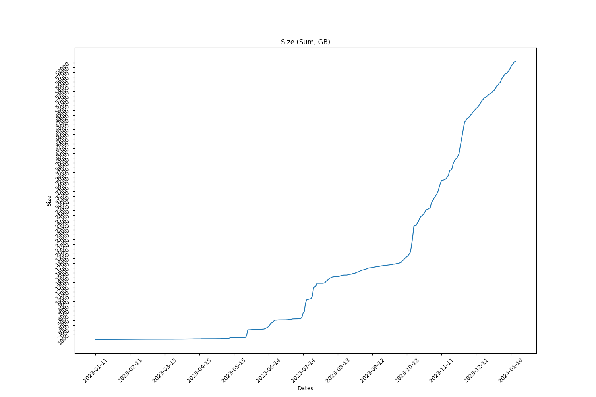
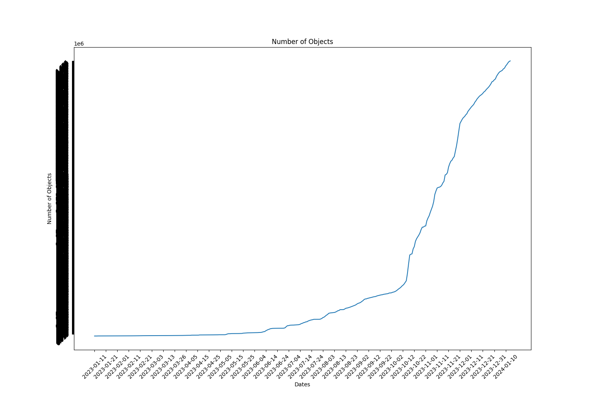

Full report for the Term: 25 

Start date: 2023-12-29  

End date: 2024-01-13 

Start Block: 5529625 

End Block: 5745626 

# Opening 
Number of openings: 4 
| id                     | createdAt                |
|------------------------|--------------------------|
| storageWorkingGroup-33 | 2024-01-02T14:28:30.000Z |
| storageWorkingGroup-34 | 2024-01-04T12:57:18.002Z |
| storageWorkingGroup-35 | 2024-01-11T11:10:18.000Z |
| storageWorkingGroup-36 | 2024-01-12T17:05:00.000Z |
# Hiring
Number of hired works: 3
| id                     |   membershipId | createdAt                |
|------------------------|----------------|--------------------------|
| storageWorkingGroup-19 |           1541 | 2024-01-03T13:00:54.001Z |
| storageWorkingGroup-20 |           2141 | 2024-01-10T15:05:12.000Z |
| storageWorkingGroup-21 |           1316 | 2024-01-13T14:53:42.001Z |
# Terminated workers 
Number of terminated workers: 2 
| createdAt                | workerId               |   worker |
|--------------------------|------------------------|----------|
| 2024-01-04T13:00:24.000Z | storageWorkingGroup-8  |     5764 |
| 2024-01-13T14:51:54.000Z | storageWorkingGroup-19 |     1541 |
# Slashed workers 
Number of slashed workers: 0 
# Rewards
Total Rewards: 1006965458472334
| workerId               |    worker_total |
|------------------------|-----------------|
| storageWorkingGroup-0  | 410970000000000 |
| storageWorkingGroup-10 |  41129447220680 |
| storageWorkingGroup-12 |  64312970534540 |
| storageWorkingGroup-13 |  56636448926540 |
| storageWorkingGroup-15 |  68116732800760 |
| storageWorkingGroup-16 |  74506873592340 |
| storageWorkingGroup-17 |  65586025756860 |
| storageWorkingGroup-18 |  40000672995500 |
| storageWorkingGroup-19 |          140964 |
| storageWorkingGroup-20 |           39150 |
| storageWorkingGroup-6  |  62992471132920 |
| storageWorkingGroup-7  |  51473435412140 |
| storageWorkingGroup-8  |           86520 |
| storageWorkingGroup-9  |  71240379833420 |
# BUCKETS Info  
|   id |   dataObjectsSize |   dataObjectsSizeLimit |   dataObjectsCount |   bags |   Utilization |   dataObjectsSize, GB |
|------|-------------------|------------------------|--------------------|--------|---------------|-----------------------|
|   12 |    23045945559327 |         68000000000000 |             737755 |  12189 |     0.338911  |              21442.3  |
|   14 |     2092873874585 |        100000000000000 |              55098 |    488 |     0.0209287 |               1947.24 |
|    2 |    27296753367697 |         68000000000000 |             707936 |  34949 |     0.401423  |              25397.3  |
|    1 |    22419457994383 |         36000000000000 |             661555 |  16782 |     0.622763  |              20859.4  |
|   11 |    23986216410671 |         42000000000000 |             764921 |  11778 |     0.5711    |              22317.1  |
|    7 |    20245628597353 |         49000000000000 |             667630 |  19071 |     0.413176  |              18836.8  |
|    8 |    30463142321060 |         55000000000000 |             631803 |   9871 |     0.553875  |              28343.3  |
|   10 |    17138183305668 |         22000000000000 |             582477 |  10210 |     0.779008  |              15945.6  |
|    3 |    26947813711149 |         42000000000000 |             753804 |  25033 |     0.641615  |              25072.6  |
|    0 |    17249257587444 |         28000000000000 |             374655 |  29584 |     0.616045  |              16049    |
|    4 |    31528456561003 |         48000000000000 |             674221 |  33774 |     0.656843  |              29334.5  |
|   18 |     3008679360164 |         57000000000000 |              87811 |    908 |     0.0527838 |               2799.32 |
## BUCKETS CREATED
Bucket Created: 0
## BUCKETS DELETED
Bucket Deleted: 0
## Bags
Bags Created: 817 

Bags Deleted: 0 

# Objects Info during this Council Period 
Total Objects Size: 124698 

Total Objects Size: 5388200252102 bytes 

## Objects Size Distribution
|   <10 MB |   <100 MB |   <1000 MB |   <10000 MB |   <100000 MB |   <1000000 MB |
|----------|-----------|------------|-------------|--------------|---------------|
|    86079 |    109563 |     124385 |      124693 |       124698 |        124698 |
 
|   0-10 MB |   10-100 MB |   100-1000 MB |   1000-10000 MB |   10000-100000 MB |   100000-10000000 MB |
|-----------|-------------|---------------|-----------------|-------------------|----------------------|
|     86079 |       23484 |         14822 |             308 |                 5 |                    0 |
## Objects Size Distribution Per Bag 
|   0-10 MB |   10-100 MB |   100-1000 MB |   1000-10000 MB |   10000-100000 MB |   100000-10000000 MB |
|-----------|-------------|---------------|-----------------|-------------------|----------------------|
|     86079 |       23484 |         14822 |             308 |                 5 |                    0 |
# Total object Info 
Total Objects: 1675640 

Total Objects Size: 62587639782349 bytes

Total Number of Bags in use: 22926 bytes

Grand Total Number of Bags: 33000 bytes

## Objects Size Distribution 
|   <10 MB |   <100 MB |   <1000 MB |   <10000 MB |   <100000 MB |   <1000000 MB |
|----------|-----------|------------|-------------|--------------|---------------|
|  1175900 |   1549167 |    1670289 |     1675403 |      1675640 |       1675640 |
 
|   0-10 MB |   10-100 MB |   100-1000 MB |   1000-10000 MB |   10000-100000 MB |   100000-10000000 MB |
|-----------|-------------|---------------|-----------------|-------------------|----------------------|
|   1175900 |      373267 |        121122 |            5114 |               237 |                    0 |
## Objects Size Distribution Per Bag 
|   0-10 MB |   10-100 MB |   100-1000 MB |   1000-10000 MB |   10000-100000 MB |   100000-10000000 MB |
|-----------|-------------|---------------|-----------------|-------------------|----------------------|
|   1175900 |      373267 |        121122 |            5114 |               237 |                    0 |

 
  
# Lost Objects - GraphQl 
Total Objects: 124698 

Total Lost Objects: 3129 

Percentage Lost Objects: %2.5092623779050185 

|      id | createdAt                |        size |   storageBagId |
|---------|--------------------------|-------------|----------------|
| 1556684 | 2023-12-29T19:10:00.000Z |    93928027 |          50331 |
| 1556685 | 2023-12-29T19:10:00.000Z |       12081 |          50331 |
| 1556686 | 2023-12-29T19:10:00.000Z |     9656770 |          50331 |
| 1556687 | 2023-12-29T19:10:00.000Z |       12405 |          50331 |
| 1556688 | 2023-12-29T19:10:00.000Z |    40394326 |          50331 |
| 1556689 | 2023-12-29T19:10:00.000Z |        9339 |          50331 |
| 1556694 | 2023-12-29T19:10:00.000Z |    85484102 |          50331 |
| 1556695 | 2023-12-29T19:10:00.000Z |       11660 |          50331 |
| 1556850 | 2023-12-29T19:27:30.001Z |   536811011 |          50337 |
| 1556825 | 2023-12-29T19:21:00.000Z |       67680 |          50338 |
| 1556824 | 2023-12-29T19:21:00.000Z |       26296 |          50338 |
| 1556830 | 2023-12-29T19:23:42.000Z |   432420253 |          50337 |
| 1556831 | 2023-12-29T19:23:42.000Z |       24588 |          50337 |
| 1556836 | 2023-12-29T19:24:12.001Z |   530610257 |          50337 |
| 1556837 | 2023-12-29T19:24:12.001Z |       27811 |          50337 |
| 1556838 | 2023-12-29T19:24:36.000Z |   594390110 |          50337 |
| 1556839 | 2023-12-29T19:24:36.000Z |       22394 |          50337 |
| 1556840 | 2023-12-29T19:24:36.000Z |   557902978 |          50337 |
| 1556841 | 2023-12-29T19:24:36.000Z |       22454 |          50337 |
| 1556851 | 2023-12-29T19:27:30.001Z |       29655 |          50337 |
| 1556919 | 2023-12-29T20:24:54.000Z |   168086538 |          50339 |
| 1556920 | 2023-12-29T20:24:54.000Z |       24197 |          50339 |
| 1556925 | 2023-12-29T20:25:24.000Z |   216354267 |          50339 |
| 1556926 | 2023-12-29T20:25:24.000Z |       25298 |          50339 |
| 1556931 | 2023-12-29T20:25:24.000Z |   200858841 |          50339 |
| 1556932 | 2023-12-29T20:25:24.000Z |       25928 |          50339 |
| 1556935 | 2023-12-29T20:25:24.000Z |   202981887 |          50339 |
| 1556936 | 2023-12-29T20:25:24.000Z |       22802 |          50339 |
| 1556937 | 2023-12-29T20:25:24.000Z |   192836986 |          50339 |
| 1556938 | 2023-12-29T20:25:24.000Z |       23305 |          50339 |
| 1556903 | 2023-12-29T20:24:54.000Z |   263192778 |          50339 |
| 1556904 | 2023-12-29T20:24:54.000Z |       22893 |          50339 |
| 1556907 | 2023-12-29T20:24:54.000Z |   155894962 |          50339 |
| 1556908 | 2023-12-29T20:24:54.000Z |       24020 |          50339 |
| 1556915 | 2023-12-29T20:24:54.000Z |   158781250 |          50339 |
| 1556916 | 2023-12-29T20:24:54.000Z |       18253 |          50339 |
| 1556917 | 2023-12-29T20:24:54.000Z |   230642866 |          50339 |
| 1556918 | 2023-12-29T20:24:54.000Z |       25703 |          50339 |
| 1556941 | 2023-12-29T20:25:24.000Z |   165597834 |          50339 |
| 1556942 | 2023-12-29T20:25:24.000Z |       26398 |          50339 |
| 1556943 | 2023-12-29T20:25:54.000Z |   278344514 |          50339 |
| 1556944 | 2023-12-29T20:25:54.000Z |       26200 |          50339 |
| 1556947 | 2023-12-29T20:25:54.000Z |   250834441 |          50339 |
| 1556948 | 2023-12-29T20:25:54.000Z |       20876 |          50339 |
| 1556959 | 2023-12-29T20:25:54.000Z |   206214718 |          50339 |
| 1556960 | 2023-12-29T20:25:54.000Z |       24582 |          50339 |
| 1556963 | 2023-12-29T20:26:24.001Z |   298956498 |          50339 |
| 1556964 | 2023-12-29T20:26:24.001Z |       23662 |          50339 |
| 1556852 | 2023-12-29T19:28:00.000Z |   694831785 |          50337 |
| 1556853 | 2023-12-29T19:28:00.000Z |       20179 |          50337 |
| 1559701 | 2023-12-30T06:49:18.000Z |      111592 |          50351 |
| 1557077 | 2023-12-29T22:01:54.001Z |       46875 |          50341 |
| 1557076 | 2023-12-29T22:01:54.001Z |       41199 |          50341 |
| 1556983 | 2023-12-29T20:26:54.000Z |    76961449 |          50339 |
| 1556984 | 2023-12-29T20:26:54.000Z |       28254 |          50339 |
| 1556987 | 2023-12-29T20:26:54.000Z |    54090791 |          50339 |
| 1556988 | 2023-12-29T20:26:54.000Z |       24365 |          50339 |
| 1558310 | 2023-12-29T23:22:30.000Z |    12191088 |          50188 |
| 1558311 | 2023-12-29T23:22:30.000Z |       22838 |          50188 |
| 1558825 | 2023-12-30T02:50:30.000Z |      392288 |          50346 |
| 1558824 | 2023-12-30T02:50:30.000Z |      100321 |          50346 |
| 1559639 | 2023-12-30T06:34:54.001Z |      281227 |          50350 |
| 1559638 | 2023-12-30T06:34:54.001Z |       33886 |          50350 |
| 1559700 | 2023-12-30T06:49:18.000Z |       31260 |          50351 |
| 1559938 | 2023-12-30T09:11:00.001Z |       61523 |          50356 |
| 1559881 | 2023-12-30T08:20:12.000Z |       47561 |          50355 |
| 1560428 | 2023-12-30T12:48:54.001Z |    47230230 |          50360 |
| 1560047 | 2023-12-30T11:29:42.000Z |      346935 |          50357 |
| 1560046 | 2023-12-30T11:29:42.000Z |       45492 |          50357 |
| 1560045 | 2023-12-30T11:01:36.000Z |       34946 |          50264 |
| 1560429 | 2023-12-30T12:48:54.001Z |       35500 |          50360 |
| 1561255 | 2023-12-30T19:51:42.000Z |      198898 |          50368 |
| 1561254 | 2023-12-30T19:51:42.000Z |       39208 |          50368 |
| 1562579 | 2023-12-31T09:13:42.001Z |   106992455 |          50384 |
| 1562217 | 2023-12-30T21:26:12.000Z |       11115 |          33237 |
| 1562218 | 2023-12-30T21:26:24.000Z |  2818623464 |          28084 |
| 1562219 | 2023-12-30T21:26:24.000Z |       22463 |          28084 |
| 1562548 | 2023-12-31T01:23:54.001Z |       13274 |          50375 |
| 1562538 | 2023-12-30T23:30:36.000Z |       82852 |          50374 |
| 1562539 | 2023-12-30T23:37:06.000Z |    62880435 |          50374 |
| 1562540 | 2023-12-30T23:37:06.000Z |       28440 |          50374 |
| 1562543 | 2023-12-30T23:55:06.001Z |    62880435 |          50374 |
| 1562544 | 2023-12-30T23:55:06.001Z |       28440 |          50374 |
| 1562545 | 2023-12-31T01:18:18.001Z |    49055284 |          50375 |
| 1562546 | 2023-12-31T01:18:18.001Z |       23106 |          50375 |
| 1562566 | 2023-12-31T08:18:06.000Z |        1652 |          50380 |
| 1562567 | 2023-12-31T08:18:06.000Z |        7306 |          50380 |
| 1562568 | 2023-12-31T08:35:54.000Z |        6350 |          50310 |
| 1562573 | 2023-12-31T09:00:30.000Z |       49674 |          50383 |
| 1562572 | 2023-12-31T09:00:30.000Z |       44900 |          50383 |
| 1562582 | 2023-12-31T09:41:30.001Z |     4503698 |          48675 |
| 1562583 | 2023-12-31T09:41:30.001Z |       12856 |          48675 |
| 1562591 | 2023-12-31T13:38:18.001Z |   918399712 |          50388 |
| 1562592 | 2023-12-31T13:38:18.001Z |       13232 |          50388 |
| 1563269 | 2023-12-31T15:16:30.000Z |   401310836 |          50391 |
| 1563270 | 2023-12-31T15:16:30.000Z |       18479 |          50391 |
| 1564353 | 2023-12-31T15:43:54.001Z |    29040687 |          29515 |
| 1564293 | 2023-12-31T15:39:30.000Z |   127055207 |          50390 |
| 1564294 | 2023-12-31T15:39:30.000Z |       24934 |          50390 |
| 1564295 | 2023-12-31T15:39:30.000Z |   106803215 |          50390 |
| 1564296 | 2023-12-31T15:39:30.000Z |       20401 |          50390 |
| 1563785 | 2023-12-31T15:28:54.000Z |    35918806 |          50390 |
| 1563786 | 2023-12-31T15:28:54.000Z |       27882 |          50390 |
| 1564069 | 2023-12-31T15:33:42.000Z |     1570675 |          50387 |
| 1564070 | 2023-12-31T15:33:42.000Z |        4078 |          50387 |
| 1564257 | 2023-12-31T15:38:24.000Z |   130549031 |          50390 |
| 1564258 | 2023-12-31T15:38:24.000Z |       24765 |          50390 |
| 1564524 | 2023-12-31T15:47:12.000Z |   139685916 |          42774 |
| 1564525 | 2023-12-31T15:47:12.000Z |       22743 |          42774 |
| 1564835 | 2023-12-31T16:27:24.001Z |   243941990 |          50397 |
| 1564504 | 2023-12-31T15:46:42.001Z |    95105368 |          50393 |
| 1564505 | 2023-12-31T15:46:42.001Z |       24467 |          50393 |
| 1564354 | 2023-12-31T15:43:54.001Z |       13937 |          29515 |
| 1567300 | 2023-12-31T17:53:36.000Z |      118348 |          50409 |
| 1567207 | 2023-12-31T17:51:00.000Z |      111856 |          50408 |
| 1567206 | 2023-12-31T17:51:00.000Z |       85197 |          50408 |
| 1566424 | 2023-12-31T17:32:36.000Z |     5620051 |          50403 |
| 1566425 | 2023-12-31T17:32:36.000Z |        8075 |          50403 |
| 1566648 | 2023-12-31T17:38:12.001Z |    15561439 |          50403 |
| 1566649 | 2023-12-31T17:38:12.001Z |        7108 |          50403 |
| 1567299 | 2023-12-31T17:53:36.000Z |       61624 |          50409 |
| 1568357 | 2023-12-31T19:30:12.000Z |        5912 |          50411 |
| 1567816 | 2023-12-31T19:01:12.000Z |       53936 |          50411 |
| 1568054 | 2023-12-31T19:06:54.000Z |       15200 |          50411 |
| 1568358 | 2023-12-31T19:32:18.000Z |     4070129 |          50411 |
| 1569341 | 2023-12-31T21:05:30.001Z |      232447 |          50418 |
| 1569241 | 2023-12-31T20:44:42.001Z |       14711 |          28094 |
| 1569340 | 2023-12-31T21:05:30.001Z |       47044 |          50418 |
| 1570441 | 2023-12-31T22:38:36.000Z |      132799 |          50422 |
| 1570269 | 2023-12-31T22:16:12.001Z |        9685 |          27342 |
| 1570440 | 2023-12-31T22:38:36.000Z |       42523 |          50422 |
| 1570442 | 2023-12-31T22:46:36.000Z |     3661181 |          50422 |
| 1570454 | 2023-12-31T22:47:06.000Z |    60138851 |          50422 |
| 1570455 | 2023-12-31T22:47:06.000Z |       13173 |          50422 |
| 1570458 | 2023-12-31T22:47:06.000Z |    14192851 |          50422 |
| 1570459 | 2023-12-31T22:47:06.000Z |       11401 |          50422 |
| 1570472 | 2023-12-31T22:47:36.000Z |    92340743 |          50422 |
| 1570473 | 2023-12-31T22:47:36.000Z |        8838 |          50422 |
| 1570474 | 2023-12-31T22:47:36.000Z |   137187135 |          50422 |
| 1570475 | 2023-12-31T22:47:36.000Z |        8838 |          50422 |
| 1570478 | 2023-12-31T22:47:36.000Z |   198065427 |          50422 |
| 1570479 | 2023-12-31T22:47:36.000Z |        9866 |          50422 |
| 1570480 | 2023-12-31T22:47:36.000Z |   280176794 |          50422 |
| 1570481 | 2023-12-31T22:47:36.000Z |       11217 |          50422 |
| 1570486 | 2023-12-31T22:48:06.000Z |   257384041 |          50422 |
| 1570487 | 2023-12-31T22:48:06.000Z |       11049 |          50422 |
| 1570498 | 2023-12-31T22:48:06.000Z |   211295055 |          50422 |
| 1570499 | 2023-12-31T22:48:06.000Z |       17912 |          50422 |
| 1570502 | 2023-12-31T22:48:30.001Z |   108936272 |          50422 |
| 1570503 | 2023-12-31T22:48:30.001Z |        7753 |          50422 |
| 1570504 | 2023-12-31T22:48:30.001Z |   241244768 |          50422 |
| 1570505 | 2023-12-31T22:48:30.001Z |        5213 |          50422 |
| 1570506 | 2023-12-31T22:48:30.001Z |     8945539 |          50422 |
| 1570507 | 2023-12-31T22:48:30.001Z |        3654 |          50422 |
| 1570522 | 2023-12-31T22:50:06.000Z |   499694347 |          50422 |
| 1570510 | 2023-12-31T22:48:54.002Z |   364727198 |          50422 |
| 1570511 | 2023-12-31T22:48:54.002Z |        7542 |          50422 |
| 1570512 | 2023-12-31T22:48:54.002Z |   492962929 |          50422 |
| 1570513 | 2023-12-31T22:48:54.002Z |        7118 |          50422 |
| 1570514 | 2023-12-31T22:48:54.002Z |   793873005 |          50422 |
| 1570515 | 2023-12-31T22:48:54.002Z |       24757 |          50422 |
| 1570518 | 2023-12-31T22:49:42.000Z |   157581392 |          50422 |
| 1570519 | 2023-12-31T22:49:42.000Z |       15181 |          50422 |
| 1570523 | 2023-12-31T22:50:06.000Z |       20393 |          50422 |
| 1570526 | 2023-12-31T22:52:30.000Z |     9727555 |          50422 |
| 1570527 | 2023-12-31T22:52:30.000Z |        6501 |          50422 |
| 1570488 | 2023-12-31T22:48:06.000Z |   320782141 |          50422 |
| 1570489 | 2023-12-31T22:48:06.000Z |       13025 |          50422 |
| 1570490 | 2023-12-31T22:48:06.000Z |   224858256 |          50422 |
| 1570491 | 2023-12-31T22:48:06.000Z |       14983 |          50422 |
| 1570492 | 2023-12-31T22:48:06.000Z |   140775160 |          50422 |
| 1570493 | 2023-12-31T22:48:06.000Z |       18310 |          50422 |
| 1570494 | 2023-12-31T22:48:06.000Z |   227845249 |          50422 |
| 1570495 | 2023-12-31T22:48:06.000Z |        4612 |          50422 |
| 1570528 | 2023-12-31T22:52:30.000Z |     2400993 |          50422 |
| 1570529 | 2023-12-31T22:52:30.000Z |        6313 |          50422 |
| 1570532 | 2023-12-31T22:52:30.000Z |    38209469 |          50422 |
| 1570533 | 2023-12-31T22:52:30.000Z |        9645 |          50422 |
| 1570538 | 2023-12-31T22:52:30.000Z |    25328423 |          50422 |
| 1570539 | 2023-12-31T22:52:30.000Z |       14178 |          50422 |
| 1570540 | 2023-12-31T22:52:30.000Z |    19334008 |          50422 |
| 1570541 | 2023-12-31T22:52:30.000Z |       14212 |          50422 |
| 1570546 | 2023-12-31T22:53:00.001Z |    58284041 |          50422 |
| 1570547 | 2023-12-31T22:53:00.001Z |       17821 |          50422 |
| 1570548 | 2023-12-31T22:53:00.001Z |    10086076 |          50422 |
| 1570549 | 2023-12-31T22:53:00.001Z |        4820 |          50422 |
| 1570550 | 2023-12-31T22:53:00.001Z |    47704726 |          50422 |
| 1570551 | 2023-12-31T22:53:00.001Z |       11589 |          50422 |
| 1570574 | 2023-12-31T22:53:30.000Z |     1138259 |          50422 |
| 1570575 | 2023-12-31T22:53:30.000Z |       10912 |          50422 |
| 1570578 | 2023-12-31T22:54:00.000Z |   177278491 |          50422 |
| 1570579 | 2023-12-31T22:54:00.000Z |       11578 |          50422 |
| 1570586 | 2023-12-31T22:54:00.000Z |     8593891 |          50422 |
| 1570587 | 2023-12-31T22:54:00.000Z |       14601 |          50422 |
| 1570588 | 2023-12-31T22:54:00.000Z |     9870368 |          50422 |
| 1570589 | 2023-12-31T22:54:00.000Z |       13490 |          50422 |
| 1570590 | 2023-12-31T22:54:00.000Z |     1790577 |          50422 |
| 1570591 | 2023-12-31T22:54:00.000Z |       18652 |          50422 |
| 1570592 | 2023-12-31T22:54:00.000Z |     6436929 |          50422 |
| 1570593 | 2023-12-31T22:54:00.000Z |       14957 |          50422 |
| 1570558 | 2023-12-31T22:53:30.000Z |    95034224 |          50422 |
| 1570559 | 2023-12-31T22:53:30.000Z |        7584 |          50422 |
| 1570564 | 2023-12-31T22:53:30.000Z |    99873137 |          50422 |
| 1570565 | 2023-12-31T22:53:30.000Z |       20275 |          50422 |
| 1570570 | 2023-12-31T22:53:30.000Z |    83108023 |          50422 |
| 1570571 | 2023-12-31T22:53:30.000Z |       13722 |          50422 |
| 1570572 | 2023-12-31T22:53:30.000Z |   113511188 |          50422 |
| 1570573 | 2023-12-31T22:53:30.000Z |       15895 |          50422 |
| 1570596 | 2023-12-31T22:54:00.000Z |    30856267 |          50422 |
| 1570597 | 2023-12-31T22:54:00.000Z |       13014 |          50422 |
| 1570598 | 2023-12-31T22:54:30.003Z |   370766878 |          50422 |
| 1570599 | 2023-12-31T22:54:30.003Z |       11702 |          50422 |
| 1570600 | 2023-12-31T22:54:30.003Z |   442355217 |          50422 |
| 1570601 | 2023-12-31T22:54:30.003Z |       21116 |          50422 |
| 1570604 | 2023-12-31T22:54:30.003Z |   272794168 |          50422 |
| 1570605 | 2023-12-31T22:54:30.003Z |       18653 |          50422 |
| 1570610 | 2023-12-31T22:54:30.003Z |    47582276 |          50422 |
| 1570611 | 2023-12-31T22:54:30.003Z |       11924 |          50422 |
| 1570612 | 2023-12-31T22:54:30.003Z |      764134 |          50422 |
| 1570613 | 2023-12-31T22:54:30.003Z |        6411 |          50422 |
| 1570616 | 2023-12-31T22:54:30.003Z |     8721734 |          50422 |
| 1570617 | 2023-12-31T22:54:30.003Z |       12521 |          50422 |
| 1570620 | 2023-12-31T22:54:54.000Z |    37416949 |          50422 |
| 1570621 | 2023-12-31T22:54:54.000Z |       18726 |          50422 |
| 1570730 | 2024-01-01T02:33:36.001Z |      321054 |          50424 |
| 1570729 | 2024-01-01T02:33:36.001Z |       63591 |          50424 |
| 1570937 | 2024-01-01T05:26:36.000Z | 20954472704 |          27851 |
| 1570938 | 2024-01-01T05:26:36.000Z |       20926 |          27851 |
| 1570443 | 2023-12-31T22:46:36.000Z |        9506 |          50422 |
| 1570446 | 2023-12-31T22:47:06.000Z |    96896127 |          50422 |
| 1570447 | 2023-12-31T22:47:06.000Z |       17320 |          50422 |
| 1573134 | 2024-01-01T16:33:12.000Z |    71618714 |          50441 |
| 1571100 | 2024-01-01T06:14:24.002Z |      266475 |          50427 |
| 1571097 | 2024-01-01T06:08:18.000Z |     8624949 |          50385 |
| 1572057 | 2024-01-01T12:28:24.000Z |        5957 |          49996 |
| 1572060 | 2024-01-01T12:28:36.000Z |       14724 |          50385 |
| 1572764 | 2024-01-01T16:03:12.000Z |      252192 |          50440 |
| 1572763 | 2024-01-01T16:03:12.000Z |       16127 |          50440 |
| 1572907 | 2024-01-01T16:21:00.000Z |        7292 |          50389 |
| 1573169 | 2024-01-01T17:46:18.000Z |    16793539 |          50442 |
| 1573172 | 2024-01-01T17:50:36.000Z |      177717 |          50444 |
| 1571890 | 2024-01-01T12:23:36.000Z |       33552 |          50385 |
| 1572113 | 2024-01-01T12:30:06.001Z |       63146 |          50385 |
| 1573135 | 2024-01-01T16:33:12.000Z |       20120 |          50441 |
| 1575329 | 2024-01-01T20:28:36.000Z |    21370506 |          50449 |
| 1575138 | 2024-01-01T20:25:54.000Z |       20560 |          47998 |
| 1575152 | 2024-01-01T20:26:00.000Z |      223287 |          50451 |
| 1575151 | 2024-01-01T20:26:00.000Z |       59228 |          50451 |
| 1573356 | 2024-01-01T17:59:12.000Z |      260875 |          50445 |
| 1573355 | 2024-01-01T17:59:12.000Z |       26518 |          50445 |
| 1574279 | 2024-01-01T19:20:30.001Z |       38453 |          50447 |
| 1574402 | 2024-01-01T19:25:00.001Z |       10798 |          50442 |
| 1574479 | 2024-01-01T19:27:12.001Z |    10301145 |          26490 |
| 1574480 | 2024-01-01T19:27:12.001Z |       17075 |          26490 |
| 1574483 | 2024-01-01T19:27:12.001Z |     3009651 |          47292 |
| 1574484 | 2024-01-01T19:27:12.001Z |        8264 |          47292 |
| 1575355 | 2024-01-01T20:29:06.000Z |    23297715 |          50449 |
| 1575356 | 2024-01-01T20:29:06.000Z |       21874 |          50449 |
| 1575357 | 2024-01-01T20:29:06.000Z |    19110397 |          50449 |
| 1575358 | 2024-01-01T20:29:06.000Z |       11887 |          50449 |
| 1575359 | 2024-01-01T20:29:06.000Z |    22423740 |          50449 |
| 1575360 | 2024-01-01T20:29:06.000Z |       19365 |          50449 |
| 1575363 | 2024-01-01T20:29:06.000Z |    20278105 |          50449 |
| 1575364 | 2024-01-01T20:29:06.000Z |       15149 |          50449 |
| 1575367 | 2024-01-01T20:29:06.000Z |    26866834 |          50449 |
| 1575368 | 2024-01-01T20:29:06.000Z |       20275 |          50449 |
| 1575369 | 2024-01-01T20:29:36.001Z |    24282960 |          50449 |
| 1575370 | 2024-01-01T20:29:36.001Z |       19950 |          50449 |
| 1575371 | 2024-01-01T20:29:36.001Z |    18901572 |          50449 |
| 1575372 | 2024-01-01T20:29:36.001Z |       21101 |          50449 |
| 1575373 | 2024-01-01T20:29:36.001Z |    27102161 |          50449 |
| 1575374 | 2024-01-01T20:29:36.001Z |       16740 |          50449 |
| 1575375 | 2024-01-01T20:29:36.001Z |    21530073 |          50449 |
| 1575376 | 2024-01-01T20:29:36.001Z |       17140 |          50449 |
| 1575377 | 2024-01-01T20:29:36.001Z |    29847427 |          50449 |
| 1575378 | 2024-01-01T20:29:36.001Z |       20656 |          50449 |
| 1575423 | 2024-01-01T20:30:30.000Z |    23325303 |          50449 |
| 1575424 | 2024-01-01T20:30:30.000Z |       22058 |          50449 |
| 1575425 | 2024-01-01T20:30:30.000Z |    20623111 |          50449 |
| 1575426 | 2024-01-01T20:30:30.000Z |       15641 |          50449 |
| 1575427 | 2024-01-01T20:30:30.000Z |    20212194 |          50449 |
| 1575428 | 2024-01-01T20:30:30.000Z |       21469 |          50449 |
| 1575431 | 2024-01-01T20:31:00.000Z |    24767655 |          50449 |
| 1575432 | 2024-01-01T20:31:00.000Z |       19340 |          50449 |
| 1575433 | 2024-01-01T20:31:00.000Z |    23800556 |          50449 |
| 1575434 | 2024-01-01T20:31:00.000Z |       22958 |          50449 |
| 1575435 | 2024-01-01T20:31:00.000Z |    16521681 |          50449 |
| 1575436 | 2024-01-01T20:31:00.000Z |       20255 |          50449 |
| 1575437 | 2024-01-01T20:31:00.000Z |    33284757 |          50449 |
| 1575438 | 2024-01-01T20:31:00.000Z |       14035 |          50449 |
| 1575441 | 2024-01-01T20:31:00.000Z |    20947600 |          50449 |
| 1575442 | 2024-01-01T20:31:00.000Z |       21726 |          50449 |
| 1575443 | 2024-01-01T20:31:00.000Z |    22918533 |          50449 |
| 1575381 | 2024-01-01T20:29:36.001Z |    17123486 |          50449 |
| 1575382 | 2024-01-01T20:29:36.001Z |       18977 |          50449 |
| 1575383 | 2024-01-01T20:29:36.001Z |    18675063 |          50449 |
| 1575384 | 2024-01-01T20:29:36.001Z |       25038 |          50449 |
| 1575385 | 2024-01-01T20:29:36.001Z |    22986319 |          50449 |
| 1575386 | 2024-01-01T20:29:36.001Z |       19794 |          50449 |
| 1575387 | 2024-01-01T20:29:36.001Z |    19066945 |          50449 |
| 1575388 | 2024-01-01T20:29:36.001Z |       19755 |          50449 |
| 1575389 | 2024-01-01T20:30:06.000Z |    17314222 |          50449 |
| 1575390 | 2024-01-01T20:30:06.000Z |       15085 |          50449 |
| 1575393 | 2024-01-01T20:30:06.000Z |    25114997 |          50449 |
| 1575394 | 2024-01-01T20:30:06.000Z |       17769 |          50449 |
| 1575397 | 2024-01-01T20:30:06.000Z |    20825804 |          50449 |
| 1575398 | 2024-01-01T20:30:06.000Z |       22235 |          50449 |
| 1575399 | 2024-01-01T20:30:06.000Z |    19261592 |          50449 |
| 1575400 | 2024-01-01T20:30:06.000Z |       15977 |          50449 |
| 1575405 | 2024-01-01T20:30:06.000Z |    19435172 |          50449 |
| 1575406 | 2024-01-01T20:30:06.000Z |       20105 |          50449 |
| 1575409 | 2024-01-01T20:30:30.000Z |    20378011 |          50449 |
| 1575410 | 2024-01-01T20:30:30.000Z |       18068 |          50449 |
| 1575411 | 2024-01-01T20:30:30.000Z |    23527082 |          50449 |
| 1575412 | 2024-01-01T20:30:30.000Z |       17552 |          50449 |
| 1575413 | 2024-01-01T20:30:30.000Z |    20004954 |          50449 |
| 1575414 | 2024-01-01T20:30:30.000Z |       20536 |          50449 |
| 1575417 | 2024-01-01T20:30:30.000Z |    24033146 |          50449 |
| 1575418 | 2024-01-01T20:30:30.000Z |       19859 |          50449 |
| 1575419 | 2024-01-01T20:30:30.000Z |    20202495 |          50449 |
| 1575420 | 2024-01-01T20:30:30.000Z |       19005 |          50449 |
| 1575421 | 2024-01-01T20:30:30.000Z |    13318230 |          50449 |
| 1575422 | 2024-01-01T20:30:30.000Z |       19016 |          50449 |
| 1575465 | 2024-01-01T20:31:30.000Z |    15454850 |          50449 |
| 1575466 | 2024-01-01T20:31:30.000Z |       18234 |          50449 |
| 1575467 | 2024-01-01T20:31:30.000Z |    17071597 |          50449 |
| 1575468 | 2024-01-01T20:31:30.000Z |       22544 |          50449 |
| 1575486 | 2024-01-01T20:32:00.001Z |       24188 |          50449 |
| 1575487 | 2024-01-01T20:32:00.001Z |    16380496 |          50449 |
| 1575488 | 2024-01-01T20:32:00.001Z |       20604 |          50449 |
| 1575485 | 2024-01-01T20:32:00.001Z |    14911187 |          50449 |
| 1575587 | 2024-01-01T20:34:30.000Z |     5595146 |          50444 |
| 1575588 | 2024-01-01T20:34:30.000Z |        2295 |          50444 |
| 1575589 | 2024-01-01T20:34:30.000Z |     8279901 |          50444 |
| 1575590 | 2024-01-01T20:34:30.000Z |       17317 |          50444 |
| 1575591 | 2024-01-01T20:34:30.000Z |     1623709 |          50444 |
| 1575592 | 2024-01-01T20:34:30.000Z |       13346 |          50444 |
| 1575593 | 2024-01-01T20:35:00.001Z |     8310843 |          50444 |
| 1575594 | 2024-01-01T20:35:00.001Z |       10286 |          50444 |
| 1575595 | 2024-01-01T20:35:00.001Z |     1316546 |          50444 |
| 1575596 | 2024-01-01T20:35:00.001Z |        5882 |          50444 |
| 1575597 | 2024-01-01T20:35:00.001Z |     1065886 |          50444 |
| 1575598 | 2024-01-01T20:35:00.001Z |        6405 |          50444 |
| 1575599 | 2024-01-01T20:35:00.001Z |     9977947 |          50444 |
| 1575600 | 2024-01-01T20:35:00.001Z |        7249 |          50444 |
| 1575601 | 2024-01-01T20:35:00.001Z |     3715734 |          50444 |
| 1575602 | 2024-01-01T20:35:00.001Z |        7834 |          50444 |
| 1575603 | 2024-01-01T20:35:00.001Z |     4620979 |          50444 |
| 1575604 | 2024-01-01T20:35:00.001Z |       10677 |          50444 |
| 1575605 | 2024-01-01T20:35:00.001Z |     8151162 |          50444 |
| 1575606 | 2024-01-01T20:35:00.001Z |        7160 |          50444 |
| 1575607 | 2024-01-01T20:35:00.001Z |     4225324 |          50444 |
| 1575629 | 2024-01-01T20:35:30.001Z |     4602488 |          50444 |
| 1575630 | 2024-01-01T20:35:30.001Z |        8002 |          50444 |
| 1575631 | 2024-01-01T20:35:30.001Z |     5298867 |          50444 |
| 1575632 | 2024-01-01T20:35:30.001Z |        7831 |          50444 |
| 1575633 | 2024-01-01T20:36:00.000Z |      968452 |          50444 |
| 1575634 | 2024-01-01T20:36:00.000Z |        4733 |          50444 |
| 1575635 | 2024-01-01T20:36:00.000Z |     1981963 |          50444 |
| 1575636 | 2024-01-01T20:36:00.000Z |        4729 |          50444 |
| 1575637 | 2024-01-01T20:36:00.000Z |     4670568 |          50444 |
| 1575638 | 2024-01-01T20:36:00.000Z |        8009 |          50444 |
| 1575639 | 2024-01-01T20:36:00.000Z |     3605499 |          50444 |
| 1575640 | 2024-01-01T20:36:00.000Z |       10826 |          50444 |
| 1575641 | 2024-01-01T20:36:00.000Z |      694342 |          50444 |
| 1575642 | 2024-01-01T20:36:00.000Z |        9614 |          50444 |
| 1575643 | 2024-01-01T20:36:00.000Z |     3892083 |          50444 |
| 1575644 | 2024-01-01T20:36:00.000Z |        7514 |          50444 |
| 1575645 | 2024-01-01T20:36:00.000Z |     1365276 |          50444 |
| 1575646 | 2024-01-01T20:36:00.000Z |        5541 |          50444 |
| 1575647 | 2024-01-01T20:36:00.000Z |     2585797 |          50444 |
| 1575648 | 2024-01-01T20:36:00.000Z |        5248 |          50444 |
| 1575669 | 2024-01-01T20:36:30.001Z |     2226386 |          50444 |
| 1575670 | 2024-01-01T20:36:30.001Z |        6077 |          50444 |
| 1575671 | 2024-01-01T20:36:30.001Z |     3083327 |          50444 |
| 1575672 | 2024-01-01T20:36:30.001Z |        7056 |          50444 |
| 1575673 | 2024-01-01T20:37:00.000Z |     2603823 |          50444 |
| 1575674 | 2024-01-01T20:37:00.000Z |        6751 |          50444 |
| 1575675 | 2024-01-01T20:37:00.000Z |     3135526 |          50444 |
| 1575676 | 2024-01-01T20:37:00.000Z |        4024 |          50444 |
| 1575677 | 2024-01-01T20:37:00.000Z |     4700895 |          50444 |
| 1575678 | 2024-01-01T20:37:00.000Z |       10035 |          50444 |
| 1575679 | 2024-01-01T20:37:00.000Z |     2148441 |          50444 |
| 1575680 | 2024-01-01T20:37:00.000Z |       10233 |          50444 |
| 1575681 | 2024-01-01T20:37:00.000Z |     1116727 |          50444 |
| 1575682 | 2024-01-01T20:37:00.000Z |        6298 |          50444 |
| 1575683 | 2024-01-01T20:37:00.000Z |      593559 |          50444 |
| 1575684 | 2024-01-01T20:37:00.000Z |        6357 |          50444 |
| 1575685 | 2024-01-01T20:37:00.000Z |     2354891 |          50444 |
| 1575686 | 2024-01-01T20:37:00.000Z |       10076 |          50444 |
| 1575687 | 2024-01-01T20:37:00.000Z |     1149338 |          50444 |
| 1575688 | 2024-01-01T20:37:00.000Z |        5177 |          50444 |
| 1575715 | 2024-01-01T20:37:12.001Z |     7868928 |          48776 |
| 1575716 | 2024-01-01T20:37:12.001Z |        7306 |          48776 |
| 1575717 | 2024-01-01T20:37:12.001Z |     2207607 |          48776 |
| 1575718 | 2024-01-01T20:37:12.001Z |        7803 |          48776 |
| 1575725 | 2024-01-01T20:37:24.000Z |     4115890 |          50444 |
| 1575726 | 2024-01-01T20:37:24.000Z |       11484 |          50444 |
| 1575727 | 2024-01-01T20:37:24.000Z |      477590 |          50444 |
| 1575728 | 2024-01-01T20:37:24.000Z |       10217 |          50444 |
| 1575739 | 2024-01-01T20:37:36.000Z |      168674 |          50348 |
| 1575740 | 2024-01-01T20:37:36.000Z |        5333 |          50348 |
| 1575444 | 2024-01-01T20:31:00.000Z |       17822 |          50449 |
| 1575445 | 2024-01-01T20:31:00.000Z |    22816168 |          50449 |
| 1575446 | 2024-01-01T20:31:00.000Z |       15759 |          50449 |
| 1575455 | 2024-01-01T20:31:30.000Z |    17307162 |          50449 |
| 1575456 | 2024-01-01T20:31:30.000Z |       19243 |          50449 |
| 1575459 | 2024-01-01T20:31:30.000Z |    13770873 |          50449 |
| 1575460 | 2024-01-01T20:31:30.000Z |       18968 |          50449 |
| 1575461 | 2024-01-01T20:31:30.000Z |    17936836 |          50449 |
| 1575462 | 2024-01-01T20:31:30.000Z |       19209 |          50449 |
| 1575573 | 2024-01-01T20:34:30.000Z |     2621594 |          36306 |
| 1575574 | 2024-01-01T20:34:30.000Z |        5767 |          36306 |
| 1575577 | 2024-01-01T20:34:30.000Z |     1480633 |          50444 |
| 1575578 | 2024-01-01T20:34:30.000Z |        4836 |          50444 |
| 1575579 | 2024-01-01T20:34:30.000Z |     2465753 |          50444 |
| 1575580 | 2024-01-01T20:34:30.000Z |        9330 |          50444 |
| 1575581 | 2024-01-01T20:34:30.000Z |     1660821 |          50444 |
| 1575582 | 2024-01-01T20:34:30.000Z |        9490 |          50444 |
| 1575583 | 2024-01-01T20:34:30.000Z |     8152691 |          50444 |
| 1575584 | 2024-01-01T20:34:30.000Z |        3055 |          50444 |
| 1575585 | 2024-01-01T20:34:30.000Z |     7857058 |          50444 |
| 1575586 | 2024-01-01T20:34:30.000Z |        6539 |          50444 |
| 1575608 | 2024-01-01T20:35:00.001Z |       18481 |          50444 |
| 1575609 | 2024-01-01T20:35:00.001Z |     1670090 |          50444 |
| 1575610 | 2024-01-01T20:35:00.001Z |        6309 |          50444 |
| 1575611 | 2024-01-01T20:35:00.001Z |     3621104 |          50444 |
| 1575612 | 2024-01-01T20:35:00.001Z |        7183 |          50444 |
| 1575613 | 2024-01-01T20:35:30.001Z |     3818569 |          50444 |
| 1575614 | 2024-01-01T20:35:30.001Z |       11485 |          50444 |
| 1575615 | 2024-01-01T20:35:30.001Z |     6882228 |          50444 |
| 1575616 | 2024-01-01T20:35:30.001Z |        8334 |          50444 |
| 1575617 | 2024-01-01T20:35:30.001Z |     6334311 |          50444 |
| 1575618 | 2024-01-01T20:35:30.001Z |        7045 |          50444 |
| 1575619 | 2024-01-01T20:35:30.001Z |     3024423 |          50444 |
| 1575620 | 2024-01-01T20:35:30.001Z |        9362 |          50444 |
| 1575621 | 2024-01-01T20:35:30.001Z |     4944795 |          50444 |
| 1575622 | 2024-01-01T20:35:30.001Z |        9354 |          50444 |
| 1575623 | 2024-01-01T20:35:30.001Z |     3950598 |          50444 |
| 1575624 | 2024-01-01T20:35:30.001Z |        5374 |          50444 |
| 1575625 | 2024-01-01T20:35:30.001Z |     3786745 |          50444 |
| 1575626 | 2024-01-01T20:35:30.001Z |        7254 |          50444 |
| 1575627 | 2024-01-01T20:35:30.001Z |     1978825 |          50444 |
| 1575628 | 2024-01-01T20:35:30.001Z |        6949 |          50444 |
| 1575649 | 2024-01-01T20:36:00.000Z |     3165567 |          50444 |
| 1575650 | 2024-01-01T20:36:00.000Z |        7418 |          50444 |
| 1575651 | 2024-01-01T20:36:00.000Z |     3732749 |          50444 |
| 1575652 | 2024-01-01T20:36:00.000Z |        3698 |          50444 |
| 1575653 | 2024-01-01T20:36:30.001Z |     3784024 |          50444 |
| 1575654 | 2024-01-01T20:36:30.001Z |        9678 |          50444 |
| 1575655 | 2024-01-01T20:36:30.001Z |     2870465 |          50444 |
| 1575656 | 2024-01-01T20:36:30.001Z |        2832 |          50444 |
| 1575657 | 2024-01-01T20:36:30.001Z |     3760765 |          50444 |
| 1575658 | 2024-01-01T20:36:30.001Z |       14520 |          50444 |
| 1575659 | 2024-01-01T20:36:30.001Z |     2674190 |          50444 |
| 1575660 | 2024-01-01T20:36:30.001Z |        3500 |          50444 |
| 1575661 | 2024-01-01T20:36:30.001Z |     1571145 |          50444 |
| 1575662 | 2024-01-01T20:36:30.001Z |        8437 |          50444 |
| 1575663 | 2024-01-01T20:36:30.001Z |     5928296 |          50444 |
| 1575664 | 2024-01-01T20:36:30.001Z |        7488 |          50444 |
| 1575665 | 2024-01-01T20:36:30.001Z |     2589541 |          50444 |
| 1575666 | 2024-01-01T20:36:30.001Z |        3576 |          50444 |
| 1575667 | 2024-01-01T20:36:30.001Z |     1107278 |          50444 |
| 1575668 | 2024-01-01T20:36:30.001Z |        5185 |          50444 |
| 1575689 | 2024-01-01T20:37:00.000Z |     1667275 |          50444 |
| 1575690 | 2024-01-01T20:37:00.000Z |        2767 |          50444 |
| 1575691 | 2024-01-01T20:37:00.000Z |      375001 |          50444 |
| 1575692 | 2024-01-01T20:37:00.000Z |        3486 |          50444 |
| 1575699 | 2024-01-01T20:37:06.000Z |     2261394 |          31729 |
| 1575700 | 2024-01-01T20:37:06.000Z |        6858 |          31729 |
| 1575703 | 2024-01-01T20:37:06.000Z |     2372917 |          37683 |
| 1575704 | 2024-01-01T20:37:06.000Z |        5759 |          37683 |
| 1575707 | 2024-01-01T20:37:06.000Z |   183590878 |          47381 |
| 1575708 | 2024-01-01T20:37:06.000Z |       14394 |          47381 |
| 1575711 | 2024-01-01T20:37:12.001Z |     1286831 |          50348 |
| 1575712 | 2024-01-01T20:37:12.001Z |        5536 |          50348 |
| 1575713 | 2024-01-01T20:37:12.001Z |     7325188 |          48776 |
| 1575714 | 2024-01-01T20:37:12.001Z |        7961 |          48776 |
| 1575741 | 2024-01-01T20:37:36.000Z |      160458 |          50348 |
| 1575742 | 2024-01-01T20:37:36.000Z |        5375 |          50348 |
| 1575769 | 2024-01-01T20:38:06.000Z |     3307462 |          41134 |
| 1575770 | 2024-01-01T20:38:06.000Z |        6926 |          41134 |
| 1575813 | 2024-01-01T20:38:18.000Z |     1390914 |          35156 |
| 1575814 | 2024-01-01T20:38:18.000Z |        5475 |          35156 |
| 1575903 | 2024-01-01T20:38:42.001Z |    47364989 |          47845 |
| 1575904 | 2024-01-01T20:38:42.001Z |       21155 |          47845 |
| 1575935 | 2024-01-01T20:38:54.000Z |    24585089 |          43632 |
| 1575936 | 2024-01-01T20:38:54.000Z |       19942 |          43632 |
| 1575967 | 2024-01-01T20:39:00.001Z |     2391518 |          44905 |
| 1575968 | 2024-01-01T20:39:00.001Z |        6395 |          44905 |
| 1575973 | 2024-01-01T20:39:06.000Z |     1528936 |          36616 |
| 1575974 | 2024-01-01T20:39:06.000Z |        8760 |          36616 |
| 1575981 | 2024-01-01T20:39:06.000Z |      505815 |          40632 |
| 1575982 | 2024-01-01T20:39:06.000Z |        5719 |          40632 |
| 1575983 | 2024-01-01T20:39:06.000Z |     4563530 |          40428 |
| 1575984 | 2024-01-01T20:39:06.000Z |        8552 |          40428 |
| 1576023 | 2024-01-01T20:39:18.000Z |     2539103 |          46253 |
| 1576024 | 2024-01-01T20:39:18.000Z |        9414 |          46253 |
| 1575825 | 2024-01-01T20:38:18.000Z |     1801649 |          48329 |
| 1575826 | 2024-01-01T20:38:18.000Z |        4284 |          48329 |
| 1575829 | 2024-01-01T20:38:24.000Z |     2267397 |          49935 |
| 1575830 | 2024-01-01T20:38:24.000Z |        8970 |          49935 |
| 1575985 | 2024-01-01T20:39:06.000Z |    23488895 |          27482 |
| 1575986 | 2024-01-01T20:39:06.000Z |       16474 |          27482 |
| 1575989 | 2024-01-01T20:39:12.000Z |      979431 |          27287 |
| 1575990 | 2024-01-01T20:39:12.000Z |        5107 |          27287 |
| 1575995 | 2024-01-01T20:39:12.000Z |     7800447 |          49288 |
| 1575996 | 2024-01-01T20:39:12.000Z |       19936 |          49288 |
| 1575997 | 2024-01-01T20:39:12.000Z |     2309194 |          48279 |
| 1575998 | 2024-01-01T20:39:12.000Z |        7503 |          48279 |
| 1575999 | 2024-01-01T20:39:12.000Z |     1262819 |          40248 |
| 1576000 | 2024-01-01T20:39:12.000Z |        5209 |          40248 |
| 1576043 | 2024-01-01T20:39:24.001Z |     3718659 |          50086 |
| 1576044 | 2024-01-01T20:39:24.001Z |        7738 |          50086 |
| 1576176 | 2024-01-01T21:20:30.000Z |  1800669568 |          50453 |
| 1576177 | 2024-01-01T21:20:30.000Z |       23023 |          50453 |
| 1576180 | 2024-01-01T21:20:54.000Z |  1339148857 |          50453 |
| 1576181 | 2024-01-01T21:20:54.000Z |       18877 |          50453 |
| 1576182 | 2024-01-01T21:20:54.000Z |  1971984905 |          50453 |
| 1576183 | 2024-01-01T21:20:54.000Z |       32399 |          50453 |
| 1576226 | 2024-01-02T00:03:42.002Z |       15984 |          50454 |
| 1575330 | 2024-01-01T20:28:36.000Z |       15197 |          50449 |
| 1575331 | 2024-01-01T20:28:36.000Z |    21977294 |          50449 |
| 1575332 | 2024-01-01T20:28:36.000Z |       17897 |          50449 |
| 1575333 | 2024-01-01T20:28:36.000Z |    24906209 |          50449 |
| 1575334 | 2024-01-01T20:28:36.000Z |       20327 |          50449 |
| 1575335 | 2024-01-01T20:28:36.000Z |    26731932 |          50449 |
| 1576341 | 2024-01-02T00:50:18.009Z |    36155865 |          50455 |
| 1576342 | 2024-01-02T00:50:18.009Z |       14072 |          50455 |
| 1576345 | 2024-01-02T00:50:18.009Z |    77216454 |          50455 |
| 1576346 | 2024-01-02T00:50:18.009Z |       12612 |          50455 |
| 1575336 | 2024-01-01T20:28:36.000Z |       25161 |          50449 |
| 1575349 | 2024-01-01T20:29:06.000Z |    20131379 |          50449 |
| 1575350 | 2024-01-01T20:29:06.000Z |       17958 |          50449 |
| 1575353 | 2024-01-01T20:29:06.000Z |    16663918 |          50449 |
| 1575354 | 2024-01-01T20:29:06.000Z |       15165 |          50449 |
| 1576720 | 2024-01-02T03:12:48.000Z |        3784 |          50444 |
| 1576791 | 2024-01-02T03:30:00.000Z |      337161 |          50431 |
| 1576771 | 2024-01-02T03:29:36.000Z |     1164680 |          50387 |
| 1576772 | 2024-01-02T03:29:36.000Z |        4545 |          50387 |
| 1576777 | 2024-01-02T03:29:36.000Z |   135632156 |          50418 |
| 1576778 | 2024-01-02T03:29:36.000Z |       16236 |          50418 |
| 1576792 | 2024-01-02T03:30:00.000Z |        3652 |          50431 |
| 1576973 | 2024-01-02T03:34:24.000Z |   591039978 |          50418 |
| 1576919 | 2024-01-02T03:32:24.000Z |   368476208 |          50418 |
| 1576920 | 2024-01-02T03:32:24.000Z |        9511 |          50418 |
| 1576939 | 2024-01-02T03:33:54.000Z |    53451935 |          50449 |
| 1576940 | 2024-01-02T03:33:54.000Z |       15710 |          50449 |
| 1576943 | 2024-01-02T03:33:54.000Z |    69924801 |          50449 |
| 1576944 | 2024-01-02T03:33:54.000Z |       20483 |          50449 |
| 1576947 | 2024-01-02T03:33:54.000Z |    36472467 |          50449 |
| 1576948 | 2024-01-02T03:33:54.000Z |       18653 |          50449 |
| 1576949 | 2024-01-02T03:33:54.000Z |    37895074 |          50449 |
| 1576950 | 2024-01-02T03:33:54.000Z |       17979 |          50449 |
| 1576951 | 2024-01-02T03:33:54.000Z |    46642236 |          50449 |
| 1576952 | 2024-01-02T03:33:54.000Z |       16546 |          50449 |
| 1576953 | 2024-01-02T03:33:54.000Z |    42241446 |          50449 |
| 1576954 | 2024-01-02T03:33:54.000Z |       18507 |          50449 |
| 1576955 | 2024-01-02T03:33:54.000Z |    48869223 |          50449 |
| 1576956 | 2024-01-02T03:33:54.000Z |       20883 |          50449 |
| 1576961 | 2024-01-02T03:34:00.001Z |   154857950 |          50418 |
| 1576962 | 2024-01-02T03:34:00.001Z |        7681 |          50418 |
| 1576967 | 2024-01-02T03:34:18.000Z |    50491611 |          50449 |
| 1576968 | 2024-01-02T03:34:18.000Z |       27294 |          50449 |
| 1576969 | 2024-01-02T03:34:24.000Z |   595638360 |          50418 |
| 1576970 | 2024-01-02T03:34:24.000Z |       11683 |          50418 |
| 1576974 | 2024-01-02T03:34:24.000Z |       11698 |          50418 |
| 1576977 | 2024-01-02T03:34:24.000Z |   525383143 |          50418 |
| 1576978 | 2024-01-02T03:34:24.000Z |       12929 |          50418 |
| 1576987 | 2024-01-02T03:39:06.000Z |   738291550 |          50418 |
| 1576988 | 2024-01-02T03:39:06.000Z |       11165 |          50418 |
| 1576989 | 2024-01-02T03:39:06.000Z |   738291550 |          50418 |
| 1576990 | 2024-01-02T03:39:06.000Z |       11165 |          50418 |
| 1577230 | 2024-01-02T05:57:48.001Z |       50568 |          50463 |
| 1577127 | 2024-01-02T05:39:54.000Z |        3558 |          50463 |
| 1577350 | 2024-01-02T06:39:54.000Z |      289159 |          50468 |
| 1577282 | 2024-01-02T06:02:48.001Z |      390292 |          50465 |
| 1577281 | 2024-01-02T06:02:48.001Z |       84108 |          50465 |
| 1577349 | 2024-01-02T06:39:54.000Z |       77508 |          50468 |
| 1577425 | 2024-01-02T07:05:18.000Z |    42801743 |          50467 |
| 1577371 | 2024-01-02T07:04:18.000Z |     2845611 |          50467 |
| 1577372 | 2024-01-02T07:04:18.000Z |        4959 |          50467 |
| 1577391 | 2024-01-02T07:04:48.000Z |    25950616 |          50467 |
| 1577392 | 2024-01-02T07:04:48.000Z |       13347 |          50467 |
| 1577397 | 2024-01-02T07:04:48.000Z |    15464836 |          50467 |
| 1577398 | 2024-01-02T07:04:48.000Z |        2799 |          50467 |
| 1577426 | 2024-01-02T07:05:18.000Z |       12251 |          50467 |
| 1577531 | 2024-01-02T07:30:24.001Z |      833532 |          50466 |
| 1577493 | 2024-01-02T07:29:24.000Z |     1295960 |          50466 |
| 1577494 | 2024-01-02T07:29:24.000Z |        6538 |          50466 |
| 1577532 | 2024-01-02T07:30:24.001Z |        6279 |          50466 |
| 1577519 | 2024-01-02T07:29:54.000Z |      875089 |          50466 |
| 1577569 | 2024-01-02T07:31:00.000Z |      183719 |          50469 |
| 1577570 | 2024-01-02T07:31:00.000Z |         639 |          50469 |
| 1577571 | 2024-01-02T07:31:00.000Z |      413866 |          50468 |
| 1577572 | 2024-01-02T07:31:00.000Z |        3495 |          50468 |
| 1577579 | 2024-01-02T07:31:00.000Z |     1385756 |          50468 |
| 1577539 | 2024-01-02T07:30:24.001Z |    84485146 |          50466 |
| 1577540 | 2024-01-02T07:30:24.001Z |       20314 |          50466 |
| 1577549 | 2024-01-02T07:30:30.004Z |     1529853 |          50469 |
| 1577550 | 2024-01-02T07:30:30.004Z |        5334 |          50469 |
| 1577553 | 2024-01-02T07:30:54.000Z |   214855720 |          50466 |
| 1577554 | 2024-01-02T07:30:54.000Z |       21476 |          50466 |
| 1577520 | 2024-01-02T07:29:54.000Z |        6522 |          50466 |
| 1577521 | 2024-01-02T07:30:24.001Z |      677218 |          50466 |
| 1577580 | 2024-01-02T07:31:00.000Z |        5189 |          50468 |
| 1577581 | 2024-01-02T07:32:00.001Z |   425135084 |          50466 |
| 1577582 | 2024-01-02T07:32:00.001Z |        7537 |          50466 |
| 1577522 | 2024-01-02T07:30:24.001Z |        3729 |          50466 |
| 1577523 | 2024-01-02T07:30:24.001Z |     2172799 |          50466 |
| 1577524 | 2024-01-02T07:30:24.001Z |        4941 |          50466 |
| 1577529 | 2024-01-02T07:30:24.001Z |      835111 |          50466 |
| 1577530 | 2024-01-02T07:30:24.001Z |        6398 |          50466 |
| 1577533 | 2024-01-02T07:30:24.001Z |      338042 |          50466 |
| 1577534 | 2024-01-02T07:30:24.001Z |        7375 |          50466 |
| 1579186 | 2024-01-02T14:18:36.000Z |        9518 |          50427 |
| 1577890 | 2024-01-02T09:48:36.000Z |        9152 |          26871 |
| 1578191 | 2024-01-02T10:49:54.001Z |     6141915 |          49906 |
| 1578192 | 2024-01-02T10:49:54.001Z |        6018 |          49906 |
| 1578919 | 2024-01-02T11:59:30.000Z |     1186047 |          33284 |
| 1578920 | 2024-01-02T11:59:30.000Z |        5577 |          33284 |
| 1578921 | 2024-01-02T11:59:36.000Z |    31911955 |          37763 |
| 1578922 | 2024-01-02T11:59:36.000Z |        7948 |          37763 |
| 1578917 | 2024-01-02T11:59:30.000Z |     1091763 |          33284 |
| 1578918 | 2024-01-02T11:59:30.000Z |        7545 |          33284 |
| 1578925 | 2024-01-02T12:04:06.000Z |     1196935 |          33284 |
| 1578926 | 2024-01-02T12:04:06.000Z |        6169 |          33284 |
| 1578931 | 2024-01-02T12:04:12.000Z |     1993580 |          46267 |
| 1578932 | 2024-01-02T12:04:12.000Z |        5234 |          46267 |
| 1579026 | 2024-01-02T14:11:18.001Z |     2676457 |          50483 |
| 1579027 | 2024-01-02T14:11:18.001Z |        3590 |          50483 |
| 1579028 | 2024-01-02T14:11:18.001Z |     1584013 |          50483 |
| 1579029 | 2024-01-02T14:11:18.001Z |        3172 |          50483 |
| 1579030 | 2024-01-02T14:11:18.001Z |     8873249 |          50483 |
| 1579031 | 2024-01-02T14:11:18.001Z |        2693 |          50483 |
| 1579032 | 2024-01-02T14:11:18.001Z |    17980242 |          50483 |
| 1579033 | 2024-01-02T14:11:18.001Z |        9620 |          50483 |
| 1579034 | 2024-01-02T14:11:18.001Z |     3168758 |          50483 |
| 1579035 | 2024-01-02T14:11:18.001Z |        5498 |          50483 |
| 1579036 | 2024-01-02T14:11:18.001Z |    12779715 |          50483 |
| 1579037 | 2024-01-02T14:11:18.001Z |       12145 |          50483 |
| 1579038 | 2024-01-02T14:11:18.001Z |      361491 |          50483 |
| 1579039 | 2024-01-02T14:11:18.001Z |        6296 |          50483 |
| 1577695 | 2024-01-02T09:31:48.002Z |      402652 |          50475 |
| 1577694 | 2024-01-02T09:31:48.002Z |       39715 |          50475 |
| 1578375 | 2024-01-02T10:53:18.001Z |   194646134 |          48803 |
| 1578377 | 2024-01-02T10:53:24.000Z |   225279220 |          45459 |
| 1578942 | 2024-01-02T12:56:18.001Z |       84480 |          50481 |
| 1578941 | 2024-01-02T12:56:18.001Z |        6806 |          50481 |
| 1578943 | 2024-01-02T12:59:12.000Z |     1350207 |          33284 |
| 1578944 | 2024-01-02T12:59:12.000Z |        5980 |          33284 |
| 1579040 | 2024-01-02T14:11:18.001Z |     7434973 |          50483 |
| 1579041 | 2024-01-02T14:11:18.001Z |       11218 |          50483 |
| 1579042 | 2024-01-02T14:11:18.001Z |     4777004 |          50483 |
| 1579043 | 2024-01-02T14:11:18.001Z |        8872 |          50483 |
| 1579044 | 2024-01-02T14:11:18.001Z |     5993088 |          50483 |
| 1579045 | 2024-01-02T14:11:18.001Z |       12076 |          50483 |
| 1579396 | 2024-01-02T15:32:54.001Z |      154671 |          50489 |
| 1579395 | 2024-01-02T15:32:54.001Z |        7848 |          50489 |
| 1579877 | 2024-01-02T16:52:06.000Z |    44967584 |          50493 |
| 1579878 | 2024-01-02T16:52:06.000Z |       19728 |          50493 |
| 1579881 | 2024-01-02T16:52:06.000Z |    29278416 |          50493 |
| 1579882 | 2024-01-02T16:52:06.000Z |       17560 |          50493 |
| 1579883 | 2024-01-02T16:52:06.000Z |    52690092 |          50493 |
| 1579884 | 2024-01-02T16:52:06.000Z |       13682 |          50493 |
| 1579885 | 2024-01-02T16:52:06.000Z |    82659128 |          50493 |
| 1579886 | 2024-01-02T16:52:06.000Z |       15993 |          50493 |
| 1581400 | 2024-01-02T18:28:36.000Z |       44748 |          50513 |
| 1580065 | 2024-01-02T17:44:42.000Z |    37636203 |          26760 |
| 1580066 | 2024-01-02T17:44:42.000Z |       14462 |          26760 |
| 1580133 | 2024-01-02T17:45:12.000Z |     8096626 |          29334 |
| 1580134 | 2024-01-02T17:45:12.000Z |       19718 |          29334 |
| 1581383 | 2024-01-02T18:15:36.001Z |       71385 |          50508 |
| 1581387 | 2024-01-02T18:19:06.001Z |      369465 |          50510 |
| 1581386 | 2024-01-02T18:19:06.001Z |       44156 |          50510 |
| 1581397 | 2024-01-02T18:26:30.001Z |       58857 |          50514 |
| 1581404 | 2024-01-02T18:30:06.001Z |        4178 |          50513 |
| 1581409 | 2024-01-02T18:37:00.001Z |       10842 |          50519 |
| 1581410 | 2024-01-02T18:38:48.000Z |       64472 |          50521 |
| 1581899 | 2024-01-02T19:13:36.000Z |       13630 |          50476 |
| 1581530 | 2024-01-02T19:07:00.000Z |    53775183 |          50208 |
| 1581531 | 2024-01-02T19:07:00.000Z |       28134 |          50208 |
| 1581502 | 2024-01-02T18:43:12.001Z |      279761 |          50522 |
| 1581501 | 2024-01-02T18:43:12.001Z |       86142 |          50522 |
| 1581509 | 2024-01-02T18:56:06.001Z |       11262 |          50523 |
| 1581511 | 2024-01-02T18:57:54.001Z |       18810 |          50503 |
| 1581512 | 2024-01-02T18:59:12.000Z |    15710832 |          50523 |
| 1581513 | 2024-01-02T18:59:12.000Z |       27326 |          50523 |
| 1581514 | 2024-01-02T19:03:30.001Z |    27832401 |          50208 |
| 1581515 | 2024-01-02T19:03:30.001Z |       45984 |          50208 |
| 1581731 | 2024-01-02T19:10:30.000Z |       48790 |          50476 |
| 1581730 | 2024-01-02T19:10:30.000Z |        4914 |          50476 |
| 1582446 | 2024-01-02T19:26:36.000Z |   176077333 |          50504 |
| 1582348 | 2024-01-02T19:24:18.000Z |    15288824 |          50476 |
| 1582349 | 2024-01-02T19:24:18.000Z |       31366 |          50476 |
| 1582430 | 2024-01-02T19:26:36.000Z |   108036664 |          50504 |
| 1582431 | 2024-01-02T19:26:36.000Z |       23542 |          50504 |
| 1582432 | 2024-01-02T19:26:36.000Z |    92119490 |          50504 |
| 1582433 | 2024-01-02T19:26:36.000Z |       22856 |          50504 |
| 1582434 | 2024-01-02T19:26:36.000Z |    90659624 |          50504 |
| 1582435 | 2024-01-02T19:26:36.000Z |       50722 |          50504 |
| 1582436 | 2024-01-02T19:26:36.000Z |   106598791 |          50504 |
| 1582437 | 2024-01-02T19:26:36.000Z |       12540 |          50504 |
| 1582444 | 2024-01-02T19:26:36.000Z |    88488517 |          50504 |
| 1582445 | 2024-01-02T19:26:36.000Z |       22825 |          50504 |
| 1582470 | 2024-01-02T19:27:30.001Z |   150392572 |          50504 |
| 1582471 | 2024-01-02T19:27:30.001Z |       15993 |          50504 |
| 1582474 | 2024-01-02T19:27:30.001Z |   291027553 |          50504 |
| 1582475 | 2024-01-02T19:27:30.001Z |       19001 |          50504 |
| 1582482 | 2024-01-02T19:27:30.001Z |   279637985 |          50504 |
| 1582483 | 2024-01-02T19:27:30.001Z |       18366 |          50504 |
| 1582486 | 2024-01-02T19:27:30.001Z |   210508025 |          50504 |
| 1582487 | 2024-01-02T19:27:30.001Z |       20830 |          50504 |
| 1582447 | 2024-01-02T19:26:36.000Z |       24830 |          50504 |
| 1582912 | 2024-01-02T19:37:54.000Z |   132690423 |          50526 |
| 1582910 | 2024-01-02T19:37:54.000Z |   133076810 |          50526 |
| 1582926 | 2024-01-02T19:37:54.000Z |    35024919 |          50526 |
| 1582927 | 2024-01-02T19:37:54.000Z |       24327 |          50526 |
| 1582936 | 2024-01-02T19:38:00.001Z |    45510331 |          50513 |
| 1582937 | 2024-01-02T19:38:00.001Z |       27876 |          50513 |
| 1582946 | 2024-01-02T19:38:24.000Z |    46336577 |          50526 |
| 1582966 | 2024-01-02T19:38:54.000Z |    42796067 |          50526 |
| 1582967 | 2024-01-02T19:38:54.000Z |       22056 |          50526 |
| 1582947 | 2024-01-02T19:38:24.000Z |       22751 |          50526 |
| 1582911 | 2024-01-02T19:37:54.000Z |       28050 |          50526 |
| 1582913 | 2024-01-02T19:37:54.000Z |       25081 |          50526 |
| 1583016 | 2024-01-02T19:39:54.000Z |   101641722 |          50526 |
| 1583014 | 2024-01-02T19:39:54.000Z |    56601492 |          50526 |
| 1583015 | 2024-01-02T19:39:54.000Z |       21308 |          50526 |
| 1582976 | 2024-01-02T19:38:54.000Z |    93048233 |          50526 |
| 1582977 | 2024-01-02T19:38:54.000Z |       16973 |          50526 |
| 1583017 | 2024-01-02T19:39:54.000Z |       20976 |          50526 |
| 1583018 | 2024-01-02T19:39:54.000Z |   251626793 |          50526 |
| 1583019 | 2024-01-02T19:39:54.000Z |       20425 |          50526 |
| 1583311 | 2024-01-02T19:45:48.000Z |    89394039 |          50513 |
| 1583292 | 2024-01-02T19:45:18.001Z |   423153097 |          50526 |
| 1583293 | 2024-01-02T19:45:18.001Z |       26376 |          50526 |
| 1583327 | 2024-01-02T19:45:48.000Z |    45271852 |          50513 |
| 1583328 | 2024-01-02T19:45:48.000Z |       22710 |          50513 |
| 1583337 | 2024-01-02T19:46:18.000Z |   112826003 |          50513 |
| 1583338 | 2024-01-02T19:46:18.000Z |       12228 |          50513 |
| 1583347 | 2024-01-02T19:46:18.000Z |    70704743 |          50513 |
| 1583348 | 2024-01-02T19:46:18.000Z |       18751 |          50513 |
| 1583300 | 2024-01-02T19:45:18.001Z |    97829583 |          50513 |
| 1583301 | 2024-01-02T19:45:18.001Z |       19662 |          50513 |
| 1583304 | 2024-01-02T19:45:18.001Z |    56854625 |          50513 |
| 1583305 | 2024-01-02T19:45:18.001Z |       16113 |          50513 |
| 1583403 | 2024-01-02T19:47:18.001Z |    95550230 |          50513 |
| 1583404 | 2024-01-02T19:47:18.001Z |       14931 |          50513 |
| 1583312 | 2024-01-02T19:45:48.000Z |       20671 |          50513 |
| 1583825 | 2024-01-02T19:55:12.001Z |    74702557 |          50513 |
| 1583803 | 2024-01-02T19:54:48.001Z |    92629103 |          50513 |
| 1583804 | 2024-01-02T19:54:48.001Z |       22760 |          50513 |
| 1583805 | 2024-01-02T19:54:48.001Z |    60562711 |          50513 |
| 1583806 | 2024-01-02T19:54:48.001Z |       21622 |          50513 |
| 1583807 | 2024-01-02T19:54:48.001Z |    96915257 |          50513 |
| 1583808 | 2024-01-02T19:54:48.001Z |       19629 |          50513 |
| 1583571 | 2024-01-02T19:50:18.001Z |        5512 |          50503 |
| 1583838 | 2024-01-02T19:55:12.001Z |       14259 |          50513 |
| 1583839 | 2024-01-02T19:55:12.001Z |    46605296 |          50513 |
| 1583840 | 2024-01-02T19:55:12.001Z |       18382 |          50513 |
| 1583841 | 2024-01-02T19:55:12.001Z |    49771641 |          50513 |
| 1583842 | 2024-01-02T19:55:12.001Z |       26944 |          50513 |
| 1583843 | 2024-01-02T19:55:12.001Z |    48979267 |          50513 |
| 1583844 | 2024-01-02T19:55:12.001Z |       21059 |          50513 |
| 1583845 | 2024-01-02T19:55:36.005Z |    46345562 |          50513 |
| 1583846 | 2024-01-02T19:55:36.005Z |       18471 |          50513 |
| 1583847 | 2024-01-02T19:55:36.005Z |    52920257 |          50513 |
| 1583848 | 2024-01-02T19:55:36.005Z |       16450 |          50513 |
| 1583849 | 2024-01-02T19:55:36.005Z |    64873997 |          50513 |
| 1583850 | 2024-01-02T19:55:36.005Z |       17924 |          50513 |
| 1583851 | 2024-01-02T19:55:36.005Z |    47800631 |          50513 |
| 1583852 | 2024-01-02T19:55:36.005Z |       17205 |          50513 |
| 1583853 | 2024-01-02T19:55:36.005Z |    42429548 |          50513 |
| 1583854 | 2024-01-02T19:55:36.005Z |       23347 |          50513 |
| 1583855 | 2024-01-02T19:55:36.005Z |    44081022 |          50513 |
| 1583856 | 2024-01-02T19:55:36.005Z |       15915 |          50513 |
| 1583857 | 2024-01-02T19:55:36.005Z |    39738107 |          50513 |
| 1583858 | 2024-01-02T19:55:36.005Z |       19597 |          50513 |
| 1583859 | 2024-01-02T19:55:36.005Z |    57031718 |          50513 |
| 1583860 | 2024-01-02T19:55:36.005Z |       22204 |          50513 |
| 1583861 | 2024-01-02T19:55:36.005Z |    35393702 |          50513 |
| 1583862 | 2024-01-02T19:55:36.005Z |       18621 |          50513 |
| 1583863 | 2024-01-02T19:55:36.005Z |    53979719 |          50513 |
| 1583864 | 2024-01-02T19:55:36.005Z |       19572 |          50513 |
| 1583826 | 2024-01-02T19:55:12.001Z |       18343 |          50513 |
| 1583827 | 2024-01-02T19:55:12.001Z |    91377626 |          50513 |
| 1583828 | 2024-01-02T19:55:12.001Z |       22226 |          50513 |
| 1583829 | 2024-01-02T19:55:12.001Z |    52585201 |          50513 |
| 1583830 | 2024-01-02T19:55:12.001Z |       24161 |          50513 |
| 1583831 | 2024-01-02T19:55:12.001Z |    50414898 |          50513 |
| 1583832 | 2024-01-02T19:55:12.001Z |       20596 |          50513 |
| 1583833 | 2024-01-02T19:55:12.001Z |    80413319 |          50513 |
| 1583834 | 2024-01-02T19:55:12.001Z |       17736 |          50513 |
| 1583835 | 2024-01-02T19:55:12.001Z |    70678211 |          50513 |
| 1583836 | 2024-01-02T19:55:12.001Z |       24060 |          50513 |
| 1583837 | 2024-01-02T19:55:12.001Z |    71930597 |          50513 |
| 1583977 | 2024-01-02T19:58:18.002Z |   306883801 |          50526 |
| 1583978 | 2024-01-02T19:58:18.002Z |       26466 |          50526 |
| 1583981 | 2024-01-02T19:58:18.002Z |   226912570 |          50526 |
| 1583982 | 2024-01-02T19:58:18.002Z |       12827 |          50526 |
| 1584107 | 2024-01-02T20:01:30.001Z |   372506184 |          50526 |
| 1584019 | 2024-01-02T19:59:18.001Z |   134765530 |          50526 |
| 1584020 | 2024-01-02T19:59:18.001Z |       19012 |          50526 |
| 1584023 | 2024-01-02T19:59:18.001Z |   225501819 |          50526 |
| 1584024 | 2024-01-02T19:59:18.001Z |       23484 |          50526 |
| 1584108 | 2024-01-02T20:01:30.001Z |       20837 |          50526 |
| 1584117 | 2024-01-02T20:01:30.001Z |   109426837 |          50526 |
| 1584118 | 2024-01-02T20:01:30.001Z |       19311 |          50526 |
| 1584109 | 2024-01-02T20:01:30.001Z |   264952382 |          50526 |
| 1584110 | 2024-01-02T20:01:30.001Z |       25566 |          50526 |
| 1584111 | 2024-01-02T20:01:30.001Z |   357107994 |          50526 |
| 1584112 | 2024-01-02T20:01:30.001Z |       24304 |          50526 |
| 1584173 | 2024-01-02T20:02:36.000Z |    15828393 |          50526 |
| 1584174 | 2024-01-02T20:02:36.000Z |       24739 |          50526 |
| 1584175 | 2024-01-02T20:02:36.000Z |    31019197 |          50526 |
| 1584176 | 2024-01-02T20:02:36.000Z |       23548 |          50526 |
| 1584177 | 2024-01-02T20:02:36.000Z |    32161841 |          50526 |
| 1584178 | 2024-01-02T20:02:36.000Z |       23707 |          50526 |
| 1584179 | 2024-01-02T20:02:36.000Z |    31939022 |          50526 |
| 1584180 | 2024-01-02T20:02:36.000Z |       23457 |          50526 |
| 1584181 | 2024-01-02T20:02:36.000Z |    38094064 |          50526 |
| 1584182 | 2024-01-02T20:02:36.000Z |       25586 |          50526 |
| 1584183 | 2024-01-02T20:02:36.000Z |    50695029 |          50526 |
| 1584184 | 2024-01-02T20:02:36.000Z |       26958 |          50526 |
| 1584261 | 2024-01-02T20:04:12.001Z |    40292357 |          50513 |
| 1584209 | 2024-01-02T20:03:12.000Z |    44256348 |          50513 |
| 1584210 | 2024-01-02T20:03:12.000Z |       19894 |          50513 |
| 1584211 | 2024-01-02T20:03:12.000Z |    59447110 |          50513 |
| 1584212 | 2024-01-02T20:03:12.000Z |       20068 |          50513 |
| 1584213 | 2024-01-02T20:03:12.000Z |    36417809 |          50513 |
| 1584214 | 2024-01-02T20:03:12.000Z |       11937 |          50513 |
| 1584215 | 2024-01-02T20:03:12.000Z |    53051732 |          50513 |
| 1584216 | 2024-01-02T20:03:12.000Z |       18129 |          50513 |
| 1584237 | 2024-01-02T20:03:42.001Z |    35722125 |          50513 |
| 1584238 | 2024-01-02T20:03:42.001Z |       16396 |          50513 |
| 1584239 | 2024-01-02T20:03:42.001Z |    64819523 |          50513 |
| 1584240 | 2024-01-02T20:03:42.001Z |       15784 |          50513 |
| 1584262 | 2024-01-02T20:04:12.001Z |       19731 |          50513 |
| 1584503 | 2024-01-02T20:10:12.003Z |   235635173 |          50526 |
| 1584467 | 2024-01-02T20:09:24.000Z |   188664545 |          50526 |
| 1584468 | 2024-01-02T20:09:24.000Z |       25722 |          50526 |
| 1584504 | 2024-01-02T20:10:12.003Z |       18624 |          50526 |
| 1584711 | 2024-01-02T20:14:36.001Z |    38422494 |          50504 |
| 1584712 | 2024-01-02T20:14:36.001Z |       23458 |          50504 |
| 1584741 | 2024-01-02T20:15:06.000Z |    86886065 |          50504 |
| 1584742 | 2024-01-02T20:15:06.000Z |       22799 |          50504 |
| 1584731 | 2024-01-02T20:15:06.000Z |    42512670 |          50504 |
| 1584732 | 2024-01-02T20:15:06.000Z |       19337 |          50504 |
| 1584733 | 2024-01-02T20:15:06.000Z |    73337487 |          50504 |
| 1584734 | 2024-01-02T20:15:06.000Z |       27088 |          50504 |
| 1584735 | 2024-01-02T20:15:06.000Z |    79023534 |          50504 |
| 1584736 | 2024-01-02T20:15:06.000Z |       23421 |          50504 |
| 1584739 | 2024-01-02T20:15:06.000Z |   220059585 |          50504 |
| 1584740 | 2024-01-02T20:15:06.000Z |       18326 |          50504 |
| 1584743 | 2024-01-02T20:15:06.000Z |    58173039 |          50504 |
| 1584744 | 2024-01-02T20:15:06.000Z |       23878 |          50504 |
| 1584745 | 2024-01-02T20:15:06.000Z |    67327029 |          50504 |
| 1584746 | 2024-01-02T20:15:06.000Z |       20353 |          50504 |
| 1584747 | 2024-01-02T20:15:06.000Z |    83697533 |          50504 |
| 1584748 | 2024-01-02T20:15:06.000Z |       28628 |          50504 |
| 1584749 | 2024-01-02T20:15:06.000Z |   121710523 |          50504 |
| 1584750 | 2024-01-02T20:15:06.000Z |       20947 |          50504 |
| 1584751 | 2024-01-02T20:15:24.005Z |   102398694 |          50504 |
| 1584752 | 2024-01-02T20:15:24.005Z |       18884 |          50504 |
| 1584755 | 2024-01-02T20:15:24.005Z |   127678068 |          50504 |
| 1584756 | 2024-01-02T20:15:24.005Z |       19394 |          50504 |
| 1584782 | 2024-01-02T20:15:54.000Z |       25408 |          50504 |
| 1584771 | 2024-01-02T20:15:54.000Z |    80633266 |          50504 |
| 1584772 | 2024-01-02T20:15:54.000Z |       21780 |          50504 |
| 1584775 | 2024-01-02T20:15:54.000Z |   134762471 |          50504 |
| 1584776 | 2024-01-02T20:15:54.000Z |       17913 |          50504 |
| 1584781 | 2024-01-02T20:15:54.000Z |   158075073 |          50504 |
| 1584805 | 2024-01-02T20:16:24.001Z |   248626542 |          50504 |
| 1584806 | 2024-01-02T20:16:24.001Z |       21644 |          50504 |
| 1584807 | 2024-01-02T20:16:24.001Z |   113513047 |          50504 |
| 1584719 | 2024-01-02T20:14:36.001Z |    31321102 |          50504 |
| 1584720 | 2024-01-02T20:14:36.001Z |       10057 |          50504 |
| 1585276 | 2024-01-02T20:27:12.000Z |       21530 |          50509 |
| 1584808 | 2024-01-02T20:16:24.001Z |       24858 |          50504 |
| 1585227 | 2024-01-02T20:26:12.000Z |    30669893 |          50509 |
| 1585228 | 2024-01-02T20:26:12.000Z |       18977 |          50509 |
| 1585229 | 2024-01-02T20:26:12.000Z |    31224792 |          50509 |
| 1585230 | 2024-01-02T20:26:12.000Z |       21768 |          50509 |
| 1585233 | 2024-01-02T20:26:12.000Z |    18714182 |          50509 |
| 1585234 | 2024-01-02T20:26:12.000Z |       26230 |          50509 |
| 1585237 | 2024-01-02T20:26:12.000Z |    32744553 |          50509 |
| 1585238 | 2024-01-02T20:26:12.000Z |       17098 |          50509 |
| 1585239 | 2024-01-02T20:26:12.000Z |    13922234 |          50509 |
| 1585240 | 2024-01-02T20:26:12.000Z |        9667 |          50509 |
| 1585291 | 2024-01-02T20:27:42.000Z |    82527314 |          50509 |
| 1585292 | 2024-01-02T20:27:42.000Z |       28330 |          50509 |
| 1585269 | 2024-01-02T20:27:12.000Z |    35446545 |          50509 |
| 1585270 | 2024-01-02T20:27:12.000Z |       20568 |          50509 |
| 1585307 | 2024-01-02T20:27:48.000Z |   112210881 |          50526 |
| 1585308 | 2024-01-02T20:27:48.000Z |       24292 |          50526 |
| 1585273 | 2024-01-02T20:27:12.000Z |    20930056 |          50509 |
| 1585274 | 2024-01-02T20:27:12.000Z |       21846 |          50509 |
| 1585275 | 2024-01-02T20:27:12.000Z |   132973993 |          50509 |
| 1585279 | 2024-01-02T20:27:12.000Z |    16360545 |          50509 |
| 1585280 | 2024-01-02T20:27:12.000Z |       21998 |          50509 |
| 1586541 | 2024-01-02T20:56:24.000Z |    21112996 |          50509 |
| 1586531 | 2024-01-02T20:56:24.000Z |    19783497 |          50509 |
| 1586532 | 2024-01-02T20:56:24.000Z |       19417 |          50509 |
| 1586525 | 2024-01-02T20:56:00.000Z |   145763261 |          50509 |
| 1586526 | 2024-01-02T20:56:00.000Z |       23038 |          50509 |
| 1586495 | 2024-01-02T20:55:36.000Z |   207341165 |          50509 |
| 1586496 | 2024-01-02T20:55:36.000Z |       20555 |          50509 |
| 1586497 | 2024-01-02T20:55:36.000Z |   151703027 |          50509 |
| 1586498 | 2024-01-02T20:55:36.000Z |       18471 |          50509 |
| 1586499 | 2024-01-02T20:55:36.000Z |    64084686 |          50509 |
| 1586500 | 2024-01-02T20:55:36.000Z |       17587 |          50509 |
| 1586503 | 2024-01-02T20:55:36.000Z |   121308437 |          50509 |
| 1586504 | 2024-01-02T20:55:36.000Z |       20893 |          50509 |
| 1586505 | 2024-01-02T20:55:36.000Z |   214735084 |          50509 |
| 1586506 | 2024-01-02T20:55:36.000Z |       22368 |          50509 |
| 1586561 | 2024-01-02T20:56:48.012Z |    39019386 |          50509 |
| 1586542 | 2024-01-02T20:56:24.000Z |       20065 |          50509 |
| 1586562 | 2024-01-02T20:56:48.012Z |       19755 |          50509 |
| 1586565 | 2024-01-02T20:56:48.012Z |   120977624 |          50509 |
| 1586566 | 2024-01-02T20:56:48.012Z |       21920 |          50509 |
| 1586575 | 2024-01-02T20:57:12.002Z |    68438116 |          50509 |
| 1586576 | 2024-01-02T20:57:12.002Z |       23038 |          50509 |
| 1586589 | 2024-01-02T20:57:42.000Z |    40057074 |          50509 |
| 1586590 | 2024-01-02T20:57:42.000Z |       20791 |          50509 |
| 1586591 | 2024-01-02T20:57:42.000Z |    35761965 |          50509 |
| 1586592 | 2024-01-02T20:57:42.000Z |       25332 |          50509 |
| 1586607 | 2024-01-02T20:58:12.000Z |    79407703 |          50509 |
| 1586608 | 2024-01-02T20:58:12.000Z |       22354 |          50509 |
| 1586613 | 2024-01-02T20:58:12.000Z |    71159707 |          50509 |
| 1586614 | 2024-01-02T20:58:12.000Z |       23394 |          50509 |
| 1586615 | 2024-01-02T20:58:12.000Z |    43982296 |          50509 |
| 1586616 | 2024-01-02T20:58:12.000Z |       21632 |          50509 |
| 1586633 | 2024-01-02T20:58:42.000Z |    79187784 |          50509 |
| 1586634 | 2024-01-02T20:58:42.000Z |       22237 |          50509 |
| 1586639 | 2024-01-02T20:58:42.000Z |    70991517 |          50509 |
| 1586640 | 2024-01-02T20:58:42.000Z |       18077 |          50509 |
| 1586555 | 2024-01-02T20:56:48.012Z |    12173287 |          50509 |
| 1586556 | 2024-01-02T20:56:48.012Z |       20458 |          50509 |
| 1586687 | 2024-01-02T20:59:42.000Z |    35920738 |          50513 |
| 1586663 | 2024-01-02T20:59:12.000Z |   209934231 |          50509 |
| 1586664 | 2024-01-02T20:59:12.000Z |       18788 |          50509 |
| 1586665 | 2024-01-02T20:59:12.000Z |   207421844 |          50509 |
| 1586666 | 2024-01-02T20:59:12.000Z |       20033 |          50509 |
| 1586667 | 2024-01-02T20:59:18.000Z |    74497658 |          50513 |
| 1586668 | 2024-01-02T20:59:18.000Z |       16147 |          50513 |
| 1586669 | 2024-01-02T20:59:18.000Z |    93712128 |          50513 |
| 1586670 | 2024-01-02T20:59:18.000Z |       16240 |          50513 |
| 1586671 | 2024-01-02T20:59:18.000Z |    62590643 |          50513 |
| 1586672 | 2024-01-02T20:59:18.000Z |       19367 |          50513 |
| 1586673 | 2024-01-02T20:59:18.000Z |    36459765 |          50513 |
| 1586674 | 2024-01-02T20:59:18.000Z |        8901 |          50513 |
| 1586675 | 2024-01-02T20:59:18.000Z |    49798782 |          50513 |
| 1586676 | 2024-01-02T20:59:18.000Z |       21884 |          50513 |
| 1586677 | 2024-01-02T20:59:18.000Z |    39996272 |          50513 |
| 1586678 | 2024-01-02T20:59:18.000Z |       14219 |          50513 |
| 1586679 | 2024-01-02T20:59:18.000Z |    89863338 |          50513 |
| 1586680 | 2024-01-02T20:59:18.000Z |       21460 |          50513 |
| 1586681 | 2024-01-02T20:59:18.000Z |    62906252 |          50513 |
| 1586682 | 2024-01-02T20:59:18.000Z |       15592 |          50513 |
| 1586723 | 2024-01-02T21:00:12.001Z |     1960138 |          50513 |
| 1586724 | 2024-01-02T21:00:12.001Z |        3306 |          50513 |
| 1586725 | 2024-01-02T21:00:12.001Z |    88405618 |          50513 |
| 1586726 | 2024-01-02T21:00:12.001Z |       18337 |          50513 |
| 1586739 | 2024-01-02T21:00:42.000Z |    61719717 |          50513 |
| 1586740 | 2024-01-02T21:00:42.000Z |        7111 |          50513 |
| 1586733 | 2024-01-02T21:00:42.000Z |    43859152 |          50513 |
| 1586734 | 2024-01-02T21:00:42.000Z |       16343 |          50513 |
| 1586735 | 2024-01-02T21:00:42.000Z |   275530354 |          50513 |
| 1586736 | 2024-01-02T21:00:42.000Z |       20422 |          50513 |
| 1586741 | 2024-01-02T21:00:42.000Z |    32814001 |          50513 |
| 1586742 | 2024-01-02T21:00:42.000Z |       20700 |          50513 |
| 1586743 | 2024-01-02T21:00:42.000Z |    31248226 |          50513 |
| 1586744 | 2024-01-02T21:00:42.000Z |       20626 |          50513 |
| 1586653 | 2024-01-02T20:59:12.000Z |   111900920 |          50509 |
| 1586654 | 2024-01-02T20:59:12.000Z |       17737 |          50509 |
| 1586655 | 2024-01-02T20:59:12.000Z |    72491462 |          50509 |
| 1586656 | 2024-01-02T20:59:12.000Z |       21666 |          50509 |
| 1586703 | 2024-01-02T20:59:42.000Z |    44082289 |          50513 |
| 1586704 | 2024-01-02T20:59:42.000Z |       19399 |          50513 |
| 1586705 | 2024-01-02T20:59:42.000Z |    42924115 |          50513 |
| 1586706 | 2024-01-02T20:59:42.000Z |       16557 |          50513 |
| 1586707 | 2024-01-02T21:00:12.001Z |    27859449 |          50513 |
| 1586708 | 2024-01-02T21:00:12.001Z |       12207 |          50513 |
| 1586709 | 2024-01-02T21:00:12.001Z |    73924104 |          50513 |
| 1586710 | 2024-01-02T21:00:12.001Z |       14615 |          50513 |
| 1586711 | 2024-01-02T21:00:12.001Z |     4149368 |          50513 |
| 1586712 | 2024-01-02T21:00:12.001Z |        1937 |          50513 |
| 1586713 | 2024-01-02T21:00:12.001Z |     5158921 |          50513 |
| 1586714 | 2024-01-02T21:00:12.001Z |        4453 |          50513 |
| 1586715 | 2024-01-02T21:00:12.001Z |   154574469 |          50513 |
| 1586716 | 2024-01-02T21:00:12.001Z |       21065 |          50513 |
| 1586717 | 2024-01-02T21:00:12.001Z |    45298934 |          50513 |
| 1586718 | 2024-01-02T21:00:12.001Z |       16943 |          50513 |
| 1586719 | 2024-01-02T21:00:12.001Z |    62327964 |          50513 |
| 1586720 | 2024-01-02T21:00:12.001Z |       13635 |          50513 |
| 1586721 | 2024-01-02T21:00:12.001Z |    69152984 |          50513 |
| 1586722 | 2024-01-02T21:00:12.001Z |       13104 |          50513 |
| 1586745 | 2024-01-02T21:00:42.000Z |   153078947 |          50513 |
| 1586746 | 2024-01-02T21:00:42.000Z |       24254 |          50513 |
| 1586747 | 2024-01-02T21:00:42.000Z |   123651703 |          50513 |
| 1586748 | 2024-01-02T21:00:42.000Z |       13481 |          50513 |
| 1586749 | 2024-01-02T21:00:42.000Z |   174142652 |          50513 |
| 1586750 | 2024-01-02T21:00:42.000Z |       24281 |          50513 |
| 1586891 | 2024-01-02T21:04:06.000Z |   143047281 |          50504 |
| 1586892 | 2024-01-02T21:04:06.000Z |       24217 |          50504 |
| 1586893 | 2024-01-02T21:04:06.000Z |   188065537 |          50504 |
| 1586894 | 2024-01-02T21:04:06.000Z |       20009 |          50504 |
| 1586903 | 2024-01-02T21:04:06.000Z |    79868845 |          50504 |
| 1586904 | 2024-01-02T21:04:06.000Z |       25004 |          50504 |
| 1586951 | 2024-01-02T21:05:30.001Z |   306635300 |          50504 |
| 1586952 | 2024-01-02T21:05:30.001Z |       25604 |          50504 |
| 1586953 | 2024-01-02T21:05:30.001Z |   154526326 |          50504 |
| 1586954 | 2024-01-02T21:05:30.001Z |       16601 |          50504 |
| 1586957 | 2024-01-02T21:05:30.001Z |   102805924 |          50504 |
| 1586958 | 2024-01-02T21:05:30.001Z |       20409 |          50504 |
| 1586959 | 2024-01-02T21:05:30.001Z |   161060472 |          50504 |
| 1586960 | 2024-01-02T21:05:30.001Z |       24125 |          50504 |
| 1586907 | 2024-01-02T21:04:06.000Z |   145583610 |          50504 |
| 1586908 | 2024-01-02T21:04:06.000Z |       23154 |          50504 |
| 1586917 | 2024-01-02T21:04:36.000Z |    78381817 |          50504 |
| 1586918 | 2024-01-02T21:04:36.000Z |       21606 |          50504 |
| 1586967 | 2024-01-02T21:05:30.001Z |    70917991 |          50504 |
| 1586968 | 2024-01-02T21:05:30.001Z |       21531 |          50504 |
| 1586983 | 2024-01-02T21:06:00.001Z |   119256011 |          50504 |
| 1586984 | 2024-01-02T21:06:00.001Z |       21821 |          50504 |
| 1586688 | 2024-01-02T20:59:42.000Z |       16400 |          50513 |
| 1586689 | 2024-01-02T20:59:42.000Z |    60190804 |          50513 |
| 1586690 | 2024-01-02T20:59:42.000Z |       17523 |          50513 |
| 1586691 | 2024-01-02T20:59:42.000Z |    47745509 |          50513 |
| 1586692 | 2024-01-02T20:59:42.000Z |       24648 |          50513 |
| 1586693 | 2024-01-02T20:59:42.000Z |    59840691 |          50513 |
| 1586694 | 2024-01-02T20:59:42.000Z |       18141 |          50513 |
| 1587047 | 2024-01-02T21:07:24.000Z |   187417810 |          50504 |
| 1586695 | 2024-01-02T20:59:42.000Z |    77110766 |          50513 |
| 1586696 | 2024-01-02T20:59:42.000Z |       18061 |          50513 |
| 1587048 | 2024-01-02T21:07:24.000Z |       20887 |          50504 |
| 1587053 | 2024-01-02T21:07:54.001Z |   198566199 |          50504 |
| 1587054 | 2024-01-02T21:07:54.001Z |       17651 |          50504 |
| 1587057 | 2024-01-02T21:07:54.001Z |   157535273 |          50504 |
| 1587058 | 2024-01-02T21:07:54.001Z |       25331 |          50504 |
| 1587059 | 2024-01-02T21:07:54.001Z |   225329290 |          50504 |
| 1587060 | 2024-01-02T21:07:54.001Z |       26606 |          50504 |
| 1587073 | 2024-01-02T21:08:24.000Z |   141216089 |          50504 |
| 1587074 | 2024-01-02T21:08:24.000Z |       18845 |          50504 |
| 1587087 | 2024-01-02T21:08:24.000Z |    28838379 |          50504 |
| 1587088 | 2024-01-02T21:08:24.000Z |       25094 |          50504 |
| 1586697 | 2024-01-02T20:59:42.000Z |    52215030 |          50513 |
| 1586698 | 2024-01-02T20:59:42.000Z |       10283 |          50513 |
| 1586699 | 2024-01-02T20:59:42.000Z |    91143925 |          50513 |
| 1586700 | 2024-01-02T20:59:42.000Z |       23832 |          50513 |
| 1586701 | 2024-01-02T20:59:42.000Z |    73593910 |          50513 |
| 1587136 | 2024-01-02T21:09:54.000Z |   253979218 |          50504 |
| 1587137 | 2024-01-02T21:09:54.000Z |       28272 |          50504 |
| 1587140 | 2024-01-02T21:09:54.000Z |    34545210 |          50504 |
| 1587141 | 2024-01-02T21:09:54.000Z |       10179 |          50504 |
| 1587188 | 2024-01-02T21:10:42.000Z |   110884609 |          50504 |
| 1587189 | 2024-01-02T21:10:42.000Z |       22349 |          50504 |
| 1587148 | 2024-01-02T21:09:54.000Z |    86441934 |          50504 |
| 1587149 | 2024-01-02T21:09:54.000Z |       21979 |          50504 |
| 1587174 | 2024-01-02T21:10:42.000Z |   145186179 |          50504 |
| 1587175 | 2024-01-02T21:10:42.000Z |       22439 |          50504 |
| 1586702 | 2024-01-02T20:59:42.000Z |       22692 |          50513 |
| 1587297 | 2024-01-02T21:13:24.000Z |   222654936 |          50504 |
| 1587298 | 2024-01-02T21:13:24.000Z |       22138 |          50504 |
| 1587577 | 2024-01-02T21:18:12.001Z |   171689520 |          50526 |
| 1587555 | 2024-01-02T21:17:42.001Z |   276543248 |          50526 |
| 1587556 | 2024-01-02T21:17:42.001Z |       20383 |          50526 |
| 1587557 | 2024-01-02T21:17:42.001Z |   251716243 |          50526 |
| 1587558 | 2024-01-02T21:17:42.001Z |       16316 |          50526 |
| 1587597 | 2024-01-02T21:18:42.001Z |   316854455 |          50526 |
| 1587598 | 2024-01-02T21:18:42.001Z |       23346 |          50526 |
| 1587578 | 2024-01-02T21:18:12.001Z |       24436 |          50526 |
| 1587581 | 2024-01-02T21:18:12.001Z |   212034802 |          50526 |
| 1587582 | 2024-01-02T21:18:12.001Z |       27120 |          50526 |
| 1588409 | 2024-01-02T21:36:24.001Z |    56941014 |          50540 |
| 1588389 | 2024-01-02T21:35:54.000Z |    67305424 |          50540 |
| 1588390 | 2024-01-02T21:35:54.000Z |       16027 |          50540 |
| 1588395 | 2024-01-02T21:35:54.000Z |   114564320 |          50540 |
| 1588396 | 2024-01-02T21:35:54.000Z |       11365 |          50540 |
| 1588397 | 2024-01-02T21:35:54.000Z |   105035890 |          50540 |
| 1588398 | 2024-01-02T21:35:54.000Z |       12759 |          50540 |
| 1588399 | 2024-01-02T21:35:54.000Z |    86126196 |          50540 |
| 1588400 | 2024-01-02T21:35:54.000Z |       13631 |          50540 |
| 1587845 | 2024-01-02T21:24:12.000Z |   126352471 |          50526 |
| 1587846 | 2024-01-02T21:24:12.000Z |       26303 |          50526 |
| 1587847 | 2024-01-02T21:24:12.000Z |    65143195 |          50526 |
| 1587848 | 2024-01-02T21:24:12.000Z |       23994 |          50526 |
| 1587849 | 2024-01-02T21:24:12.000Z |    74462862 |          50526 |
| 1587850 | 2024-01-02T21:24:12.000Z |       24853 |          50526 |
| 1587851 | 2024-01-02T21:24:12.000Z |    63367585 |          50526 |
| 1587852 | 2024-01-02T21:24:12.000Z |       19916 |          50526 |
| 1588369 | 2024-01-02T21:35:24.001Z |    42269739 |          50540 |
| 1588370 | 2024-01-02T21:35:24.001Z |       16027 |          50540 |
| 1588371 | 2024-01-02T21:35:24.001Z |    84924367 |          50540 |
| 1588372 | 2024-01-02T21:35:24.001Z |       12650 |          50540 |
| 1588433 | 2024-01-02T21:36:54.000Z |    40273942 |          50540 |
| 1588434 | 2024-01-02T21:36:54.000Z |       13134 |          50540 |
| 1588463 | 2024-01-02T21:37:24.000Z |   107786634 |          50540 |
| 1588464 | 2024-01-02T21:37:24.000Z |       13313 |          50540 |
| 1588465 | 2024-01-02T21:37:24.000Z |    85745103 |          50540 |
| 1588466 | 2024-01-02T21:37:24.000Z |       20321 |          50540 |
| 1588475 | 2024-01-02T21:37:54.001Z |    99756798 |          50540 |
| 1588476 | 2024-01-02T21:37:54.001Z |       10790 |          50540 |
| 1588479 | 2024-01-02T21:37:54.001Z |    87208050 |          50540 |
| 1588480 | 2024-01-02T21:37:54.001Z |       11267 |          50540 |
| 1588493 | 2024-01-02T21:38:24.000Z |   111269122 |          50540 |
| 1588494 | 2024-01-02T21:38:24.000Z |        9999 |          50540 |
| 1588410 | 2024-01-02T21:36:24.001Z |       15725 |          50540 |
| 1589177 | 2024-01-02T21:55:48.000Z |    32680970 |          50546 |
| 1589183 | 2024-01-02T21:55:48.000Z |    24064033 |          50546 |
| 1589184 | 2024-01-02T21:55:48.000Z |        9281 |          50546 |
| 1589178 | 2024-01-02T21:55:48.000Z |       16621 |          50546 |
| 1589439 | 2024-01-02T22:01:30.001Z |   173028574 |          50504 |
| 1589453 | 2024-01-02T22:01:30.001Z |    99372335 |          50504 |
| 1589454 | 2024-01-02T22:01:30.001Z |       22174 |          50504 |
| 1589455 | 2024-01-02T22:01:30.001Z |    91532138 |          50504 |
| 1589456 | 2024-01-02T22:01:30.001Z |       21874 |          50504 |
| 1589471 | 2024-01-02T22:02:00.000Z |    85663161 |          50504 |
| 1589472 | 2024-01-02T22:02:00.000Z |       19619 |          50504 |
| 1589427 | 2024-01-02T22:01:00.000Z |   137112252 |          50504 |
| 1589428 | 2024-01-02T22:01:00.000Z |       20279 |          50504 |
| 1589429 | 2024-01-02T22:01:00.000Z |   149159913 |          50504 |
| 1589430 | 2024-01-02T22:01:00.000Z |       21561 |          50504 |
| 1589473 | 2024-01-02T22:02:00.000Z |    73927730 |          50504 |
| 1589474 | 2024-01-02T22:02:00.000Z |       20640 |          50504 |
| 1589440 | 2024-01-02T22:01:30.001Z |       16661 |          50504 |
| 1589445 | 2024-01-02T22:01:30.001Z |   173685913 |          50504 |
| 1589446 | 2024-01-02T22:01:30.001Z |       21451 |          50504 |
| 1589497 | 2024-01-02T22:03:00.000Z |   271995495 |          50504 |
| 1589498 | 2024-01-02T22:03:00.000Z |       25536 |          50504 |
| 1589447 | 2024-01-02T22:01:30.001Z |   166952880 |          50504 |
| 1589519 | 2024-01-02T22:03:30.000Z |   280823917 |          50504 |
| 1589520 | 2024-01-02T22:03:30.000Z |       23215 |          50504 |
| 1589448 | 2024-01-02T22:01:30.001Z |       20509 |          50504 |
| 1590005 | 2024-01-02T22:15:30.001Z |     8318203 |          50546 |
| 1589559 | 2024-01-02T22:04:30.000Z |   458541443 |          50504 |
| 1589560 | 2024-01-02T22:04:30.000Z |       24540 |          50504 |
| 1589839 | 2024-01-02T22:11:00.002Z |    33489906 |          50546 |
| 1589840 | 2024-01-02T22:11:00.002Z |       15265 |          50546 |
| 1589937 | 2024-01-02T22:13:54.000Z |     6524552 |          50546 |
| 1589938 | 2024-01-02T22:13:54.000Z |        4476 |          50546 |
| 1589923 | 2024-01-02T22:13:18.000Z |     9893524 |          50546 |
| 1589924 | 2024-01-02T22:13:18.000Z |        5360 |          50546 |
| 1589919 | 2024-01-02T22:13:18.000Z |    24829807 |          50546 |
| 1589920 | 2024-01-02T22:13:18.000Z |        5690 |          50546 |
| 1589921 | 2024-01-02T22:13:18.000Z |     4185978 |          50546 |
| 1589922 | 2024-01-02T22:13:18.000Z |        5387 |          50546 |
| 1590016 | 2024-01-02T22:15:30.001Z |        6780 |          50546 |
| 1590006 | 2024-01-02T22:15:30.001Z |        7154 |          50546 |
| 1590007 | 2024-01-02T22:15:30.001Z |     9771527 |          50546 |
| 1590008 | 2024-01-02T22:15:30.001Z |        6770 |          50546 |
| 1590003 | 2024-01-02T22:15:30.001Z |    11307773 |          50546 |
| 1590004 | 2024-01-02T22:15:30.001Z |       22706 |          50546 |
| 1590009 | 2024-01-02T22:15:30.001Z |     7507038 |          50546 |
| 1590010 | 2024-01-02T22:15:30.001Z |        4253 |          50546 |
| 1590013 | 2024-01-02T22:15:30.001Z |     3673112 |          50546 |
| 1590014 | 2024-01-02T22:15:30.001Z |        6098 |          50546 |
| 1590015 | 2024-01-02T22:15:30.001Z |     1675433 |          50546 |
| 1590241 | 2024-01-02T22:21:54.001Z |    98721480 |          50540 |
| 1590221 | 2024-01-02T22:21:24.001Z |   103884585 |          50540 |
| 1590222 | 2024-01-02T22:21:24.001Z |       12222 |          50540 |
| 1590255 | 2024-01-02T22:21:54.001Z |    87045908 |          50540 |
| 1590256 | 2024-01-02T22:21:54.001Z |       14572 |          50540 |
| 1590199 | 2024-01-02T22:20:42.000Z |   100532899 |          50540 |
| 1590200 | 2024-01-02T22:20:42.000Z |       10298 |          50540 |
| 1590242 | 2024-01-02T22:21:54.001Z |       12144 |          50540 |
| 1590737 | 2024-01-02T22:36:00.000Z |    29127399 |          50526 |
| 1590299 | 2024-01-02T22:23:42.000Z |   102536400 |          50540 |
| 1590300 | 2024-01-02T22:23:42.000Z |        9682 |          50540 |
| 1590301 | 2024-01-02T22:23:42.000Z |    50865461 |          50540 |
| 1590302 | 2024-01-02T22:23:42.000Z |       11281 |          50540 |
| 1590303 | 2024-01-02T22:23:42.000Z |    19485829 |          50540 |
| 1590304 | 2024-01-02T22:23:42.000Z |       12388 |          50540 |
| 1590315 | 2024-01-02T22:23:42.000Z |    98457268 |          50540 |
| 1590316 | 2024-01-02T22:23:42.000Z |        8130 |          50540 |
| 1590317 | 2024-01-02T22:23:42.000Z |    84403138 |          50540 |
| 1590318 | 2024-01-02T22:23:42.000Z |       11265 |          50540 |
| 1590439 | 2024-01-02T22:27:00.000Z |   127476213 |          50526 |
| 1590440 | 2024-01-02T22:27:00.000Z |       23458 |          50526 |
| 1590738 | 2024-01-02T22:36:00.000Z |       23523 |          50526 |
| 1590807 | 2024-01-02T22:37:36.000Z |   186743467 |          50526 |
| 1590808 | 2024-01-02T22:37:36.000Z |       21182 |          50526 |
| 1591135 | 2024-01-02T22:46:00.000Z |   222659551 |          50504 |
| 1591117 | 2024-01-02T22:45:30.000Z |   100138432 |          50504 |
| 1591118 | 2024-01-02T22:45:30.000Z |       18665 |          50504 |
| 1591136 | 2024-01-02T22:46:00.000Z |       21656 |          50504 |
| 1591594 | 2024-01-02T23:28:30.000Z |      304778 |          50556 |
| 1591173 | 2024-01-02T22:47:00.001Z |    82134397 |          50504 |
| 1591174 | 2024-01-02T22:47:00.001Z |       19862 |          50504 |
| 1591464 | 2024-01-02T23:12:42.000Z |       70918 |          50555 |
| 1591463 | 2024-01-02T23:12:42.000Z |       75034 |          50555 |
| 1591425 | 2024-01-02T23:09:24.000Z |   292651439 |          50553 |
| 1591593 | 2024-01-02T23:28:30.000Z |       68793 |          50556 |
| 1592951 | 2024-01-03T00:20:36.000Z |       80430 |          50560 |
| 1592519 | 2024-01-03T00:06:54.000Z |    13933682 |          41332 |
| 1592520 | 2024-01-03T00:06:54.000Z |       38998 |          41332 |
| 1592521 | 2024-01-03T00:10:06.000Z |    39291586 |          50558 |
| 1592522 | 2024-01-03T00:10:06.000Z |       13456 |          50558 |
| 1593035 | 2024-01-03T08:18:48.001Z |      202471 |          50585 |
| 1593034 | 2024-01-03T08:18:48.001Z |       71967 |          50585 |
| 1593755 | 2024-01-03T10:06:36.000Z |     4937643 |          50564 |
| 1593129 | 2024-01-03T09:53:12.001Z |   104620116 |          50562 |
| 1593130 | 2024-01-03T09:53:12.001Z |       48920 |          50562 |
| 1593767 | 2024-01-03T10:06:36.000Z |     2989326 |          50564 |
| 1593768 | 2024-01-03T10:06:36.000Z |        5133 |          50564 |
| 1593807 | 2024-01-03T10:07:36.000Z |  1051805093 |          50574 |
| 1593808 | 2024-01-03T10:07:36.000Z |       10886 |          50574 |
| 1593775 | 2024-01-03T10:06:48.001Z |  1155718683 |          50574 |
| 1593776 | 2024-01-03T10:06:48.001Z |       10702 |          50574 |
| 1593756 | 2024-01-03T10:06:36.000Z |        7767 |          50564 |
| 1594089 | 2024-01-03T10:12:06.001Z |   628837342 |          50574 |
| 1593857 | 2024-01-03T10:08:12.000Z |  3128277406 |          50574 |
| 1593858 | 2024-01-03T10:08:12.000Z |        9410 |          50574 |
| 1593861 | 2024-01-03T10:08:12.000Z |   980717635 |          50574 |
| 1593862 | 2024-01-03T10:08:12.000Z |        7403 |          50574 |
| 1594105 | 2024-01-03T10:12:06.001Z |     1890202 |          50574 |
| 1594106 | 2024-01-03T10:12:06.001Z |        3865 |          50574 |
| 1594115 | 2024-01-03T10:12:36.001Z |     3891394 |          50574 |
| 1594116 | 2024-01-03T10:12:36.001Z |        7099 |          50574 |
| 1594117 | 2024-01-03T10:12:36.001Z |     7214395 |          50574 |
| 1594118 | 2024-01-03T10:12:36.001Z |        8541 |          50574 |
| 1594119 | 2024-01-03T10:12:36.001Z |    98977632 |          50574 |
| 1594120 | 2024-01-03T10:12:36.001Z |        7643 |          50574 |
| 1594121 | 2024-01-03T10:12:36.001Z |     4034576 |          50574 |
| 1594122 | 2024-01-03T10:12:36.001Z |        4407 |          50574 |
| 1594123 | 2024-01-03T10:12:36.001Z |    88848090 |          50574 |
| 1594124 | 2024-01-03T10:12:36.001Z |        7530 |          50574 |
| 1594125 | 2024-01-03T10:12:36.001Z |   190237683 |          50574 |
| 1594126 | 2024-01-03T10:12:36.001Z |        7100 |          50574 |
| 1594135 | 2024-01-03T10:12:42.000Z |     2445256 |          50584 |
| 1594136 | 2024-01-03T10:12:42.000Z |        9101 |          50584 |
| 1594141 | 2024-01-03T10:12:42.000Z |   145973174 |          50584 |
| 1594142 | 2024-01-03T10:12:42.000Z |       21763 |          50584 |
| 1594090 | 2024-01-03T10:12:06.001Z |        5422 |          50574 |
| 1594097 | 2024-01-03T10:12:06.001Z |   559040307 |          50574 |
| 1594098 | 2024-01-03T10:12:06.001Z |        8989 |          50574 |
| 1594099 | 2024-01-03T10:12:06.001Z |   246372262 |          50574 |
| 1594100 | 2024-01-03T10:12:06.001Z |        9030 |          50574 |
| 1594101 | 2024-01-03T10:12:06.001Z |     5245861 |          50574 |
| 1594102 | 2024-01-03T10:12:06.001Z |        6336 |          50574 |
| 1594261 | 2024-01-03T10:15:24.001Z |    52280936 |          50569 |
| 1594262 | 2024-01-03T10:15:24.001Z |       21054 |          50569 |
| 1594251 | 2024-01-03T10:15:24.001Z |    96617519 |          50569 |
| 1594252 | 2024-01-03T10:15:24.001Z |       15637 |          50569 |
| 1594449 | 2024-01-03T10:33:54.001Z |   210076720 |          50570 |
| 1594344 | 2024-01-03T10:31:54.000Z |        5802 |          50374 |
| 1594450 | 2024-01-03T10:33:54.001Z |       13423 |          50570 |
| 1594733 | 2024-01-03T10:47:18.001Z |   123685173 |          50589 |
| 1594457 | 2024-01-03T10:33:54.001Z |   209722828 |          50570 |
| 1594458 | 2024-01-03T10:33:54.001Z |       11973 |          50570 |
| 1594749 | 2024-01-03T10:47:24.000Z |     3979461 |          50568 |
| 1594750 | 2024-01-03T10:47:24.000Z |        7704 |          50568 |
| 1594734 | 2024-01-03T10:47:18.001Z |       15551 |          50589 |
| 1594737 | 2024-01-03T10:47:18.001Z |     6378146 |          50589 |
| 1594738 | 2024-01-03T10:47:18.001Z |        7157 |          50589 |
| 1596522 | 2024-01-03T11:25:30.000Z |        4875 |          50576 |
| 1594825 | 2024-01-03T10:48:48.000Z |     2251514 |          50589 |
| 1594826 | 2024-01-03T10:48:48.000Z |        5133 |          50589 |
| 1594835 | 2024-01-03T10:48:48.000Z |     4195076 |          50589 |
| 1594836 | 2024-01-03T10:48:48.000Z |        9218 |          50589 |
| 1596517 | 2024-01-03T11:25:30.000Z |      851796 |          50576 |
| 1596518 | 2024-01-03T11:25:30.000Z |        8375 |          50576 |
| 1596521 | 2024-01-03T11:25:30.000Z |     1623779 |          50576 |
| 1598025 | 2024-01-03T12:02:42.001Z |     1958708 |          32056 |
| 1597271 | 2024-01-03T11:44:18.001Z |   158353807 |          50569 |
| 1597272 | 2024-01-03T11:44:18.001Z |       14919 |          50569 |
| 1597331 | 2024-01-03T11:45:24.001Z |   201863304 |          49151 |
| 1597643 | 2024-01-03T11:53:06.001Z |   438438296 |          50569 |
| 1597644 | 2024-01-03T11:53:06.001Z |       19774 |          50569 |
| 1597875 | 2024-01-03T11:59:30.001Z |    41185747 |          50569 |
| 1597876 | 2024-01-03T11:59:30.001Z |        5587 |          50569 |
| 1597881 | 2024-01-03T11:59:30.001Z |    42113803 |          50569 |
| 1597882 | 2024-01-03T11:59:30.001Z |        5543 |          50569 |
| 1598003 | 2024-01-03T12:02:30.000Z |    12625776 |          50569 |
| 1598004 | 2024-01-03T12:02:30.000Z |        5576 |          50569 |
| 1597721 | 2024-01-03T11:54:54.000Z |    11724683 |          50569 |
| 1597722 | 2024-01-03T11:54:54.000Z |       11494 |          50569 |
| 1597729 | 2024-01-03T11:54:54.000Z |      371739 |          50569 |
| 1597730 | 2024-01-03T11:54:54.000Z |        1568 |          50569 |
| 1597891 | 2024-01-03T11:59:30.001Z |     5494187 |          50569 |
| 1597892 | 2024-01-03T11:59:30.001Z |        6195 |          50569 |
| 1597893 | 2024-01-03T11:59:30.001Z |    20803052 |          50569 |
| 1597894 | 2024-01-03T11:59:30.001Z |        5416 |          50569 |
| 1598049 | 2024-01-03T12:03:12.000Z |     2225999 |          32056 |
| 1598050 | 2024-01-03T12:03:12.000Z |        3858 |          32056 |
| 1598026 | 2024-01-03T12:02:42.001Z |        7491 |          32056 |
| 1598997 | 2024-01-03T13:39:54.000Z |      891083 |          35412 |
| 1598147 | 2024-01-03T12:05:24.001Z |    59968109 |          42429 |
| 1598148 | 2024-01-03T12:05:24.001Z |       19586 |          42429 |
| 1598636 | 2024-01-03T12:36:48.000Z |        6186 |          50578 |
| 1598121 | 2024-01-03T12:05:00.000Z |  1004886525 |          32076 |
| 1598122 | 2024-01-03T12:05:00.000Z |       16159 |          32076 |
| 1598633 | 2024-01-03T12:36:48.000Z |     2640484 |          50578 |
| 1598634 | 2024-01-03T12:36:48.000Z |        4442 |          50578 |
| 1598635 | 2024-01-03T12:36:48.000Z |     1096231 |          50578 |
| 1598998 | 2024-01-03T13:39:54.000Z |        6528 |          35412 |
| 1599200 | 2024-01-03T13:45:42.000Z |   356969184 |          50593 |
| 1599167 | 2024-01-03T13:43:12.001Z |   216508386 |          50593 |
| 1599168 | 2024-01-03T13:43:12.001Z |       23028 |          50593 |
| 1599180 | 2024-01-03T13:44:00.000Z |   210481104 |          50593 |
| 1599181 | 2024-01-03T13:44:00.000Z |       23120 |          50593 |
| 1599182 | 2024-01-03T13:44:24.000Z |   258583442 |          50593 |
| 1599183 | 2024-01-03T13:44:24.000Z |       19668 |          50593 |
| 1599184 | 2024-01-03T13:44:24.000Z |   227947466 |          50593 |
| 1599185 | 2024-01-03T13:44:24.000Z |       17458 |          50593 |
| 1599194 | 2024-01-03T13:45:18.000Z |   275597635 |          50593 |
| 1599195 | 2024-01-03T13:45:18.000Z |       18656 |          50593 |
| 1599196 | 2024-01-03T13:45:18.000Z |   258282259 |          50593 |
| 1599197 | 2024-01-03T13:45:18.000Z |       20687 |          50593 |
| 1599201 | 2024-01-03T13:45:42.000Z |       18517 |          50593 |
| 1599206 | 2024-01-03T13:45:42.000Z |   347123798 |          50593 |
| 1599207 | 2024-01-03T13:45:42.000Z |       19610 |          50593 |
| 1599208 | 2024-01-03T13:45:42.000Z |   312616081 |          50593 |
| 1599209 | 2024-01-03T13:45:42.000Z |       23311 |          50593 |
| 1599212 | 2024-01-03T13:46:06.000Z |   554284480 |          50593 |
| 1599213 | 2024-01-03T13:46:06.000Z |       25135 |          50593 |
| 1599218 | 2024-01-03T13:46:30.000Z |   478989425 |          50593 |
| 1599219 | 2024-01-03T13:46:30.000Z |       21129 |          50593 |
| 1599419 | 2024-01-03T13:50:06.002Z |   419024297 |          50593 |
| 1599359 | 2024-01-03T13:49:06.000Z |   370584143 |          50593 |
| 1599360 | 2024-01-03T13:49:06.000Z |       21164 |          50593 |
| 1599420 | 2024-01-03T13:50:06.002Z |       26045 |          50593 |
| 1599421 | 2024-01-03T13:50:06.002Z |   401871894 |          50593 |
| 1599422 | 2024-01-03T13:50:06.002Z |       21103 |          50593 |
| 1600064 | 2024-01-03T14:06:48.000Z |   240344637 |          50526 |
| 1599483 | 2024-01-03T13:52:00.001Z |        2962 |          50571 |
| 1600250 | 2024-01-03T14:08:36.001Z |   119896889 |          50540 |
| 1600092 | 2024-01-03T14:07:00.001Z |    23605879 |          29604 |
| 1600093 | 2024-01-03T14:07:00.001Z |       25207 |          29604 |
| 1600240 | 2024-01-03T14:08:36.001Z |   134406060 |          50540 |
| 1600241 | 2024-01-03T14:08:36.001Z |       12261 |          50540 |
| 1600244 | 2024-01-03T14:08:36.001Z |     1926762 |          49466 |
| 1600245 | 2024-01-03T14:08:36.001Z |        8603 |          49466 |
| 1600065 | 2024-01-03T14:06:48.000Z |        8620 |          50526 |
| 1600288 | 2024-01-03T14:08:48.000Z |     1461985 |          50518 |
| 1600289 | 2024-01-03T14:08:48.000Z |        8260 |          50518 |
| 1600251 | 2024-01-03T14:08:36.001Z |        8621 |          50540 |
| 1600260 | 2024-01-03T14:08:42.000Z |    27706247 |          44176 |
| 1600261 | 2024-01-03T14:08:42.000Z |       21811 |          44176 |
| 1600262 | 2024-01-03T14:08:42.000Z |     3166818 |          44615 |
| 1600263 | 2024-01-03T14:08:42.000Z |       12931 |          44615 |
| 1600402 | 2024-01-03T14:51:06.000Z |      253425 |          50596 |
| 1600352 | 2024-01-03T14:34:00.001Z |       62756 |          50595 |
| 1600401 | 2024-01-03T14:51:06.000Z |       52806 |          50596 |
| 1600873 | 2024-01-03T16:20:42.000Z |       18817 |          50602 |
| 1600642 | 2024-01-03T15:51:12.001Z |       39264 |          50600 |
| 1600641 | 2024-01-03T15:51:12.001Z |       40724 |          50600 |
| 1600635 | 2024-01-03T15:37:06.000Z |       94698 |          50599 |
| 1600634 | 2024-01-03T15:37:06.000Z |       39732 |          50599 |
| 1600637 | 2024-01-03T15:44:54.000Z |   179421032 |          50597 |
| 1600638 | 2024-01-03T15:44:54.000Z |       15042 |          50597 |
| 1600639 | 2024-01-03T15:50:30.001Z |    26340464 |          50599 |
| 1600640 | 2024-01-03T15:50:30.001Z |       31614 |          50599 |
| 1600645 | 2024-01-03T15:59:00.000Z |   142331256 |          50600 |
| 1600646 | 2024-01-03T15:59:00.000Z |       25426 |          50600 |
| 1600994 | 2024-01-03T16:27:00.000Z |        8272 |          50597 |
| 1601077 | 2024-01-03T16:32:06.001Z |    22018646 |          36458 |
| 1601079 | 2024-01-03T16:47:42.000Z |       18642 |          50427 |
| 1603363 | 2024-01-03T20:43:00.000Z |       89055 |          50613 |
| 1603714 | 2024-01-03T23:47:36.000Z |        7128 |          43886 |
| 1603671 | 2024-01-03T23:02:18.001Z |        6170 |          50565 |
| 1604032 | 2024-01-04T00:51:42.000Z |    10528606 |          44822 |
| 1603970 | 2024-01-04T00:45:30.000Z |    49160972 |          48675 |
| 1603971 | 2024-01-04T00:45:30.000Z |       16292 |          48675 |
| 1603969 | 2024-01-04T00:22:36.001Z |        7903 |          50621 |
| 1604048 | 2024-01-04T00:51:42.000Z |   132052876 |          45993 |
| 1604049 | 2024-01-04T00:51:42.000Z |       22096 |          45993 |
| 1604050 | 2024-01-04T00:51:42.000Z |   109796583 |          30025 |
| 1604051 | 2024-01-04T00:51:42.000Z |       15337 |          30025 |
| 1604054 | 2024-01-04T00:51:48.000Z |    38217214 |          50540 |
| 1604055 | 2024-01-04T00:51:48.000Z |       18863 |          50540 |
| 1604056 | 2024-01-04T00:51:48.000Z |    55587629 |          28369 |
| 1604057 | 2024-01-04T00:51:48.000Z |       17855 |          28369 |
| 1604064 | 2024-01-04T00:51:48.000Z |     2675569 |          46449 |
| 1604065 | 2024-01-04T00:51:48.000Z |        6563 |          46449 |
| 1603948 | 2024-01-04T00:16:06.000Z |       13076 |          50620 |
| 1604012 | 2024-01-04T00:51:36.001Z |    79832055 |          44467 |
| 1604013 | 2024-01-04T00:51:36.001Z |       24957 |          44467 |
| 1604020 | 2024-01-04T00:51:36.001Z |    54320243 |          29120 |
| 1604021 | 2024-01-04T00:51:36.001Z |       22613 |          29120 |
| 1604022 | 2024-01-04T00:51:36.001Z |    33923170 |          50226 |
| 1604023 | 2024-01-04T00:51:36.001Z |       20779 |          50226 |
| 1604070 | 2024-01-04T00:51:48.000Z |    13932718 |          46129 |
| 1604071 | 2024-01-04T00:51:48.000Z |       21995 |          46129 |
| 1604033 | 2024-01-04T00:51:42.000Z |       20127 |          44822 |
| 1604036 | 2024-01-04T00:51:42.000Z |    23611554 |          43632 |
| 1604037 | 2024-01-04T00:51:42.000Z |       20063 |          43632 |
| 1604040 | 2024-01-04T00:51:42.000Z |    67231995 |          34266 |
| 1604041 | 2024-01-04T00:51:42.000Z |       19576 |          34266 |
| 1604296 | 2024-01-04T00:57:00.000Z |     1411776 |          50621 |
| 1604297 | 2024-01-04T00:57:00.000Z |        9214 |          50621 |
| 1604358 | 2024-01-04T00:57:54.000Z |   137110170 |          39021 |
| 1604346 | 2024-01-04T00:57:42.000Z |    68410686 |          48667 |
| 1604336 | 2024-01-04T00:57:36.001Z |    25311251 |          47867 |
| 1604337 | 2024-01-04T00:57:36.001Z |       23458 |          47867 |
| 1604338 | 2024-01-04T00:57:36.001Z |    38391965 |          48541 |
| 1604339 | 2024-01-04T00:57:36.001Z |       18622 |          48541 |
| 1604340 | 2024-01-04T00:57:36.001Z |    17674904 |          49056 |
| 1604341 | 2024-01-04T00:57:36.001Z |       20117 |          49056 |
| 1604344 | 2024-01-04T00:57:36.001Z |    28956270 |          29858 |
| 1604345 | 2024-01-04T00:57:36.001Z |       15546 |          29858 |
| 1604347 | 2024-01-04T00:57:42.000Z |       18111 |          48667 |
| 1604348 | 2024-01-04T00:57:42.000Z |    71872965 |          48665 |
| 1604349 | 2024-01-04T00:57:42.000Z |       19187 |          48665 |
| 1604354 | 2024-01-04T00:57:48.001Z |   109677700 |          49267 |
| 1604355 | 2024-01-04T00:57:48.001Z |       20134 |          49267 |
| 1604356 | 2024-01-04T00:57:48.001Z |   126161698 |          46456 |
| 1604357 | 2024-01-04T00:57:48.001Z |       17042 |          46456 |
| 1604326 | 2024-01-04T00:57:30.001Z |     3033713 |          50592 |
| 1604327 | 2024-01-04T00:57:30.001Z |        5993 |          50592 |
| 1604314 | 2024-01-04T00:57:30.001Z |     2436552 |          50621 |
| 1604315 | 2024-01-04T00:57:30.001Z |        5635 |          50621 |
| 1604316 | 2024-01-04T00:57:30.001Z |     7057911 |          50592 |
| 1604317 | 2024-01-04T00:57:30.001Z |        6800 |          50592 |
| 1604318 | 2024-01-04T00:57:30.001Z |     1678968 |          50621 |
| 1604319 | 2024-01-04T00:57:30.001Z |        8429 |          50621 |
| 1604320 | 2024-01-04T00:57:30.001Z |     2930657 |          50592 |
| 1604321 | 2024-01-04T00:57:30.001Z |        6992 |          50592 |
| 1604322 | 2024-01-04T00:57:30.001Z |     2521522 |          50621 |
| 1604323 | 2024-01-04T00:57:30.001Z |        7855 |          50621 |
| 1604324 | 2024-01-04T00:57:30.001Z |     1729068 |          50592 |
| 1604325 | 2024-01-04T00:57:30.001Z |        8895 |          50592 |
| 1604380 | 2024-01-04T00:58:06.001Z |   245360172 |          49457 |
| 1604381 | 2024-01-04T00:58:06.001Z |       17763 |          49457 |
| 1604382 | 2024-01-04T00:58:18.000Z |   398093159 |          46454 |
| 1604383 | 2024-01-04T00:58:18.000Z |       24168 |          46454 |
| 1604419 | 2024-01-04T00:58:36.000Z |       22928 |          50620 |
| 1604420 | 2024-01-04T00:58:36.000Z |  1885925623 |          50620 |
| 1604421 | 2024-01-04T00:58:36.000Z |       23854 |          50620 |
| 1604422 | 2024-01-04T00:58:36.000Z |   568907503 |          50620 |
| 1604423 | 2024-01-04T00:58:36.000Z |       22557 |          50620 |
| 1604424 | 2024-01-04T00:58:42.000Z |     1506182 |          27238 |
| 1604425 | 2024-01-04T00:58:42.000Z |        5623 |          27238 |
| 1604430 | 2024-01-04T00:58:42.000Z |     1463786 |          27238 |
| 1604431 | 2024-01-04T00:58:42.000Z |        5137 |          27238 |
| 1604432 | 2024-01-04T00:58:42.000Z |     1319035 |          27238 |
| 1604433 | 2024-01-04T00:58:42.000Z |        5619 |          27238 |
| 1604434 | 2024-01-04T00:58:42.000Z |     1039417 |          27238 |
| 1604435 | 2024-01-04T00:58:42.000Z |        5963 |          27238 |
| 1604436 | 2024-01-04T00:58:42.000Z |     1352806 |          27238 |
| 1604437 | 2024-01-04T00:58:42.000Z |        5814 |          27238 |
| 1604404 | 2024-01-04T00:58:36.000Z |   234740572 |          50620 |
| 1604405 | 2024-01-04T00:58:36.000Z |       20626 |          50620 |
| 1604406 | 2024-01-04T00:58:36.000Z |  1387448015 |          50620 |
| 1604407 | 2024-01-04T00:58:36.000Z |       21838 |          50620 |
| 1604408 | 2024-01-04T00:58:36.000Z |   795423672 |          50620 |
| 1604409 | 2024-01-04T00:58:36.000Z |       27713 |          50620 |
| 1604410 | 2024-01-04T00:58:36.000Z |  1510567720 |          50620 |
| 1604411 | 2024-01-04T00:58:36.000Z |       24592 |          50620 |
| 1604412 | 2024-01-04T00:58:36.000Z |   779385275 |          50620 |
| 1604413 | 2024-01-04T00:58:36.000Z |       24651 |          50620 |
| 1604414 | 2024-01-04T00:58:36.000Z |  1404944627 |          50620 |
| 1604415 | 2024-01-04T00:58:36.000Z |       21214 |          50620 |
| 1604416 | 2024-01-04T00:58:36.000Z |  1834357298 |          50620 |
| 1604417 | 2024-01-04T00:58:36.000Z |       25280 |          50620 |
| 1604418 | 2024-01-04T00:58:36.000Z |  2065978398 |          50620 |
| 1604454 | 2024-01-04T00:59:30.000Z |  1722852392 |          50620 |
| 1604455 | 2024-01-04T00:59:30.000Z |       19973 |          50620 |
| 1604458 | 2024-01-04T00:59:30.000Z |   252901352 |          50620 |
| 1604459 | 2024-01-04T00:59:30.000Z |       24320 |          50620 |
| 1604494 | 2024-01-04T01:00:00.001Z |     1645722 |          50592 |
| 1604495 | 2024-01-04T01:00:00.001Z |        9754 |          50592 |
| 1604500 | 2024-01-04T01:00:42.000Z |     1206761 |          50592 |
| 1604501 | 2024-01-04T01:00:42.000Z |        7715 |          50592 |
| 1604506 | 2024-01-04T01:00:42.000Z |     4825803 |          50592 |
| 1604507 | 2024-01-04T01:00:42.000Z |        6576 |          50592 |
| 1604508 | 2024-01-04T01:00:42.000Z |     2852763 |          50592 |
| 1604509 | 2024-01-04T01:00:42.000Z |        8647 |          50592 |
| 1604480 | 2024-01-04T01:00:00.001Z |     4352667 |          50592 |
| 1604481 | 2024-01-04T01:00:00.001Z |        7106 |          50592 |
| 1604482 | 2024-01-04T01:00:00.001Z |     3115179 |          50592 |
| 1604483 | 2024-01-04T01:00:00.001Z |        8216 |          50592 |
| 1604486 | 2024-01-04T01:00:00.001Z |     1815542 |          50592 |
| 1604487 | 2024-01-04T01:00:00.001Z |        7958 |          50592 |
| 1604488 | 2024-01-04T01:00:00.001Z |     2456951 |          50592 |
| 1604489 | 2024-01-04T01:00:00.001Z |        6441 |          50592 |
| 1604512 | 2024-01-04T01:00:42.000Z |     5496938 |          50592 |
| 1604513 | 2024-01-04T01:00:42.000Z |        6410 |          50592 |
| 1604516 | 2024-01-04T01:00:48.000Z |   911687589 |          39858 |
| 1604517 | 2024-01-04T01:00:48.000Z |       18106 |          39858 |
| 1604518 | 2024-01-04T01:01:18.000Z |     5361451 |          50592 |
| 1604519 | 2024-01-04T01:01:18.000Z |        6139 |          50592 |
| 1604520 | 2024-01-04T01:01:18.000Z |     3636330 |          50592 |
| 1604521 | 2024-01-04T01:01:18.000Z |        6876 |          50592 |
| 1604526 | 2024-01-04T01:01:18.000Z |     4928764 |          50592 |
| 1604527 | 2024-01-04T01:01:18.000Z |        4762 |          50592 |
| 1604530 | 2024-01-04T01:01:18.000Z |     3465226 |          50592 |
| 1604531 | 2024-01-04T01:01:18.000Z |        7090 |          50592 |
| 1604534 | 2024-01-04T01:01:18.000Z |     2015859 |          50592 |
| 1604535 | 2024-01-04T01:01:18.000Z |        7793 |          50592 |
| 1604359 | 2024-01-04T00:57:54.000Z |       25316 |          39021 |
| 1604360 | 2024-01-04T00:58:00.001Z |    86235112 |          50621 |
| 1604361 | 2024-01-04T00:58:00.001Z |       15341 |          50621 |
| 1604362 | 2024-01-04T00:58:00.001Z |   232736743 |          50332 |
| 1604363 | 2024-01-04T00:58:00.001Z |       22309 |          50332 |
| 1604995 | 2024-01-04T01:12:24.000Z |        9119 |          50554 |
| 1604994 | 2024-01-04T01:12:24.000Z |      715326 |          50554 |
| 1605020 | 2024-01-04T01:12:30.000Z |     2424407 |          31925 |
| 1605021 | 2024-01-04T01:12:30.000Z |        6294 |          31925 |
| 1605026 | 2024-01-04T01:12:36.000Z |      993340 |          26409 |
| 1605027 | 2024-01-04T01:12:36.000Z |        6880 |          26409 |
| 1605030 | 2024-01-04T01:12:36.000Z |     6599211 |          29725 |
| 1605031 | 2024-01-04T01:12:36.000Z |       12489 |          29725 |
| 1605032 | 2024-01-04T01:12:36.000Z |     5574157 |          50525 |
| 1605033 | 2024-01-04T01:12:36.000Z |       17869 |          50525 |
| 1605038 | 2024-01-04T01:12:42.001Z |      919932 |          28482 |
| 1605039 | 2024-01-04T01:12:42.001Z |        8594 |          28482 |
| 1605040 | 2024-01-04T01:12:42.001Z |     2970252 |          49360 |
| 1605041 | 2024-01-04T01:12:42.001Z |        5553 |          49360 |
| 1605042 | 2024-01-04T01:12:42.001Z |      392445 |          28746 |
| 1605043 | 2024-01-04T01:12:42.001Z |        3741 |          28746 |
| 1605046 | 2024-01-04T01:12:42.001Z |     1960378 |          27338 |
| 1605047 | 2024-01-04T01:12:42.001Z |        6419 |          27338 |
| 1604996 | 2024-01-04T01:12:24.000Z |     2292988 |          50292 |
| 1604997 | 2024-01-04T01:12:24.000Z |        6702 |          50292 |
| 1605000 | 2024-01-04T01:12:24.000Z |      594487 |          50554 |
| 1605001 | 2024-01-04T01:12:24.000Z |        7319 |          50554 |
| 1605004 | 2024-01-04T01:12:24.000Z |     1165591 |          50554 |
| 1605113 | 2024-01-04T01:30:36.001Z |       10500 |          50622 |
| 1605122 | 2024-01-04T01:30:36.001Z |    50193905 |          50622 |
| 1605123 | 2024-01-04T01:30:36.001Z |       19272 |          50622 |
| 1605106 | 2024-01-04T01:30:06.000Z |    28809762 |          50622 |
| 1605107 | 2024-01-04T01:30:06.000Z |        9941 |          50622 |
| 1605108 | 2024-01-04T01:30:36.001Z |    26769329 |          50622 |
| 1605109 | 2024-01-04T01:30:36.001Z |        9660 |          50622 |
| 1605112 | 2024-01-04T01:30:36.001Z |    40062237 |          50622 |
| 1605130 | 2024-01-04T01:31:06.000Z |    86952148 |          50622 |
| 1605131 | 2024-01-04T01:31:06.000Z |       19554 |          50622 |
| 1605132 | 2024-01-04T01:31:06.000Z |   119024164 |          50622 |
| 1605133 | 2024-01-04T01:31:06.000Z |       20901 |          50622 |
| 1605134 | 2024-01-04T01:31:06.000Z |    86365873 |          50622 |
| 1605135 | 2024-01-04T01:31:06.000Z |       11383 |          50622 |
| 1605136 | 2024-01-04T01:31:06.000Z |    29136535 |          50622 |
| 1605137 | 2024-01-04T01:31:06.000Z |        8749 |          50622 |
| 1605138 | 2024-01-04T01:31:06.000Z |    13323329 |          50622 |
| 1605139 | 2024-01-04T01:31:06.000Z |       12245 |          50622 |
| 1605140 | 2024-01-04T01:31:06.000Z |    48546391 |          50622 |
| 1605141 | 2024-01-04T01:31:06.000Z |       15730 |          50622 |
| 1605154 | 2024-01-04T01:31:36.001Z |    53415679 |          50622 |
| 1605155 | 2024-01-04T01:31:36.001Z |       21850 |          50622 |
| 1605162 | 2024-01-04T01:31:36.001Z |    39593561 |          50622 |
| 1605163 | 2024-01-04T01:31:36.001Z |       16934 |          50622 |
| 1605168 | 2024-01-04T01:32:00.001Z |   356686605 |          50622 |
| 1605169 | 2024-01-04T01:32:00.001Z |       18562 |          50622 |
| 1605170 | 2024-01-04T01:32:00.001Z |   284825276 |          50622 |
| 1605171 | 2024-01-04T01:32:00.001Z |       11163 |          50622 |
| 1605178 | 2024-01-04T01:32:00.001Z |    33400514 |          50622 |
| 1605179 | 2024-01-04T01:32:00.001Z |       13376 |          50622 |
| 1605005 | 2024-01-04T01:12:24.000Z |        7902 |          50554 |
| 1605207 | 2024-01-04T01:35:24.000Z |       11128 |          50622 |
| 1605200 | 2024-01-04T01:34:30.000Z |    78261726 |          50622 |
| 1605201 | 2024-01-04T01:34:30.000Z |       16530 |          50622 |
| 1605016 | 2024-01-04T01:12:30.000Z |     3618429 |          31925 |
| 1605206 | 2024-01-04T01:35:24.000Z |   199156993 |          50622 |
| 1605210 | 2024-01-04T01:35:24.000Z |   261388946 |          50622 |
| 1605211 | 2024-01-04T01:35:24.000Z |       16332 |          50622 |
| 1605242 | 2024-01-04T01:37:30.001Z |   164647290 |          50622 |
| 1605218 | 2024-01-04T01:35:48.001Z |   261115623 |          50622 |
| 1605219 | 2024-01-04T01:35:48.001Z |       17229 |          50622 |
| 1605236 | 2024-01-04T01:36:42.001Z |    62201937 |          50622 |
| 1605222 | 2024-01-04T01:35:48.001Z |    48171146 |          50622 |
| 1605223 | 2024-01-04T01:35:48.001Z |        7917 |          50622 |
| 1605224 | 2024-01-04T01:35:48.001Z |   229452997 |          50622 |
| 1605225 | 2024-01-04T01:35:48.001Z |        8487 |          50622 |
| 1605240 | 2024-01-04T01:37:06.000Z |   107034635 |          50622 |
| 1605237 | 2024-01-04T01:36:42.001Z |       16375 |          50622 |
| 1605243 | 2024-01-04T01:37:30.001Z |       18992 |          50622 |
| 1605241 | 2024-01-04T01:37:06.000Z |       11700 |          50622 |
| 1605244 | 2024-01-04T01:37:54.001Z |   274056203 |          50622 |
| 1605245 | 2024-01-04T01:37:54.001Z |       15580 |          50622 |
| 1605246 | 2024-01-04T01:37:54.001Z |   288992502 |          50622 |
| 1605247 | 2024-01-04T01:37:54.001Z |        8179 |          50622 |
| 1605260 | 2024-01-04T01:38:54.001Z |   447021264 |          50622 |
| 1605261 | 2024-01-04T01:38:54.001Z |       18711 |          50622 |
| 1605250 | 2024-01-04T01:37:54.001Z |   270591094 |          50622 |
| 1605251 | 2024-01-04T01:37:54.001Z |       18393 |          50622 |
| 1605252 | 2024-01-04T01:37:54.001Z |   243173326 |          50622 |
| 1605253 | 2024-01-04T01:37:54.001Z |       12415 |          50622 |
| 1605254 | 2024-01-04T01:38:24.000Z |   363276806 |          50622 |
| 1605255 | 2024-01-04T01:38:24.000Z |       18883 |          50622 |
| 1605256 | 2024-01-04T01:38:24.000Z |   404950740 |          50622 |
| 1605257 | 2024-01-04T01:38:24.000Z |        9635 |          50622 |
| 1605258 | 2024-01-04T01:38:24.000Z |   392424580 |          50622 |
| 1605259 | 2024-01-04T01:38:24.000Z |       14864 |          50622 |
| 1605264 | 2024-01-04T01:40:36.000Z |   455757684 |          50622 |
| 1605265 | 2024-01-04T01:40:36.000Z |       11692 |          50622 |
| 1605266 | 2024-01-04T01:40:36.000Z |   457199954 |          50622 |
| 1605267 | 2024-01-04T01:40:36.000Z |       13634 |          50622 |
| 1605268 | 2024-01-04T01:41:06.000Z |   495367918 |          50622 |
| 1605269 | 2024-01-04T01:41:06.000Z |       15041 |          50622 |
| 1605270 | 2024-01-04T01:41:06.000Z |   657877168 |          50622 |
| 1605271 | 2024-01-04T01:41:06.000Z |       19115 |          50622 |
| 1605272 | 2024-01-04T01:41:06.000Z |   669786886 |          50622 |
| 1605273 | 2024-01-04T01:41:06.000Z |       14657 |          50622 |
| 1605280 | 2024-01-04T01:41:06.000Z |   493622650 |          50622 |
| 1605281 | 2024-01-04T01:41:06.000Z |       14979 |          50622 |
| 1605017 | 2024-01-04T01:12:30.000Z |        7165 |          31925 |
| 1605762 | 2024-01-04T02:27:30.001Z |    88637571 |          50623 |
| 1605596 | 2024-01-04T02:23:24.001Z |   590497893 |          50623 |
| 1605597 | 2024-01-04T02:23:24.001Z |       16686 |          50623 |
| 1605598 | 2024-01-04T02:23:24.001Z |   490027937 |          50623 |
| 1605599 | 2024-01-04T02:23:24.001Z |       22958 |          50623 |
| 1605608 | 2024-01-04T02:23:24.001Z |   114222979 |          50623 |
| 1605609 | 2024-01-04T02:23:24.001Z |       15541 |          50623 |
| 1605763 | 2024-01-04T02:27:30.001Z |       10335 |          50623 |
| 1605764 | 2024-01-04T02:27:30.001Z |   147346963 |          50623 |
| 1605772 | 2024-01-04T02:27:30.001Z |    90397859 |          50623 |
| 1605773 | 2024-01-04T02:27:30.001Z |       18610 |          50623 |
| 1605774 | 2024-01-04T02:27:30.001Z |    56814995 |          50623 |
| 1605775 | 2024-01-04T02:27:30.001Z |       21121 |          50623 |
| 1605776 | 2024-01-04T02:28:00.000Z |    51532000 |          50623 |
| 1605777 | 2024-01-04T02:28:00.000Z |       14417 |          50623 |
| 1605778 | 2024-01-04T02:28:00.000Z |    91930488 |          50623 |
| 1605779 | 2024-01-04T02:28:00.000Z |       16241 |          50623 |
| 1605780 | 2024-01-04T02:28:00.000Z |   221079634 |          50623 |
| 1605781 | 2024-01-04T02:28:00.000Z |       15928 |          50623 |
| 1605765 | 2024-01-04T02:27:30.001Z |       18422 |          50623 |
| 1605766 | 2024-01-04T02:27:30.001Z |    54670009 |          50623 |
| 1605767 | 2024-01-04T02:27:30.001Z |       12504 |          50623 |
| 1605768 | 2024-01-04T02:27:30.001Z |    41427778 |          50623 |
| 1605769 | 2024-01-04T02:27:30.001Z |       11255 |          50623 |
| 1605770 | 2024-01-04T02:27:30.001Z |    54576679 |          50623 |
| 1605771 | 2024-01-04T02:27:30.001Z |       13216 |          50623 |
| 1606126 | 2024-01-04T02:44:06.001Z |      587966 |          50623 |
| 1606127 | 2024-01-04T02:44:06.001Z |        5087 |          50623 |
| 1606128 | 2024-01-04T02:44:30.001Z |    50457203 |          50623 |
| 1606129 | 2024-01-04T02:44:30.001Z |       19490 |          50623 |
| 1606132 | 2024-01-04T02:44:30.001Z |    35643841 |          50623 |
| 1606133 | 2024-01-04T02:44:30.001Z |       18357 |          50623 |
| 1606136 | 2024-01-04T02:45:00.000Z |   107537772 |          50623 |
| 1606137 | 2024-01-04T02:45:00.000Z |       13913 |          50623 |
| 1606138 | 2024-01-04T02:45:00.000Z |    88315454 |          50623 |
| 1606139 | 2024-01-04T02:45:00.000Z |       14845 |          50623 |
| 1607668 | 2024-01-04T08:17:30.001Z |    20474592 |          50639 |
| 1607638 | 2024-01-04T08:08:00.000Z |    19177649 |          50638 |
| 1607639 | 2024-01-04T08:08:00.000Z |       34076 |          50638 |
| 1606561 | 2024-01-04T05:20:06.000Z |    74286514 |          32192 |
| 1606562 | 2024-01-04T05:20:06.000Z |       20696 |          32192 |
| 1606563 | 2024-01-04T05:23:00.000Z |   103252155 |          32192 |
| 1606564 | 2024-01-04T05:23:00.000Z |        6480 |          32192 |
| 1606642 | 2024-01-04T06:00:36.000Z |      254550 |          50631 |
| 1606641 | 2024-01-04T06:00:36.000Z |       24316 |          50631 |
| 1607570 | 2024-01-04T07:50:00.001Z | 22020934466 |          27851 |
| 1607571 | 2024-01-04T07:50:00.001Z |        8849 |          27851 |
| 1607643 | 2024-01-04T08:13:54.001Z |       77007 |          50643 |
| 1607669 | 2024-01-04T08:17:30.001Z |        5385 |          50639 |
| 1608038 | 2024-01-04T09:06:36.000Z |       44547 |          50648 |
| 1607888 | 2024-01-04T08:21:30.001Z |        5230 |          50645 |
| 1607959 | 2024-01-04T08:24:30.000Z |     3603630 |          50645 |
| 1607960 | 2024-01-04T08:24:30.000Z |       11705 |          50645 |
| 1608852 | 2024-01-04T10:25:42.000Z |   444163012 |          50654 |
| 1608183 | 2024-01-04T09:25:48.001Z |     5259559 |          50649 |
| 1608176 | 2024-01-04T09:23:36.000Z |      185764 |          50652 |
| 1608175 | 2024-01-04T09:23:36.000Z |       45198 |          50652 |
| 1608184 | 2024-01-04T09:25:48.001Z |       18506 |          50649 |
| 1608836 | 2024-01-04T10:24:42.001Z |   504456373 |          50654 |
| 1608837 | 2024-01-04T10:24:42.001Z |       24945 |          50654 |
| 1608853 | 2024-01-04T10:25:42.000Z |       12876 |          50654 |
| 1609874 | 2024-01-04T13:45:54.000Z |    64730409 |          50664 |
| 1609826 | 2024-01-04T13:45:18.001Z |     7794581 |          50664 |
| 1609827 | 2024-01-04T13:45:18.001Z |        5543 |          50664 |
| 1609830 | 2024-01-04T13:45:18.001Z |    64585163 |          50664 |
| 1609831 | 2024-01-04T13:45:18.001Z |        8046 |          50664 |
| 1609834 | 2024-01-04T13:45:18.001Z |    28204499 |          50664 |
| 1609835 | 2024-01-04T13:45:18.001Z |        5319 |          50664 |
| 1609836 | 2024-01-04T13:45:18.001Z |     2802314 |          50664 |
| 1609837 | 2024-01-04T13:45:18.001Z |        7689 |          50664 |
| 1609840 | 2024-01-04T13:45:18.001Z |    13857194 |          50664 |
| 1609841 | 2024-01-04T13:45:18.001Z |        9347 |          50664 |
| 1609361 | 2024-01-04T11:39:30.001Z |      399705 |          50662 |
| 1609362 | 2024-01-04T11:42:48.000Z |       10434 |          50662 |
| 1609862 | 2024-01-04T13:45:54.000Z |   107799428 |          50664 |
| 1609863 | 2024-01-04T13:45:54.000Z |        7427 |          50664 |
| 1609864 | 2024-01-04T13:45:54.000Z |   178939561 |          50664 |
| 1609865 | 2024-01-04T13:45:54.000Z |        9341 |          50664 |
| 1609902 | 2024-01-04T13:46:54.000Z |   208567665 |          50664 |
| 1609903 | 2024-01-04T13:46:54.000Z |       13457 |          50664 |
| 1609906 | 2024-01-04T13:46:54.000Z |   201605863 |          50664 |
| 1609907 | 2024-01-04T13:46:54.000Z |        9613 |          50664 |
| 1609910 | 2024-01-04T13:47:30.001Z |   406643464 |          50664 |
| 1609911 | 2024-01-04T13:47:30.001Z |       10025 |          50664 |
| 1609912 | 2024-01-04T13:47:30.001Z |   271545460 |          50664 |
| 1609913 | 2024-01-04T13:47:30.001Z |        3611 |          50664 |
| 1609922 | 2024-01-04T13:47:30.001Z |   207169957 |          50664 |
| 1609958 | 2024-01-04T13:49:54.001Z |    86438473 |          50664 |
| 1609959 | 2024-01-04T13:49:54.001Z |       10272 |          50664 |
| 1609976 | 2024-01-04T13:50:48.000Z |     9260594 |          50664 |
| 1609977 | 2024-01-04T13:50:48.000Z |        7989 |          50664 |
| 1609966 | 2024-01-04T13:49:54.001Z |    77048522 |          50664 |
| 1609967 | 2024-01-04T13:49:54.001Z |       12046 |          50664 |
| 1609978 | 2024-01-04T13:50:48.000Z |    34836146 |          50664 |
| 1610020 | 2024-01-04T13:52:54.000Z |   125051347 |          50664 |
| 1610021 | 2024-01-04T13:52:54.000Z |       13223 |          50664 |
| 1609923 | 2024-01-04T13:47:30.001Z |       10536 |          50664 |
| 1609926 | 2024-01-04T13:47:30.001Z |   218622472 |          50664 |
| 1609927 | 2024-01-04T13:47:30.001Z |        9291 |          50664 |
| 1609951 | 2024-01-04T13:49:54.001Z |        5552 |          50664 |
| 1609930 | 2024-01-04T13:48:00.001Z |   441405383 |          50664 |
| 1609931 | 2024-01-04T13:48:00.001Z |        9400 |          50664 |
| 1609932 | 2024-01-04T13:48:00.001Z |   210626100 |          50664 |
| 1609933 | 2024-01-04T13:48:00.001Z |       10245 |          50664 |
| 1609934 | 2024-01-04T13:48:00.001Z |   214666820 |          50664 |
| 1609935 | 2024-01-04T13:48:00.001Z |       10982 |          50664 |
| 1609936 | 2024-01-04T13:48:00.001Z |   170333726 |          50664 |
| 1609937 | 2024-01-04T13:48:00.001Z |       10720 |          50664 |
| 1609938 | 2024-01-04T13:48:00.001Z |   295420872 |          50664 |
| 1609939 | 2024-01-04T13:48:00.001Z |       11155 |          50664 |
| 1609942 | 2024-01-04T13:48:30.001Z |   525459087 |          50664 |
| 1609943 | 2024-01-04T13:48:30.001Z |        3488 |          50664 |
| 1609944 | 2024-01-04T13:48:30.001Z |   466500562 |          50664 |
| 1609945 | 2024-01-04T13:48:30.001Z |        9170 |          50664 |
| 1609950 | 2024-01-04T13:49:54.001Z |   675072085 |          50664 |
| 1609952 | 2024-01-04T13:49:54.001Z |    20988731 |          50664 |
| 1609953 | 2024-01-04T13:49:54.001Z |       11090 |          50664 |
| 1609979 | 2024-01-04T13:50:48.000Z |        5637 |          50664 |
| 1609982 | 2024-01-04T13:50:48.000Z |    82233075 |          50664 |
| 1609983 | 2024-01-04T13:50:48.000Z |        5941 |          50664 |
| 1609996 | 2024-01-04T13:51:42.001Z |   117160170 |          50664 |
| 1609997 | 2024-01-04T13:51:42.001Z |       11309 |          50664 |
| 1609875 | 2024-01-04T13:45:54.000Z |       11483 |          50664 |
| 1609886 | 2024-01-04T13:46:24.001Z |   159334739 |          50664 |
| 1609887 | 2024-01-04T13:46:24.001Z |       10416 |          50664 |
| 1609894 | 2024-01-04T13:46:54.000Z |   227334076 |          50664 |
| 1609895 | 2024-01-04T13:46:54.000Z |       12474 |          50664 |
| 1609896 | 2024-01-04T13:46:54.000Z |   209084705 |          50664 |
| 1609897 | 2024-01-04T13:46:54.000Z |        8337 |          50664 |
| 1609898 | 2024-01-04T13:46:54.000Z |   207842678 |          50664 |
| 1609899 | 2024-01-04T13:46:54.000Z |       10119 |          50664 |
| 1610259 | 2024-01-04T14:03:48.000Z |        7441 |          50666 |
| 1610261 | 2024-01-04T14:03:48.000Z |        4725 |          50666 |
| 1611888 | 2024-01-04T16:17:36.000Z |     4090889 |          39264 |
| 1611870 | 2024-01-04T16:17:30.000Z |     3092102 |          41096 |
| 1611871 | 2024-01-04T16:17:30.000Z |        9729 |          41096 |
| 1610504 | 2024-01-04T14:29:00.001Z |     3175788 |          50663 |
| 1610505 | 2024-01-04T14:29:00.001Z |        7250 |          50663 |
| 1610506 | 2024-01-04T14:29:00.001Z |     5479024 |          50663 |
| 1610507 | 2024-01-04T14:29:00.001Z |        5273 |          50663 |
| 1611148 | 2024-01-04T15:57:00.000Z |     7739139 |          50670 |
| 1611149 | 2024-01-04T15:57:00.000Z |       21408 |          50670 |
| 1611889 | 2024-01-04T16:17:36.000Z |        5359 |          39264 |
| 1611890 | 2024-01-04T16:17:36.000Z |     2966428 |          50150 |
| 1611891 | 2024-01-04T16:17:36.000Z |        8580 |          50150 |
| 1612088 | 2024-01-04T17:38:42.000Z |    22275092 |          50678 |
| 1612080 | 2024-01-04T17:38:42.000Z |      328823 |          50678 |
| 1612081 | 2024-01-04T17:38:42.000Z |        4050 |          50678 |
| 1612076 | 2024-01-04T17:38:42.000Z |    27494806 |          50678 |
| 1612077 | 2024-01-04T17:38:42.000Z |       20720 |          50678 |
| 1612082 | 2024-01-04T17:38:42.000Z |     1506089 |          50678 |
| 1612083 | 2024-01-04T17:38:42.000Z |        5628 |          50678 |
| 1612084 | 2024-01-04T17:38:42.000Z |     1086407 |          50678 |
| 1612085 | 2024-01-04T17:38:42.000Z |        7944 |          50678 |
| 1612089 | 2024-01-04T17:38:42.000Z |       21203 |          50678 |
| 1612090 | 2024-01-04T17:38:42.000Z |    27967815 |          50678 |
| 1612091 | 2024-01-04T17:38:42.000Z |       23193 |          50678 |
| 1612092 | 2024-01-04T17:38:42.000Z |      949621 |          50678 |
| 1612093 | 2024-01-04T17:38:42.000Z |        6185 |          50678 |
| 1612319 | 2024-01-04T18:42:06.000Z |        6094 |          50680 |
| 1612289 | 2024-01-04T18:41:42.000Z |        6777 |          50680 |
| 1612283 | 2024-01-04T18:31:12.000Z |      122836 |          46578 |
| 1612282 | 2024-01-04T18:31:12.000Z |       11794 |          46578 |
| 1612290 | 2024-01-04T18:41:42.000Z |      881390 |          50680 |
| 1612291 | 2024-01-04T18:41:42.000Z |        6433 |          50680 |
| 1612284 | 2024-01-04T18:37:00.000Z |  2079525376 |          50681 |
| 1612286 | 2024-01-04T18:41:42.000Z |     1103595 |          50680 |
| 1612287 | 2024-01-04T18:41:42.000Z |        6060 |          50680 |
| 1612288 | 2024-01-04T18:41:42.000Z |      956337 |          50680 |
| 1612292 | 2024-01-04T18:41:42.000Z |      975974 |          50680 |
| 1612293 | 2024-01-04T18:41:42.000Z |        5573 |          50680 |
| 1612294 | 2024-01-04T18:41:42.000Z |      773645 |          50680 |
| 1612295 | 2024-01-04T18:41:42.000Z |        5174 |          50680 |
| 1612296 | 2024-01-04T18:41:42.000Z |     1004386 |          50680 |
| 1612297 | 2024-01-04T18:41:42.000Z |        5695 |          50680 |
| 1612298 | 2024-01-04T18:41:42.000Z |      911023 |          50680 |
| 1612299 | 2024-01-04T18:41:42.000Z |        5596 |          50680 |
| 1612300 | 2024-01-04T18:41:42.000Z |     1269228 |          50680 |
| 1612301 | 2024-01-04T18:41:42.000Z |        7734 |          50680 |
| 1612302 | 2024-01-04T18:41:42.000Z |      845155 |          50680 |
| 1612303 | 2024-01-04T18:41:42.000Z |        5032 |          50680 |
| 1612304 | 2024-01-04T18:41:42.000Z |     1275423 |          50680 |
| 1612305 | 2024-01-04T18:41:42.000Z |        6600 |          50680 |
| 1612306 | 2024-01-04T18:42:06.000Z |      888656 |          50680 |
| 1612307 | 2024-01-04T18:42:06.000Z |        5558 |          50680 |
| 1612308 | 2024-01-04T18:42:06.000Z |     1396888 |          50680 |
| 1612309 | 2024-01-04T18:42:06.000Z |        6221 |          50680 |
| 1612310 | 2024-01-04T18:42:06.000Z |     1886002 |          50680 |
| 1612311 | 2024-01-04T18:42:06.000Z |        6772 |          50680 |
| 1612312 | 2024-01-04T18:42:06.000Z |      391850 |          50680 |
| 1612313 | 2024-01-04T18:42:06.000Z |        4614 |          50680 |
| 1612314 | 2024-01-04T18:42:06.000Z |     1057899 |          50680 |
| 1612315 | 2024-01-04T18:42:06.000Z |        6300 |          50680 |
| 1612316 | 2024-01-04T18:42:06.000Z |     1105180 |          50680 |
| 1612317 | 2024-01-04T18:42:06.000Z |        6166 |          50680 |
| 1612318 | 2024-01-04T18:42:06.000Z |     1107193 |          50680 |
| 1612361 | 2024-01-04T18:42:54.001Z |        5781 |          50680 |
| 1612362 | 2024-01-04T18:42:54.001Z |      856144 |          50680 |
| 1612363 | 2024-01-04T18:42:54.001Z |        5062 |          50680 |
| 1612364 | 2024-01-04T18:42:54.001Z |      707736 |          50680 |
| 1612365 | 2024-01-04T18:42:54.001Z |        6192 |          50680 |
| 1612366 | 2024-01-04T18:43:24.000Z |      466859 |          50680 |
| 1612367 | 2024-01-04T18:43:24.000Z |        6120 |          50680 |
| 1612368 | 2024-01-04T18:43:24.000Z |      760592 |          50680 |
| 1612369 | 2024-01-04T18:43:24.000Z |        7887 |          50680 |
| 1612370 | 2024-01-04T18:43:24.000Z |     1000878 |          50680 |
| 1612371 | 2024-01-04T18:43:24.000Z |        5569 |          50680 |
| 1612372 | 2024-01-04T18:43:24.000Z |      635059 |          50680 |
| 1612373 | 2024-01-04T18:43:24.000Z |        5753 |          50680 |
| 1612374 | 2024-01-04T18:43:24.000Z |      832078 |          50680 |
| 1612375 | 2024-01-04T18:43:24.000Z |        5811 |          50680 |
| 1612376 | 2024-01-04T18:43:24.000Z |     1094094 |          50680 |
| 1612377 | 2024-01-04T18:43:24.000Z |        6523 |          50680 |
| 1612378 | 2024-01-04T18:43:24.000Z |     5057215 |          50680 |
| 1612379 | 2024-01-04T18:43:24.000Z |        7197 |          50680 |
| 1612380 | 2024-01-04T18:43:24.000Z |     1083883 |          50680 |
| 1612381 | 2024-01-04T18:43:24.000Z |        6305 |          50680 |
| 1612412 | 2024-01-04T18:48:54.000Z |     1364463 |          50680 |
| 1612413 | 2024-01-04T18:48:54.000Z |        4888 |          50680 |
| 1612414 | 2024-01-04T18:48:54.000Z |     1808811 |          50680 |
| 1612415 | 2024-01-04T18:48:54.000Z |        5684 |          50680 |
| 1612416 | 2024-01-04T18:48:54.000Z |     1897099 |          50680 |
| 1612417 | 2024-01-04T18:48:54.000Z |        5553 |          50680 |
| 1612418 | 2024-01-04T18:48:54.000Z |     1830985 |          50680 |
| 1612419 | 2024-01-04T18:48:54.000Z |        4584 |          50680 |
| 1612420 | 2024-01-04T18:48:54.000Z |     2211080 |          50680 |
| 1612421 | 2024-01-04T18:48:54.000Z |        5725 |          50680 |
| 1612422 | 2024-01-04T18:48:54.000Z |     2173844 |          50680 |
| 1612423 | 2024-01-04T18:48:54.000Z |        6359 |          50680 |
| 1612424 | 2024-01-04T18:48:54.000Z |      603768 |          50680 |
| 1612425 | 2024-01-04T18:48:54.000Z |        6663 |          50680 |
| 1612428 | 2024-01-04T18:49:24.001Z |      767572 |          50680 |
| 1612429 | 2024-01-04T18:49:24.001Z |        4989 |          50680 |
| 1612430 | 2024-01-04T18:49:24.001Z |      669835 |          50680 |
| 1612431 | 2024-01-04T18:49:24.001Z |        6810 |          50680 |
| 1612432 | 2024-01-04T18:49:24.001Z |      883916 |          50680 |
| 1612433 | 2024-01-04T18:49:24.001Z |        7032 |          50680 |
| 1612434 | 2024-01-04T18:49:24.001Z |      618937 |          50680 |
| 1612435 | 2024-01-04T18:49:24.001Z |        5109 |          50680 |
| 1612436 | 2024-01-04T18:49:24.001Z |      918473 |          50680 |
| 1612437 | 2024-01-04T18:49:24.001Z |        5323 |          50680 |
| 1612340 | 2024-01-04T18:42:30.000Z |      673923 |          50680 |
| 1612341 | 2024-01-04T18:42:30.000Z |        4532 |          50680 |
| 1612342 | 2024-01-04T18:42:30.000Z |      967806 |          50680 |
| 1612343 | 2024-01-04T18:42:30.000Z |        6262 |          50680 |
| 1612344 | 2024-01-04T18:42:30.000Z |      931442 |          50680 |
| 1612345 | 2024-01-04T18:42:30.000Z |        4491 |          50680 |
| 1612346 | 2024-01-04T18:42:54.001Z |      515342 |          50680 |
| 1612347 | 2024-01-04T18:42:54.001Z |        6117 |          50680 |
| 1612348 | 2024-01-04T18:42:54.001Z |     1242513 |          50680 |
| 1612349 | 2024-01-04T18:42:54.001Z |        7281 |          50680 |
| 1612350 | 2024-01-04T18:42:54.001Z |     1139548 |          50680 |
| 1612351 | 2024-01-04T18:42:54.001Z |        6277 |          50680 |
| 1612352 | 2024-01-04T18:42:54.001Z |     1105541 |          50680 |
| 1612353 | 2024-01-04T18:42:54.001Z |        4863 |          50680 |
| 1612354 | 2024-01-04T18:42:54.001Z |      879054 |          50680 |
| 1612355 | 2024-01-04T18:42:54.001Z |        4484 |          50680 |
| 1612356 | 2024-01-04T18:42:54.001Z |      346163 |          50680 |
| 1612357 | 2024-01-04T18:42:54.001Z |        5136 |          50680 |
| 1612358 | 2024-01-04T18:42:54.001Z |      979241 |          50680 |
| 1612359 | 2024-01-04T18:42:54.001Z |        5309 |          50680 |
| 1612360 | 2024-01-04T18:42:54.001Z |      878729 |          50680 |
| 1612382 | 2024-01-04T18:43:24.000Z |      954822 |          50680 |
| 1612383 | 2024-01-04T18:43:24.000Z |        4171 |          50680 |
| 1612384 | 2024-01-04T18:43:24.000Z |     1071670 |          50680 |
| 1612385 | 2024-01-04T18:43:24.000Z |        6110 |          50680 |
| 1612386 | 2024-01-04T18:43:48.000Z |     1066451 |          50680 |
| 1612387 | 2024-01-04T18:43:48.000Z |        6301 |          50680 |
| 1612388 | 2024-01-04T18:43:48.000Z |     3246590 |          50680 |
| 1612389 | 2024-01-04T18:43:48.000Z |        6119 |          50680 |
| 1612390 | 2024-01-04T18:43:48.000Z |     2768726 |          50680 |
| 1612391 | 2024-01-04T18:43:48.000Z |        5311 |          50680 |
| 1612392 | 2024-01-04T18:43:48.000Z |     3645711 |          50680 |
| 1612393 | 2024-01-04T18:43:48.000Z |        6261 |          50680 |
| 1612394 | 2024-01-04T18:43:48.000Z |      771238 |          50680 |
| 1612395 | 2024-01-04T18:43:48.000Z |        5584 |          50680 |
| 1612396 | 2024-01-04T18:47:30.000Z |     5727947 |          50681 |
| 1612397 | 2024-01-04T18:47:30.000Z |        5721 |          50681 |
| 1612402 | 2024-01-04T18:48:06.000Z |    16412411 |          50681 |
| 1612403 | 2024-01-04T18:48:06.000Z |        6709 |          50681 |
| 1612408 | 2024-01-04T18:48:54.000Z |      780880 |          50680 |
| 1612409 | 2024-01-04T18:48:54.000Z |        5594 |          50680 |
| 1612410 | 2024-01-04T18:48:54.000Z |     1032542 |          50680 |
| 1612411 | 2024-01-04T18:48:54.000Z |        5996 |          50680 |
| 1612438 | 2024-01-04T18:49:24.001Z |     1113098 |          50680 |
| 1612439 | 2024-01-04T18:49:24.001Z |        6271 |          50680 |
| 1612440 | 2024-01-04T18:49:24.001Z |      992999 |          50680 |
| 1612441 | 2024-01-04T18:49:24.001Z |        6692 |          50680 |
| 1612442 | 2024-01-04T18:49:24.001Z |      931243 |          50680 |
| 1612443 | 2024-01-04T18:49:24.001Z |        6342 |          50680 |
| 1612444 | 2024-01-04T18:49:24.001Z |      958788 |          50680 |
| 1612445 | 2024-01-04T18:49:24.001Z |        5796 |          50680 |
| 1612446 | 2024-01-04T18:49:24.001Z |     1577319 |          50680 |
| 1612447 | 2024-01-04T18:49:24.001Z |        6636 |          50680 |
| 1612448 | 2024-01-04T18:49:54.001Z |      934581 |          50680 |
| 1612449 | 2024-01-04T18:49:54.001Z |        7338 |          50680 |
| 1612450 | 2024-01-04T18:49:54.001Z |      845614 |          50680 |
| 1612451 | 2024-01-04T18:49:54.001Z |        3988 |          50680 |
| 1612452 | 2024-01-04T18:49:54.001Z |     1214562 |          50680 |
| 1612453 | 2024-01-04T18:49:54.001Z |        6374 |          50680 |
| 1612454 | 2024-01-04T18:49:54.001Z |     1354801 |          50680 |
| 1612455 | 2024-01-04T18:49:54.001Z |        7654 |          50680 |
| 1612456 | 2024-01-04T18:49:54.001Z |     1938318 |          50680 |
| 1612457 | 2024-01-04T18:49:54.001Z |        5685 |          50680 |
| 1612554 | 2024-01-04T20:45:00.001Z |   892359522 |          50685 |
| 1612666 | 2024-01-04T21:03:36.000Z |     2008963 |          50685 |
| 1612667 | 2024-01-04T21:03:36.000Z |        7182 |          50685 |
| 1612664 | 2024-01-04T21:03:06.000Z |     1851343 |          50685 |
| 1612665 | 2024-01-04T21:03:06.000Z |        6838 |          50685 |
| 1612320 | 2024-01-04T18:42:06.000Z |      357015 |          50680 |
| 1612321 | 2024-01-04T18:42:06.000Z |        6766 |          50680 |
| 1612322 | 2024-01-04T18:42:06.000Z |     1045109 |          50680 |
| 1612323 | 2024-01-04T18:42:06.000Z |        6941 |          50680 |
| 1612324 | 2024-01-04T18:42:06.000Z |     1277196 |          50680 |
| 1612325 | 2024-01-04T18:42:06.000Z |        4693 |          50680 |
| 1612326 | 2024-01-04T18:42:30.000Z |     2090047 |          50680 |
| 1612327 | 2024-01-04T18:42:30.000Z |        6921 |          50680 |
| 1612328 | 2024-01-04T18:42:30.000Z |     1045855 |          50680 |
| 1612329 | 2024-01-04T18:42:30.000Z |        5513 |          50680 |
| 1612330 | 2024-01-04T18:42:30.000Z |     3955009 |          50680 |
| 1612331 | 2024-01-04T18:42:30.000Z |        6260 |          50680 |
| 1612332 | 2024-01-04T18:42:30.000Z |     2877795 |          50680 |
| 1612333 | 2024-01-04T18:42:30.000Z |        7834 |          50680 |
| 1612334 | 2024-01-04T18:42:30.000Z |     4760420 |          50680 |
| 1612335 | 2024-01-04T18:42:30.000Z |        7165 |          50680 |
| 1612336 | 2024-01-04T18:42:30.000Z |    23821749 |          50680 |
| 1612337 | 2024-01-04T18:42:30.000Z |       11590 |          50680 |
| 1612338 | 2024-01-04T18:42:30.000Z |    23143853 |          50680 |
| 1612339 | 2024-01-04T18:42:30.000Z |       18372 |          50680 |
| 1614012 | 2024-01-05T07:08:06.000Z |  1081106470 |          48516 |
| 1613502 | 2024-01-04T22:51:30.000Z |        7258 |          29801 |
| 1614153 | 2024-01-05T10:59:12.001Z |    65165224 |          50605 |
| 1614154 | 2024-01-05T10:59:12.001Z |        7327 |          50605 |
| 1614155 | 2024-01-05T10:59:12.001Z |    47618660 |          50605 |
| 1614156 | 2024-01-05T10:59:12.001Z |        7670 |          50605 |
| 1614513 | 2024-01-05T11:10:48.000Z |   965398378 |          50703 |
| 1614514 | 2024-01-05T11:10:48.000Z |        8244 |          50703 |
| 1615151 | 2024-01-05T11:32:06.001Z |   843631412 |          50703 |
| 1614542 | 2024-01-05T11:16:06.000Z |       11084 |          50703 |
| 1614541 | 2024-01-05T11:16:06.000Z |   789088439 |          50703 |
| 1614543 | 2024-01-05T11:16:06.000Z |   903689439 |          50703 |
| 1614544 | 2024-01-05T11:16:06.000Z |       21583 |          50703 |
| 1615059 | 2024-01-05T11:30:30.000Z |   735880842 |          50703 |
| 1615060 | 2024-01-05T11:30:30.000Z |       22808 |          50703 |
| 1615155 | 2024-01-05T11:32:06.001Z |   891680622 |          50703 |
| 1615156 | 2024-01-05T11:32:06.001Z |       13542 |          50703 |
| 1615181 | 2024-01-05T11:56:36.001Z |  1421901716 |           7905 |
| 1615171 | 2024-01-05T11:33:36.000Z |  1649117041 |          50703 |
| 1615172 | 2024-01-05T11:33:36.000Z |       23232 |          50703 |
| 1615179 | 2024-01-05T11:40:24.000Z |  5965580315 |          50703 |
| 1615180 | 2024-01-05T11:40:24.000Z |       13846 |          50703 |
| 1614555 | 2024-01-05T11:17:36.000Z |  1406008191 |          50703 |
| 1614556 | 2024-01-05T11:17:36.000Z |        8485 |          50703 |
| 1614565 | 2024-01-05T11:19:00.001Z |  2442987379 |          50703 |
| 1614566 | 2024-01-05T11:19:00.001Z |       23232 |          50703 |
| 1615152 | 2024-01-05T11:32:06.001Z |       11449 |          50703 |
| 1615153 | 2024-01-05T11:32:06.001Z |  1169645873 |          50703 |
| 1615154 | 2024-01-05T11:32:06.001Z |       22808 |          50703 |
| 1616104 | 2024-01-05T13:05:00.000Z |   318379970 |          50703 |
| 1616068 | 2024-01-05T12:42:54.000Z |    84164740 |          50703 |
| 1616069 | 2024-01-05T12:42:54.000Z |       21859 |          50703 |
| 1616130 | 2024-01-05T13:05:30.000Z |    76710330 |          50703 |
| 1616131 | 2024-01-05T13:05:30.000Z |       20821 |          50703 |
| 1616142 | 2024-01-05T13:07:54.001Z |   527339943 |          50703 |
| 1616143 | 2024-01-05T13:07:54.001Z |       20693 |          50703 |
| 1616105 | 2024-01-05T13:05:00.000Z |       12737 |          50703 |
| 1616854 | 2024-01-05T14:43:00.000Z |        3790 |          50702 |
| 1616328 | 2024-01-05T14:14:18.000Z |       20502 |          38547 |
| 1616327 | 2024-01-05T14:14:18.000Z |    82650747 |          38547 |
| 1616146 | 2024-01-05T13:09:54.000Z |  1184953806 |          50703 |
| 1616147 | 2024-01-05T13:09:54.000Z |       11126 |          50703 |
| 1616153 | 2024-01-05T13:46:18.000Z |  1233737478 |          50425 |
| 1616259 | 2024-01-05T14:08:12.000Z |     1332049 |          50701 |
| 1616260 | 2024-01-05T14:08:12.000Z |        4139 |          50701 |
| 1616268 | 2024-01-05T14:08:42.001Z |        5597 |          50701 |
| 1616253 | 2024-01-05T14:08:12.000Z |     1177935 |          50701 |
| 1616254 | 2024-01-05T14:08:12.000Z |        6424 |          50701 |
| 1616255 | 2024-01-05T14:08:12.000Z |      885327 |          50701 |
| 1616256 | 2024-01-05T14:08:12.000Z |        6652 |          50701 |
| 1616257 | 2024-01-05T14:08:12.000Z |     1215655 |          50701 |
| 1616258 | 2024-01-05T14:08:12.000Z |        4929 |          50701 |
| 1616267 | 2024-01-05T14:08:42.001Z |      751729 |          50701 |
| 1616849 | 2024-01-05T14:43:00.000Z |   286395502 |          50702 |
| 1616850 | 2024-01-05T14:43:00.000Z |       17255 |          50702 |
| 1617419 | 2024-01-05T16:05:42.000Z |    63410428 |          40571 |
| 1616955 | 2024-01-05T15:38:48.000Z |      869571 |          50718 |
| 1616956 | 2024-01-05T15:38:48.000Z |        5296 |          50718 |
| 1617053 | 2024-01-05T15:51:00.003Z |    32690406 |          50718 |
| 1617054 | 2024-01-05T15:51:00.003Z |       11445 |          50718 |
| 1617849 | 2024-01-05T17:56:30.002Z |     2724879 |          50704 |
| 1617536 | 2024-01-05T17:44:12.001Z |        4073 |          50722 |
| 1617535 | 2024-01-05T17:44:12.001Z |      271294 |          50722 |
| 1617829 | 2024-01-05T17:55:48.000Z |     2988223 |          50704 |
| 1617830 | 2024-01-05T17:55:48.000Z |        6094 |          50704 |
| 1617850 | 2024-01-05T17:56:30.002Z |        6005 |          50704 |
| 1617851 | 2024-01-05T17:56:30.002Z |     3005722 |          50704 |
| 1617852 | 2024-01-05T17:56:30.002Z |        6393 |          50704 |
| 1617853 | 2024-01-05T17:56:30.002Z |     2985171 |          50704 |
| 1617854 | 2024-01-05T17:56:30.002Z |        7773 |          50704 |
| 1617855 | 2024-01-05T17:56:30.002Z |     2375225 |          50704 |
| 1617856 | 2024-01-05T17:56:30.002Z |        4416 |          50704 |
| 1618289 | 2024-01-05T19:01:00.000Z |       10926 |          50726 |
| 1618318 | 2024-01-05T19:02:00.000Z |   117505140 |          50726 |
| 1618319 | 2024-01-05T19:02:00.000Z |       16374 |          50726 |
| 1618326 | 2024-01-05T19:02:00.000Z |   134396857 |          50726 |
| 1618327 | 2024-01-05T19:02:00.000Z |       12477 |          50726 |
| 1618296 | 2024-01-05T19:01:30.000Z |    70415542 |          50726 |
| 1618297 | 2024-01-05T19:01:30.000Z |       17792 |          50726 |
| 1618302 | 2024-01-05T19:01:30.000Z |   104238805 |          50726 |
| 1618303 | 2024-01-05T19:01:30.000Z |       21700 |          50726 |
| 1618304 | 2024-01-05T19:01:30.000Z |    13723184 |          50726 |
| 1618305 | 2024-01-05T19:01:30.000Z |        9744 |          50726 |
| 1618334 | 2024-01-05T19:02:00.000Z |    13146757 |          50726 |
| 1618335 | 2024-01-05T19:02:00.000Z |       16779 |          50726 |
| 1618336 | 2024-01-05T19:02:00.000Z |    51561778 |          50726 |
| 1618337 | 2024-01-05T19:02:00.000Z |       18890 |          50726 |
| 1618360 | 2024-01-05T19:02:30.001Z |   245948901 |          50726 |
| 1618361 | 2024-01-05T19:02:30.001Z |       14110 |          50726 |
| 1618362 | 2024-01-05T19:02:30.001Z |   202923782 |          50726 |
| 1618363 | 2024-01-05T19:02:30.001Z |       15444 |          50726 |
| 1618364 | 2024-01-05T19:02:30.001Z |   174232127 |          50726 |
| 1618365 | 2024-01-05T19:02:30.001Z |       13741 |          50726 |
| 1618372 | 2024-01-05T19:02:30.001Z |    68370932 |          50726 |
| 1618373 | 2024-01-05T19:02:30.001Z |       19897 |          50726 |
| 1618374 | 2024-01-05T19:02:30.001Z |    52252369 |          50726 |
| 1618375 | 2024-01-05T19:02:30.001Z |       16789 |          50726 |
| 1618408 | 2024-01-05T19:03:00.000Z |   378149448 |          50726 |
| 1618409 | 2024-01-05T19:03:00.000Z |       22019 |          50726 |
| 1618410 | 2024-01-05T19:03:00.000Z |   239612678 |          50726 |
| 1618474 | 2024-01-05T19:05:18.001Z |   292188568 |          50726 |
| 1618454 | 2024-01-05T19:04:18.000Z |   159485060 |          50726 |
| 1618455 | 2024-01-05T19:04:18.000Z |       20701 |          50726 |
| 1618456 | 2024-01-05T19:04:18.000Z |   128890442 |          50726 |
| 1618457 | 2024-01-05T19:04:18.000Z |       20076 |          50726 |
| 1618464 | 2024-01-05T19:04:48.001Z |   235086105 |          50726 |
| 1618465 | 2024-01-05T19:04:48.001Z |       13368 |          50726 |
| 1618468 | 2024-01-05T19:04:48.001Z |   160230916 |          50726 |
| 1618469 | 2024-01-05T19:04:48.001Z |       13501 |          50726 |
| 1618411 | 2024-01-05T19:03:00.000Z |       15564 |          50726 |
| 1618414 | 2024-01-05T19:03:00.000Z |   321162229 |          50726 |
| 1618415 | 2024-01-05T19:03:00.000Z |       14785 |          50726 |
| 1618420 | 2024-01-05T19:03:00.000Z |    38344702 |          50726 |
| 1618421 | 2024-01-05T19:03:00.000Z |       11561 |          50726 |
| 1618438 | 2024-01-05T19:03:48.000Z |    64765645 |          50726 |
| 1618439 | 2024-01-05T19:03:48.000Z |       10764 |          50726 |
| 1618500 | 2024-01-05T19:05:48.001Z |      564488 |          50726 |
| 1618501 | 2024-01-05T19:05:48.001Z |        6682 |          50726 |
| 1618508 | 2024-01-05T19:06:24.000Z |   130029675 |          50726 |
| 1618509 | 2024-01-05T19:06:24.000Z |       15249 |          50726 |
| 1618475 | 2024-01-05T19:05:18.001Z |       14078 |          50726 |
| 1618494 | 2024-01-05T19:05:48.001Z |    76091974 |          50726 |
| 1618495 | 2024-01-05T19:05:48.001Z |       11876 |          50726 |
| 1622957 | 2024-01-06T14:03:36.001Z |   123318397 |          50752 |
| 1618868 | 2024-01-05T20:11:00.000Z |      438131 |          50729 |
| 1618869 | 2024-01-05T20:11:00.000Z |        6486 |          50729 |
| 1618874 | 2024-01-05T20:11:00.000Z |     6368633 |          50729 |
| 1618875 | 2024-01-05T20:11:00.000Z |       10104 |          50729 |
| 1618998 | 2024-01-05T20:20:30.000Z |    46878843 |          50728 |
| 1618999 | 2024-01-05T20:20:30.000Z |       21496 |          50728 |
| 1618900 | 2024-01-05T20:11:42.001Z |    46558140 |          50728 |
| 1618901 | 2024-01-05T20:11:42.001Z |       23682 |          50728 |
| 1619734 | 2024-01-05T22:35:54.001Z |       76734 |          50736 |
| 1622985 | 2024-01-06T14:10:42.000Z |   914666853 |          50752 |
| 1622986 | 2024-01-06T14:10:42.000Z |       12551 |          50752 |
| 1622989 | 2024-01-06T14:12:30.001Z |   996981717 |          50752 |
| 1622990 | 2024-01-06T14:12:30.001Z |       18559 |          50752 |
| 1622991 | 2024-01-06T14:13:00.000Z |   913155590 |          50752 |
| 1622992 | 2024-01-06T14:13:00.000Z |        8742 |          50752 |
| 1622993 | 2024-01-06T14:13:00.000Z |   640062320 |          50752 |
| 1622994 | 2024-01-06T14:13:00.000Z |       15932 |          50752 |
| 1622995 | 2024-01-06T14:13:00.000Z |   665203816 |          50752 |
| 1622996 | 2024-01-06T14:13:00.000Z |        9881 |          50752 |
| 1623001 | 2024-01-06T14:38:48.007Z |       57928 |          50756 |
| 1623002 | 2024-01-06T14:57:00.001Z |        9008 |          50758 |
| 1622958 | 2024-01-06T14:03:36.001Z |       12870 |          50752 |
| 1622963 | 2024-01-06T14:04:00.001Z |   165278894 |          50752 |
| 1622964 | 2024-01-06T14:04:00.001Z |       10891 |          50752 |
| 1622969 | 2024-01-06T14:04:48.000Z |   246783114 |          50752 |
| 1622970 | 2024-01-06T14:04:48.000Z |       14997 |          50752 |
| 1622979 | 2024-01-06T14:07:30.000Z |   663671519 |          50752 |
| 1622980 | 2024-01-06T14:07:30.000Z |       11631 |          50752 |
| 1623714 | 2024-01-06T16:26:24.000Z |     1318397 |          50754 |
| 1623660 | 2024-01-06T16:25:54.001Z |      913920 |          50754 |
| 1623661 | 2024-01-06T16:25:54.001Z |        6017 |          50754 |
| 1623727 | 2024-01-06T16:26:30.000Z |       11633 |          40848 |
| 1623344 | 2024-01-06T16:16:54.000Z |     1412987 |          50754 |
| 1623345 | 2024-01-06T16:16:54.000Z |        5125 |          50754 |
| 1623336 | 2024-01-06T16:16:30.000Z |     1036445 |          50754 |
| 1623337 | 2024-01-06T16:16:30.000Z |        5512 |          50754 |
| 1623338 | 2024-01-06T16:16:30.000Z |      707365 |          50754 |
| 1623339 | 2024-01-06T16:16:30.000Z |        4407 |          50754 |
| 1623346 | 2024-01-06T16:16:54.000Z |      737479 |          50754 |
| 1623347 | 2024-01-06T16:16:54.000Z |        7759 |          50754 |
| 1623668 | 2024-01-06T16:25:54.001Z |     1996274 |          50754 |
| 1623669 | 2024-01-06T16:25:54.001Z |        6424 |          50754 |
| 1623670 | 2024-01-06T16:25:54.001Z |     2057776 |          50754 |
| 1623671 | 2024-01-06T16:25:54.001Z |        7805 |          50754 |
| 1623672 | 2024-01-06T16:25:54.001Z |      983760 |          50754 |
| 1623673 | 2024-01-06T16:25:54.001Z |        6433 |          50754 |
| 1623674 | 2024-01-06T16:25:54.001Z |     1778327 |          50754 |
| 1623675 | 2024-01-06T16:25:54.001Z |        7677 |          50754 |
| 1623715 | 2024-01-06T16:26:24.000Z |        7996 |          50754 |
| 1624579 | 2024-01-06T20:58:12.000Z |    65996026 |          50766 |
| 1624406 | 2024-01-06T19:18:24.000Z |      129753 |          50765 |
| 1624405 | 2024-01-06T19:18:24.000Z |       72238 |          50765 |
| 1624414 | 2024-01-06T19:45:06.000Z |    65996026 |          50766 |
| 1624604 | 2024-01-06T23:10:00.001Z |    96358982 |          50765 |
| 1624605 | 2024-01-06T23:10:00.001Z |       19177 |          50765 |
| 1624609 | 2024-01-06T23:11:24.001Z |   269071478 |          50570 |
| 1624610 | 2024-01-06T23:11:24.001Z |       25336 |          50570 |
| 1624693 | 2024-01-07T00:08:30.001Z |       10312 |          50223 |
| 1624692 | 2024-01-07T00:08:30.001Z |     3417020 |          50223 |
| 1625146 | 2024-01-07T00:25:54.000Z |     1119561 |          50772 |
| 1625117 | 2024-01-07T00:25:18.001Z |        8308 |          50770 |
| 1625158 | 2024-01-07T00:25:54.000Z |     1137713 |          50772 |
| 1625159 | 2024-01-07T00:25:54.000Z |        9946 |          50772 |
| 1625147 | 2024-01-07T00:25:54.000Z |        5807 |          50772 |
| 1625170 | 2024-01-07T00:26:24.000Z |     2599206 |          50772 |
| 1625171 | 2024-01-07T00:26:24.000Z |        8027 |          50772 |
| 1625176 | 2024-01-07T00:26:24.000Z |     1845601 |          50772 |
| 1625177 | 2024-01-07T00:26:24.000Z |        5340 |          50772 |
| 1625178 | 2024-01-07T00:26:24.000Z |     1532913 |          50772 |
| 1625179 | 2024-01-07T00:26:24.000Z |        7641 |          50772 |
| 1625148 | 2024-01-07T00:25:54.000Z |     1369328 |          50772 |
| 1625149 | 2024-01-07T00:25:54.000Z |        8913 |          50772 |
| 1625240 | 2024-01-07T00:27:48.000Z |    91817849 |          50770 |
| 1625234 | 2024-01-07T00:27:48.000Z |   157063468 |          50770 |
| 1625235 | 2024-01-07T00:27:48.000Z |       15695 |          50770 |
| 1625226 | 2024-01-07T00:27:48.000Z |   106706154 |          50770 |
| 1625227 | 2024-01-07T00:27:48.000Z |       14572 |          50770 |
| 1625229 | 2024-01-07T00:27:48.000Z |       11772 |          50770 |
| 1625202 | 2024-01-07T00:27:12.001Z |     2492186 |          50772 |
| 1625203 | 2024-01-07T00:27:12.001Z |        4886 |          50772 |
| 1625268 | 2024-01-07T00:28:18.000Z |    54816531 |          50770 |
| 1625269 | 2024-01-07T00:28:18.000Z |       16671 |          50770 |
| 1625270 | 2024-01-07T00:28:18.000Z |    76649023 |          50770 |
| 1625271 | 2024-01-07T00:28:18.000Z |       16937 |          50770 |
| 1625274 | 2024-01-07T00:28:18.000Z |    69782269 |          50770 |
| 1625275 | 2024-01-07T00:28:18.000Z |       22634 |          50770 |
| 1625310 | 2024-01-07T00:29:18.000Z |    80074513 |          50770 |
| 1625300 | 2024-01-07T00:28:48.000Z |    38420788 |          50770 |
| 1625301 | 2024-01-07T00:28:48.000Z |       13012 |          50770 |
| 1625311 | 2024-01-07T00:29:18.000Z |        7981 |          50770 |
| 1625241 | 2024-01-07T00:27:48.000Z |       10896 |          50770 |
| 1625257 | 2024-01-07T00:28:18.000Z |        8145 |          50770 |
| 1625494 | 2024-01-07T00:31:54.000Z |     1882770 |          50613 |
| 1625495 | 2024-01-07T00:31:54.000Z |        8780 |          50613 |
| 1625589 | 2024-01-07T17:16:36.001Z |       35013 |          50797 |
| 1625549 | 2024-01-07T02:00:54.002Z |      234445 |          50778 |
| 1625548 | 2024-01-07T02:00:54.002Z |       38878 |          50778 |
| 1625562 | 2024-01-07T04:55:48.001Z |   934719380 |          50780 |
| 1625564 | 2024-01-07T05:42:48.000Z |       12854 |          50783 |
| 1625569 | 2024-01-07T09:33:06.001Z |   605271055 |          50787 |
| 1625532 | 2024-01-07T00:34:54.001Z |   960537993 |          50770 |
| 1625536 | 2024-01-07T00:39:48.001Z |  2094244877 |          50770 |
| 1625533 | 2024-01-07T00:34:54.001Z |       11874 |          50770 |
| 1625537 | 2024-01-07T00:39:48.001Z |       18802 |          50770 |
| 1625582 | 2024-01-07T14:44:48.000Z |   322852224 |          50784 |
| 1626194 | 2024-01-07T22:53:54.001Z |       17753 |          50780 |
| 1626102 | 2024-01-07T22:52:30.000Z |    95308435 |          50785 |
| 1626103 | 2024-01-07T22:52:30.000Z |       19358 |          50785 |
| 1626187 | 2024-01-07T22:53:54.001Z |   233006000 |          50780 |
| 1626188 | 2024-01-07T22:53:54.001Z |       15409 |          50780 |
| 1626193 | 2024-01-07T22:53:54.001Z |   172163138 |          50780 |
| 1626094 | 2024-01-07T22:52:30.000Z |    54778513 |          50785 |
| 1626095 | 2024-01-07T22:52:30.000Z |       19621 |          50785 |
| 1626223 | 2024-01-07T22:54:18.000Z |   433390503 |          50780 |
| 1626224 | 2024-01-07T22:54:18.000Z |       13368 |          50780 |
| 1626225 | 2024-01-07T22:54:18.000Z |   301338102 |          50780 |
| 1626226 | 2024-01-07T22:54:18.000Z |        9124 |          50780 |
| 1626227 | 2024-01-07T22:54:18.000Z |   351275696 |          50780 |
| 1626228 | 2024-01-07T22:54:18.000Z |       10018 |          50780 |
| 1626247 | 2024-01-07T22:54:48.000Z |   388254837 |          50780 |
| 1626248 | 2024-01-07T22:54:48.000Z |       22521 |          50780 |
| 1626249 | 2024-01-07T22:54:48.000Z |   372036404 |          50780 |
| 1626250 | 2024-01-07T22:54:48.000Z |       20175 |          50780 |
| 1626253 | 2024-01-07T22:54:48.000Z |   489841937 |          50780 |
| 1626254 | 2024-01-07T22:54:48.000Z |       25214 |          50780 |
| 1626255 | 2024-01-07T22:54:48.000Z |   157933706 |          50780 |
| 1626256 | 2024-01-07T22:54:48.000Z |       21662 |          50780 |
| 1626215 | 2024-01-07T22:54:18.000Z |   342560801 |          50780 |
| 1626216 | 2024-01-07T22:54:18.000Z |        9592 |          50780 |
| 1626217 | 2024-01-07T22:54:18.000Z |   322723368 |          50780 |
| 1626299 | 2024-01-07T22:55:48.000Z |   193981562 |          50780 |
| 1626300 | 2024-01-07T22:55:48.000Z |       13999 |          50780 |
| 1626218 | 2024-01-07T22:54:18.000Z |       11221 |          50780 |
| 1626357 | 2024-01-07T22:57:24.000Z |   390246119 |          50780 |
| 1626339 | 2024-01-07T22:56:54.000Z |   415807904 |          50780 |
| 1626340 | 2024-01-07T22:56:54.000Z |       12931 |          50780 |
| 1626317 | 2024-01-07T22:56:18.001Z |   467311136 |          50780 |
| 1626318 | 2024-01-07T22:56:18.001Z |       11838 |          50780 |
| 1626377 | 2024-01-07T22:57:54.000Z |   335172715 |          50780 |
| 1626378 | 2024-01-07T22:57:54.000Z |        8125 |          50780 |
| 1626385 | 2024-01-07T22:57:54.000Z |   264148011 |          50780 |
| 1626386 | 2024-01-07T22:57:54.000Z |       11453 |          50780 |
| 1626358 | 2024-01-07T22:57:24.000Z |       13055 |          50780 |
| 1626397 | 2024-01-07T22:58:24.000Z |   315363732 |          50780 |
| 1626398 | 2024-01-07T22:58:24.000Z |        9471 |          50780 |
| 1627131 | 2024-01-07T23:15:36.001Z |    35116348 |          50782 |
| 1627101 | 2024-01-07T23:15:12.000Z |     9848291 |          50782 |
| 1627102 | 2024-01-07T23:15:12.000Z |        9068 |          50782 |
| 1627103 | 2024-01-07T23:15:12.000Z |     1508389 |          50782 |
| 1627104 | 2024-01-07T23:15:12.000Z |       11918 |          50782 |
| 1627105 | 2024-01-07T23:15:12.000Z |     8086069 |          50782 |
| 1627106 | 2024-01-07T23:15:12.000Z |       11025 |          50782 |
| 1627107 | 2024-01-07T23:15:12.000Z |     1822071 |          50782 |
| 1627108 | 2024-01-07T23:15:12.000Z |       10938 |          50782 |
| 1627109 | 2024-01-07T23:15:12.000Z |     2452787 |          50782 |
| 1627110 | 2024-01-07T23:15:12.000Z |        9815 |          50782 |
| 1627111 | 2024-01-07T23:15:12.000Z |     6305994 |          50782 |
| 1627112 | 2024-01-07T23:15:12.000Z |        7342 |          50782 |
| 1627113 | 2024-01-07T23:15:12.000Z |     1603646 |          50782 |
| 1627114 | 2024-01-07T23:15:12.000Z |        6059 |          50782 |
| 1627217 | 2024-01-07T23:16:54.000Z |   534309420 |          50782 |
| 1627218 | 2024-01-07T23:16:54.000Z |       19002 |          50782 |
| 1627219 | 2024-01-07T23:16:54.000Z |   536907319 |          50782 |
| 1627220 | 2024-01-07T23:16:54.000Z |       19002 |          50782 |
| 1627221 | 2024-01-07T23:16:54.000Z |   599917923 |          50782 |
| 1627222 | 2024-01-07T23:16:54.000Z |       11236 |          50782 |
| 1627223 | 2024-01-07T23:16:54.000Z |   344013459 |          50782 |
| 1627224 | 2024-01-07T23:16:54.000Z |       19002 |          50782 |
| 1627225 | 2024-01-07T23:16:54.000Z |    42077595 |          50782 |
| 1627226 | 2024-01-07T23:16:54.000Z |        6796 |          50782 |
| 1627227 | 2024-01-07T23:17:24.000Z |   297641160 |          50782 |
| 1627228 | 2024-01-07T23:17:24.000Z |        9643 |          50782 |
| 1627231 | 2024-01-07T23:17:24.000Z |   279160534 |          50782 |
| 1627232 | 2024-01-07T23:17:24.000Z |       11127 |          50782 |
| 1627259 | 2024-01-07T23:17:48.000Z |   305209820 |          50782 |
| 1627260 | 2024-01-07T23:17:48.000Z |        9137 |          50782 |
| 1627263 | 2024-01-07T23:17:48.000Z |   485352384 |          50782 |
| 1627264 | 2024-01-07T23:17:48.000Z |        9970 |          50782 |
| 1627265 | 2024-01-07T23:17:48.000Z |    14594686 |          50782 |
| 1627266 | 2024-01-07T23:17:48.000Z |       12002 |          50782 |
| 1627267 | 2024-01-07T23:18:18.001Z |   566296218 |          50782 |
| 1627268 | 2024-01-07T23:18:18.001Z |       11600 |          50782 |
| 1627271 | 2024-01-07T23:18:18.001Z |   386850299 |          50782 |
| 1627272 | 2024-01-07T23:18:18.001Z |       11983 |          50782 |
| 1627161 | 2024-01-07T23:16:00.000Z |   225380659 |          50782 |
| 1627162 | 2024-01-07T23:16:00.000Z |       19002 |          50782 |
| 1627163 | 2024-01-07T23:16:00.000Z |   147802588 |          50782 |
| 1627164 | 2024-01-07T23:16:00.000Z |        5827 |          50782 |
| 1627165 | 2024-01-07T23:16:00.000Z |   273149232 |          50782 |
| 1627166 | 2024-01-07T23:16:00.000Z |       19002 |          50782 |
| 1627167 | 2024-01-07T23:16:00.000Z |   121957748 |          50782 |
| 1627168 | 2024-01-07T23:16:00.000Z |       14380 |          50782 |
| 1627169 | 2024-01-07T23:16:00.000Z |    80530770 |          50782 |
| 1627170 | 2024-01-07T23:16:00.000Z |        9552 |          50782 |
| 1627195 | 2024-01-07T23:16:30.001Z |   171152120 |          50782 |
| 1627196 | 2024-01-07T23:16:30.001Z |       14177 |          50782 |
| 1627197 | 2024-01-07T23:16:30.001Z |   151648749 |          50782 |
| 1627198 | 2024-01-07T23:16:30.001Z |       19002 |          50782 |
| 1627247 | 2024-01-07T23:17:48.000Z |   510245473 |          50782 |
| 1627248 | 2024-01-07T23:17:48.000Z |        9161 |          50782 |
| 1627251 | 2024-01-07T23:17:48.000Z |   625932697 |          50782 |
| 1627252 | 2024-01-07T23:17:48.000Z |       19002 |          50782 |
| 1627255 | 2024-01-07T23:17:48.000Z |   219320413 |          50782 |
| 1627256 | 2024-01-07T23:17:48.000Z |       12889 |          50782 |
| 1627287 | 2024-01-07T23:18:48.001Z |   783576057 |          50782 |
| 1627288 | 2024-01-07T23:18:48.001Z |        3832 |          50782 |
| 1627291 | 2024-01-07T23:18:48.001Z |   395600804 |          50782 |
| 1627292 | 2024-01-07T23:18:48.001Z |        4550 |          50782 |
| 1627325 | 2024-01-07T23:19:18.001Z |   294356860 |          50782 |
| 1627326 | 2024-01-07T23:19:18.001Z |       10226 |          50782 |
| 1627327 | 2024-01-07T23:19:42.001Z |   328525877 |          50782 |
| 1627328 | 2024-01-07T23:19:42.001Z |       10599 |          50782 |
| 1627331 | 2024-01-07T23:19:42.001Z |   526259885 |          50782 |
| 1627332 | 2024-01-07T23:19:42.001Z |       12325 |          50782 |
| 1627335 | 2024-01-07T23:19:42.001Z |   656462989 |          50782 |
| 1627336 | 2024-01-07T23:19:42.001Z |       11862 |          50782 |
| 1627339 | 2024-01-07T23:19:42.001Z |   529859645 |          50782 |
| 1627340 | 2024-01-07T23:19:42.001Z |       11986 |          50782 |
| 1627307 | 2024-01-07T23:19:18.001Z |   801807252 |          50782 |
| 1627308 | 2024-01-07T23:19:18.001Z |        9273 |          50782 |
| 1627313 | 2024-01-07T23:19:18.001Z |   473745506 |          50782 |
| 1627314 | 2024-01-07T23:19:18.001Z |       10400 |          50782 |
| 1627317 | 2024-01-07T23:19:18.001Z |   422751596 |          50782 |
| 1627318 | 2024-01-07T23:19:18.001Z |       11591 |          50782 |
| 1627321 | 2024-01-07T23:19:18.001Z |    11353846 |          50782 |
| 1627322 | 2024-01-07T23:19:18.001Z |        9652 |          50782 |
| 1627132 | 2024-01-07T23:15:36.001Z |        7684 |          50782 |
| 1627133 | 2024-01-07T23:15:36.001Z |    62706928 |          50782 |
| 1627134 | 2024-01-07T23:15:36.001Z |        6447 |          50782 |
| 1627135 | 2024-01-07T23:15:36.001Z |    15780623 |          50782 |
| 1627136 | 2024-01-07T23:15:36.001Z |       13148 |          50782 |
| 1627137 | 2024-01-07T23:15:36.001Z |   109990601 |          50782 |
| 1627138 | 2024-01-07T23:15:36.001Z |       11656 |          50782 |
| 1627139 | 2024-01-07T23:15:36.001Z |   196423330 |          50782 |
| 1627140 | 2024-01-07T23:15:36.001Z |        8202 |          50782 |
| 1627141 | 2024-01-07T23:15:36.001Z |     5857169 |          50782 |
| 1627142 | 2024-01-07T23:15:36.001Z |        7485 |          50782 |
| 1629927 | 2024-01-08T03:09:30.001Z |       10306 |          50807 |
| 1627517 | 2024-01-07T23:23:24.000Z |    44280704 |          50785 |
| 1627518 | 2024-01-07T23:23:24.000Z |       19902 |          50785 |
| 1627535 | 2024-01-07T23:23:54.000Z |    57905998 |          50785 |
| 1627536 | 2024-01-07T23:23:54.000Z |       20402 |          50785 |
| 1627719 | 2024-01-07T23:27:06.000Z |   344644133 |          50780 |
| 1627720 | 2024-01-07T23:27:06.000Z |       10105 |          50780 |
| 1629938 | 2024-01-08T03:11:00.000Z |   632164946 |          50807 |
| 1629939 | 2024-01-08T03:11:00.000Z |        5908 |          50807 |
| 1629940 | 2024-01-08T03:11:18.000Z |   751196679 |          50806 |
| 1629941 | 2024-01-08T03:11:18.000Z |        7506 |          50806 |
| 1629942 | 2024-01-08T03:11:48.000Z |   700529855 |          50806 |
| 1629943 | 2024-01-08T03:11:48.000Z |        5962 |          50806 |
| 1629944 | 2024-01-08T03:11:54.001Z |   733096203 |          50807 |
| 1629945 | 2024-01-08T03:11:54.001Z |       14150 |          50807 |
| 1629952 | 2024-01-08T03:13:48.000Z |   888998020 |          50806 |
| 1629953 | 2024-01-08T03:13:48.000Z |        5648 |          50806 |
| 1629954 | 2024-01-08T03:13:48.000Z |   849891848 |          50807 |
| 1629955 | 2024-01-08T03:13:48.000Z |       13900 |          50807 |
| 1629956 | 2024-01-08T03:14:18.001Z |   835129387 |          50807 |
| 1629957 | 2024-01-08T03:14:18.001Z |       14261 |          50807 |
| 1629958 | 2024-01-08T03:14:48.000Z |   912039312 |          50807 |
| 1629959 | 2024-01-08T03:14:48.000Z |        6700 |          50807 |
| 1629960 | 2024-01-08T03:14:48.000Z |   795575416 |          50807 |
| 1629961 | 2024-01-08T03:14:48.000Z |       15918 |          50807 |
| 1629962 | 2024-01-08T03:15:00.001Z |   912649386 |          50806 |
| 1629963 | 2024-01-08T03:15:00.001Z |        7895 |          50806 |
| 1629964 | 2024-01-08T03:15:18.000Z |   940782595 |          50807 |
| 1629965 | 2024-01-08T03:15:18.000Z |       15547 |          50807 |
| 1629966 | 2024-01-08T03:16:06.000Z |   955656122 |          50806 |
| 1629967 | 2024-01-08T03:16:06.000Z |        6929 |          50806 |
| 1629968 | 2024-01-08T03:17:00.000Z |  1036421492 |          50806 |
| 1629969 | 2024-01-08T03:17:00.000Z |        8765 |          50806 |
| 1630032 | 2024-01-08T03:23:12.001Z |    95213703 |          50722 |
| 1629928 | 2024-01-08T03:09:54.000Z |   627839344 |          50806 |
| 1629929 | 2024-01-08T03:09:54.000Z |        7566 |          50806 |
| 1629924 | 2024-01-08T03:09:06.000Z |   600745230 |          50806 |
| 1629925 | 2024-01-08T03:09:06.000Z |        6667 |          50806 |
| 1629926 | 2024-01-08T03:09:30.001Z |   592557702 |          50807 |
| 1629932 | 2024-01-08T03:10:30.000Z |   634473993 |          50807 |
| 1629933 | 2024-01-08T03:10:30.000Z |        7603 |          50807 |
| 1629934 | 2024-01-08T03:10:30.000Z |   671606976 |          50807 |
| 1629935 | 2024-01-08T03:10:30.000Z |        6693 |          50807 |
| 1630440 | 2024-01-08T04:26:30.000Z |    49756982 |          41107 |
| 1630441 | 2024-01-08T04:26:30.000Z |       18802 |          41107 |
| 1630446 | 2024-01-08T04:26:30.000Z |    49171830 |          41107 |
| 1630447 | 2024-01-08T04:26:30.000Z |       16376 |          41107 |
| 1630454 | 2024-01-08T04:26:30.000Z |    39174284 |          41107 |
| 1630455 | 2024-01-08T04:26:30.000Z |       15884 |          41107 |
| 1631600 | 2024-01-08T06:37:36.000Z |    24691327 |          39746 |
| 1630472 | 2024-01-08T04:27:00.000Z |    68788014 |          41107 |
| 1630473 | 2024-01-08T04:27:00.000Z |       18627 |          41107 |
| 1630474 | 2024-01-08T04:27:00.000Z |    46154662 |          41107 |
| 1630475 | 2024-01-08T04:27:00.000Z |       26815 |          41107 |
| 1630476 | 2024-01-08T04:27:00.000Z |    35885826 |          41107 |
| 1630477 | 2024-01-08T04:27:00.000Z |       16915 |          41107 |
| 1630478 | 2024-01-08T04:27:00.000Z |    28750304 |          41107 |
| 1630479 | 2024-01-08T04:27:00.000Z |       21142 |          41107 |
| 1631634 | 2024-01-08T06:38:00.001Z |    67914582 |          39746 |
| 1631635 | 2024-01-08T06:38:00.001Z |       18527 |          39746 |
| 1631636 | 2024-01-08T06:38:00.001Z |    32037777 |          39746 |
| 1631637 | 2024-01-08T06:38:00.001Z |       12976 |          39746 |
| 1630480 | 2024-01-08T04:27:00.000Z |    36427441 |          41107 |
| 1630481 | 2024-01-08T04:27:00.000Z |       16361 |          41107 |
| 1630482 | 2024-01-08T04:27:00.000Z |    51768969 |          41107 |
| 1630483 | 2024-01-08T04:27:00.000Z |       16422 |          41107 |
| 1630484 | 2024-01-08T04:27:00.000Z |    57291975 |          41107 |
| 1630485 | 2024-01-08T04:27:00.000Z |       20053 |          41107 |
| 1631606 | 2024-01-08T06:37:36.000Z |    25662535 |          39746 |
| 1631607 | 2024-01-08T06:37:36.000Z |       20975 |          39746 |
| 1631608 | 2024-01-08T06:37:36.000Z |    26394814 |          39746 |
| 1631609 | 2024-01-08T06:37:36.000Z |       17287 |          39746 |
| 1631610 | 2024-01-08T06:37:36.000Z |    38117177 |          39746 |
| 1631611 | 2024-01-08T06:37:36.000Z |       22236 |          39746 |
| 1631612 | 2024-01-08T06:37:36.000Z |    34954799 |          39746 |
| 1631613 | 2024-01-08T06:37:36.000Z |       14240 |          39746 |
| 1631616 | 2024-01-08T06:37:36.000Z |    23791881 |          39746 |
| 1631617 | 2024-01-08T06:37:36.000Z |       23488 |          39746 |
| 1631618 | 2024-01-08T06:37:36.000Z |    29762554 |          39746 |
| 1631619 | 2024-01-08T06:37:36.000Z |       21255 |          39746 |
| 1631620 | 2024-01-08T06:38:00.001Z |    21566856 |          39746 |
| 1631621 | 2024-01-08T06:38:00.001Z |       12702 |          39746 |
| 1631601 | 2024-01-08T06:37:36.000Z |       25093 |          39746 |
| 1632182 | 2024-01-08T07:16:42.000Z |   166416047 |          33782 |
| 1632425 | 2024-01-08T07:53:36.000Z |   889267892 |          46093 |
| 1632426 | 2024-01-08T07:53:36.000Z |       14741 |          46093 |
| 1633517 | 2024-01-08T13:48:00.000Z |    10551017 |          50824 |
| 1633001 | 2024-01-08T09:23:12.000Z |   650366297 |          50817 |
| 1633002 | 2024-01-08T09:23:12.000Z |       11522 |          50817 |
| 1632873 | 2024-01-08T09:18:42.000Z |   110467163 |          50817 |
| 1632874 | 2024-01-08T09:18:42.000Z |       12078 |          50817 |
| 1633339 | 2024-01-08T13:44:30.000Z |    17826114 |          31687 |
| 1633340 | 2024-01-08T13:44:30.000Z |       20253 |          31687 |
| 1633518 | 2024-01-08T13:48:00.000Z |        8739 |          50824 |
| 1634135 | 2024-01-08T14:49:54.001Z |    80067076 |          49081 |
| 1633533 | 2024-01-08T13:48:30.001Z |    27847254 |          50824 |
| 1633534 | 2024-01-08T13:48:30.001Z |        8463 |          50824 |
| 1634099 | 2024-01-08T14:00:24.000Z |   314835884 |          36204 |
| 1634100 | 2024-01-08T14:00:24.000Z |       18016 |          36204 |
| 1634136 | 2024-01-08T14:49:54.001Z |       12494 |          49081 |
| 1634137 | 2024-01-08T14:49:54.001Z |    67610602 |          44643 |
| 1634138 | 2024-01-08T14:49:54.001Z |       14521 |          44643 |
| 1634296 | 2024-01-08T16:06:00.000Z |    23847576 |          50826 |
| 1634284 | 2024-01-08T16:06:00.000Z |    54420149 |          50826 |
| 1634285 | 2024-01-08T16:06:00.000Z |       21231 |          50826 |
| 1634286 | 2024-01-08T16:06:00.000Z |    68299471 |          50826 |
| 1634287 | 2024-01-08T16:06:00.000Z |       23845 |          50826 |
| 1634288 | 2024-01-08T16:06:00.000Z |    44231020 |          50826 |
| 1634289 | 2024-01-08T16:06:00.000Z |       12915 |          50826 |
| 1634297 | 2024-01-08T16:06:00.000Z |       19276 |          50826 |
| 1634298 | 2024-01-08T16:06:00.000Z |    36652840 |          50826 |
| 1634299 | 2024-01-08T16:06:00.000Z |       19277 |          50826 |
| 1636596 | 2024-01-08T21:04:36.000Z |        8327 |          26823 |
| 1634446 | 2024-01-08T16:09:24.000Z |     3395257 |          50826 |
| 1634447 | 2024-01-08T16:09:24.000Z |        7259 |          50826 |
| 1634448 | 2024-01-08T16:09:24.000Z |     4836545 |          50826 |
| 1634449 | 2024-01-08T16:09:24.000Z |        6857 |          50826 |
| 1634450 | 2024-01-08T16:09:24.000Z |     1627528 |          50826 |
| 1634451 | 2024-01-08T16:09:24.000Z |        5465 |          50826 |
| 1634452 | 2024-01-08T16:09:24.000Z |     5795714 |          50826 |
| 1634453 | 2024-01-08T16:09:24.000Z |       10285 |          50826 |
| 1634852 | 2024-01-08T18:21:06.000Z |   216914722 |          50452 |
| 1637280 | 2024-01-08T23:19:00.000Z |    82405814 |          50843 |
| 1637281 | 2024-01-08T23:19:00.000Z |        9783 |          50843 |
| 1637282 | 2024-01-08T23:19:00.000Z |    52754055 |          50843 |
| 1637283 | 2024-01-08T23:19:00.000Z |        5862 |          50843 |
| 1637284 | 2024-01-08T23:19:00.000Z |    97172773 |          50843 |
| 1637285 | 2024-01-08T23:19:00.000Z |        7982 |          50843 |
| 1637286 | 2024-01-08T23:19:00.000Z |    62914823 |          50843 |
| 1637287 | 2024-01-08T23:19:00.000Z |        8498 |          50843 |
| 1637310 | 2024-01-08T23:19:30.000Z |    75101836 |          50843 |
| 1637311 | 2024-01-08T23:19:30.000Z |        7236 |          50843 |
| 1637312 | 2024-01-08T23:19:30.000Z |    38125053 |          50843 |
| 1637313 | 2024-01-08T23:19:30.000Z |        8570 |          50843 |
| 1637316 | 2024-01-08T23:19:30.000Z |    57749433 |          50843 |
| 1637317 | 2024-01-08T23:19:30.000Z |        9419 |          50843 |
| 1637378 | 2024-01-08T23:21:00.001Z |    72202901 |          50843 |
| 1637379 | 2024-01-08T23:21:00.001Z |       11124 |          50843 |
| 1637402 | 2024-01-08T23:22:00.000Z |   193329158 |          50843 |
| 1637403 | 2024-01-08T23:22:00.000Z |        8131 |          50843 |
| 1637408 | 2024-01-08T23:22:00.000Z |   175526306 |          50843 |
| 1637330 | 2024-01-08T23:20:00.000Z |    78305448 |          50843 |
| 1637331 | 2024-01-08T23:20:00.000Z |       16733 |          50843 |
| 1637332 | 2024-01-08T23:20:00.000Z |    61742819 |          50843 |
| 1637333 | 2024-01-08T23:20:00.000Z |        8344 |          50843 |
| 1637334 | 2024-01-08T23:20:00.000Z |    87194399 |          50843 |
| 1637335 | 2024-01-08T23:20:00.000Z |       10786 |          50843 |
| 1637336 | 2024-01-08T23:20:00.000Z |    63360369 |          50843 |
| 1637337 | 2024-01-08T23:20:00.000Z |        3962 |          50843 |
| 1637409 | 2024-01-08T23:22:00.000Z |        9897 |          50843 |
| 1637418 | 2024-01-08T23:22:24.000Z |   161763777 |          50843 |
| 1637419 | 2024-01-08T23:22:24.000Z |       10023 |          50843 |
| 1637598 | 2024-01-08T23:25:42.000Z |   232178750 |          50843 |
| 1637546 | 2024-01-08T23:24:48.000Z |   371621825 |          50843 |
| 1637547 | 2024-01-08T23:24:48.000Z |       10992 |          50843 |
| 1637548 | 2024-01-08T23:24:48.000Z |   507342646 |          50843 |
| 1637549 | 2024-01-08T23:24:48.000Z |       10868 |          50843 |
| 1637504 | 2024-01-08T23:24:00.000Z |   289145609 |          50843 |
| 1637505 | 2024-01-08T23:24:00.000Z |        8604 |          50843 |
| 1637508 | 2024-01-08T23:24:00.000Z |   198163976 |          50843 |
| 1637509 | 2024-01-08T23:24:00.000Z |        8088 |          50843 |
| 1637512 | 2024-01-08T23:24:00.000Z |   248243559 |          50843 |
| 1637513 | 2024-01-08T23:24:00.000Z |       10466 |          50843 |
| 1637570 | 2024-01-08T23:25:12.000Z |   366501216 |          50843 |
| 1637571 | 2024-01-08T23:25:12.000Z |       13982 |          50843 |
| 1637599 | 2024-01-08T23:25:42.000Z |        8134 |          50843 |
| 1637600 | 2024-01-08T23:25:42.000Z |   313734969 |          50843 |
| 1637601 | 2024-01-08T23:25:42.000Z |        8876 |          50843 |
| 1637602 | 2024-01-08T23:25:42.000Z |   117933692 |          50843 |
| 1637603 | 2024-01-08T23:25:42.000Z |       13366 |          50843 |
| 1637780 | 2024-01-09T00:25:48.001Z |    76734315 |          50844 |
| 1638380 | 2024-01-09T08:42:54.001Z |    87359527 |          50722 |
| 1638408 | 2024-01-09T12:19:18.000Z |   159150806 |          50865 |
| 1640715 | 2024-01-09T20:47:48.000Z |   215267332 |          50840 |
| 1638525 | 2024-01-09T19:53:48.000Z |   317712326 |          50840 |
| 1638526 | 2024-01-09T19:53:48.000Z |        9452 |          50840 |
| 1638527 | 2024-01-09T19:53:48.000Z |    74344565 |          50840 |
| 1638528 | 2024-01-09T19:53:48.000Z |       19702 |          50840 |
| 1640755 | 2024-01-09T20:48:48.000Z |   374164165 |          50840 |
| 1640756 | 2024-01-09T20:48:48.000Z |       12119 |          50840 |
| 1640761 | 2024-01-09T20:48:48.000Z |    28305745 |          50840 |
| 1640762 | 2024-01-09T20:48:48.000Z |        9517 |          50840 |
| 1640763 | 2024-01-09T20:48:48.000Z |    50163984 |          50840 |
| 1640764 | 2024-01-09T20:48:48.000Z |        7002 |          50840 |
| 1639336 | 2024-01-09T20:16:30.000Z |    93784757 |          50452 |
| 1640737 | 2024-01-09T20:48:18.001Z |   258066181 |          50840 |
| 1640738 | 2024-01-09T20:48:18.001Z |       12145 |          50840 |
| 1640741 | 2024-01-09T20:48:18.001Z |   320896661 |          50840 |
| 1640742 | 2024-01-09T20:48:18.001Z |       15003 |          50840 |
| 1640743 | 2024-01-09T20:48:18.001Z |    82981208 |          50840 |
| 1640744 | 2024-01-09T20:48:18.001Z |       14085 |          50840 |
| 1640745 | 2024-01-09T20:48:18.001Z |    52029794 |          50840 |
| 1640746 | 2024-01-09T20:48:18.001Z |       15972 |          50840 |
| 1640781 | 2024-01-09T20:49:18.001Z |   331946876 |          50840 |
| 1640782 | 2024-01-09T20:49:18.001Z |        9015 |          50840 |
| 1640783 | 2024-01-09T20:49:18.001Z |    98776282 |          50840 |
| 1640784 | 2024-01-09T20:49:18.001Z |       12654 |          50840 |
| 1640785 | 2024-01-09T20:49:18.001Z |   186327522 |          50840 |
| 1640786 | 2024-01-09T20:49:18.001Z |       10493 |          50840 |
| 1640791 | 2024-01-09T20:49:18.001Z |    26923903 |          50840 |
| 1640792 | 2024-01-09T20:49:18.001Z |       11556 |          50840 |
| 1640795 | 2024-01-09T20:49:48.000Z |    32227691 |          50840 |
| 1640796 | 2024-01-09T20:49:48.000Z |        6388 |          50840 |
| 1640716 | 2024-01-09T20:47:48.000Z |       12065 |          50840 |
| 1643123 | 2024-01-10T01:50:24.000Z |   833129783 |          50894 |
| 1640821 | 2024-01-09T20:50:18.000Z |   233527190 |          50840 |
| 1640822 | 2024-01-09T20:50:18.000Z |       14700 |          50840 |
| 1640823 | 2024-01-09T20:50:18.000Z |    77468157 |          50840 |
| 1640824 | 2024-01-09T20:50:18.000Z |       11611 |          50840 |
| 1640825 | 2024-01-09T20:50:18.000Z |     5066046 |          50840 |
| 1640826 | 2024-01-09T20:50:18.000Z |        5895 |          50840 |
| 1640827 | 2024-01-09T20:50:18.000Z |    25150883 |          50840 |
| 1640828 | 2024-01-09T20:50:18.000Z |       12533 |          50840 |
| 1641289 | 2024-01-09T21:10:48.001Z |    12426508 |          49091 |
| 1641290 | 2024-01-09T21:10:48.001Z |        4378 |          49091 |
| 1641733 | 2024-01-09T21:26:30.011Z |   325807017 |          50885 |
| 1642963 | 2024-01-10T01:16:06.000Z |    11209894 |          50427 |
| 1643127 | 2024-01-10T01:50:24.000Z |   416305947 |          50894 |
| 1643128 | 2024-01-10T01:50:24.000Z |       10181 |          50894 |
| 1643143 | 2024-01-10T01:50:54.000Z |  1871447031 |          50894 |
| 1643144 | 2024-01-10T01:50:54.000Z |       19128 |          50894 |
| 1643155 | 2024-01-10T02:41:00.000Z |       10289 |          31444 |
| 1643154 | 2024-01-10T02:41:00.000Z |     4004088 |          31444 |
| 1640829 | 2024-01-09T20:50:18.000Z |     4125351 |          50840 |
| 1640830 | 2024-01-09T20:50:18.000Z |        5634 |          50840 |
| 1640831 | 2024-01-09T20:50:18.000Z |   480844785 |          50840 |
| 1640832 | 2024-01-09T20:50:18.000Z |       19834 |          50840 |
| 1640843 | 2024-01-09T20:50:48.001Z |     5537990 |          50840 |
| 1640844 | 2024-01-09T20:50:48.001Z |       12913 |          50840 |
| 1640845 | 2024-01-09T20:50:48.001Z |   488805210 |          50840 |
| 1640846 | 2024-01-09T20:50:48.001Z |       12686 |          50840 |
| 1640847 | 2024-01-09T20:50:48.001Z |   492517198 |          50840 |
| 1640848 | 2024-01-09T20:50:48.001Z |       12245 |          50840 |
| 1640849 | 2024-01-09T20:50:48.001Z |    77561103 |          50840 |
| 1640850 | 2024-01-09T20:50:48.001Z |       13167 |          50840 |
| 1640851 | 2024-01-09T20:50:48.001Z |   134118736 |          50840 |
| 1640852 | 2024-01-09T20:50:48.001Z |        9546 |          50840 |
| 1641179 | 2024-01-09T21:03:06.000Z |     8362366 |          48675 |
| 1641642 | 2024-01-09T21:20:30.001Z |       10620 |          50885 |
| 1641734 | 2024-01-09T21:26:30.011Z |       22196 |          50885 |
| 1643158 | 2024-01-10T02:41:24.000Z |    13016410 |          38740 |
| 1643159 | 2024-01-10T02:41:24.000Z |       14854 |          38740 |
| 1643160 | 2024-01-10T02:41:24.000Z |     9404711 |          43765 |
| 1643161 | 2024-01-10T02:41:24.000Z |       16211 |          43765 |
| 1643172 | 2024-01-10T02:42:18.000Z |    32164310 |          27482 |
| 1643173 | 2024-01-10T02:42:18.000Z |       19631 |          27482 |
| 1643180 | 2024-01-10T02:42:18.000Z |    31203078 |          50882 |
| 1643181 | 2024-01-10T02:42:18.000Z |       13374 |          50882 |
| 1643190 | 2024-01-10T02:42:30.001Z |    52295015 |          26231 |
| 1643191 | 2024-01-10T02:42:30.001Z |       23825 |          26231 |
| 1643206 | 2024-01-10T02:43:30.000Z |   103825475 |          48553 |
| 1643299 | 2024-01-10T02:50:42.000Z |        9062 |          38119 |
| 1643302 | 2024-01-10T02:50:48.001Z |    21270481 |          44329 |
| 1643207 | 2024-01-10T02:43:30.000Z |        6240 |          48553 |
| 1643214 | 2024-01-10T02:43:30.000Z |     2258763 |          38119 |
| 1643215 | 2024-01-10T02:43:30.000Z |        9525 |          38119 |
| 1643298 | 2024-01-10T02:50:42.000Z |     2389567 |          38119 |
| 1643124 | 2024-01-10T01:50:24.000Z |       11424 |          50894 |
| 1643416 | 2024-01-10T03:01:18.000Z |    49656121 |          28167 |
| 1643417 | 2024-01-10T03:01:18.000Z |       11595 |          28167 |
| 1643420 | 2024-01-10T03:01:18.000Z |    28806641 |          43459 |
| 1643421 | 2024-01-10T03:01:18.000Z |       20797 |          43459 |
| 1643422 | 2024-01-10T03:01:18.000Z |    13306255 |          31506 |
| 1643423 | 2024-01-10T03:01:18.000Z |       17551 |          31506 |
| 1644395 | 2024-01-10T04:00:30.001Z |   206924678 |          37875 |
| 1643464 | 2024-01-10T03:02:24.001Z |    64360794 |          42429 |
| 1643465 | 2024-01-10T03:02:24.001Z |       19250 |          42429 |
| 1643436 | 2024-01-10T03:01:54.001Z |    64204042 |          37241 |
| 1643437 | 2024-01-10T03:01:54.001Z |       14651 |          37241 |
| 1643444 | 2024-01-10T03:01:54.001Z |    39152560 |          49630 |
| 1643445 | 2024-01-10T03:01:54.001Z |       11536 |          49630 |
| 1644091 | 2024-01-10T03:53:00.001Z |   286061388 |          48516 |
| 1644089 | 2024-01-10T03:51:00.001Z |   210063111 |          48516 |
| 1645138 | 2024-01-10T05:40:48.001Z |     5575086 |          49935 |
| 1644719 | 2024-01-10T04:37:54.000Z |       11113 |          28900 |
| 1645168 | 2024-01-10T05:44:36.000Z |     2509293 |          50908 |
| 1645169 | 2024-01-10T05:44:36.000Z |        4093 |          50908 |
| 1645170 | 2024-01-10T05:44:36.000Z |     1489858 |          50908 |
| 1645171 | 2024-01-10T05:44:36.000Z |        6635 |          50908 |
| 1645176 | 2024-01-10T05:44:36.000Z |      450984 |          50908 |
| 1645177 | 2024-01-10T05:44:36.000Z |        6390 |          50908 |
| 1645178 | 2024-01-10T05:44:36.000Z |     3185223 |          50908 |
| 1645179 | 2024-01-10T05:44:36.000Z |        3087 |          50908 |
| 1644468 | 2024-01-10T04:19:12.000Z |      424059 |          50905 |
| 1644467 | 2024-01-10T04:19:12.000Z |       51186 |          50905 |
| 1644479 | 2024-01-10T04:35:12.001Z |       19098 |          50906 |
| 1645198 | 2024-01-10T05:45:06.001Z |     1187328 |          50908 |
| 1645199 | 2024-01-10T05:45:06.001Z |        7416 |          50908 |
| 1645200 | 2024-01-10T05:45:06.001Z |      747839 |          50908 |
| 1645201 | 2024-01-10T05:45:06.001Z |        4778 |          50908 |
| 1645195 | 2024-01-10T05:45:06.001Z |       13050 |          50908 |
| 1645139 | 2024-01-10T05:40:48.001Z |        6715 |          49935 |
| 1645140 | 2024-01-10T05:40:48.001Z |     5733113 |          46155 |
| 1645141 | 2024-01-10T05:40:48.001Z |       15182 |          46155 |
| 1645238 | 2024-01-10T05:46:18.000Z |   156077938 |          50908 |
| 1645239 | 2024-01-10T05:46:18.000Z |        7733 |          50908 |
| 1645162 | 2024-01-10T05:44:36.000Z |     3529350 |          50908 |
| 1645246 | 2024-01-10T05:48:54.000Z |      311528 |          50908 |
| 1645247 | 2024-01-10T05:48:54.000Z |        5498 |          50908 |
| 1645163 | 2024-01-10T05:44:36.000Z |        4414 |          50908 |
| 1645746 | 2024-01-10T09:57:06.000Z |      954696 |          50922 |
| 1645314 | 2024-01-10T06:27:30.000Z |   586471611 |          50916 |
| 1645383 | 2024-01-10T08:00:42.001Z |    15870604 |          50919 |
| 1645384 | 2024-01-10T08:00:42.001Z |       20167 |          50919 |
| 1645385 | 2024-01-10T08:00:42.001Z |    15072368 |          50919 |
| 1645386 | 2024-01-10T08:00:42.001Z |       15960 |          50919 |
| 1645389 | 2024-01-10T08:00:42.001Z |     9891741 |          50919 |
| 1645390 | 2024-01-10T08:00:42.001Z |       18803 |          50919 |
| 1645373 | 2024-01-10T08:00:42.001Z |    17498296 |          50919 |
| 1645374 | 2024-01-10T08:00:42.001Z |       25485 |          50919 |
| 1645747 | 2024-01-10T09:57:06.000Z |        5783 |          50922 |
| 1645770 | 2024-01-10T09:57:54.001Z |     1001452 |          50922 |
| 1645771 | 2024-01-10T09:57:54.001Z |        5615 |          50922 |
| 1645750 | 2024-01-10T09:57:06.000Z |      659913 |          50922 |
| 1645751 | 2024-01-10T09:57:06.000Z |        7927 |          50922 |
| 1645882 | 2024-01-10T10:11:12.000Z |      492992 |          50922 |
| 1645800 | 2024-01-10T09:59:30.000Z |     1825218 |          50922 |
| 1645801 | 2024-01-10T09:59:30.000Z |        7400 |          50922 |
| 1645883 | 2024-01-10T10:11:12.000Z |        5199 |          50922 |
| 1646102 | 2024-01-10T11:04:30.001Z |       12889 |          47998 |
| 1646149 | 2024-01-10T11:10:18.001Z |    80987355 |          50927 |
| 1646150 | 2024-01-10T11:10:18.001Z |       12274 |          50927 |
| 1646131 | 2024-01-10T11:09:48.001Z |    13089587 |          50927 |
| 1646132 | 2024-01-10T11:09:48.001Z |        7774 |          50927 |
| 1647283 | 2024-01-10T13:04:54.000Z |       58251 |          50943 |
| 1647276 | 2024-01-10T12:47:30.000Z |       45158 |          50939 |
| 1647275 | 2024-01-10T12:47:30.000Z |        8282 |          50939 |
| 1649419 | 2024-01-10T15:04:54.000Z |    60758587 |          50950 |
| 1647953 | 2024-01-10T13:39:42.001Z |       11291 |          50947 |
| 1648043 | 2024-01-10T13:52:48.000Z |       48255 |          50949 |
| 1648040 | 2024-01-10T13:49:24.001Z |       28190 |          36468 |
| 1648044 | 2024-01-10T13:52:48.000Z |      266022 |          50949 |
| 1649409 | 2024-01-10T15:04:54.000Z |   123557400 |          50950 |
| 1649410 | 2024-01-10T15:04:54.000Z |       17899 |          50950 |
| 1649411 | 2024-01-10T15:04:54.000Z |    40526007 |          50950 |
| 1649412 | 2024-01-10T15:04:54.000Z |       16649 |          50950 |
| 1649405 | 2024-01-10T15:04:54.000Z |    76157122 |          50950 |
| 1649406 | 2024-01-10T15:04:54.000Z |       20407 |          50950 |
| 1649407 | 2024-01-10T15:04:54.000Z |    36438813 |          50950 |
| 1649408 | 2024-01-10T15:04:54.000Z |       12871 |          50950 |
| 1649413 | 2024-01-10T15:04:54.000Z |   129707692 |          50950 |
| 1649414 | 2024-01-10T15:04:54.000Z |       18524 |          50950 |
| 1649415 | 2024-01-10T15:04:54.000Z |    42044897 |          50950 |
| 1649416 | 2024-01-10T15:04:54.000Z |       17251 |          50950 |
| 1649417 | 2024-01-10T15:04:54.000Z |    39493821 |          50950 |
| 1649418 | 2024-01-10T15:04:54.000Z |       20452 |          50950 |
| 1648566 | 2024-01-10T14:45:36.000Z |        6756 |          50948 |
| 1649420 | 2024-01-10T15:04:54.000Z |       19131 |          50950 |
| 1649421 | 2024-01-10T15:04:54.000Z |    75901275 |          50950 |
| 1649422 | 2024-01-10T15:04:54.000Z |       19312 |          50950 |
| 1649423 | 2024-01-10T15:04:54.000Z |    66905722 |          50950 |
| 1649424 | 2024-01-10T15:04:54.000Z |       18001 |          50950 |
| 1650052 | 2024-01-10T16:47:24.000Z |   557832912 |          48483 |
| 1650077 | 2024-01-10T17:23:06.001Z |     8322526 |          50960 |
| 1650078 | 2024-01-10T17:23:06.001Z |       13433 |          50960 |
| 1650478 | 2024-01-10T18:28:06.001Z |   123057858 |          50964 |
| 1650432 | 2024-01-10T18:25:36.000Z |   318964152 |          50964 |
| 1650433 | 2024-01-10T18:25:36.000Z |       11275 |          50964 |
| 1650434 | 2024-01-10T18:25:36.000Z |   254082673 |          50964 |
| 1650435 | 2024-01-10T18:25:36.000Z |       17756 |          50964 |
| 1650436 | 2024-01-10T18:26:06.001Z |   657087098 |          50964 |
| 1650437 | 2024-01-10T18:26:06.001Z |       20321 |          50964 |
| 1650442 | 2024-01-10T18:26:06.001Z |   503066882 |          50964 |
| 1650443 | 2024-01-10T18:26:06.001Z |       18014 |          50964 |
| 1650452 | 2024-01-10T18:26:36.001Z |   198606909 |          50964 |
| 1650453 | 2024-01-10T18:26:36.001Z |       22003 |          50964 |
| 1650454 | 2024-01-10T18:26:36.001Z |   297603244 |          50964 |
| 1650455 | 2024-01-10T18:26:36.001Z |       19952 |          50964 |
| 1650456 | 2024-01-10T18:26:36.001Z |   603380811 |          50964 |
| 1650457 | 2024-01-10T18:26:36.001Z |       19829 |          50964 |
| 1650460 | 2024-01-10T18:26:36.001Z |   340874553 |          50964 |
| 1650461 | 2024-01-10T18:26:36.001Z |       18411 |          50964 |
| 1650464 | 2024-01-10T18:27:06.000Z |   435071184 |          50964 |
| 1650465 | 2024-01-10T18:27:06.000Z |       20118 |          50964 |
| 1650466 | 2024-01-10T18:27:06.000Z |   269843719 |          50964 |
| 1650467 | 2024-01-10T18:27:06.000Z |       19706 |          50964 |
| 1650468 | 2024-01-10T18:27:06.000Z |   491565427 |          50964 |
| 1650469 | 2024-01-10T18:27:06.000Z |       22733 |          50964 |
| 1650470 | 2024-01-10T18:27:06.000Z |   140565128 |          50964 |
| 1650471 | 2024-01-10T18:27:06.000Z |       16210 |          50964 |
| 1650479 | 2024-01-10T18:28:06.001Z |       14376 |          50964 |
| 1650618 | 2024-01-10T18:43:30.000Z |    98277078 |          50969 |
| 1650606 | 2024-01-10T18:43:30.000Z |    55444821 |          50969 |
| 1650607 | 2024-01-10T18:43:30.000Z |       22135 |          50969 |
| 1650608 | 2024-01-10T18:43:30.000Z |   120555270 |          50969 |
| 1650609 | 2024-01-10T18:43:30.000Z |       25389 |          50969 |
| 1650619 | 2024-01-10T18:43:30.000Z |       24114 |          50969 |
| 1650620 | 2024-01-10T18:43:30.000Z |    81853437 |          50969 |
| 1650621 | 2024-01-10T18:43:30.000Z |       22032 |          50969 |
| 1651303 | 2024-01-10T18:58:48.003Z |   132019027 |          50966 |
| 1651137 | 2024-01-10T18:54:24.004Z |   102887487 |          50966 |
| 1651138 | 2024-01-10T18:54:24.004Z |       15505 |          50966 |
| 1651141 | 2024-01-10T18:54:24.004Z |   135801317 |          50966 |
| 1651142 | 2024-01-10T18:54:24.004Z |       15183 |          50966 |
| 1651153 | 2024-01-10T18:54:24.004Z |   350597082 |          50966 |
| 1651154 | 2024-01-10T18:54:24.004Z |       13633 |          50966 |
| 1651304 | 2024-01-10T18:58:48.003Z |       22507 |          50966 |
| 1651880 | 2024-01-10T19:32:42.000Z |       19416 |          50977 |
| 1651737 | 2024-01-10T19:29:30.001Z |   420034144 |          50977 |
| 1651738 | 2024-01-10T19:29:30.001Z |       15220 |          50977 |
| 1651783 | 2024-01-10T19:30:30.000Z |   512588620 |          50977 |
| 1651784 | 2024-01-10T19:30:30.000Z |       15684 |          50977 |
| 1651785 | 2024-01-10T19:30:30.000Z |   511423448 |          50977 |
| 1651786 | 2024-01-10T19:30:30.000Z |       11106 |          50977 |
| 1651885 | 2024-01-10T19:32:42.000Z |   146531205 |          50977 |
| 1651886 | 2024-01-10T19:32:42.000Z |       19469 |          50977 |
| 1651705 | 2024-01-10T19:29:00.000Z |   167426904 |          50977 |
| 1651706 | 2024-01-10T19:29:00.000Z |       13880 |          50977 |
| 1651709 | 2024-01-10T19:29:00.000Z |   397450485 |          50977 |
| 1651710 | 2024-01-10T19:29:00.000Z |       15659 |          50977 |
| 1651917 | 2024-01-10T19:33:12.001Z |   306155836 |          50977 |
| 1651918 | 2024-01-10T19:33:12.001Z |       20621 |          50977 |
| 1651919 | 2024-01-10T19:33:12.001Z |   316382318 |          50977 |
| 1651920 | 2024-01-10T19:33:12.001Z |       20533 |          50977 |
| 1651935 | 2024-01-10T19:33:42.001Z |   488577572 |          50977 |
| 1651936 | 2024-01-10T19:33:42.001Z |       16685 |          50977 |
| 1651941 | 2024-01-10T19:33:42.001Z |   361989133 |          50977 |
| 1651942 | 2024-01-10T19:33:42.001Z |       17695 |          50977 |
| 1651943 | 2024-01-10T19:34:24.029Z |   387387771 |          50977 |
| 1651944 | 2024-01-10T19:34:24.029Z |       15095 |          50977 |
| 1652127 | 2024-01-10T19:38:00.000Z |   310048932 |          50978 |
| 1652113 | 2024-01-10T19:38:00.000Z |   414545366 |          50978 |
| 1652114 | 2024-01-10T19:38:00.000Z |       21164 |          50978 |
| 1652083 | 2024-01-10T19:37:30.000Z |   416977664 |          50978 |
| 1652084 | 2024-01-10T19:37:30.000Z |       19676 |          50978 |
| 1652085 | 2024-01-10T19:37:30.000Z |   370803065 |          50978 |
| 1652086 | 2024-01-10T19:37:30.000Z |       22309 |          50978 |
| 1652087 | 2024-01-10T19:37:30.000Z |   478553598 |          50978 |
| 1652088 | 2024-01-10T19:37:30.000Z |       22575 |          50978 |
| 1652089 | 2024-01-10T19:37:30.000Z |   418280269 |          50978 |
| 1652090 | 2024-01-10T19:37:30.000Z |       23030 |          50978 |
| 1652128 | 2024-01-10T19:38:00.000Z |       21044 |          50978 |
| 1652151 | 2024-01-10T19:38:54.000Z |   359261950 |          50978 |
| 1652152 | 2024-01-10T19:38:54.000Z |       24935 |          50978 |
| 1652173 | 2024-01-10T19:39:24.000Z |   485261240 |          50978 |
| 1652174 | 2024-01-10T19:39:24.000Z |       22880 |          50978 |
| 1652254 | 2024-01-10T19:44:24.000Z |        6245 |          50981 |
| 1652211 | 2024-01-10T19:40:48.000Z |   497163908 |          50978 |
| 1652212 | 2024-01-10T19:40:48.000Z |       19343 |          50978 |
| 1652213 | 2024-01-10T19:40:48.000Z |   442659864 |          50978 |
| 1652215 | 2024-01-10T19:41:18.001Z |   376644884 |          50978 |
| 1652216 | 2024-01-10T19:41:18.001Z |       23998 |          50978 |
| 1652203 | 2024-01-10T19:40:18.000Z |   523148040 |          50978 |
| 1652204 | 2024-01-10T19:40:18.000Z |       22502 |          50978 |
| 1652205 | 2024-01-10T19:40:18.000Z |   443416018 |          50978 |
| 1652206 | 2024-01-10T19:40:18.000Z |       16291 |          50978 |
| 1652209 | 2024-01-10T19:40:18.000Z |   381467162 |          50978 |
| 1652210 | 2024-01-10T19:40:18.000Z |       20924 |          50978 |
| 1652214 | 2024-01-10T19:40:48.000Z |       20905 |          50978 |
| 1652219 | 2024-01-10T19:41:18.001Z |   358127817 |          50978 |
| 1652220 | 2024-01-10T19:41:18.001Z |       20724 |          50978 |
| 1652322 | 2024-01-10T19:47:12.000Z |       20067 |          31174 |
| 1652321 | 2024-01-10T19:47:12.000Z |    30352223 |          31174 |
| 1652353 | 2024-01-10T19:47:30.001Z |     2883534 |          49906 |
| 1652354 | 2024-01-10T19:47:30.001Z |        9611 |          49906 |
| 1652247 | 2024-01-10T19:44:24.000Z |     3488525 |          50981 |
| 1652248 | 2024-01-10T19:44:24.000Z |        8240 |          50981 |
| 1655092 | 2024-01-10T21:50:30.000Z |       17855 |          50989 |
| 1652493 | 2024-01-10T20:03:30.000Z |   173466509 |          50966 |
| 1652494 | 2024-01-10T20:03:30.000Z |       14015 |          50966 |
| 1652497 | 2024-01-10T20:03:30.000Z |    39352950 |          50966 |
| 1652498 | 2024-01-10T20:03:30.000Z |       16305 |          50966 |
| 1655069 | 2024-01-10T21:42:18.001Z |   305537032 |          50985 |
| 1655070 | 2024-01-10T21:42:18.001Z |       14511 |          50985 |
| 1655071 | 2024-01-10T21:42:18.001Z |   674697447 |          50985 |
| 1655072 | 2024-01-10T21:42:18.001Z |       16888 |          50985 |
| 1655073 | 2024-01-10T21:42:18.001Z |   481479268 |          50985 |
| 1655074 | 2024-01-10T21:42:18.001Z |       16832 |          50985 |
| 1655075 | 2024-01-10T21:42:18.001Z |   551667432 |          50985 |
| 1655076 | 2024-01-10T21:42:18.001Z |       18522 |          50985 |
| 1655105 | 2024-01-10T21:50:30.000Z |   131973457 |          50989 |
| 1655106 | 2024-01-10T21:50:30.000Z |       14742 |          50989 |
| 1655109 | 2024-01-10T21:51:00.000Z |   184559715 |          50989 |
| 1655110 | 2024-01-10T21:51:00.000Z |       18966 |          50989 |
| 1655259 | 2024-01-10T22:02:06.001Z |   222627832 |          50989 |
| 1655206 | 2024-01-10T21:54:06.000Z |       19238 |          50989 |
| 1655260 | 2024-01-10T22:02:06.001Z |       13407 |          50989 |
| 1655261 | 2024-01-10T22:04:24.001Z |    50708543 |          50989 |
| 1655262 | 2024-01-10T22:04:24.001Z |        8197 |          50989 |
| 1655263 | 2024-01-10T22:04:54.000Z |   110930789 |          50989 |
| 1655264 | 2024-01-10T22:04:54.000Z |       15523 |          50989 |
| 1655269 | 2024-01-10T22:04:54.000Z |   130714979 |          50989 |
| 1655270 | 2024-01-10T22:04:54.000Z |        9088 |          50989 |
| 1655271 | 2024-01-10T22:04:54.000Z |    93593437 |          50989 |
| 1655272 | 2024-01-10T22:04:54.000Z |       19843 |          50989 |
| 1655273 | 2024-01-10T22:04:54.000Z |    77273375 |          50989 |
| 1655274 | 2024-01-10T22:04:54.000Z |       12350 |          50989 |
| 1655275 | 2024-01-10T22:04:54.000Z |    52643204 |          50989 |
| 1655276 | 2024-01-10T22:04:54.000Z |       12017 |          50989 |
| 1655277 | 2024-01-10T22:04:54.000Z |    88995105 |          50989 |
| 1655278 | 2024-01-10T22:04:54.000Z |       17586 |          50989 |
| 1655265 | 2024-01-10T22:04:54.000Z |    92403277 |          50989 |
| 1655266 | 2024-01-10T22:04:54.000Z |       17779 |          50989 |
| 1655267 | 2024-01-10T22:04:54.000Z |   110718338 |          50989 |
| 1655268 | 2024-01-10T22:04:54.000Z |       22995 |          50989 |
| 1655587 | 2024-01-11T00:18:18.000Z |      285686 |          50995 |
| 1655586 | 2024-01-11T00:18:18.000Z |       75130 |          50995 |
| 1656089 | 2024-01-11T04:34:12.000Z |   322348810 |          33229 |
| 1655658 | 2024-01-11T00:40:06.001Z |    13518177 |          50995 |
| 1655659 | 2024-01-11T00:40:06.001Z |       19196 |          50995 |
| 1655664 | 2024-01-11T00:40:54.001Z |    79190691 |          50995 |
| 1655665 | 2024-01-11T00:40:54.001Z |       18738 |          50995 |
| 1655678 | 2024-01-11T00:41:48.001Z |    93044216 |          50995 |
| 1655679 | 2024-01-11T00:41:48.001Z |       17931 |          50995 |
| 1655772 | 2024-01-11T00:47:06.001Z |    52697242 |          50996 |
| 1655773 | 2024-01-11T00:47:06.001Z |        8148 |          50996 |
| 1656104 | 2024-01-11T06:47:06.000Z |   264762091 |          50993 |
| 1655642 | 2024-01-11T00:40:06.001Z |    92831036 |          50995 |
| 1655643 | 2024-01-11T00:40:06.001Z |       18791 |          50995 |
| 1655654 | 2024-01-11T00:40:06.001Z |    94009499 |          50995 |
| 1655655 | 2024-01-11T00:40:06.001Z |       17707 |          50995 |
| 1656594 | 2024-01-11T08:46:12.000Z |   188459411 |          50939 |
| 1656595 | 2024-01-11T08:46:12.000Z |       16720 |          50939 |
| 1656907 | 2024-01-11T08:52:00.001Z |     9930727 |          51002 |
| 1656644 | 2024-01-11T08:47:12.000Z |   565699566 |          50939 |
| 1656645 | 2024-01-11T08:47:12.000Z |       10453 |          50939 |
| 1656648 | 2024-01-11T08:47:12.000Z |   211749005 |          50939 |
| 1656649 | 2024-01-11T08:47:12.000Z |       20200 |          50939 |
| 1656730 | 2024-01-11T08:48:30.000Z |     2902359 |          51007 |
| 1656731 | 2024-01-11T08:48:30.000Z |        4904 |          51007 |
| 1656797 | 2024-01-11T08:50:00.001Z |   552293983 |          50939 |
| 1656798 | 2024-01-11T08:50:00.001Z |       16440 |          50939 |
| 1656873 | 2024-01-11T08:51:24.001Z |   846552530 |          50939 |
| 1656874 | 2024-01-11T08:51:24.001Z |        8718 |          50939 |
| 1656774 | 2024-01-11T08:49:36.000Z |   570106318 |          50939 |
| 1656775 | 2024-01-11T08:49:36.000Z |        5754 |          50939 |
| 1656776 | 2024-01-11T08:49:36.000Z |   566993177 |          50939 |
| 1656777 | 2024-01-11T08:49:36.000Z |        9031 |          50939 |
| 1656915 | 2024-01-11T08:52:00.001Z |     1767020 |          51002 |
| 1656916 | 2024-01-11T08:52:00.001Z |       13549 |          51002 |
| 1656917 | 2024-01-11T08:52:00.001Z |     1998603 |          51002 |
| 1656918 | 2024-01-11T08:52:00.001Z |        6785 |          51002 |
| 1656921 | 2024-01-11T08:52:00.001Z |     3637850 |          51002 |
| 1656922 | 2024-01-11T08:52:00.001Z |        8726 |          51002 |
| 1656927 | 2024-01-11T08:52:30.000Z |     1928728 |          51002 |
| 1656928 | 2024-01-11T08:52:30.000Z |        4408 |          51002 |
| 1656931 | 2024-01-11T08:52:30.000Z |      170613 |          51002 |
| 1656932 | 2024-01-11T08:52:30.000Z |        4561 |          51002 |
| 1656979 | 2024-01-11T08:53:30.000Z |     1610661 |          51002 |
| 1656980 | 2024-01-11T08:53:30.000Z |        6067 |          51002 |
| 1656985 | 2024-01-11T08:53:30.000Z |    14388565 |          51002 |
| 1656986 | 2024-01-11T08:53:30.000Z |        5290 |          51002 |
| 1656957 | 2024-01-11T08:53:00.000Z |     2973478 |          51002 |
| 1656958 | 2024-01-11T08:53:00.000Z |        9892 |          51002 |
| 1657013 | 2024-01-11T08:55:30.034Z |      496822 |          51002 |
| 1657014 | 2024-01-11T08:55:30.034Z |        1119 |          51002 |
| 1656908 | 2024-01-11T08:52:00.001Z |        7473 |          51002 |
| 1657061 | 2024-01-11T08:56:30.001Z |      413461 |          51002 |
| 1657055 | 2024-01-11T08:56:30.001Z |      580860 |          51002 |
| 1657056 | 2024-01-11T08:56:30.001Z |       10450 |          51002 |
| 1657039 | 2024-01-11T08:56:00.001Z |     6592779 |          51002 |
| 1657040 | 2024-01-11T08:56:00.001Z |         818 |          51002 |
| 1657099 | 2024-01-11T08:57:24.000Z |     1693321 |          51002 |
| 1657100 | 2024-01-11T08:57:24.000Z |        6820 |          51002 |
| 1657107 | 2024-01-11T08:57:24.000Z |       77081 |          51002 |
| 1657108 | 2024-01-11T08:57:24.000Z |       17005 |          51002 |
| 1657109 | 2024-01-11T08:57:24.000Z |     2363244 |          51002 |
| 1657110 | 2024-01-11T08:57:24.000Z |        7032 |          51002 |
| 1657193 | 2024-01-11T08:58:54.000Z |   381563832 |          50939 |
| 1657194 | 2024-01-11T08:58:54.000Z |        9209 |          50939 |
| 1657062 | 2024-01-11T08:56:30.001Z |        7628 |          51002 |
| 1657069 | 2024-01-11T08:56:30.001Z |     3372382 |          51002 |
| 1657070 | 2024-01-11T08:56:30.001Z |       11838 |          51002 |
| 1660565 | 2024-01-11T15:21:12.000Z |    89780855 |          51025 |
| 1658694 | 2024-01-11T10:40:42.000Z |       15544 |          50920 |
| 1660223 | 2024-01-11T13:59:54.000Z |    45313707 |          49350 |
| 1660569 | 2024-01-11T15:21:12.000Z |    74507035 |          51025 |
| 1660570 | 2024-01-11T15:21:12.000Z |       26119 |          51025 |
| 1660583 | 2024-01-11T15:22:36.000Z |    89916090 |          51025 |
| 1660584 | 2024-01-11T15:22:36.000Z |       21660 |          51025 |
| 1660585 | 2024-01-11T15:22:36.000Z |    91489122 |          51025 |
| 1660586 | 2024-01-11T15:22:36.000Z |        9313 |          51025 |
| 1657369 | 2024-01-11T09:19:00.001Z |     1342992 |          51014 |
| 1657370 | 2024-01-11T09:19:00.001Z |        6536 |          51014 |
| 1658681 | 2024-01-11T10:40:18.000Z |   221170006 |          50920 |
| 1658682 | 2024-01-11T10:40:18.000Z |       15307 |          50920 |
| 1658687 | 2024-01-11T10:40:42.000Z |   292077196 |          50920 |
| 1658688 | 2024-01-11T10:40:42.000Z |       15200 |          50920 |
| 1658689 | 2024-01-11T10:40:42.000Z |   270776501 |          50920 |
| 1658690 | 2024-01-11T10:40:42.000Z |       16060 |          50920 |
| 1658691 | 2024-01-11T10:40:42.000Z |   217623865 |          50920 |
| 1658692 | 2024-01-11T10:40:42.000Z |       14908 |          50920 |
| 1658693 | 2024-01-11T10:40:42.000Z |   223392345 |          50920 |
| 1660539 | 2024-01-11T14:44:00.000Z |  1608264893 |          51025 |
| 1660535 | 2024-01-11T14:40:06.001Z |  1245288584 |          51025 |
| 1660536 | 2024-01-11T14:40:06.001Z |       25400 |          51025 |
| 1660540 | 2024-01-11T14:44:00.000Z |       16648 |          51025 |
| 1660601 | 2024-01-11T15:23:24.000Z |   157363196 |          51025 |
| 1660602 | 2024-01-11T15:23:24.000Z |       21398 |          51025 |
| 1660603 | 2024-01-11T15:23:24.000Z |   154754236 |          51025 |
| 1660604 | 2024-01-11T15:23:24.000Z |       21572 |          51025 |
| 1660605 | 2024-01-11T15:23:24.000Z |   164935429 |          51025 |
| 1660606 | 2024-01-11T15:23:24.000Z |       21628 |          51025 |
| 1660613 | 2024-01-11T15:23:24.000Z |   152230472 |          51025 |
| 1660638 | 2024-01-11T15:24:48.000Z |       24049 |          51025 |
| 1660644 | 2024-01-11T15:24:48.000Z |       23445 |          51025 |
| 1660654 | 2024-01-11T15:29:12.000Z |       24697 |          51025 |
| 1660653 | 2024-01-11T15:29:12.000Z |    69268983 |          51025 |
| 1660657 | 2024-01-11T15:29:12.000Z |    57223294 |          51025 |
| 1660658 | 2024-01-11T15:29:12.000Z |       21637 |          51025 |
| 1660614 | 2024-01-11T15:23:24.000Z |       24844 |          51025 |
| 1660630 | 2024-01-11T15:24:48.000Z |       21791 |          51025 |
| 1660629 | 2024-01-11T15:24:48.000Z |   175083277 |          51025 |
| 1660633 | 2024-01-11T15:24:48.000Z |   190971795 |          51025 |
| 1660634 | 2024-01-11T15:24:48.000Z |       26394 |          51025 |
| 1660637 | 2024-01-11T15:24:48.000Z |   114883248 |          51025 |
| 1660669 | 2024-01-11T15:30:00.001Z |   137552495 |          51025 |
| 1660670 | 2024-01-11T15:30:00.001Z |       26248 |          51025 |
| 1660675 | 2024-01-11T15:30:00.001Z |   156821971 |          51025 |
| 1660676 | 2024-01-11T15:30:00.001Z |       23193 |          51025 |
| 1660681 | 2024-01-11T15:30:00.001Z |   116034144 |          51025 |
| 1660682 | 2024-01-11T15:30:00.001Z |       22117 |          51025 |
| 1660693 | 2024-01-11T15:30:30.000Z |    89356420 |          51025 |
| 1660694 | 2024-01-11T15:30:30.000Z |       22959 |          51025 |
| 1660699 | 2024-01-11T15:30:30.000Z |    99863611 |          51025 |
| 1660700 | 2024-01-11T15:30:30.000Z |       24631 |          51025 |
| 1660703 | 2024-01-11T15:30:30.000Z |    97759374 |          51025 |
| 1660704 | 2024-01-11T15:30:30.000Z |       23693 |          51025 |
| 1660725 | 2024-01-11T15:31:30.001Z |    75435571 |          51025 |
| 1660726 | 2024-01-11T15:31:30.001Z |       26028 |          51025 |
| 1660566 | 2024-01-11T15:21:12.000Z |       24163 |          51025 |
| 1660831 | 2024-01-11T15:33:42.000Z |   595462178 |          51025 |
| 1660815 | 2024-01-11T15:33:42.000Z |   609238076 |          51025 |
| 1660816 | 2024-01-11T15:33:42.000Z |       24086 |          51025 |
| 1660829 | 2024-01-11T15:33:42.000Z |   621216600 |          51025 |
| 1660830 | 2024-01-11T15:33:42.000Z |       21930 |          51025 |
| 1660731 | 2024-01-11T15:31:30.001Z |    95288965 |          51025 |
| 1660732 | 2024-01-11T15:31:30.001Z |       23675 |          51025 |
| 1660832 | 2024-01-11T15:33:42.000Z |       24999 |          51025 |
| 1660835 | 2024-01-11T15:34:36.000Z |   726908586 |          51025 |
| 1660836 | 2024-01-11T15:34:36.000Z |        8726 |          51025 |
| 1661812 | 2024-01-11T18:29:00.000Z |       17128 |          51034 |
| 1661797 | 2024-01-11T18:29:00.000Z |    43221167 |          51034 |
| 1661798 | 2024-01-11T18:29:00.000Z |       12670 |          51034 |
| 1661801 | 2024-01-11T18:29:00.000Z |   127834699 |          51034 |
| 1661802 | 2024-01-11T18:29:00.000Z |       18894 |          51034 |
| 1661807 | 2024-01-11T18:29:00.000Z |   156962332 |          51034 |
| 1661808 | 2024-01-11T18:29:00.000Z |       16489 |          51034 |
| 1661811 | 2024-01-11T18:29:00.000Z |    57821070 |          51034 |
| 1661365 | 2024-01-11T16:33:42.001Z |   779718951 |          46254 |
| 1661366 | 2024-01-11T16:33:42.001Z |       15906 |          46254 |
| 1661375 | 2024-01-11T17:06:36.000Z | 21238280400 |          27851 |
| 1661376 | 2024-01-11T17:06:36.000Z |       10677 |          27851 |
| 1661813 | 2024-01-11T18:29:00.000Z |    86351997 |          51034 |
| 1661814 | 2024-01-11T18:29:00.000Z |       20365 |          51034 |
| 1661815 | 2024-01-11T18:29:00.000Z |     2240605 |          51034 |
| 1661816 | 2024-01-11T18:29:00.000Z |        5938 |          51034 |
| 1663026 | 2024-01-11T21:20:36.000Z |  1519548162 |          27358 |
| 1663747 | 2024-01-11T23:02:48.000Z |    11687552 |          50997 |
| 1663748 | 2024-01-11T23:02:48.000Z |       20436 |          50997 |
| 1663911 | 2024-01-11T23:09:06.001Z |   180249089 |          50997 |
| 1663912 | 2024-01-11T23:09:06.001Z |       19058 |          50997 |
| 1664039 | 2024-01-11T23:45:18.002Z |        3198 |          51055 |
| 1663883 | 2024-01-11T23:08:12.000Z |    70189620 |          50997 |
| 1663884 | 2024-01-11T23:08:12.000Z |       11707 |          50997 |
| 1663981 | 2024-01-11T23:09:36.001Z |   265002801 |          50997 |
| 1663982 | 2024-01-11T23:09:36.001Z |        8265 |          50997 |
| 1664294 | 2024-01-12T00:08:00.001Z |   346464631 |          50997 |
| 1664122 | 2024-01-12T00:04:12.000Z |   162721508 |          50997 |
| 1664123 | 2024-01-12T00:04:12.000Z |       11019 |          50997 |
| 1664128 | 2024-01-12T00:04:12.000Z |    79719631 |          50997 |
| 1664129 | 2024-01-12T00:04:12.000Z |       17329 |          50997 |
| 1664130 | 2024-01-12T00:04:12.000Z |    61238077 |          50997 |
| 1664131 | 2024-01-12T00:04:12.000Z |       19663 |          50997 |
| 1664104 | 2024-01-12T00:03:42.000Z |   124522489 |          50997 |
| 1664105 | 2024-01-12T00:03:42.000Z |        9212 |          50997 |
| 1664366 | 2024-01-12T00:08:48.000Z |   221183262 |          50997 |
| 1664367 | 2024-01-12T00:08:48.000Z |       17228 |          50997 |
| 1664295 | 2024-01-12T00:08:00.001Z |       19810 |          50997 |
| 1664296 | 2024-01-12T00:08:00.001Z |   263955735 |          50997 |
| 1664297 | 2024-01-12T00:08:00.001Z |       22534 |          50997 |
| 1664984 | 2024-01-12T01:37:06.001Z |    64312363 |          50997 |
| 1664985 | 2024-01-12T01:37:06.001Z |       19391 |          50997 |
| 1671566 | 2024-01-12T13:37:00.001Z |   192599600 |          51080 |
| 1667677 | 2024-01-12T04:40:18.000Z |   149489862 |          51071 |
| 1667678 | 2024-01-12T04:40:18.000Z |        7041 |          51071 |
| 1671540 | 2024-01-12T13:35:06.000Z |   128561509 |          51080 |
| 1671541 | 2024-01-12T13:35:06.000Z |       18459 |          51080 |
| 1671561 | 2024-01-12T13:37:00.001Z |        9853 |          51080 |
| 1671562 | 2024-01-12T13:37:00.001Z |   175015524 |          51080 |
| 1671563 | 2024-01-12T13:37:00.001Z |       13093 |          51080 |
| 1671560 | 2024-01-12T13:37:00.001Z |   222080029 |          51080 |
| 1671564 | 2024-01-12T13:37:00.001Z |   198815531 |          51080 |
| 1671565 | 2024-01-12T13:37:00.001Z |       27765 |          51080 |
| 1665467 | 2024-01-12T02:21:36.000Z |       13122 |          50287 |
| 1671534 | 2024-01-12T13:34:06.001Z |    11891049 |          51080 |
| 1671535 | 2024-01-12T13:34:06.001Z |       16712 |          51080 |
| 1671608 | 2024-01-12T13:40:30.000Z |   683088104 |          51080 |
| 1671609 | 2024-01-12T13:40:30.000Z |       16948 |          51080 |
| 1671567 | 2024-01-12T13:37:00.001Z |       17024 |          51080 |
| 1671580 | 2024-01-12T13:38:30.001Z |   360251401 |          51080 |
| 1671581 | 2024-01-12T13:38:30.001Z |       17148 |          51080 |
| 1671572 | 2024-01-12T13:37:30.000Z |   229887387 |          51080 |
| 1671573 | 2024-01-12T13:37:30.000Z |       15300 |          51080 |
| 1671576 | 2024-01-12T13:38:00.000Z |   264320927 |          51080 |
| 1671577 | 2024-01-12T13:38:00.000Z |       14584 |          51080 |
| 1671588 | 2024-01-12T13:39:00.000Z |   200015389 |          51080 |
| 1671589 | 2024-01-12T13:39:00.000Z |       15892 |          51080 |
| 1671590 | 2024-01-12T13:39:00.000Z |   379353216 |          51080 |
| 1671591 | 2024-01-12T13:39:00.000Z |       18413 |          51080 |
| 1671920 | 2024-01-12T14:56:12.000Z |    66126906 |          51086 |
| 1671923 | 2024-01-12T15:00:00.000Z |     1105031 |          51083 |
| 1671924 | 2024-01-12T15:00:00.000Z |       15532 |          51083 |
| 1671925 | 2024-01-12T15:00:00.000Z |     1057675 |          51083 |
| 1671926 | 2024-01-12T15:00:00.000Z |        6859 |          51083 |
| 1671927 | 2024-01-12T15:00:00.000Z |     2223153 |          51083 |
| 1671928 | 2024-01-12T15:00:00.000Z |       14044 |          51083 |
| 1671929 | 2024-01-12T15:00:00.000Z |      221647 |          51083 |
| 1671930 | 2024-01-12T15:00:00.000Z |       14487 |          51083 |
| 1672829 | 2024-01-12T17:48:48.001Z |   445056665 |          51099 |
| 1672809 | 2024-01-12T17:48:18.001Z |      427882 |          51099 |
| 1672810 | 2024-01-12T17:48:18.001Z |        8987 |          51099 |
| 1672867 | 2024-01-12T17:50:18.001Z |   354067709 |          51099 |
| 1672868 | 2024-01-12T17:50:18.001Z |        5761 |          51099 |
| 1672863 | 2024-01-12T17:50:18.001Z |   362786463 |          51099 |
| 1672864 | 2024-01-12T17:50:18.001Z |       10308 |          51099 |
| 1672871 | 2024-01-12T17:50:18.001Z |   296738061 |          51099 |
| 1672872 | 2024-01-12T17:50:18.001Z |        5291 |          51099 |
| 1672830 | 2024-01-12T17:48:48.001Z |        6030 |          51099 |
| 1672935 | 2024-01-12T17:51:18.000Z |   406167153 |          51099 |
| 1672899 | 2024-01-12T17:50:48.000Z |   396047732 |          51099 |
| 1672900 | 2024-01-12T17:50:48.000Z |        6505 |          51099 |
| 1672887 | 2024-01-12T17:50:48.000Z |   353258583 |          51099 |
| 1672888 | 2024-01-12T17:50:48.000Z |        8106 |          51099 |
| 1672891 | 2024-01-12T17:50:48.000Z |   374963515 |          51099 |
| 1672892 | 2024-01-12T17:50:48.000Z |        7932 |          51099 |
| 1672943 | 2024-01-12T17:51:18.000Z |   330654359 |          51099 |
| 1672944 | 2024-01-12T17:51:18.000Z |        8780 |          51099 |
| 1672965 | 2024-01-12T17:51:48.000Z |   412645043 |          51099 |
| 1672966 | 2024-01-12T17:51:48.000Z |        6945 |          51099 |
| 1672967 | 2024-01-12T17:51:48.000Z |   551814991 |          51099 |
| 1672968 | 2024-01-12T17:51:48.000Z |        8013 |          51099 |
| 1672969 | 2024-01-12T17:51:48.000Z |   296852774 |          51099 |
| 1672970 | 2024-01-12T17:51:48.000Z |       13829 |          51099 |
| 1672975 | 2024-01-12T17:51:48.000Z |   404793578 |          51099 |
| 1672976 | 2024-01-12T17:51:48.000Z |        7207 |          51099 |
| 1672979 | 2024-01-12T17:51:48.000Z |   446114740 |          51099 |
| 1672980 | 2024-01-12T17:51:48.000Z |        7811 |          51099 |
| 1672989 | 2024-01-12T17:52:18.000Z |     1016399 |          51099 |
| 1672990 | 2024-01-12T17:52:18.000Z |        9503 |          51099 |
| 1672936 | 2024-01-12T17:51:18.000Z |        9455 |          51099 |
| 1672999 | 2024-01-12T17:52:18.000Z |   407838580 |          51099 |
| 1673000 | 2024-01-12T17:52:18.000Z |        6383 |          51099 |
| 1673019 | 2024-01-12T17:52:42.000Z |      282654 |          51099 |
| 1673020 | 2024-01-12T17:52:42.000Z |        6846 |          51099 |
| 1673007 | 2024-01-12T17:52:42.000Z |   593108010 |          51099 |
| 1673008 | 2024-01-12T17:52:42.000Z |        5567 |          51099 |
| 1673013 | 2024-01-12T17:52:42.000Z |   421344250 |          51099 |
| 1673014 | 2024-01-12T17:52:42.000Z |        8865 |          51099 |
| 1673029 | 2024-01-12T17:53:06.000Z |   542120136 |          51099 |
| 1673030 | 2024-01-12T17:53:06.000Z |        6843 |          51099 |
| 1672937 | 2024-01-12T17:51:18.000Z |   506734640 |          51099 |
| 1672938 | 2024-01-12T17:51:18.000Z |       11019 |          51099 |
| 1672939 | 2024-01-12T17:51:18.000Z |   633127613 |          51099 |
| 1672940 | 2024-01-12T17:51:18.000Z |       11707 |          51099 |
| 1673639 | 2024-01-12T19:12:24.000Z |      245725 |          51104 |
| 1673063 | 2024-01-12T17:53:30.000Z |   210835913 |          51099 |
| 1673064 | 2024-01-12T17:53:30.000Z |        9238 |          51099 |
| 1673039 | 2024-01-12T17:53:06.000Z |   813798821 |          51099 |
| 1673040 | 2024-01-12T17:53:06.000Z |        8847 |          51099 |
| 1673045 | 2024-01-12T17:53:30.000Z |    98709239 |          51099 |
| 1673046 | 2024-01-12T17:53:30.000Z |       18271 |          51099 |
| 1673047 | 2024-01-12T17:53:30.000Z |    89515136 |          51099 |
| 1673048 | 2024-01-12T17:53:30.000Z |       16072 |          51099 |
| 1673049 | 2024-01-12T17:53:30.000Z |      574718 |          51099 |
| 1673050 | 2024-01-12T17:53:30.000Z |        9352 |          51099 |
| 1673638 | 2024-01-12T19:12:24.000Z |       17126 |          51104 |
| 1676203 | 2024-01-13T07:48:48.000Z |   504243324 |          51125 |
| 1674424 | 2024-01-12T20:25:48.000Z |   311960941 |          51105 |
| 1675268 | 2024-01-13T00:38:42.000Z |        7051 |          27246 |
| 1675293 | 2024-01-13T01:42:48.001Z |   494239619 |          29895 |
| 1674481 | 2024-01-12T20:47:18.001Z |   130756224 |          51107 |
| 1674788 | 2024-01-13T00:19:18.001Z |       17277 |          50408 |
| 1677184 | 2024-01-13T13:19:48.001Z |   405762141 |          51132 |
| 1676552 | 2024-01-13T08:58:06.000Z |    20017952 |          51128 |
| 1676553 | 2024-01-13T08:58:06.000Z |       10071 |          51128 |
| 1677162 | 2024-01-13T13:18:48.001Z |   126097287 |          51132 |
| 1677163 | 2024-01-13T13:18:48.001Z |        7398 |          51132 |
| 1677185 | 2024-01-13T13:19:48.001Z |        6110 |          51132 |
| 1677186 | 2024-01-13T13:19:48.001Z |   331797794 |          51132 |
| 1677187 | 2024-01-13T13:19:48.001Z |        7469 |          51132 |
| 1679851 | 2024-01-13T17:05:00.000Z |      203685 |          51145 |
| 1677699 | 2024-01-13T14:43:36.001Z |    13851369 |          50522 |
| 1677816 | 2024-01-13T14:58:06.000Z |        7143 |          37778 |
| 1679456 | 2024-01-13T16:02:18.001Z |   101082386 |          51136 |
| 1679457 | 2024-01-13T16:02:18.001Z |       18833 |          51136 |
| 1679460 | 2024-01-13T16:02:18.001Z |    74096864 |          51136 |
| 1679461 | 2024-01-13T16:02:18.001Z |       22555 |          51136 |
| 1679462 | 2024-01-13T16:02:18.001Z |    47632879 |          51136 |
| 1679463 | 2024-01-13T16:02:18.001Z |       16234 |          51136 |
| 1679874 | 2024-01-13T17:07:48.000Z |   579407673 |          51144 |
| 1679875 | 2024-01-13T17:07:48.000Z |       26490 |          51144 |
| 1679878 | 2024-01-13T17:07:48.000Z |   124628502 |          51144 |
| 1679879 | 2024-01-13T17:07:48.000Z |       33501 |          51144 |
| 1679884 | 2024-01-13T17:07:48.000Z |   231311618 |          51144 |
| 1679885 | 2024-01-13T17:07:48.000Z |       14393 |          51144 |
| 1679888 | 2024-01-13T17:07:48.000Z |   239795138 |          51144 |
| 1679889 | 2024-01-13T17:07:48.000Z |       15405 |          51144 |
| 1679890 | 2024-01-13T17:07:48.000Z |   149765524 |          51144 |
| 1679891 | 2024-01-13T17:07:48.000Z |       15206 |          51144 |
| 1679892 | 2024-01-13T17:07:48.000Z |   113439046 |          51144 |
| 1679893 | 2024-01-13T17:07:48.000Z |       15920 |          51144 |
| 1679896 | 2024-01-13T17:08:18.000Z |   704116024 |          51144 |
| 1679897 | 2024-01-13T17:08:18.000Z |       18481 |          51144 |
| 1679908 | 2024-01-13T17:08:18.000Z |    96513117 |          51144 |
| 1679909 | 2024-01-13T17:08:18.000Z |       12386 |          51144 |
| 1679910 | 2024-01-13T17:08:18.000Z |    55049701 |          51144 |
| 1679911 | 2024-01-13T17:08:18.000Z |       18545 |          51144 |
| 1679938 | 2024-01-13T17:16:30.001Z |    14711705 |          51143 |
| 1679924 | 2024-01-13T17:13:00.000Z |   613475096 |          51144 |
| 1679918 | 2024-01-13T17:10:48.000Z |   765604940 |          51144 |
| 1679919 | 2024-01-13T17:10:48.000Z |       11367 |          51144 |
| 1679925 | 2024-01-13T17:13:00.000Z |       42228 |          51144 |
| 1679926 | 2024-01-13T17:13:00.000Z |   723740239 |          51144 |
| 1679927 | 2024-01-13T17:13:00.000Z |       15424 |          51144 |
| 1679939 | 2024-01-13T17:16:30.001Z |       14660 |          51143 |
| 1679932 | 2024-01-13T17:14:00.000Z |   990560998 |          51144 |
| 1679933 | 2024-01-13T17:14:00.000Z |       15382 |          51144 |
| 1679850 | 2024-01-13T17:05:00.000Z |       73587 |          51145 |
| 1679854 | 2024-01-13T17:05:36.001Z |    64908456 |          51144 |
| 1679968 | 2024-01-13T17:19:00.000Z |   193973916 |          51143 |
| 1679969 | 2024-01-13T17:19:00.000Z |       14522 |          51143 |
| 1679855 | 2024-01-13T17:05:36.001Z |       10796 |          51144 |
| 1680060 | 2024-01-13T17:21:54.001Z |   382992416 |          51143 |
| 1680010 | 2024-01-13T17:21:00.000Z |   299874898 |          51143 |
| 1680011 | 2024-01-13T17:21:00.000Z |       15034 |          51143 |
| 1680012 | 2024-01-13T17:21:00.000Z |   417402495 |          51143 |
| 1680013 | 2024-01-13T17:21:00.000Z |       14493 |          51143 |
| 1680061 | 2024-01-13T17:21:54.001Z |       12292 |          51143 |
| 1680062 | 2024-01-13T17:21:54.001Z |   258959469 |          51143 |
| 1680063 | 2024-01-13T17:21:54.001Z |       14335 |          51143 |
| 1680490 | 2024-01-13T17:41:24.000Z |    81090935 |          51145 |
| 1680491 | 2024-01-13T17:41:24.000Z |       23146 |          51145 |
| 1680492 | 2024-01-13T17:41:24.000Z |    57375048 |          51145 |
| 1680493 | 2024-01-13T17:41:24.000Z |       25010 |          51145 |
| 1680494 | 2024-01-13T17:41:24.000Z |    60961543 |          51145 |
| 1680495 | 2024-01-13T17:41:24.000Z |       24549 |          51145 |
| 1680498 | 2024-01-13T17:41:24.000Z |    42558052 |          51145 |
| 1680499 | 2024-01-13T17:41:24.000Z |       24456 |          51145 |
| 1681097 | 2024-01-13T18:29:54.001Z |       82222 |          51148 |
| 1681098 | 2024-01-13T18:29:54.001Z |      255068 |          51148 | 
