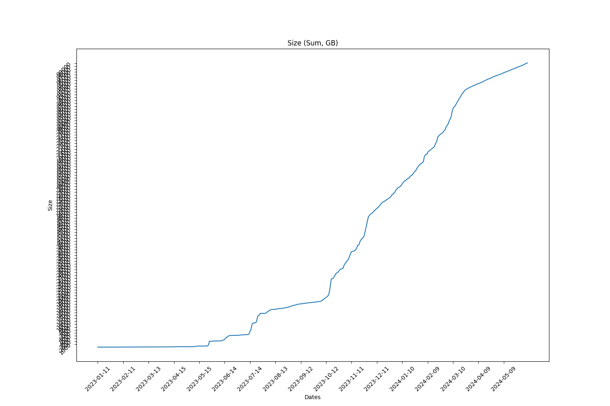
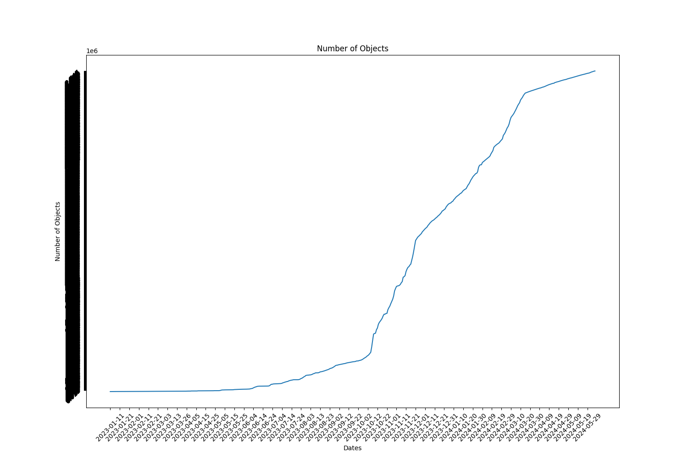

Full report for the Term: 32 

Start date: 2024-05-09  

End date: 2024-06-06 

Start Block: 7416030 

End Block: 7819230 

# Opening 
Number of openings: 0 
# Hiring
Number of hired works: 0
# Terminated workers 
Number of terminated workers: 0 
# Slashed workers 
Number of slashed workers: 0 
# Rewards
Total Rewards: 2869677843362680
| workerId               |    worker_total |
|------------------------|-----------------|
| storageWorkingGroup-0  |          403760 |
| storageWorkingGroup-15 | 450547028161580 |
| storageWorkingGroup-17 | 443829800802780 |
| storageWorkingGroup-22 | 418658088308180 |
| storageWorkingGroup-23 | 358656167506980 |
| storageWorkingGroup-24 | 361649463478800 |
| storageWorkingGroup-6  | 394561415884300 |
| storageWorkingGroup-9  | 441775878816300 |
# BUCKETS Info  
|   id |   dataObjectsSize |   dataObjectsSizeLimit |   dataObjectsCount |   bags |   Utilization |   dataObjectsSize, GB |
|------|-------------------|------------------------|--------------------|--------|---------------|-----------------------|
|    1 |    67503783030859 |        125000000000000 |            1922766 |  41302 |      0.54003  |               62806.5 |
|    2 |    60340010478534 |         88000000000000 |            1535300 |  45679 |      0.685682 |               56141.2 |
|    4 |    56405654813322 |        114000000000000 |            1261036 |  40929 |      0.494786 |               52480.6 |
|    3 |    45087511884519 |        100000000000000 |            1264128 |  31519 |      0.450875 |               41950.1 |
|   10 |    63498735724382 |        125000000000000 |            1849276 |  26002 |      0.50799  |               59080.1 |
|   11 |    39906551872781 |         86000000000000 |            1160518 |  16256 |      0.46403  |               37129.6 |
|    0 |    29962827840036 |         90000000000000 |             653056 |  33669 |      0.33292  |               27877.8 |
|    8 |    55187730378811 |        110000000000000 |            1237939 |  16948 |      0.501707 |               51347.4 |
## BUCKETS CREATED
Bucket Created: 0
## BUCKETS DELETED
Bucket Deleted: 0
## Bags
Bags Created: 1138 

Bags Deleted: 0 

# Objects Info during this Council Period 
Total Objects Size: 66950 

Total Objects Size: 3716816028814 bytes 

## Objects Size Distribution
|   <10 MB |   <100 MB |   <1000 MB |   <10000 MB |   <100000 MB |   <1000000 MB |
|----------|-----------|------------|-------------|--------------|---------------|
|    42556 |     58253 |      66522 |       66950 |        66950 |         66950 |
 
|   0-10 MB |   10-100 MB |   100-1000 MB |   1000-10000 MB |   10000-100000 MB |   100000-10000000 MB |
|-----------|-------------|---------------|-----------------|-------------------|----------------------|
|     42556 |       15697 |          8269 |             428 |                 0 |                    0 |
## Objects Size Distribution Per Bag 
|   0-10 MB |   10-100 MB |   100-1000 MB |   1000-10000 MB |   10000-100000 MB |   100000-10000000 MB |
|-----------|-------------|---------------|-----------------|-------------------|----------------------|
|     42556 |       15697 |          8269 |             428 |                 0 |                    0 |
# Total object Info 
Total Objects: 2747280 

Total Objects Size: 106487966244254 bytes

Total Number of Bags in use: 33613 bytes

Grand Total Number of Bags: 33000 bytes

## Objects Size Distribution 
|   <10 MB |   <100 MB |   <1000 MB |   <10000 MB |   <100000 MB |   <1000000 MB |
|----------|-----------|------------|-------------|--------------|---------------|
|  1943817 |   2513738 |    2738238 |     2746978 |      2747280 |       2747280 |
 
|   0-10 MB |   10-100 MB |   100-1000 MB |   1000-10000 MB |   10000-100000 MB |   100000-10000000 MB |
|-----------|-------------|---------------|-----------------|-------------------|----------------------|
|   1943817 |      569921 |        224500 |            8740 |               302 |                    0 |
## Objects Size Distribution Per Bag 
|   0-10 MB |   10-100 MB |   100-1000 MB |   1000-10000 MB |   10000-100000 MB |   100000-10000000 MB |
|-----------|-------------|---------------|-----------------|-------------------|----------------------|
|   1943817 |      569921 |        224500 |            8740 |               302 |                    0 |

 
  
# Lost Objects - GraphQl 
Total Objects: 66950 

Total Lost Objects: 275 

Percentage Lost Objects: %0.4107542942494399 

|      id | createdAt                |       size |   storageBagId |
|---------|--------------------------|------------|----------------|
| 2712977 | 2024-05-15T18:04:12.000Z |  495630998 |          56158 |
| 2706141 | 2024-05-12T16:32:48.000Z |  275579294 |          25955 |
| 2706142 | 2024-05-12T16:32:48.000Z |      16627 |          25955 |
| 2707329 | 2024-05-13T07:52:00.000Z |     280877 |          62399 |
| 2706699 | 2024-05-13T00:42:36.000Z |  228370915 |          62355 |
| 2706700 | 2024-05-13T00:42:36.000Z |      10425 |          62355 |
| 2706709 | 2024-05-13T00:42:36.000Z |  360280194 |          62355 |
| 2706710 | 2024-05-13T00:42:36.000Z |      14104 |          62355 |
| 2706713 | 2024-05-13T00:42:36.000Z |  258078951 |          62355 |
| 2706714 | 2024-05-13T00:42:36.000Z |      11814 |          62355 |
| 2706715 | 2024-05-13T00:44:06.000Z |  349112984 |          62355 |
| 2706716 | 2024-05-13T00:44:06.000Z |      10488 |          62355 |
| 2706727 | 2024-05-13T00:44:06.000Z |  215552134 |          62355 |
| 2706728 | 2024-05-13T00:44:06.000Z |      14281 |          62355 |
| 2706731 | 2024-05-13T00:44:06.000Z |  184039037 |          62355 |
| 2706732 | 2024-05-13T00:44:06.000Z |       8538 |          62355 |
| 2706735 | 2024-05-13T00:45:06.001Z |  266372283 |          62355 |
| 2706736 | 2024-05-13T00:45:06.001Z |      11167 |          62355 |
| 2706739 | 2024-05-13T00:45:06.001Z |  205994477 |          62355 |
| 2706740 | 2024-05-13T00:45:06.001Z |      12346 |          62355 |
| 2706747 | 2024-05-13T00:52:48.000Z |      14665 |          62355 |
| 2706748 | 2024-05-13T00:52:48.000Z |  391339010 |          62355 |
| 2706749 | 2024-05-13T00:52:48.000Z |      10295 |          62355 |
| 2706744 | 2024-05-13T00:52:48.000Z |  690536201 |          62355 |
| 2706745 | 2024-05-13T00:52:48.000Z |      10821 |          62355 |
| 2706746 | 2024-05-13T00:52:48.000Z |  322071794 |          62355 |
| 2706750 | 2024-05-13T00:52:48.000Z |  284238021 |          62355 |
| 2706751 | 2024-05-13T00:52:48.000Z |       8570 |          62355 |
| 2706758 | 2024-05-13T00:52:48.000Z |  294405365 |          62355 |
| 2706759 | 2024-05-13T00:52:48.000Z |      12527 |          62355 |
| 2706752 | 2024-05-13T00:52:48.000Z |  212077961 |          62355 |
| 2706753 | 2024-05-13T00:52:48.000Z |      12248 |          62355 |
| 2706754 | 2024-05-13T00:52:48.000Z |  202168769 |          62355 |
| 2706755 | 2024-05-13T00:52:48.000Z |      10116 |          62355 |
| 2706756 | 2024-05-13T00:52:48.000Z |  213448260 |          62355 |
| 2706757 | 2024-05-13T00:52:48.000Z |      11127 |          62355 |
| 2706760 | 2024-05-13T00:52:48.000Z |  230326055 |          62355 |
| 2706761 | 2024-05-13T00:52:48.000Z |       7120 |          62355 |
| 2706762 | 2024-05-13T00:52:48.000Z |  248735753 |          62355 |
| 2706763 | 2024-05-13T00:52:48.000Z |      10891 |          62355 |
| 2706764 | 2024-05-13T00:54:30.000Z |  338650177 |          62355 |
| 2706765 | 2024-05-13T00:54:30.000Z |      13656 |          62355 |
| 2706766 | 2024-05-13T00:54:30.000Z |  256597024 |          62355 |
| 2706767 | 2024-05-13T00:54:30.000Z |      11816 |          62355 |
| 2706768 | 2024-05-13T00:54:30.000Z |  172903823 |          62355 |
| 2706769 | 2024-05-13T00:54:30.000Z |      14069 |          62355 |
| 2706770 | 2024-05-13T00:54:30.000Z |  193261901 |          62355 |
| 2706771 | 2024-05-13T00:54:30.000Z |       9945 |          62355 |
| 2706772 | 2024-05-13T00:54:30.000Z |  205941655 |          62355 |
| 2706773 | 2024-05-13T00:54:30.000Z |      11394 |          62355 |
| 2706774 | 2024-05-13T00:54:30.000Z |  240244125 |          62355 |
| 2706775 | 2024-05-13T00:54:30.000Z |      10194 |          62355 |
| 2706776 | 2024-05-13T00:54:30.000Z |  296522355 |          62355 |
| 2706777 | 2024-05-13T00:54:30.000Z |      11592 |          62355 |
| 2706778 | 2024-05-13T00:54:30.000Z |  154570999 |          62355 |
| 2706779 | 2024-05-13T00:54:30.000Z |       9132 |          62355 |
| 2706780 | 2024-05-13T00:54:30.000Z |  198941847 |          62355 |
| 2706781 | 2024-05-13T00:54:30.000Z |      10376 |          62355 |
| 2706782 | 2024-05-13T00:54:30.000Z |  239354956 |          62355 |
| 2706783 | 2024-05-13T00:54:30.000Z |      13383 |          62355 |
| 2707328 | 2024-05-13T07:52:00.000Z |      74425 |          62399 |
| 2714668 | 2024-05-16T03:01:00.002Z | 2582884173 |          55469 |
| 2709080 | 2024-05-14T00:18:12.000Z | 3507039916 |          62424 |
| 2709170 | 2024-05-14T00:30:12.001Z |      19474 |          50118 |
| 2707249 | 2024-05-13T01:16:18.001Z |      14665 |          27533 |
| 2708950 | 2024-05-13T22:09:36.000Z |     286382 |          62420 |
| 2708949 | 2024-05-13T22:09:36.000Z |      78576 |          62420 |
| 2714455 | 2024-05-16T02:30:30.000Z |      15550 |          50198 |
| 2699933 | 2024-05-09T21:51:36.001Z |   56984884 |          40298 |
| 2698279 | 2024-05-09T12:54:30.000Z |      12479 |          32037 |
| 2710152 | 2024-05-14T09:50:30.000Z |   16455604 |          62431 |
| 2710448 | 2024-05-14T17:14:42.000Z |  469092769 |          54734 |
| 2698646 | 2024-05-09T13:51:24.000Z |   16427759 |          33274 |
| 2698647 | 2024-05-09T13:51:24.000Z |      19551 |          33274 |
| 2698648 | 2024-05-09T13:51:24.000Z |  457932524 |          59671 |
| 2698649 | 2024-05-09T13:51:24.000Z |      21504 |          59671 |
| 2698650 | 2024-05-09T13:51:24.000Z |   39042836 |          28230 |
| 2698651 | 2024-05-09T13:51:24.000Z |      27316 |          28230 |
| 2698652 | 2024-05-09T13:51:24.000Z |   24180277 |          33428 |
| 2698653 | 2024-05-09T13:51:24.000Z |       5242 |          33428 |
| 2698654 | 2024-05-09T13:51:24.000Z |   88376045 |          27659 |
| 2698655 | 2024-05-09T13:51:24.000Z |      14241 |          27659 |
| 2698656 | 2024-05-09T13:51:24.000Z |   21707541 |          40779 |
| 2698657 | 2024-05-09T13:51:24.000Z |      18123 |          40779 |
| 2698658 | 2024-05-09T13:51:24.000Z |   30941631 |          44164 |
| 2698659 | 2024-05-09T13:51:24.000Z |       6800 |          44164 |
| 2698660 | 2024-05-09T13:51:24.000Z |  596352444 |          51101 |
| 2698661 | 2024-05-09T13:51:24.000Z |      18855 |          51101 |
| 2698662 | 2024-05-09T13:51:24.000Z |  149814652 |          60445 |
| 2698663 | 2024-05-09T13:51:24.000Z |      21436 |          60445 |
| 2698664 | 2024-05-09T13:51:24.000Z |   15577031 |          27387 |
| 2698665 | 2024-05-09T13:51:24.000Z |      15502 |          27387 |
| 2698824 | 2024-05-09T13:55:18.000Z |   62427181 |          55609 |
| 2698825 | 2024-05-09T13:55:18.000Z |      16474 |          55609 |
| 2698832 | 2024-05-09T13:55:24.000Z |   84625348 |          46716 |
| 2698833 | 2024-05-09T13:55:24.000Z |      19108 |          46716 |
| 2698846 | 2024-05-09T16:03:36.000Z |  313490193 |          61257 |
| 2698858 | 2024-05-09T16:52:42.000Z |   53558464 |          62280 |
| 2698859 | 2024-05-09T16:52:42.000Z |      16776 |          62280 |
| 2699934 | 2024-05-09T21:51:36.001Z |      11952 |          40298 |
| 2711763 | 2024-05-15T03:05:30.000Z |  172768730 |          46449 |
| 2699881 | 2024-05-09T21:50:54.001Z |    5399188 |          29693 |
| 2699882 | 2024-05-09T21:50:54.001Z |      15938 |          29693 |
| 2711058 | 2024-05-14T18:50:00.000Z |  116104931 |          47829 |
| 2711059 | 2024-05-14T18:50:00.000Z |      23913 |          47829 |
| 2711060 | 2024-05-14T18:50:00.000Z |  100709368 |          29127 |
| 2711061 | 2024-05-14T18:50:00.000Z |      17912 |          29127 |
| 2701149 | 2024-05-10T14:02:24.000Z |      17495 |          54008 |
| 2701174 | 2024-05-10T14:04:42.000Z |   24344312 |          51721 |
| 2701175 | 2024-05-10T14:04:42.000Z |       5850 |          51721 |
| 2701178 | 2024-05-10T14:04:42.000Z |    1149410 |          51721 |
| 2701179 | 2024-05-10T14:04:42.000Z |       6486 |          51721 |
| 2711390 | 2024-05-14T21:42:42.000Z |  112422945 |          62033 |
| 2714971 | 2024-05-16T10:31:18.001Z |  481042903 |          48513 |
| 2702610 | 2024-05-11T00:56:24.000Z |  356122502 |          62330 |
| 2702611 | 2024-05-11T00:56:24.000Z |       9096 |          62330 |
| 2702612 | 2024-05-11T00:57:48.000Z |  338733831 |          62330 |
| 2702613 | 2024-05-11T00:57:48.000Z |      18160 |          62330 |
| 2716940 | 2024-05-17T06:09:48.000Z |  198427612 |          51800 |
| 2703005 | 2024-05-11T06:42:30.000Z |  666864936 |          55294 |
| 2704226 | 2024-05-11T22:20:24.000Z | 1796687221 |          62336 |
| 2712731 | 2024-05-15T17:39:48.001Z |   31943739 |          26520 |
| 2712743 | 2024-05-15T17:40:12.000Z |  103688201 |          27680 |
| 2737164 | 2024-05-26T00:55:12.001Z |   49264554 |          62723 |
| 2703168 | 2024-05-11T07:27:18.000Z |     192381 |          62337 |
| 2703167 | 2024-05-11T07:27:18.000Z |      52553 |          62337 |
| 2703220 | 2024-05-11T10:49:42.001Z |   14588263 |          62340 |
| 2703981 | 2024-05-11T15:16:54.000Z |      16635 |          61079 |
| 2712608 | 2024-05-15T11:08:48.000Z | 2689254277 |          55469 |
| 2712637 | 2024-05-15T11:09:30.001Z |       5210 |          62223 |
| 2715280 | 2024-05-16T11:16:36.000Z |       7060 |          49081 |
| 2716294 | 2024-05-16T21:29:48.000Z |   27888559 |          62500 |
| 2716295 | 2024-05-16T21:29:48.000Z |      18538 |          62500 |
| 2716987 | 2024-05-17T08:18:24.000Z |  114283577 |          61466 |
| 2718117 | 2024-05-17T21:32:18.001Z |      10853 |          57192 |
| 2717666 | 2024-05-17T15:36:36.000Z |  202312302 |          62520 |
| 2718125 | 2024-05-17T21:32:18.001Z |      10853 |          57192 |
| 2718127 | 2024-05-17T21:32:18.001Z |      15285 |          57192 |
| 2718131 | 2024-05-17T21:32:18.001Z |      15285 |          57192 |
| 2738283 | 2024-05-26T18:19:18.000Z |   45996742 |          62737 |
| 2737775 | 2024-05-26T12:01:42.002Z |  985289766 |          54885 |
| 2738288 | 2024-05-26T19:23:24.000Z |     180624 |          62740 |
| 2738287 | 2024-05-26T19:23:24.000Z |      50468 |          62740 |
| 2723155 | 2024-05-19T21:22:18.000Z | 1577264135 |          54734 |
| 2722680 | 2024-05-19T15:00:24.000Z |   36961479 |          43357 |
| 2722681 | 2024-05-19T15:00:24.000Z |      17723 |          43357 |
| 2722846 | 2024-05-19T15:02:30.000Z |    2090393 |          27027 |
| 2722847 | 2024-05-19T15:02:30.000Z |      12979 |          27027 |
| 2722984 | 2024-05-19T15:08:24.000Z |   97907274 |          33255 |
| 2722985 | 2024-05-19T15:08:24.000Z |      16310 |          33255 |
| 2721414 | 2024-05-19T06:56:36.001Z |      10632 |          62560 |
| 2739164 | 2024-05-27T04:11:00.000Z |       8922 |          62744 |
| 2746255 | 2024-05-30T08:35:12.000Z |  128015504 |          62813 |
| 2748491 | 2024-05-31T15:02:54.000Z |      82241 |          62840 |
| 2748490 | 2024-05-31T15:02:54.000Z |      62175 |          62840 |
| 2739512 | 2024-05-27T05:32:00.000Z |     313726 |          62746 |
| 2746258 | 2024-05-30T08:38:36.001Z |      75894 |          62813 |
| 2747978 | 2024-05-31T04:49:18.001Z |     203276 |          62833 |
| 2746257 | 2024-05-30T08:38:36.001Z |      11558 |          62813 |
| 2724703 | 2024-05-20T14:00:42.000Z |  260489755 |          60445 |
| 2739536 | 2024-05-27T09:36:54.000Z |     323770 |          62749 |
| 2739535 | 2024-05-27T09:36:54.000Z |      93271 |          62749 |
| 2723478 | 2024-05-19T22:12:12.000Z |      12092 |          57192 |
| 2740095 | 2024-05-27T14:07:24.000Z |  151694580 |          62734 |
| 2740099 | 2024-05-27T15:15:00.000Z |       2308 |          62753 |
| 2740106 | 2024-05-27T15:34:18.001Z |  182103959 |          60060 |
| 2740130 | 2024-05-27T17:17:30.001Z |     115947 |          62757 |
| 2724704 | 2024-05-20T14:00:42.000Z |      23170 |          60445 |
| 2726644 | 2024-05-21T06:40:06.001Z |      12304 |          48910 |
| 2724552 | 2024-05-20T13:46:12.000Z |       8458 |          32274 |
| 2724559 | 2024-05-20T13:46:12.000Z |   17712217 |          29922 |
| 2724560 | 2024-05-20T13:46:12.000Z |      20197 |          29922 |
| 2727488 | 2024-05-21T14:49:24.000Z |  892332253 |          62625 |
| 2726386 | 2024-05-21T05:57:54.001Z |      18277 |          51602 |
| 2746787 | 2024-05-30T15:44:42.000Z |       6960 |          57192 |
| 2746793 | 2024-05-30T15:44:42.000Z |       7373 |          57192 |
| 2746797 | 2024-05-30T15:44:42.000Z |       7330 |          57192 |
| 2746795 | 2024-05-30T15:44:42.000Z |      15881 |          57192 |
| 2741228 | 2024-05-28T05:22:48.000Z |      12997 |          50135 |
| 2728655 | 2024-05-22T06:41:00.000Z |   67105773 |          62631 |
| 2741703 | 2024-05-28T13:28:00.000Z |      16332 |          58562 |
| 2728656 | 2024-05-22T06:41:00.000Z |      14120 |          62631 |
| 2729633 | 2024-05-22T15:19:24.000Z |     398219 |          60674 |
| 2729634 | 2024-05-22T15:19:24.000Z |       4009 |          60674 |
| 2729661 | 2024-05-22T16:29:48.001Z |     239203 |          62653 |
| 2729660 | 2024-05-22T16:29:48.001Z |      64946 |          62653 |
| 2731208 | 2024-05-23T10:58:00.000Z | 1565268764 |          55469 |
| 2729808 | 2024-05-22T22:43:00.001Z |      15380 |          46455 |
| 2742570 | 2024-05-28T16:16:48.000Z |  394996196 |          62778 |
| 2742575 | 2024-05-28T17:38:42.000Z |   11262164 |          62404 |
| 2742578 | 2024-05-28T18:11:24.000Z |     135632 |          62780 |
| 2742577 | 2024-05-28T18:11:24.000Z |      46796 |          62780 |
| 2731416 | 2024-05-23T15:43:30.000Z |     181127 |          62671 |
| 2731415 | 2024-05-23T15:43:30.000Z |      77380 |          62671 |
| 2731441 | 2024-05-23T17:16:24.000Z |   98945033 |          62598 |
| 2731444 | 2024-05-23T17:25:24.001Z |     338825 |          62674 |
| 2731443 | 2024-05-23T17:25:24.001Z |      30058 |          62674 |
| 2733189 | 2024-05-24T04:13:18.000Z |     109264 |          62687 |
| 2732456 | 2024-05-23T18:57:42.000Z |      10103 |          51326 |
| 2732563 | 2024-05-23T19:03:36.000Z | 2288023289 |          35730 |
| 2732579 | 2024-05-23T22:59:24.000Z |     123009 |          62679 |
| 2732578 | 2024-05-23T22:59:24.000Z |      34375 |          62679 |
| 2743467 | 2024-05-29T00:58:54.000Z |  142056030 |          62789 |
| 2743468 | 2024-05-29T00:58:54.000Z |      15508 |          62789 |
| 2732687 | 2024-05-24T01:58:36.000Z |       9175 |          53757 |
| 2734235 | 2024-05-24T19:31:12.001Z |  291401459 |          62706 |
| 2734239 | 2024-05-24T19:32:18.001Z |  203904153 |          62704 |
| 2734240 | 2024-05-24T19:32:18.001Z |      17445 |          62704 |
| 2744805 | 2024-05-29T21:20:18.000Z |     183921 |          62802 |
| 2735434 | 2024-05-25T05:54:36.000Z |  152043109 |          62713 |
| 2735438 | 2024-05-25T06:46:36.000Z |   98708349 |          62714 |
| 2744804 | 2024-05-29T21:20:18.000Z |      36131 |          62802 |
| 2744950 | 2024-05-29T22:37:54.000Z |       7662 |          62806 |
| 2744959 | 2024-05-29T22:44:12.000Z |  242634833 |          62806 |
| 2744960 | 2024-05-29T22:44:12.000Z |      18792 |          62806 |
| 2748792 | 2024-05-31T15:30:18.000Z | 1303380114 |          51083 |
| 2749687 | 2024-06-01T04:05:06.000Z |  159132407 |          27497 |
| 2749688 | 2024-06-01T04:05:06.000Z |      11084 |          27497 |
| 2752036 | 2024-06-01T21:36:12.000Z |   55120032 |          57966 |
| 2751630 | 2024-06-01T20:45:18.003Z |  800588234 |          62864 |
| 2752037 | 2024-06-01T21:36:12.000Z |      18966 |          57966 |
| 2752038 | 2024-06-01T21:36:12.000Z |  112368881 |          45993 |
| 2752039 | 2024-06-01T21:36:12.000Z |      21594 |          45993 |
| 2752084 | 2024-06-01T21:36:36.000Z |  204101872 |          56798 |
| 2752085 | 2024-06-01T21:36:36.000Z |      18597 |          56798 |
| 2754230 | 2024-06-02T12:15:30.000Z |   23317214 |          63049 |
| 2752582 | 2024-06-02T00:57:24.000Z |   60217669 |          62906 |
| 2753192 | 2024-06-02T04:27:30.001Z |  166169356 |          62983 |
| 2753193 | 2024-06-02T04:27:30.001Z |       9872 |          62983 |
| 2752328 | 2024-06-01T22:36:12.001Z |  945665282 |          62873 |
| 2752393 | 2024-06-01T23:34:24.001Z |   23381911 |          62888 |
| 2754231 | 2024-06-02T12:15:30.000Z |      13934 |          63049 |
| 2757988 | 2024-06-03T16:50:30.000Z |      20569 |          29763 |
| 2756201 | 2024-06-02T23:45:06.001Z |      18982 |          60189 |
| 2756826 | 2024-06-03T05:48:18.000Z |   29678652 |          63190 |
| 2757488 | 2024-06-03T15:08:06.000Z |  146442589 |          63211 |
| 2757489 | 2024-06-03T15:08:06.000Z |      41266 |          63211 |
| 2761669 | 2024-06-04T17:00:00.000Z | 3732802113 |          63297 |
| 2758789 | 2024-06-03T18:28:48.000Z |     278527 |          63221 |
| 2758788 | 2024-06-03T18:28:48.000Z |      84434 |          63221 |
| 2759477 | 2024-06-04T03:04:18.000Z | 4372008172 |          62761 |
| 2758234 | 2024-06-03T17:33:54.001Z |  592932791 |          63217 |
| 2758235 | 2024-06-03T17:33:54.001Z |      22014 |          63217 |
| 2760799 | 2024-06-04T15:22:06.001Z |  662492999 |          63293 |
| 2760800 | 2024-06-04T15:22:06.001Z |      12238 |          63293 |
| 2761757 | 2024-06-04T20:39:54.001Z |  163110296 |          63306 |
| 2762291 | 2024-06-05T01:28:54.001Z |  437772293 |          62949 |
| 2762292 | 2024-06-05T01:28:54.001Z |      19922 |          62949 |
| 2762301 | 2024-06-05T01:28:54.001Z |  110231228 |          51362 |
| 2762302 | 2024-06-05T01:28:54.001Z |      21454 |          51362 |
| 2762307 | 2024-06-05T01:28:54.001Z |  157197492 |          51395 |
| 2762308 | 2024-06-05T01:28:54.001Z |      16136 |          51395 |
| 2762311 | 2024-06-05T01:29:42.000Z |   39157221 |          29120 |
| 2762312 | 2024-06-05T01:29:42.000Z |      17844 |          29120 |
| 2762333 | 2024-06-05T01:30:48.000Z |  246652182 |          28937 |
| 2761818 | 2024-06-04T23:11:18.001Z |  280591412 |          63314 |
| 2762334 | 2024-06-05T01:30:48.000Z |      16145 |          28937 |
| 2762546 | 2024-06-05T01:37:42.000Z |   70020015 |          63325 |
| 2762050 | 2024-06-05T00:42:54.000Z |      24381 |          58671 |
| 2764196 | 2024-06-05T19:24:36.003Z |  149148300 |          63375 |
| 2762233 | 2024-06-05T01:21:06.000Z |   55291819 |          44819 |
| 2762234 | 2024-06-05T01:21:06.000Z |      18785 |          44819 |
| 2762257 | 2024-06-05T01:21:54.000Z |   65818617 |          55026 |
| 2762258 | 2024-06-05T01:21:54.000Z |      11162 |          55026 |
| 2762283 | 2024-06-05T01:22:42.001Z |   44979546 |          43632 |
| 2762284 | 2024-06-05T01:22:42.001Z |      14645 |          43632 |
| 2762285 | 2024-06-05T01:22:42.001Z |   41424540 |          62975 |
| 2762286 | 2024-06-05T01:22:42.001Z |      19840 |          62975 |
| 2762289 | 2024-06-05T01:22:42.001Z |   70062378 |          29855 |
| 2762290 | 2024-06-05T01:22:42.001Z |      20716 |          29855 |
| 2762834 | 2024-06-05T09:08:00.000Z | 1063344847 |          62742 |
| 2762877 | 2024-06-05T09:20:18.000Z |       9960 |          28094 |
| 2765242 | 2024-06-06T03:53:54.000Z |      19722 |          63399 |
| 2764745 | 2024-06-05T22:16:12.000Z |      25566 |          63224 |
| 2764744 | 2024-06-05T22:16:12.000Z |       7970 |          63224 | 
