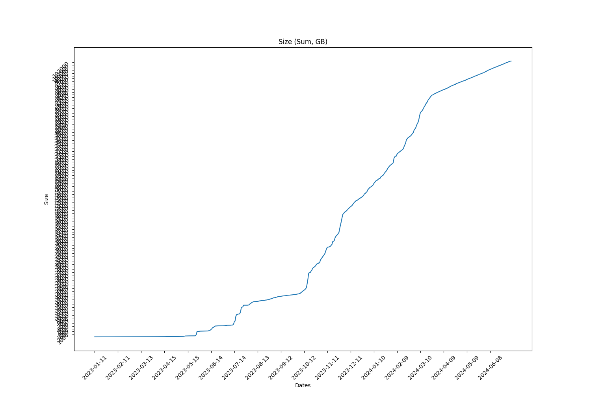
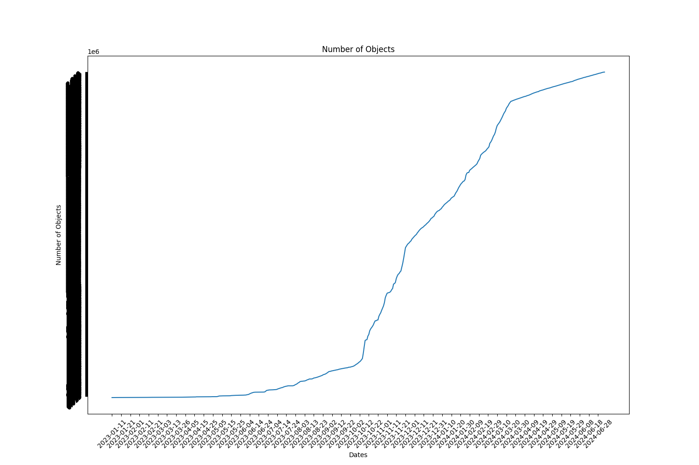

Full report for the Term: 33 

Start date: 2024-06-06  

End date: 2024-07-04 

Start Block: 7819230 

End Block: 8222430 

# Opening 
Number of openings: 0 
# Hiring
Number of hired works: 0
# Terminated workers 
Number of terminated workers: 0 
# Slashed workers 
Number of slashed workers: 0 
# Rewards
Total Rewards: 3493750000685840
| workerId               |    worker_total |
|------------------------|-----------------|
| storageWorkingGroup-0  |          403760 |
| storageWorkingGroup-15 | 526239022561700 |
| storageWorkingGroup-17 | 572236483046480 |
| storageWorkingGroup-22 | 486227084013300 |
| storageWorkingGroup-23 | 405694545208960 |
| storageWorkingGroup-24 | 536714694899740 |
| storageWorkingGroup-6  | 456558778188940 |
| storageWorkingGroup-9  | 510079392362960 |
# BUCKETS Info  
|   id |   dataObjectsSize |   dataObjectsSizeLimit |   dataObjectsCount |   bags |   Utilization |   dataObjectsSize, GB |
|------|-------------------|------------------------|--------------------|--------|---------------|-----------------------|
|    2 |    62442845590751 |         88000000000000 |            1570360 |  46148 |      0.709578 |               58097.7 |
|    8 |    56880876624856 |        110000000000000 |            1266540 |  17410 |      0.517099 |               52922.8 |
|   10 |    65896632889866 |        125000000000000 |            1888423 |  26495 |      0.527173 |               61311.1 |
|   11 |    41457314285360 |         86000000000000 |            1188755 |  16746 |      0.482062 |               38572.5 |
|    1 |    69972992845441 |        125000000000000 |            1963033 |  41786 |      0.559784 |               65103.8 |
|    3 |    46564559514403 |        100000000000000 |            1294702 |  31995 |      0.465646 |               43324.3 |
|    4 |    58082391969295 |        114000000000000 |            1291757 |  41419 |      0.509495 |               54040.7 |
|    0 |    31159884682308 |         90000000000000 |             674207 |  34137 |      0.346221 |               28991.6 |
## BUCKETS CREATED
Bucket Created: 0
## BUCKETS DELETED
Bucket Deleted: 0
## Bags
Bags Created: 946 

Bags Deleted: 0 

# Objects Info during this Council Period 
Total Objects Size: 63051 

Total Objects Size: 3636589824659 bytes 

## Objects Size Distribution
|   <10 MB |   <100 MB |   <1000 MB |   <10000 MB |   <100000 MB |   <1000000 MB |
|----------|-----------|------------|-------------|--------------|---------------|
|    40717 |     54905 |      62591 |       63051 |        63051 |         63051 |
 
|   0-10 MB |   10-100 MB |   100-1000 MB |   1000-10000 MB |   10000-100000 MB |   100000-10000000 MB |
|-----------|-------------|---------------|-----------------|-------------------|----------------------|
|     40717 |       14188 |          7686 |             460 |                 0 |                    0 |
## Objects Size Distribution Per Bag 
|   0-10 MB |   10-100 MB |   100-1000 MB |   1000-10000 MB |   10000-100000 MB |   100000-10000000 MB |
|-----------|-------------|---------------|-----------------|-------------------|----------------------|
|     40717 |       14188 |          7686 |             460 |                 0 |                    0 |
# Total object Info 
Total Objects: 2811087 

Total Objects Size: 110163637453988 bytes

Total Number of Bags in use: 34285 bytes

Grand Total Number of Bags: 33000 bytes

## Objects Size Distribution 
|   <10 MB |   <100 MB |   <1000 MB |   <10000 MB |   <100000 MB |   <1000000 MB |
|----------|-----------|------------|-------------|--------------|---------------|
|  1985010 |   2569282 |    2801585 |     2810785 |      2811087 |       2811087 |
 
|   0-10 MB |   10-100 MB |   100-1000 MB |   1000-10000 MB |   10000-100000 MB |   100000-10000000 MB |
|-----------|-------------|---------------|-----------------|-------------------|----------------------|
|   1985010 |      584272 |        232303 |            9200 |               302 |                    0 |
## Objects Size Distribution Per Bag 
|   0-10 MB |   10-100 MB |   100-1000 MB |   1000-10000 MB |   10000-100000 MB |   100000-10000000 MB |
|-----------|-------------|---------------|-----------------|-------------------|----------------------|
|   1985010 |      584272 |        232303 |            9200 |               302 |                    0 |

 
  
# Lost Objects - GraphQl 
Total Objects: 63051 

Total Lost Objects: 153 

Percentage Lost Objects: %0.2426607032402341 

|      id | createdAt                |       size |   storageBagId |
|---------|--------------------------|------------|----------------|
| 2767665 | 2024-06-06T22:32:18.000Z | 4218693116 |          50703 |
| 2767673 | 2024-06-06T22:32:36.000Z | 4031856098 |          50171 |
| 2767960 | 2024-06-07T05:36:36.000Z |       5827 |          60592 |
| 2768469 | 2024-06-07T13:33:00.000Z |      22164 |          50152 |
| 2768637 | 2024-06-07T13:57:24.000Z |    6743189 |          54444 |
| 2768638 | 2024-06-07T13:57:24.000Z |      13226 |          54444 |
| 2768837 | 2024-06-07T14:30:48.000Z |    1047091 |          60985 |
| 2768838 | 2024-06-07T14:30:48.000Z |       6040 |          60985 |
| 2770142 | 2024-06-08T01:13:06.000Z |  245648690 |          63485 |
| 2770792 | 2024-06-08T09:01:06.000Z |       4804 |          63505 |
| 2770811 | 2024-06-08T09:03:42.000Z |     152832 |          63509 |
| 2770810 | 2024-06-08T09:03:42.000Z |      56046 |          63509 |
| 2771030 | 2024-06-08T15:29:30.001Z |  355531830 |          63537 |
| 2771027 | 2024-06-08T15:28:48.000Z |     325284 |          63538 |
| 2771026 | 2024-06-08T15:28:48.000Z |      75756 |          63538 |
| 2771121 | 2024-06-08T15:46:12.000Z |      15450 |          51407 |
| 2771170 | 2024-06-08T15:52:48.000Z |      75756 |          63540 |
| 2771171 | 2024-06-08T15:52:48.000Z |     325284 |          63540 |
| 2771350 | 2024-06-08T16:30:18.000Z |   13648091 |          63542 |
| 2771351 | 2024-06-08T16:30:18.000Z |      27586 |          63542 |
| 2771951 | 2024-06-08T19:18:24.000Z |  623303146 |          60651 |
| 2772007 | 2024-06-08T21:16:48.000Z |  987006872 |          63562 |
| 2771985 | 2024-06-08T20:38:00.001Z |  577791304 |          63558 |
| 2771993 | 2024-06-08T21:06:06.000Z | 2943610235 |          63559 |
| 2772286 | 2024-06-09T00:03:18.000Z |    3843498 |          41455 |
| 2772287 | 2024-06-09T00:03:18.000Z |       3857 |          41455 |
| 2773171 | 2024-06-09T02:50:18.000Z |  172057956 |          63575 |
| 2773749 | 2024-06-09T15:34:06.000Z | 4002238657 |          63592 |
| 2774046 | 2024-06-09T16:54:42.000Z | 1792261739 |          63593 |
| 2774573 | 2024-06-09T21:18:12.001Z | 2706123584 |          63582 |
| 2776753 | 2024-06-11T02:03:24.000Z |      91044 |          63634 |
| 2776883 | 2024-06-11T02:24:36.001Z |      17762 |          51059 |
| 2779719 | 2024-06-12T04:33:48.000Z |   76177298 |          63371 |
| 2779720 | 2024-06-12T04:33:48.000Z |       8667 |          63371 |
| 2779727 | 2024-06-12T04:33:48.000Z |  148622798 |          63371 |
| 2779728 | 2024-06-12T04:33:48.000Z |       8587 |          63371 |
| 2782047 | 2024-06-12T22:30:48.001Z |  112179476 |          63302 |
| 2782152 | 2024-06-13T05:19:48.001Z |      25654 |          57033 |
| 2788516 | 2024-06-16T00:29:42.000Z |   76737038 |          63795 |
| 2789167 | 2024-06-16T05:05:06.000Z |   73152442 |          63781 |
| 2789168 | 2024-06-16T05:05:06.000Z |      13574 |          63781 |
| 2789169 | 2024-06-16T05:58:06.001Z | 1413301787 |          63471 |
| 2789165 | 2024-06-16T05:02:30.001Z |   37109266 |          63781 |
| 2789185 | 2024-06-16T08:07:06.000Z |   85883962 |          63768 |
| 2789200 | 2024-06-16T09:21:12.000Z |  162359216 |          62809 |
| 2789201 | 2024-06-16T09:21:12.000Z |       8180 |          62809 |
| 2791100 | 2024-06-17T02:55:36.000Z |       6392 |          63825 |
| 2791665 | 2024-06-17T16:33:06.000Z |     285189 |          63838 |
| 2791879 | 2024-06-17T17:00:30.000Z |      15877 |          60768 |
| 2795426 | 2024-06-19T06:30:12.000Z | 1150719527 |          63879 |
| 2797772 | 2024-06-20T08:44:12.000Z |     120774 |          63909 |
| 2797771 | 2024-06-20T08:44:12.000Z |       5808 |          63909 |
| 2798190 | 2024-06-20T14:54:54.000Z |      12116 |          57192 |
| 2798194 | 2024-06-20T14:54:54.000Z |      12116 |          57192 |
| 2798202 | 2024-06-20T14:54:54.000Z |      12116 |          57192 |
| 2802617 | 2024-06-22T19:45:12.000Z |      45119 |          63985 |
| 2802616 | 2024-06-22T19:45:12.000Z |      66259 |          63985 |
| 2802744 | 2024-06-22T20:06:54.001Z |    1465465 |          60830 |
| 2802745 | 2024-06-22T20:06:54.001Z |       7770 |          60830 |
| 2804813 | 2024-06-23T12:51:00.001Z |   29996216 |          49237 |
| 2804814 | 2024-06-23T12:51:00.001Z |      10791 |          49237 |
| 2805195 | 2024-06-23T19:46:12.001Z |  922723509 |          63957 |
| 2805563 | 2024-06-23T21:18:24.000Z |       3452 |          62005 |
| 2806130 | 2024-06-24T03:22:54.000Z |  579461319 |          58382 |
| 2808424 | 2024-06-25T02:01:18.001Z |  718817863 |          64041 |
| 2808502 | 2024-06-25T07:19:24.000Z | 1397981078 |          64068 |
| 2809070 | 2024-06-25T14:00:42.001Z |  322201929 |          64078 |
| 2809068 | 2024-06-25T13:31:54.000Z |  138191130 |          64078 |
| 2809089 | 2024-06-25T16:37:36.000Z |      33894 |          64084 |
| 2809088 | 2024-06-25T16:37:36.000Z |      96582 |          64084 |
| 2811342 | 2024-06-26T12:53:24.001Z |   66123037 |          64133 |
| 2811672 | 2024-06-26T16:33:54.000Z |   13790468 |          51491 |
| 2811673 | 2024-06-26T16:33:54.000Z |       7156 |          51491 |
| 2811745 | 2024-06-26T16:42:00.000Z |      20001 |          62627 |
| 2812360 | 2024-06-26T18:20:18.001Z |  623303146 |          62862 |
| 2812361 | 2024-06-26T18:20:18.001Z |      25612 |          62862 |
| 2812370 | 2024-06-26T18:32:54.000Z |      34174 |          64162 |
| 2814810 | 2024-06-27T22:19:12.001Z |  530793774 |          64209 |
| 2817279 | 2024-06-29T01:05:24.000Z |  756485101 |          64208 |
| 2818105 | 2024-06-29T13:22:48.001Z |   35055628 |          43514 |
| 2818106 | 2024-06-29T13:22:48.001Z |      20673 |          43514 |
| 2820220 | 2024-06-30T07:32:30.000Z |      22180 |          52120 |
| 2823605 | 2024-07-02T04:32:06.000Z |   14971774 |          64091 |
| 2823606 | 2024-07-02T04:32:06.000Z |      16806 |          64091 |
| 2823611 | 2024-07-02T04:32:06.000Z |   96011539 |          54493 |
| 2823612 | 2024-07-02T04:32:06.000Z |      16536 |          54493 |
| 2823673 | 2024-07-02T04:34:18.000Z |  303860475 |          49123 |
| 2823674 | 2024-07-02T04:34:18.000Z |      19921 |          49123 |
| 2778106 | 2024-06-11T10:51:18.000Z |       7964 |          63652 |
| 2778445 | 2024-06-11T15:28:24.000Z |  335471426 |          63299 |
| 2778548 | 2024-06-11T18:55:18.000Z |  797515422 |          63665 |
| 2778549 | 2024-06-11T18:55:18.000Z |      20172 |          63665 |
| 2778581 | 2024-06-11T18:55:54.000Z |      16867 |          57793 |
| 2781010 | 2024-06-12T14:57:54.001Z | 2744811293 |          63694 |
| 2781263 | 2024-06-12T21:20:00.001Z |  155392904 |          63212 |
| 2781264 | 2024-06-12T21:20:00.001Z |      21025 |          63212 |
| 2781277 | 2024-06-12T21:20:00.001Z |  170440540 |          63212 |
| 2781278 | 2024-06-12T21:20:00.001Z |      16142 |          63212 |
| 2781286 | 2024-06-12T21:24:48.001Z |      17449 |          48578 |
| 2784286 | 2024-06-14T00:35:06.000Z |  143251530 |          63302 |
| 2784334 | 2024-06-14T03:42:42.001Z |   41759343 |          63739 |
| 2786836 | 2024-06-15T02:47:30.000Z |   53549706 |          53845 |
| 2787040 | 2024-06-15T09:23:06.000Z |  135481037 |          63770 |
| 2787168 | 2024-06-15T09:42:18.001Z |      14664 |          52138 |
| 2789744 | 2024-06-16T16:07:30.000Z |   76737038 |          63795 |
| 2789908 | 2024-06-16T16:20:42.001Z |   76737038 |          63795 |
| 2793614 | 2024-06-18T17:52:24.000Z |  774994519 |          63858 |
| 2796226 | 2024-06-19T20:35:12.000Z |      17440 |          25965 |
| 2796306 | 2024-06-19T20:49:24.000Z |      11622 |          50622 |
| 2801347 | 2024-06-22T02:07:36.001Z |   24341100 |          43336 |
| 2801348 | 2024-06-22T02:07:36.001Z |       4651 |          43336 |
| 2803375 | 2024-06-22T20:38:36.000Z |      13386 |          63151 |
| 2803501 | 2024-06-22T23:29:42.000Z |  922723509 |          63957 |
| 2804518 | 2024-06-23T11:05:00.000Z |  235925780 |          63882 |
| 2807391 | 2024-06-24T15:40:54.001Z |       7411 |          60884 |
| 2807390 | 2024-06-24T15:40:54.001Z |    1386766 |          60884 |
| 2807426 | 2024-06-24T17:10:00.001Z |    6816090 |          64045 |
| 2813910 | 2024-06-27T15:59:24.000Z |      26356 |          64199 |
| 2813911 | 2024-06-27T15:59:24.000Z |     356332 |          64199 |
| 2815785 | 2024-06-28T12:05:00.000Z |       4170 |          28940 |
| 2816770 | 2024-06-28T21:24:30.000Z |   77227073 |          62231 |
| 2822193 | 2024-07-01T13:45:36.001Z |   23930218 |          64292 |
| 2822182 | 2024-07-01T12:54:42.000Z |   71917316 |          64290 |
| 2825878 | 2024-07-02T23:00:12.000Z | 1378115964 |          63305 |
| 2825879 | 2024-07-02T23:00:12.000Z |      13149 |          63305 |
| 2825922 | 2024-07-02T23:01:06.000Z | 2451809271 |          64143 |
| 2825923 | 2024-07-02T23:01:06.000Z |       8685 |          64143 |
| 2825924 | 2024-07-02T23:02:42.000Z |    1153339 |          32511 |
| 2825925 | 2024-07-02T23:02:42.000Z |       7691 |          32511 |
| 2825926 | 2024-07-02T23:02:48.001Z |    7340682 |          44164 |
| 2825927 | 2024-07-02T23:02:48.001Z |       4214 |          44164 |
| 2825928 | 2024-07-02T23:02:48.001Z |    8628297 |          43357 |
| 2825929 | 2024-07-02T23:02:48.001Z |      11294 |          43357 |
| 2825930 | 2024-07-02T23:02:48.001Z |   45348659 |          36527 |
| 2825931 | 2024-07-02T23:02:48.001Z |      20842 |          36527 |
| 2825932 | 2024-07-02T23:02:48.001Z |   10177827 |          46716 |
| 2825933 | 2024-07-02T23:02:48.001Z |      10301 |          46716 |
| 2825934 | 2024-07-02T23:02:48.001Z |    4628591 |          61690 |
| 2825935 | 2024-07-02T23:02:48.001Z |       7393 |          61690 |
| 2825936 | 2024-07-02T23:02:48.001Z |    7756360 |          44164 |
| 2825937 | 2024-07-02T23:02:48.001Z |       7199 |          44164 |
| 2825938 | 2024-07-02T23:02:48.001Z |    4653001 |          61690 |
| 2825939 | 2024-07-02T23:02:48.001Z |      13062 |          61690 |
| 2825940 | 2024-07-02T23:03:12.000Z |    3774020 |          32511 |
| 2825941 | 2024-07-02T23:03:12.000Z |       5450 |          32511 |
| 2825978 | 2024-07-03T00:51:00.001Z |   15268904 |          64330 |
| 2825979 | 2024-07-03T00:51:00.001Z |      17523 |          64330 |
| 2825991 | 2024-07-03T04:24:06.000Z | 1613516620 |          64324 |
| 2818783 | 2024-06-29T14:12:42.000Z |  190433444 |          51373 |
| 2818784 | 2024-06-29T14:12:42.000Z |      27978 |          51373 |
| 2819168 | 2024-06-29T22:01:00.001Z |      17068 |          28219 |
| 2825494 | 2024-07-02T22:58:00.018Z |   10854951 |          29080 |
| 2825495 | 2024-07-02T22:58:00.018Z |      13433 |          29080 | 
