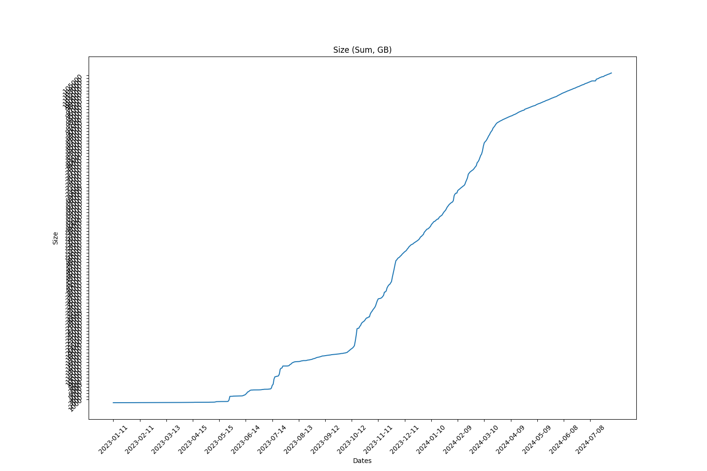
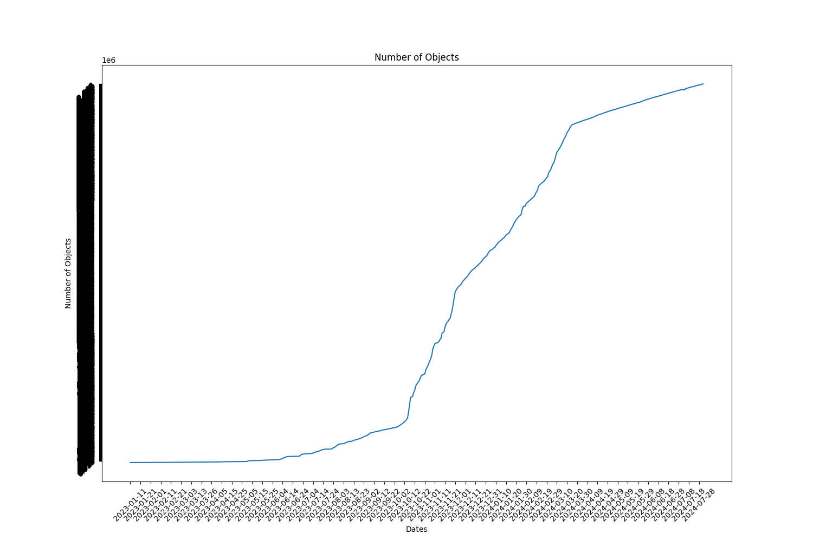

Full report for the Term: 34 

Start date: 2024-07-04  

End date: 2024-08-01 

Start Block: 8222430 

End Block: 8625630 

# Opening 
Number of openings: 0 
# Hiring
Number of hired works: 0
# Terminated workers 
Number of terminated workers: 0 
# Slashed workers 
Number of slashed workers: 0 
# Rewards
Total Rewards: 4067916667006640
| workerId               |    worker_total |
|------------------------|-----------------|
| storageWorkingGroup-0  |          403760 |
| storageWorkingGroup-15 | 605610776327060 |
| storageWorkingGroup-17 | 675423423683400 |
| storageWorkingGroup-22 | 556435868106860 |
| storageWorkingGroup-23 | 460767910058820 |
| storageWorkingGroup-24 | 666786853025720 |
| storageWorkingGroup-6  | 519780459475760 |
| storageWorkingGroup-9  | 583111375925260 |
# BUCKETS Info  
|   id |   dataObjectsSize |   dataObjectsSizeLimit |   dataObjectsCount |   bags |   Utilization |   dataObjectsSize, GB |
|------|-------------------|------------------------|--------------------|--------|---------------|-----------------------|
|    8 |    58549269474028 |        110000000000000 |            1292166 |  17759 |      0.532266 |               54475.1 |
|   10 |    68139635167518 |        125000000000000 |            1923461 |  26863 |      0.545117 |               63398.1 |
|    2 |    64413849336109 |         88000000000000 |            1603253 |  46507 |      0.731976 |               59931.5 |
|   11 |    42772012490648 |         86000000000000 |            1210925 |  16832 |      0.497349 |               39795.7 |
|    1 |    72218941726128 |        125000000000000 |            1999340 |  42150 |      0.577752 |               67193.5 |
|    3 |    47951338364330 |        100000000000000 |            1321221 |  32332 |      0.479513 |               44614.6 |
|    4 |    59806352134621 |        114000000000000 |            1320965 |  41764 |      0.524617 |               55644.7 |
|    0 |    32203898424356 |         90000000000000 |             693008 |  34501 |      0.357821 |               29963   |
## BUCKETS CREATED
Bucket Created: 0
## BUCKETS DELETED
Bucket Deleted: 0
## Bags
Bags Created: 657 

Bags Deleted: 0 

# Objects Info during this Council Period 
Total Objects Size: 58554 

Total Objects Size: 3523929471180 bytes 

## Objects Size Distribution
|   <10 MB |   <100 MB |   <1000 MB |   <10000 MB |   <100000 MB |   <1000000 MB |
|----------|-----------|------------|-------------|--------------|---------------|
|    37747 |     50810 |      58062 |       58554 |        58554 |         58554 |
 
|   0-10 MB |   10-100 MB |   100-1000 MB |   1000-10000 MB |   10000-100000 MB |   100000-10000000 MB |
|-----------|-------------|---------------|-----------------|-------------------|----------------------|
|     37747 |       13063 |          7252 |             492 |                 0 |                    0 |
## Objects Size Distribution Per Bag 
|   0-10 MB |   10-100 MB |   100-1000 MB |   1000-10000 MB |   10000-100000 MB |   100000-10000000 MB |
|-----------|-------------|---------------|-----------------|-------------------|----------------------|
|     37747 |       13063 |          7252 |             492 |                 0 |                    0 |
# Total object Info 
Total Objects: 2868213 

Total Objects Size: 113594857215271 bytes

Total Number of Bags in use: 34784 bytes

Grand Total Number of Bags: 33000 bytes

## Objects Size Distribution 
|   <10 MB |   <100 MB |   <1000 MB |   <10000 MB |   <100000 MB |   <1000000 MB |
|----------|-----------|------------|-------------|--------------|---------------|
|  2021840 |   2618892 |    2858229 |     2867911 |      2868213 |       2868213 |
 
|   0-10 MB |   10-100 MB |   100-1000 MB |   1000-10000 MB |   10000-100000 MB |   100000-10000000 MB |
|-----------|-------------|---------------|-----------------|-------------------|----------------------|
|   2021840 |      597052 |        239337 |            9682 |               302 |                    0 |
## Objects Size Distribution Per Bag 
|   0-10 MB |   10-100 MB |   100-1000 MB |   1000-10000 MB |   10000-100000 MB |   100000-10000000 MB |
|-----------|-------------|---------------|-----------------|-------------------|----------------------|
|   2021840 |      597052 |        239337 |            9682 |               302 |                    0 |

 
  
# Lost Objects - GraphQl 
Total Objects: 58554 

Total Lost Objects: 197 

Percentage Lost Objects: %0.3364415752980155 

|      id | createdAt                |       size |   storageBagId |
|---------|--------------------------|------------|----------------|
| 2866715 | 2024-07-22T19:06:12.000Z |  189652672 |          64697 |
| 2866717 | 2024-07-22T19:08:12.000Z |  189652672 |          64697 |
| 2875141 | 2024-07-26T16:09:00.000Z |   93834560 |          44822 |
| 2875142 | 2024-07-26T16:09:00.000Z |      17797 |          44822 |
| 2875145 | 2024-07-26T16:09:00.000Z |    9351306 |          59491 |
| 2875146 | 2024-07-26T16:09:00.000Z |      11478 |          59491 |
| 2875155 | 2024-07-26T16:09:12.000Z |   23545799 |          47024 |
| 2875156 | 2024-07-26T16:09:12.000Z |      17364 |          47024 |
| 2878597 | 2024-07-28T18:01:12.000Z |  217111428 |          61091 |
| 2878598 | 2024-07-28T18:01:12.000Z |      25042 |          61091 |
| 2878603 | 2024-07-28T18:01:12.000Z |   69543189 |          61091 |
| 2878604 | 2024-07-28T18:01:12.000Z |      22293 |          61091 |
| 2878605 | 2024-07-28T18:01:12.000Z |  124919339 |          61091 |
| 2878606 | 2024-07-28T18:01:12.000Z |      20023 |          61091 |
| 2878607 | 2024-07-28T18:01:12.000Z |  154838598 |          61091 |
| 2878608 | 2024-07-28T18:01:12.000Z |      13452 |          61091 |
| 2879701 | 2024-07-28T19:13:54.000Z |    1079186 |          64483 |
| 2879702 | 2024-07-28T19:13:54.000Z |       5307 |          64483 |
| 2885264 | 2024-07-31T19:47:12.000Z |   35121275 |          26831 |
| 2885265 | 2024-07-31T19:47:12.000Z |      25165 |          26831 |
| 2886906 | 2024-08-01T10:23:36.000Z |       6835 |          40679 |
| 2832355 | 2024-07-06T02:51:24.000Z |  586662505 |          64389 |
| 2832356 | 2024-07-06T02:51:24.000Z |      20263 |          64389 |
| 2833646 | 2024-07-06T16:25:00.000Z |     266674 |          64412 |
| 2833645 | 2024-07-06T16:25:00.000Z |      25264 |          64412 |
| 2837384 | 2024-07-08T08:25:24.001Z |    1701863 |          26823 |
| 2837385 | 2024-07-08T08:25:24.001Z |       9076 |          26823 |
| 2837454 | 2024-07-08T09:30:54.000Z |   23379465 |          64468 |
| 2837484 | 2024-07-08T17:15:54.000Z |  230770870 |          64479 |
| 2841930 | 2024-07-10T09:15:30.000Z |   20811197 |          64492 |
| 2842122 | 2024-07-10T17:14:42.001Z |   17494011 |          43375 |
| 2842123 | 2024-07-10T17:14:42.001Z |      21997 |          43375 |
| 2842317 | 2024-07-10T17:51:48.000Z |      13994 |          60153 |
| 2842423 | 2024-07-10T18:11:24.000Z |      15716 |          57192 |
| 2842425 | 2024-07-10T18:11:24.000Z |      15716 |          57192 |
| 2846351 | 2024-07-15T12:53:36.001Z |    7854290 |          55746 |
| 2846352 | 2024-07-15T12:53:36.001Z |      11315 |          55746 |
| 2846376 | 2024-07-15T12:54:12.001Z |      15373 |          58532 |
| 2846775 | 2024-07-15T13:05:06.001Z | 3322658709 |          59371 |
| 2850466 | 2024-07-15T15:02:54.001Z | 1932196916 |          53575 |
| 2854667 | 2024-07-17T01:19:30.000Z |      15853 |          27230 |
| 2859045 | 2024-07-18T16:51:00.001Z |  456695459 |          64686 |
| 2859046 | 2024-07-18T16:51:00.001Z |      11336 |          64686 |
| 2859101 | 2024-07-18T16:52:18.000Z |  605997180 |          64686 |
| 2859102 | 2024-07-18T16:52:18.000Z |       7665 |          64686 |
| 2860137 | 2024-07-19T11:34:18.001Z |      14172 |          43561 |
| 2865681 | 2024-07-21T23:27:30.001Z |     752752 |          61006 |
| 2865682 | 2024-07-21T23:27:30.001Z |      12359 |          61006 |
| 2866893 | 2024-07-23T03:05:06.000Z | 1261940623 |          64012 |
| 2868690 | 2024-07-24T11:32:06.000Z |       2839 |          55107 |
| 2870091 | 2024-07-24T12:54:36.000Z |    1208560 |          29432 |
| 2870092 | 2024-07-24T12:54:36.000Z |       5080 |          29432 |
| 2871423 | 2024-07-24T21:34:48.000Z |     176637 |          64778 |
| 2871422 | 2024-07-24T21:34:48.000Z |      66143 |          64778 |
| 2874266 | 2024-07-26T08:35:06.000Z |  119536386 |          64805 |
| 2874725 | 2024-07-26T16:01:42.001Z |    9752635 |          61163 |
| 2874726 | 2024-07-26T16:01:42.001Z |      13404 |          61163 |
| 2874733 | 2024-07-26T16:01:42.001Z |   22328096 |          61163 |
| 2874734 | 2024-07-26T16:01:42.001Z |      16509 |          61163 |
| 2876306 | 2024-07-27T08:05:24.000Z |    2537723 |          37373 |
| 2876307 | 2024-07-27T08:05:24.000Z |       5891 |          37373 |
| 2877034 | 2024-07-27T16:56:00.000Z |    2752952 |          29080 |
| 2877035 | 2024-07-27T16:56:00.000Z |       9004 |          29080 |
| 2877465 | 2024-07-27T19:02:30.000Z | 1516703508 |          52302 |
| 2878167 | 2024-07-28T12:27:36.001Z |       6644 |          64863 |
| 2879056 | 2024-07-28T18:56:54.001Z |   23812667 |          29783 |
| 2879057 | 2024-07-28T18:56:54.001Z |      17369 |          29783 |
| 2879324 | 2024-07-28T19:01:18.000Z |   30813959 |          49056 |
| 2879325 | 2024-07-28T19:01:18.000Z |      23316 |          49056 |
| 2879332 | 2024-07-28T19:01:18.000Z |   22879174 |          29181 |
| 2879333 | 2024-07-28T19:01:18.000Z |      16436 |          29181 |
| 2879334 | 2024-07-28T19:01:18.000Z |   21544013 |          29604 |
| 2879335 | 2024-07-28T19:01:18.000Z |      24988 |          29604 |
| 2882653 | 2024-07-30T05:33:48.001Z |       3442 |          64957 |
| 2882895 | 2024-07-30T11:22:36.000Z |   62960639 |          51362 |
| 2882896 | 2024-07-30T11:22:36.000Z |      26319 |          51362 |
| 2883266 | 2024-07-30T19:13:48.001Z |   35104995 |          64976 |
| 2883267 | 2024-07-30T19:13:48.001Z |      15368 |          64976 |
| 2883843 | 2024-07-31T08:53:24.000Z |   26257419 |          64986 |
| 2830944 | 2024-07-05T10:12:36.001Z |       7971 |          28266 |
| 2831088 | 2024-07-05T12:22:18.000Z |  216105312 |          64339 |
| 2831808 | 2024-07-05T18:52:36.000Z |      25190 |          46173 |
| 2832106 | 2024-07-05T19:52:18.001Z |   14159872 |          56646 |
| 2835792 | 2024-07-07T20:30:24.000Z |   60726803 |          64453 |
| 2836012 | 2024-07-07T21:13:36.001Z |    7292102 |          51006 |
| 2836013 | 2024-07-07T21:13:36.001Z |      15719 |          51006 |
| 2836276 | 2024-07-07T22:03:48.000Z |  695873088 |          64457 |
| 2836499 | 2024-07-08T05:10:30.000Z |     232494 |          64461 |
| 2836498 | 2024-07-08T05:10:30.000Z |      80783 |          64461 |
| 2853641 | 2024-07-16T09:12:00.000Z |  408069934 |          42119 |
| 2854350 | 2024-07-16T17:18:30.000Z |       8921 |          44359 |
| 2857382 | 2024-07-18T07:57:48.000Z | 3615443707 |          57589 |
| 2862485 | 2024-07-20T08:59:30.000Z | 1018163883 |          58281 |
| 2862486 | 2024-07-20T08:59:30.000Z |      21543 |          58281 |
| 2862801 | 2024-07-20T17:07:06.000Z |      20395 |          50995 |
| 2863184 | 2024-07-20T18:36:30.000Z |      78757 |          64718 |
| 2868689 | 2024-07-24T11:32:06.000Z |     476231 |          55107 |
| 2868315 | 2024-07-24T02:25:18.001Z |      16992 |          27226 |
| 2872557 | 2024-07-25T14:00:24.000Z |    3922252 |          59076 |
| 2872558 | 2024-07-25T14:00:24.000Z |       6982 |          59076 |
| 2872559 | 2024-07-25T14:00:24.000Z |    4452310 |          61429 |
| 2872560 | 2024-07-25T14:00:24.000Z |      14470 |          61429 |
| 2872561 | 2024-07-25T14:00:24.000Z |     678255 |          60830 |
| 2872562 | 2024-07-25T14:00:24.000Z |       5574 |          60830 |
| 2872563 | 2024-07-25T14:00:24.000Z |   13328242 |          61949 |
| 2872564 | 2024-07-25T14:00:24.000Z |       5808 |          61949 |
| 2872565 | 2024-07-25T14:00:24.000Z |  177337837 |          43368 |
| 2872566 | 2024-07-25T14:00:24.000Z |       9511 |          43368 |
| 2872567 | 2024-07-25T14:00:24.000Z | 1112447673 |          55470 |
| 2872568 | 2024-07-25T14:00:24.000Z |      22572 |          55470 |
| 2872569 | 2024-07-25T14:00:24.000Z |   34475277 |          60041 |
| 2872570 | 2024-07-25T14:00:24.000Z |      14505 |          60041 |
| 2872571 | 2024-07-25T14:00:24.000Z |   17921687 |          29792 |
| 2872572 | 2024-07-25T14:00:24.000Z |      17839 |          29792 |
| 2872573 | 2024-07-25T14:00:24.000Z |    7115206 |          59076 |
| 2872574 | 2024-07-25T14:00:24.000Z |      13459 |          59076 |
| 2872575 | 2024-07-25T14:00:24.000Z |   17329367 |          61949 |
| 2872576 | 2024-07-25T14:00:24.000Z |       6390 |          61949 |
| 2874233 | 2024-07-26T06:57:36.000Z |  116348197 |          27121 |
| 2874234 | 2024-07-26T06:57:36.000Z |      22937 |          27121 |
| 2877561 | 2024-07-28T01:16:36.000Z |    1225513 |          55170 |
| 2877562 | 2024-07-28T01:16:36.000Z |       4272 |          55170 |
| 2878282 | 2024-07-28T16:51:36.001Z |   12595508 |          51747 |
| 2878283 | 2024-07-28T16:51:36.001Z |      16244 |          51747 |
| 2878328 | 2024-07-28T17:01:42.000Z |    8121645 |          29044 |
| 2878329 | 2024-07-28T17:01:42.000Z |       4286 |          29044 |
| 2878565 | 2024-07-28T17:49:18.000Z |  859454438 |          64884 |
| 2878566 | 2024-07-28T17:49:18.000Z |       7720 |          64884 |
| 2878569 | 2024-07-28T17:50:48.001Z |    4213859 |          61091 |
| 2878570 | 2024-07-28T17:50:48.001Z |      10115 |          61091 |
| 2879157 | 2024-07-28T18:58:06.000Z |       4476 |          61926 |
| 2879495 | 2024-07-28T19:07:48.001Z |  279046072 |          45756 |
| 2879496 | 2024-07-28T19:07:48.001Z |      12526 |          45756 |
| 2879832 | 2024-07-28T19:15:36.000Z |   11004257 |          49816 |
| 2879833 | 2024-07-28T19:15:36.000Z |       8095 |          49816 |
| 2879846 | 2024-07-28T19:15:48.000Z |    7534731 |          51625 |
| 2879847 | 2024-07-28T19:15:48.000Z |      23271 |          51625 |
| 2879964 | 2024-07-28T21:10:30.001Z |   96272079 |          64900 |
| 2880346 | 2024-07-29T07:26:06.001Z |      65654 |          64919 |
| 2880347 | 2024-07-29T07:26:06.001Z |     116160 |          64919 |
| 2880360 | 2024-07-29T07:42:30.000Z |  186804782 |          64920 |
| 2881577 | 2024-07-30T02:34:36.000Z |       9345 |          64012 |
| 2882162 | 2024-07-30T03:17:54.000Z |  131360175 |          58568 |
| 2882163 | 2024-07-30T03:17:54.000Z |      17159 |          58568 |
| 2885756 | 2024-07-31T19:59:24.001Z | 1426192128 |          64421 |
| 2885757 | 2024-07-31T19:59:24.001Z |      11922 |          64421 |
| 2885820 | 2024-07-31T20:00:54.000Z |   70529108 |          58857 |
| 2885821 | 2024-07-31T20:00:54.000Z |      25045 |          58857 |
| 2885826 | 2024-07-31T20:01:00.001Z |   90350794 |          50966 |
| 2885827 | 2024-07-31T20:01:00.001Z |      11701 |          50966 |
| 2885864 | 2024-07-31T20:02:00.000Z |  645566308 |          53984 |
| 2885865 | 2024-07-31T20:02:00.000Z |      18113 |          53984 |
| 2887007 | 2024-08-01T10:55:30.001Z |  117704262 |          58146 |
| 2887008 | 2024-08-01T10:55:30.001Z |      24134 |          58146 |
| 2887009 | 2024-08-01T10:55:30.001Z |   44602249 |          26236 |
| 2887010 | 2024-08-01T10:55:30.001Z |      20801 |          26236 |
| 2887011 | 2024-08-01T10:55:30.001Z |   25237138 |          33325 |
| 2887012 | 2024-08-01T10:55:30.001Z |      14028 |          33325 |
| 2829673 | 2024-07-04T17:17:18.000Z |   68731851 |          60997 |
| 2829674 | 2024-07-04T17:17:18.000Z |      22962 |          60997 |
| 2829806 | 2024-07-04T21:18:48.000Z |     301504 |          64367 |
| 2829805 | 2024-07-04T21:18:48.000Z |      65881 |          64367 |
| 2833851 | 2024-07-06T18:46:36.000Z |  178484432 |          29736 |
| 2833852 | 2024-07-06T18:46:36.000Z |      19525 |          29736 |
| 2834550 | 2024-07-07T01:28:12.001Z |  873540774 |          64358 |
| 2834552 | 2024-07-07T01:33:00.000Z |  873540774 |          64358 |
| 2835154 | 2024-07-07T11:08:42.000Z | 1490122171 |          64433 |
| 2835156 | 2024-07-07T11:12:48.001Z | 1799257524 |          64433 |
| 2840050 | 2024-07-09T14:30:12.000Z |    9889538 |          64507 |
| 2840051 | 2024-07-09T14:30:12.000Z |      16868 |          64507 |
| 2842794 | 2024-07-10T18:51:24.001Z |   44533301 |          57378 |
| 2842795 | 2024-07-10T18:51:24.001Z |       5694 |          57378 |
| 2842821 | 2024-07-10T18:51:54.000Z |      20799 |          48376 |
| 2842830 | 2024-07-10T18:51:54.000Z |  273659038 |          49004 |
| 2842831 | 2024-07-10T18:51:54.000Z |      21623 |          49004 |
| 2842900 | 2024-07-11T14:22:12.001Z |    7863159 |          64535 |
| 2842919 | 2024-07-12T06:12:00.000Z |   13750433 |          64543 |
| 2842940 | 2024-07-12T16:04:00.000Z |  283170624 |          63692 |
| 2842932 | 2024-07-12T13:17:00.000Z |     187436 |          64547 |
| 2842942 | 2024-07-12T18:39:30.001Z |  783648587 |          63093 |
| 2842961 | 2024-07-13T02:42:18.001Z |      94417 |          64562 |
| 2842960 | 2024-07-13T02:42:18.001Z |      84170 |          64562 |
| 2843013 | 2024-07-14T07:54:18.000Z |   20658436 |          44692 |
| 2843014 | 2024-07-14T07:54:18.000Z |      17680 |          44692 |
| 2847586 | 2024-07-15T13:30:48.000Z |   60192666 |          50540 |
| 2847587 | 2024-07-15T13:30:48.000Z |      14883 |          50540 |
| 2847588 | 2024-07-15T13:30:48.000Z |  144322822 |          50923 |
| 2847589 | 2024-07-15T13:30:48.000Z |      15695 |          50923 |
| 2847590 | 2024-07-15T13:30:48.000Z |  116519942 |          50540 |
| 2847591 | 2024-07-15T13:30:48.000Z |      13334 |          50540 |
| 2851759 | 2024-07-15T18:07:54.001Z |   27477493 |          64622 |
| 2855988 | 2024-07-17T18:29:48.000Z |   32934497 |          64664 |
| 2856075 | 2024-07-17T20:50:54.001Z |      12116 |          50462 |
| 2856556 | 2024-07-17T22:37:00.001Z |   22347835 |          62166 |
| 2856557 | 2024-07-17T22:37:00.001Z |      10185 |          62166 |
| 2861684 | 2024-07-19T23:04:06.000Z |    2638934 |          44152 |
| 2861685 | 2024-07-19T23:04:06.000Z |       8179 |          44152 | 
