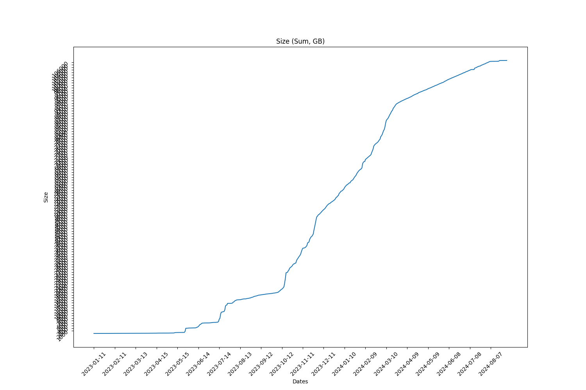
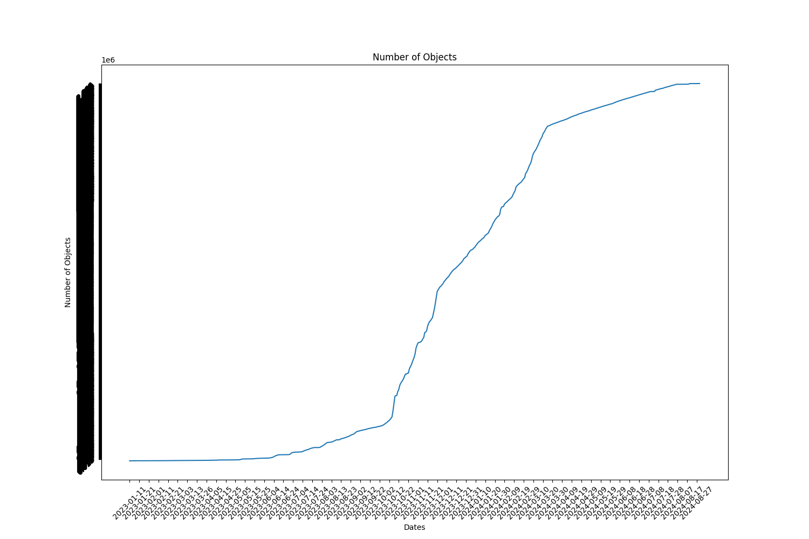

Full report for the Term: 35 

Start date: 2024-08-01  

End date: 2024-08-29 

Start Block: 8625630 

End Block: 9028830 

# Opening 
Number of openings: 0 
# Hiring
Number of hired works: 0
# Terminated workers 
Number of terminated workers: 0 
# Slashed workers 
Number of slashed workers: 0 
# Rewards
Total Rewards: 3160864431284683
| workerId               |    worker_total |
|------------------------|-----------------|
| storageWorkingGroup-0  |          389340 |
| storageWorkingGroup-15 | 486650699127600 |
| storageWorkingGroup-17 | 505490189596980 |
| storageWorkingGroup-22 | 490399464768360 |
| storageWorkingGroup-23 | 332961353881100 |
| storageWorkingGroup-24 | 521149905015040 |
| storageWorkingGroup-6  | 371626653244980 |
| storageWorkingGroup-9  | 452586165261283 |
# BUCKETS Info  
|   id |   dataObjectsSize |   dataObjectsSizeLimit |   dataObjectsCount |   bags |   Utilization |   dataObjectsSize, GB |
|------|-------------------|------------------------|--------------------|--------|---------------|-----------------------|
|    8 |    59100143303884 |        110000000000000 |            1299308 |  18055 |      0.537274 |               54987.6 |
|    1 |    72928644978198 |        125000000000000 |            2009284 |  42429 |      0.583429 |               67853.8 |
|    2 |    64982306099533 |         88000000000000 |            1611311 |  46507 |      0.738435 |               60460.4 |
|   10 |    68873666122375 |        125000000000000 |            1933548 |  27154 |      0.550989 |               64081   |
|    4 |    60362346007948 |        114000000000000 |            1328977 |  42066 |      0.529494 |               56162   |
|    3 |    48448335844561 |        100000000000000 |            1328767 |  32628 |      0.484483 |               45077   |
|    0 |    32500463458794 |         90000000000000 |             698175 |  34792 |      0.361116 |               30238.9 |
|   11 |    43213817770328 |         86000000000000 |            1217153 |  16941 |      0.502486 |               40206.7 |
## BUCKETS CREATED
Bucket Created: 0
## BUCKETS DELETED
Bucket Deleted: 0
## Bags
Bags Created: 460 

Bags Deleted: 0 

# Objects Info during this Council Period 
Total Objects Size: 16174 

Total Objects Size: 1125928166989 bytes 

## Objects Size Distribution
|   <10 MB |   <100 MB |   <1000 MB |   <10000 MB |   <100000 MB |   <1000000 MB |
|----------|-----------|------------|-------------|--------------|---------------|
|    10420 |     13945 |      15977 |       16174 |        16174 |         16174 |
 
|   0-10 MB |   10-100 MB |   100-1000 MB |   1000-10000 MB |   10000-100000 MB |   100000-10000000 MB |
|-----------|-------------|---------------|-----------------|-------------------|----------------------|
|     10420 |        3525 |          2032 |             197 |                 0 |                    0 |
## Objects Size Distribution Per Bag 
|   0-10 MB |   10-100 MB |   100-1000 MB |   1000-10000 MB |   10000-100000 MB |   100000-10000000 MB |
|-----------|-------------|---------------|-----------------|-------------------|----------------------|
|     10420 |        3525 |          2032 |             197 |                 0 |                    0 |
# Total object Info 
Total Objects: 2883654 

Total Objects Size: 114678942247137 bytes

Total Number of Bags in use: 35097 bytes

Grand Total Number of Bags: 33000 bytes

## Objects Size Distribution 
|   <10 MB |   <100 MB |   <1000 MB |   <10000 MB |   <100000 MB |   <1000000 MB |
|----------|-----------|------------|-------------|--------------|---------------|
|  2031822 |   2632191 |    2873476 |     2883352 |      2883654 |       2883654 |
 
|   0-10 MB |   10-100 MB |   100-1000 MB |   1000-10000 MB |   10000-100000 MB |   100000-10000000 MB |
|-----------|-------------|---------------|-----------------|-------------------|----------------------|
|   2031822 |      600369 |        241285 |            9876 |               302 |                    0 |
## Objects Size Distribution Per Bag 
|   0-10 MB |   10-100 MB |   100-1000 MB |   1000-10000 MB |   10000-100000 MB |   100000-10000000 MB |
|-----------|-------------|---------------|-----------------|-------------------|----------------------|
|   2031822 |      600369 |        241285 |            9876 |               302 |                    0 |

 
  
# Lost Objects - GraphQl 
Total Objects: 16174 

Total Lost Objects: 803 

Percentage Lost Objects: %4.964758253987882 

|      id | createdAt                |       size |   storageBagId |
|---------|--------------------------|------------|----------------|
| 2889142 | 2024-08-02T05:59:18.001Z |    6661817 |          64961 |
| 2890031 | 2024-08-02T15:25:00.001Z |    1092367 |          60830 |
| 2890032 | 2024-08-02T15:25:00.001Z |       7233 |          60830 |
| 2891308 | 2024-08-03T05:17:24.001Z |   19283291 |          65034 |
| 2891309 | 2024-08-03T05:17:24.001Z |      25630 |          65034 |
| 2893685 | 2024-08-04T09:42:06.000Z |    2159787 |          58329 |
| 2893686 | 2024-08-04T09:42:06.000Z |      15144 |          58329 |
| 2894021 | 2024-08-04T21:08:48.000Z |   62174411 |          65078 |
| 2896648 | 2024-08-06T02:07:30.001Z |    3652607 |          44152 |
| 2896649 | 2024-08-06T02:07:30.001Z |       6910 |          44152 |
| 2898409 | 2024-08-09T21:16:48.000Z |      65684 |          65166 |
| 2898408 | 2024-08-09T21:16:48.000Z |      89699 |          65166 |
| 2898440 | 2024-08-10T05:36:36.001Z |      12090 |          65177 |
| 2898570 | 2024-08-12T01:12:36.001Z |   23659152 |          65222 |
| 2898580 | 2024-08-12T06:07:00.001Z |  657508339 |          65200 |
| 2899094 | 2024-08-19T05:57:18.000Z |   67365683 |          65328 |
| 2899095 | 2024-08-19T05:57:18.000Z |      11202 |          65328 |
| 2899098 | 2024-08-19T07:02:12.001Z |      17245 |          58497 |
| 2899097 | 2024-08-19T07:02:12.001Z |   19469078 |          58497 |
| 2899099 | 2024-08-19T07:02:18.000Z |  220777566 |          54281 |
| 2899100 | 2024-08-19T07:02:18.000Z |       8724 |          54281 |
| 2899319 | 2024-08-19T08:05:30.000Z |   48902595 |          33260 |
| 2899320 | 2024-08-19T08:05:30.000Z |      18189 |          33260 |
| 2899506 | 2024-08-19T08:23:18.001Z |      20048 |          62651 |
| 2899505 | 2024-08-19T08:23:18.001Z |   25670896 |          62651 |
| 2899511 | 2024-08-19T08:23:24.001Z |   98644210 |          62985 |
| 2899512 | 2024-08-19T08:23:24.001Z |       6158 |          62985 |
| 2899632 | 2024-08-19T08:35:24.000Z |   10448578 |          30786 |
| 2899633 | 2024-08-19T08:35:24.000Z |      13235 |          30786 |
| 2899664 | 2024-08-19T08:38:06.000Z |   68479171 |          50995 |
| 2899665 | 2024-08-19T08:38:06.000Z |      20876 |          50995 |
| 2899801 | 2024-08-19T08:57:12.001Z |      19387 |          49056 |
| 2899808 | 2024-08-19T08:57:48.000Z |   75238250 |          49056 |
| 2899809 | 2024-08-19T08:57:48.000Z |      18317 |          49056 |
| 2899812 | 2024-08-19T08:57:48.000Z |   37137347 |          49056 |
| 2899813 | 2024-08-19T08:57:48.000Z |      20787 |          49056 |
| 2899961 | 2024-08-19T09:07:12.000Z |      11030 |          59491 |
| 2900056 | 2024-08-19T09:10:18.000Z |    8317343 |          52855 |
| 2900057 | 2024-08-19T09:10:18.000Z |      20328 |          52855 |
| 2900060 | 2024-08-19T09:10:18.000Z |    8545365 |          63312 |
| 2900061 | 2024-08-19T09:10:18.000Z |       8704 |          63312 |
| 2900076 | 2024-08-19T09:10:36.000Z |   12457961 |          31636 |
| 2900077 | 2024-08-19T09:10:36.000Z |      18001 |          31636 |
| 2900110 | 2024-08-19T09:11:12.000Z |    8266836 |          63936 |
| 2900111 | 2024-08-19T09:11:12.000Z |      12288 |          63936 |
| 2900112 | 2024-08-19T09:11:12.000Z |    8054137 |          63936 |
| 2900113 | 2024-08-19T09:11:12.000Z |      10643 |          63936 |
| 2900126 | 2024-08-19T09:12:00.000Z |   51739942 |          48453 |
| 2900127 | 2024-08-19T09:12:00.000Z |       7242 |          48453 |
| 2900174 | 2024-08-19T09:13:36.000Z |  531380478 |          29981 |
| 2900166 | 2024-08-19T09:13:12.000Z |   12932319 |          52795 |
| 2900167 | 2024-08-19T09:13:12.000Z |       6215 |          52795 |
| 2900175 | 2024-08-19T09:13:36.000Z |      17338 |          29981 |
| 2900176 | 2024-08-19T09:13:48.001Z |   14550121 |          52795 |
| 2900177 | 2024-08-19T09:13:48.001Z |       6417 |          52795 |
| 2900192 | 2024-08-19T09:14:48.001Z |  583333932 |          29981 |
| 2900193 | 2024-08-19T09:14:48.001Z |      15943 |          29981 |
| 2900212 | 2024-08-19T09:18:30.001Z |   40433863 |          26759 |
| 2900213 | 2024-08-19T09:18:30.001Z |      18135 |          26759 |
| 2900198 | 2024-08-19T09:15:24.000Z |  466347053 |          29981 |
| 2900199 | 2024-08-19T09:15:24.000Z |      23218 |          29981 |
| 2900214 | 2024-08-19T09:18:30.001Z | 1225476579 |          29981 |
| 2900215 | 2024-08-19T09:18:30.001Z |      15864 |          29981 |
| 2900210 | 2024-08-19T09:17:48.000Z |  406102348 |          29981 |
| 2900211 | 2024-08-19T09:17:48.000Z |      18090 |          29981 |
| 2900382 | 2024-08-19T09:38:06.000Z |   29450379 |          33638 |
| 2900383 | 2024-08-19T09:38:06.000Z |      24191 |          33638 |
| 2900388 | 2024-08-19T09:38:18.001Z |   30304057 |          28877 |
| 2900389 | 2024-08-19T09:38:18.001Z |      17155 |          28877 |
| 2900392 | 2024-08-19T09:38:24.001Z |   93473405 |          63251 |
| 2900393 | 2024-08-19T09:38:24.001Z |      14811 |          63251 |
| 2900482 | 2024-08-19T09:53:42.000Z |   64991303 |          61971 |
| 2900483 | 2024-08-19T09:53:42.000Z |      22406 |          61971 |
| 2900462 | 2024-08-19T09:40:48.001Z |  144220803 |          49715 |
| 2900463 | 2024-08-19T09:40:48.001Z |      16124 |          49715 |
| 2900466 | 2024-08-19T09:53:00.000Z |   58126781 |          29844 |
| 2900467 | 2024-08-19T09:53:00.000Z |      22366 |          29844 |
| 2900478 | 2024-08-19T09:53:30.000Z |  231472327 |          64715 |
| 2900479 | 2024-08-19T09:53:30.000Z |      14099 |          64715 |
| 2900670 | 2024-08-19T10:01:54.000Z |    2770271 |          46427 |
| 2900671 | 2024-08-19T10:01:54.000Z |       8890 |          46427 |
| 2900676 | 2024-08-19T10:02:06.001Z |    5541497 |          54414 |
| 2900677 | 2024-08-19T10:02:06.001Z |       4424 |          54414 |
| 2900678 | 2024-08-19T10:02:06.001Z |   48122969 |          29702 |
| 2900679 | 2024-08-19T10:02:06.001Z |      13148 |          29702 |
| 2900684 | 2024-08-19T10:02:06.001Z |    3482032 |          50408 |
| 2900685 | 2024-08-19T10:02:06.001Z |       4912 |          50408 |
| 2900690 | 2024-08-19T10:02:18.000Z |   66758251 |          29897 |
| 2900691 | 2024-08-19T10:02:18.000Z |      25795 |          29897 |
| 2900703 | 2024-08-19T10:03:00.001Z |       9310 |          40346 |
| 2900704 | 2024-08-19T10:03:12.000Z |    7493446 |          50019 |
| 2900705 | 2024-08-19T10:03:12.000Z |       5528 |          50019 |
| 2900702 | 2024-08-19T10:03:00.001Z |    9725241 |          40346 |
| 2900902 | 2024-08-19T13:47:42.000Z |   76879687 |          28314 |
| 2900903 | 2024-08-19T13:47:42.000Z |      24494 |          28314 |
| 2900926 | 2024-08-19T13:48:00.000Z |   26302513 |          29776 |
| 2900927 | 2024-08-19T13:48:00.000Z |      21472 |          29776 |
| 2900932 | 2024-08-19T13:48:00.000Z |   92233096 |          41203 |
| 2900933 | 2024-08-19T13:48:00.000Z |      15974 |          41203 |
| 2901020 | 2024-08-19T13:49:30.000Z |  122492116 |          26894 |
| 2901021 | 2024-08-19T13:49:30.000Z |      12333 |          26894 |
| 2901070 | 2024-08-19T13:50:12.000Z |  174706889 |          52249 |
| 2901071 | 2024-08-19T13:50:12.000Z |      15955 |          52249 |
| 2901076 | 2024-08-19T13:50:12.000Z |   30345387 |          35895 |
| 2901077 | 2024-08-19T13:50:12.000Z |      19674 |          35895 |
| 2901759 | 2024-08-20T02:02:42.000Z |   57532120 |          50301 |
| 2901760 | 2024-08-20T02:02:42.000Z |      19861 |          50301 |
| 2901769 | 2024-08-20T02:48:30.001Z |  215022853 |          44206 |
| 2901770 | 2024-08-20T02:48:30.001Z |      20631 |          44206 |
| 2901767 | 2024-08-20T02:47:18.000Z |  165404082 |          44206 |
| 2901768 | 2024-08-20T02:47:18.000Z |      21872 |          44206 |
| 2901857 | 2024-08-20T07:36:24.000Z |   18876739 |          57245 |
| 2901858 | 2024-08-20T07:36:24.000Z |       5794 |          57245 |
| 2901859 | 2024-08-20T07:36:24.000Z |   73848340 |          48910 |
| 2901860 | 2024-08-20T07:36:24.000Z |      13890 |          48910 |
| 2901935 | 2024-08-20T07:49:12.000Z |   31480738 |          26757 |
| 2901936 | 2024-08-20T07:49:12.000Z |      11503 |          26757 |
| 2901979 | 2024-08-20T08:00:00.000Z |  266375196 |          59158 |
| 2901980 | 2024-08-20T08:00:00.000Z |      16077 |          59158 |
| 2901991 | 2024-08-20T08:01:24.000Z |  328139733 |          59158 |
| 2901992 | 2024-08-20T08:01:24.000Z |      16874 |          59158 |
| 2901989 | 2024-08-20T08:01:24.000Z |  307316273 |          59158 |
| 2901990 | 2024-08-20T08:01:24.000Z |      16686 |          59158 |
| 2902083 | 2024-08-20T08:49:48.000Z |  706355826 |          62658 |
| 2902084 | 2024-08-20T08:49:48.000Z |      16521 |          62658 |
| 2902145 | 2024-08-20T09:42:06.001Z |   83478357 |          49081 |
| 2902146 | 2024-08-20T09:42:06.001Z |       5207 |          49081 |
| 2902155 | 2024-08-20T09:44:18.001Z |   16612104 |          29725 |
| 2902156 | 2024-08-20T09:44:18.001Z |      20965 |          29725 |
| 2902157 | 2024-08-20T09:44:24.000Z |  296883531 |          46190 |
| 2902158 | 2024-08-20T09:44:24.000Z |      24394 |          46190 |
| 2902239 | 2024-08-20T10:53:06.001Z |   22922087 |          43316 |
| 2902240 | 2024-08-20T10:53:06.001Z |      12137 |          43316 |
| 2902347 | 2024-08-20T11:07:24.002Z |  162462671 |          49922 |
| 2902348 | 2024-08-20T11:07:24.002Z |      16099 |          49922 |
| 2902353 | 2024-08-20T11:08:00.000Z |   25901608 |          44267 |
| 2902354 | 2024-08-20T11:08:00.000Z |      14451 |          44267 |
| 2902373 | 2024-08-20T11:09:48.000Z |   96063871 |          50449 |
| 2902363 | 2024-08-20T11:09:24.001Z |   56788854 |          50449 |
| 2902364 | 2024-08-20T11:09:24.001Z |      12911 |          50449 |
| 2902371 | 2024-08-20T11:09:42.000Z |  176997992 |          30572 |
| 2902372 | 2024-08-20T11:09:42.000Z |      16976 |          30572 |
| 2902374 | 2024-08-20T11:09:48.000Z |      15182 |          50449 |
| 2902468 | 2024-08-20T13:10:24.001Z |   10820525 |          57458 |
| 2902469 | 2024-08-20T13:10:24.001Z |      17749 |          57458 |
| 2902487 | 2024-08-20T13:11:30.000Z |      13247 |          48910 |
| 2902488 | 2024-08-20T13:11:30.000Z |    1207736 |          56574 |
| 2902489 | 2024-08-20T13:11:30.000Z |       4797 |          56574 |
| 2902484 | 2024-08-20T13:11:30.000Z |   48641996 |          48910 |
| 2902485 | 2024-08-20T13:11:30.000Z |      11968 |          48910 |
| 2902486 | 2024-08-20T13:11:30.000Z |   82387668 |          48910 |
| 2902600 | 2024-08-20T13:40:54.000Z | 1432506545 |          63311 |
| 2888563 | 2024-08-01T21:50:18.000Z |    6598790 |          65011 |
| 2888564 | 2024-08-01T21:50:18.000Z |      18826 |          65011 |
| 2893552 | 2024-08-04T02:38:54.000Z |    5423407 |          43632 |
| 2893553 | 2024-08-04T02:38:54.000Z |      20934 |          43632 |
| 2893592 | 2024-08-04T02:48:54.001Z |   46160289 |          65035 |
| 2896515 | 2024-08-05T18:29:54.000Z |    8764398 |          42898 |
| 2896516 | 2024-08-05T18:29:54.000Z |      19328 |          42898 |
| 2898333 | 2024-08-08T12:08:48.001Z |     272145 |          65130 |
| 2898332 | 2024-08-08T12:08:48.001Z |      89833 |          65130 |
| 2898521 | 2024-08-11T18:46:24.000Z |     392591 |          65213 |
| 2898520 | 2024-08-11T18:46:24.000Z |      83657 |          65213 |
| 2898703 | 2024-08-14T07:00:30.001Z |   42225827 |          65265 |
| 2898706 | 2024-08-14T10:59:54.000Z |  563340312 |          65272 |
| 2898727 | 2024-08-14T20:11:54.000Z |   13472096 |          64980 |
| 2898936 | 2024-08-18T19:12:48.000Z |  301013922 |          65308 |
| 2898937 | 2024-08-18T19:12:48.000Z |       7668 |          65308 |
| 2898952 | 2024-08-18T19:21:24.000Z |   16514902 |          61105 |
| 2898953 | 2024-08-18T19:21:24.000Z |      16778 |          61105 |
| 2898972 | 2024-08-18T19:22:18.000Z |  137963322 |          57262 |
| 2898973 | 2024-08-18T19:22:18.000Z |       9313 |          57262 |
| 2899121 | 2024-08-19T07:03:18.000Z |   67365683 |          65328 |
| 2899119 | 2024-08-19T07:03:12.001Z |   17513299 |          28292 |
| 2899120 | 2024-08-19T07:03:12.001Z |      20075 |          28292 |
| 2899123 | 2024-08-19T07:22:12.001Z |   67365683 |          65328 |
| 2899129 | 2024-08-19T07:57:42.000Z |  415887546 |          57320 |
| 2899130 | 2024-08-19T07:57:42.000Z |      19236 |          57320 |
| 2899127 | 2024-08-19T07:57:24.000Z |  144737759 |          61706 |
| 2899128 | 2024-08-19T07:57:24.000Z |      14998 |          61706 |
| 2899139 | 2024-08-19T07:57:54.000Z |  178069774 |          54281 |
| 2899140 | 2024-08-19T07:57:54.000Z |      18924 |          54281 |
| 2899141 | 2024-08-19T07:57:54.000Z |  169564591 |          55285 |
| 2899142 | 2024-08-19T07:57:54.000Z |      21030 |          55285 |
| 2899147 | 2024-08-19T07:57:54.000Z |  217517559 |          54281 |
| 2899148 | 2024-08-19T07:57:54.000Z |       7433 |          54281 |
| 2899283 | 2024-08-19T08:04:00.000Z |  136716244 |          47721 |
| 2899284 | 2024-08-19T08:04:00.000Z |      23981 |          47721 |
| 2899285 | 2024-08-19T08:04:00.000Z |  235061805 |          55367 |
| 2899286 | 2024-08-19T08:04:00.000Z |      20045 |          55367 |
| 2899301 | 2024-08-19T08:04:24.000Z |  209266869 |          55367 |
| 2899302 | 2024-08-19T08:04:24.000Z |      18642 |          55367 |
| 2899385 | 2024-08-19T08:11:42.000Z |  249559304 |          57470 |
| 2899386 | 2024-08-19T08:11:42.000Z |      17694 |          57470 |
| 2899387 | 2024-08-19T08:11:48.000Z | 1009686270 |          63528 |
| 2899388 | 2024-08-19T08:11:48.000Z |      19299 |          63528 |
| 2899519 | 2024-08-19T08:23:48.001Z |   27254030 |          62651 |
| 2899520 | 2024-08-19T08:23:48.001Z |      20048 |          62651 |
| 2899546 | 2024-08-19T08:26:00.001Z |   35702214 |          63505 |
| 2899547 | 2024-08-19T08:26:00.001Z |      19320 |          63505 |
| 2899694 | 2024-08-19T08:41:12.000Z |   76809560 |          41450 |
| 2899695 | 2024-08-19T08:41:12.000Z |      21346 |          41450 |
| 2899731 | 2024-08-19T08:43:30.001Z |      19058 |          38363 |
| 2899734 | 2024-08-19T08:43:42.000Z |  407761079 |          41450 |
| 2899735 | 2024-08-19T08:43:42.000Z |      16728 |          41450 |
| 2899730 | 2024-08-19T08:43:30.001Z |   14444701 |          38363 |
| 2899740 | 2024-08-19T08:44:12.000Z |    9369594 |          38363 |
| 2899886 | 2024-08-19T09:03:30.000Z |   15090811 |          65330 |
| 2899887 | 2024-08-19T09:03:30.000Z |      11315 |          65330 |
| 2899890 | 2024-08-19T09:03:30.000Z |   84858238 |          65330 |
| 2899891 | 2024-08-19T09:03:30.000Z |      12773 |          65330 |
| 2899898 | 2024-08-19T09:04:00.000Z |   27338667 |          65277 |
| 2899899 | 2024-08-19T09:04:00.000Z |      27540 |          65277 |
| 2900010 | 2024-08-19T09:09:06.000Z |  103820937 |          26913 |
| 2900011 | 2024-08-19T09:09:06.000Z |       5385 |          26913 |
| 2900086 | 2024-08-19T09:10:54.000Z |   22175704 |          42016 |
| 2900087 | 2024-08-19T09:10:54.000Z |      13693 |          42016 |
| 2900090 | 2024-08-19T09:10:54.000Z |   23906889 |          42016 |
| 2900091 | 2024-08-19T09:10:54.000Z |      14592 |          42016 |
| 2900102 | 2024-08-19T09:11:12.000Z |  130240781 |          48578 |
| 2900103 | 2024-08-19T09:11:12.000Z |      11791 |          48578 |
| 2900224 | 2024-08-19T09:19:18.000Z |   36423555 |          26759 |
| 2900225 | 2024-08-19T09:19:18.000Z |      18385 |          26759 |
| 2900246 | 2024-08-19T09:20:00.001Z |   25273179 |          26759 |
| 2900247 | 2024-08-19T09:20:00.001Z |      19449 |          26759 |
| 2900342 | 2024-08-19T09:29:12.000Z |   21016747 |          54909 |
| 2900343 | 2024-08-19T09:29:12.000Z |      17016 |          54909 |
| 2900346 | 2024-08-19T09:29:30.000Z |  124517836 |          47711 |
| 2900347 | 2024-08-19T09:29:30.000Z |      17246 |          47711 |
| 2900364 | 2024-08-19T09:31:12.001Z |   52704572 |          49114 |
| 2900365 | 2024-08-19T09:31:12.001Z |      15608 |          49114 |
| 2900354 | 2024-08-19T09:29:48.001Z |   52727604 |          48392 |
| 2900355 | 2024-08-19T09:29:48.001Z |      18671 |          48392 |
| 2900358 | 2024-08-19T09:30:00.000Z |  182303913 |          26746 |
| 2900359 | 2024-08-19T09:30:00.000Z |      19666 |          26746 |
| 2900612 | 2024-08-19T10:00:24.000Z |    3012332 |          52221 |
| 2900613 | 2024-08-19T10:00:24.000Z |       3090 |          52221 |
| 2900614 | 2024-08-19T10:00:24.000Z |    7232612 |          51497 |
| 2900615 | 2024-08-19T10:00:24.000Z |      22505 |          51497 |
| 2900618 | 2024-08-19T10:00:42.001Z |   51793326 |          57729 |
| 2900619 | 2024-08-19T10:00:42.001Z |      12583 |          57729 |
| 2900626 | 2024-08-19T10:01:18.001Z |  303010220 |          55367 |
| 2900627 | 2024-08-19T10:01:18.001Z |      21386 |          55367 |
| 2900630 | 2024-08-19T10:01:18.001Z |    3427510 |          62975 |
| 2900631 | 2024-08-19T10:01:18.001Z |      10661 |          62975 |
| 2900648 | 2024-08-19T10:01:36.000Z |  202052300 |          57042 |
| 2900649 | 2024-08-19T10:01:36.000Z |      14103 |          57042 |
| 2900768 | 2024-08-19T10:06:06.000Z |    5693531 |          59267 |
| 2900769 | 2024-08-19T10:06:06.000Z |       9649 |          59267 |
| 2900772 | 2024-08-19T10:06:06.000Z |   21346147 |          50706 |
| 2900773 | 2024-08-19T10:06:06.000Z |      23432 |          50706 |
| 2900800 | 2024-08-19T10:15:42.000Z |   48892531 |          54863 |
| 2900801 | 2024-08-19T10:15:42.000Z |      11598 |          54863 |
| 2900802 | 2024-08-19T10:15:42.000Z |    6902321 |          42582 |
| 2900803 | 2024-08-19T10:15:42.000Z |       6539 |          42582 |
| 2900808 | 2024-08-19T10:15:54.000Z |     741618 |          58675 |
| 2900809 | 2024-08-19T10:15:54.000Z |       6660 |          58675 |
| 2900818 | 2024-08-19T10:17:24.000Z |    7147603 |          34795 |
| 2900819 | 2024-08-19T10:17:24.000Z |      23071 |          34795 |
| 2900946 | 2024-08-19T13:48:18.001Z |   50658299 |          25965 |
| 2900947 | 2024-08-19T13:48:18.001Z |      16048 |          25965 |
| 2900950 | 2024-08-19T13:48:18.001Z |   52463634 |          47711 |
| 2900951 | 2024-08-19T13:48:18.001Z |      12919 |          47711 |
| 2900952 | 2024-08-19T13:48:18.001Z |   74019065 |          25965 |
| 2900953 | 2024-08-19T13:48:18.001Z |      17478 |          25965 |
| 2900964 | 2024-08-19T13:48:36.001Z |   77412620 |          28143 |
| 2900965 | 2024-08-19T13:48:36.001Z |      22994 |          28143 |
| 2901030 | 2024-08-19T13:49:42.000Z |   37787587 |          43766 |
| 2901031 | 2024-08-19T13:49:42.000Z |      13438 |          43766 |
| 2901090 | 2024-08-19T13:50:30.000Z |   43049073 |          63879 |
| 2901091 | 2024-08-19T13:50:30.000Z |      12795 |          63879 |
| 2901094 | 2024-08-19T13:50:30.000Z |   28879862 |          62651 |
| 2901095 | 2024-08-19T13:50:30.000Z |      20048 |          62651 |
| 2901096 | 2024-08-19T13:50:30.000Z |   20078506 |          28782 |
| 2901097 | 2024-08-19T13:50:30.000Z |      25971 |          28782 |
| 2901272 | 2024-08-19T13:54:42.001Z |   34646574 |          54166 |
| 2901273 | 2024-08-19T13:54:42.001Z |      20045 |          54166 |
| 2901280 | 2024-08-19T13:54:42.001Z |   34585643 |          54166 |
| 2901281 | 2024-08-19T13:54:42.001Z |      13394 |          54166 |
| 2901294 | 2024-08-19T13:55:00.000Z |   44231733 |          25965 |
| 2901295 | 2024-08-19T13:55:00.000Z |      14227 |          25965 |
| 2901352 | 2024-08-19T13:55:42.000Z |     948024 |          60413 |
| 2901353 | 2024-08-19T13:55:42.000Z |      10727 |          60413 |
| 2901362 | 2024-08-19T13:55:54.001Z |   70712944 |          38644 |
| 2901363 | 2024-08-19T13:55:54.001Z |      20275 |          38644 |
| 2901400 | 2024-08-19T13:56:18.000Z |   13054407 |          56580 |
| 2901401 | 2024-08-19T13:56:18.000Z |      14448 |          56580 |
| 2901448 | 2024-08-19T13:56:42.000Z |   35320777 |          63677 |
| 2901449 | 2024-08-19T13:56:42.000Z |       8856 |          63677 |
| 2901454 | 2024-08-19T13:56:42.000Z |   10859041 |          40714 |
| 2901455 | 2024-08-19T13:56:42.000Z |      17885 |          40714 |
| 2901488 | 2024-08-19T13:57:12.001Z |   39311131 |          37806 |
| 2901489 | 2024-08-19T13:57:12.001Z |      10594 |          37806 |
| 2901490 | 2024-08-19T13:57:12.001Z |    8335341 |          49586 |
| 2901491 | 2024-08-19T13:57:12.001Z |       7552 |          49586 |
| 2901510 | 2024-08-19T13:57:24.001Z |    6380577 |          27338 |
| 2901511 | 2024-08-19T13:57:24.001Z |       4354 |          27338 |
| 2901526 | 2024-08-19T13:57:36.000Z |    6203859 |          47011 |
| 2901527 | 2024-08-19T13:57:36.000Z |       9932 |          47011 |
| 2901558 | 2024-08-19T15:13:30.000Z |    9226390 |          65337 |
| 2901559 | 2024-08-19T15:13:30.000Z |      11738 |          65337 |
| 2901560 | 2024-08-19T15:13:30.000Z |   14962413 |          65337 |
| 2901561 | 2024-08-19T15:13:30.000Z |       9930 |          65337 |
| 2901604 | 2024-08-19T17:26:54.000Z |    1215507 |          60824 |
| 2901605 | 2024-08-19T17:26:54.000Z |       4037 |          60824 |
| 2901616 | 2024-08-19T17:27:12.000Z |    2459143 |          38273 |
| 2901617 | 2024-08-19T17:27:12.000Z |       6406 |          38273 |
| 2901660 | 2024-08-19T17:27:36.000Z |  111770737 |          55404 |
| 2901661 | 2024-08-19T17:27:36.000Z |      21563 |          55404 |
| 2901662 | 2024-08-19T17:27:36.000Z |   49690160 |          60110 |
| 2901663 | 2024-08-19T17:27:36.000Z |      20552 |          60110 |
| 2901698 | 2024-08-19T18:03:30.000Z |       8230 |          65341 |
| 2901699 | 2024-08-19T18:03:30.000Z |    7121228 |          65341 |
| 2901700 | 2024-08-19T18:03:30.000Z |       9077 |          65341 |
| 2901695 | 2024-08-19T18:03:00.000Z |   10138804 |          65341 |
| 2901696 | 2024-08-19T18:03:00.000Z |       6383 |          65341 |
| 2901697 | 2024-08-19T18:03:30.000Z |    7065057 |          65341 |
| 2901793 | 2024-08-20T04:23:48.001Z |   35589644 |          51600 |
| 2901794 | 2024-08-20T04:23:48.001Z |       7872 |          51600 |
| 2901877 | 2024-08-20T07:37:24.000Z |   46445516 |          29531 |
| 2901878 | 2024-08-20T07:37:24.000Z |      12515 |          29531 |
| 2901889 | 2024-08-20T07:38:18.001Z |   12091499 |          44267 |
| 2901890 | 2024-08-20T07:38:18.001Z |      16582 |          44267 |
| 2901891 | 2024-08-20T07:38:18.001Z |   69612079 |          27121 |
| 2901892 | 2024-08-20T07:38:18.001Z |      16581 |          27121 |
| 2902029 | 2024-08-20T08:07:12.000Z |   99116743 |          50301 |
| 2902030 | 2024-08-20T08:07:12.000Z |      17764 |          50301 |
| 2902043 | 2024-08-20T08:10:06.000Z |  119312141 |          45336 |
| 2902044 | 2024-08-20T08:10:06.000Z |      13915 |          45336 |
| 2902103 | 2024-08-20T09:34:54.001Z |    1864439 |          50223 |
| 2902104 | 2024-08-20T09:34:54.001Z |       6493 |          50223 |
| 2902099 | 2024-08-20T09:09:18.000Z |  100043678 |          63649 |
| 2902100 | 2024-08-20T09:09:18.000Z |      11891 |          63649 |
| 2902109 | 2024-08-20T09:35:06.000Z |  111672946 |          57419 |
| 2902110 | 2024-08-20T09:35:06.000Z |      12048 |          57419 |
| 2902105 | 2024-08-20T09:34:54.001Z |    1585011 |          50223 |
| 2902106 | 2024-08-20T09:34:54.001Z |       6615 |          50223 |
| 2902107 | 2024-08-20T09:34:54.001Z |     800881 |          50223 |
| 2902108 | 2024-08-20T09:34:54.001Z |       6632 |          50223 |
| 2902115 | 2024-08-20T09:38:18.002Z |  231023224 |          50223 |
| 2902181 | 2024-08-20T10:19:12.000Z | 1896621688 |          62856 |
| 2902182 | 2024-08-20T10:19:12.000Z |      18266 |          62856 |
| 2902185 | 2024-08-20T10:21:18.000Z | 2030481347 |          62856 |
| 2902186 | 2024-08-20T10:21:18.000Z |      18415 |          62856 |
| 2902187 | 2024-08-20T10:28:36.001Z | 2457505150 |          62856 |
| 2902188 | 2024-08-20T10:28:36.001Z |      18320 |          62856 |
| 2902189 | 2024-08-20T10:28:48.000Z |   15096035 |          54831 |
| 2902190 | 2024-08-20T10:28:48.000Z |      17812 |          54831 |
| 2902201 | 2024-08-20T10:31:54.001Z |  209616822 |          60381 |
| 2902202 | 2024-08-20T10:31:54.001Z |      14580 |          60381 |
| 2902199 | 2024-08-20T10:31:48.000Z |   38357539 |          33325 |
| 2902200 | 2024-08-20T10:31:48.000Z |      14210 |          33325 |
| 2902307 | 2024-08-20T11:04:24.001Z |    7506988 |          65346 |
| 2902308 | 2024-08-20T11:04:24.001Z |       4691 |          65346 |
| 2902337 | 2024-08-20T11:06:24.000Z |   50988637 |          34187 |
| 2902338 | 2024-08-20T11:06:24.000Z |      14270 |          34187 |
| 2902343 | 2024-08-20T11:07:00.001Z |   57160265 |          34187 |
| 2902344 | 2024-08-20T11:07:00.001Z |      15374 |          34187 |
| 2902345 | 2024-08-20T11:07:18.000Z |   33408769 |          26384 |
| 2902346 | 2024-08-20T11:07:18.000Z |      16441 |          26384 |
| 2902410 | 2024-08-20T12:09:06.002Z |  512604785 |          39168 |
| 2902411 | 2024-08-20T12:09:06.002Z |       4314 |          39168 |
| 2902424 | 2024-08-20T13:03:48.000Z |  615547761 |          62272 |
| 2902425 | 2024-08-20T13:03:48.000Z |      13164 |          62272 |
| 2902436 | 2024-08-20T13:08:54.000Z |  141805240 |          57188 |
| 2902437 | 2024-08-20T13:08:54.000Z |      20532 |          57188 |
| 2902444 | 2024-08-20T13:09:06.000Z |    5186250 |          63126 |
| 2902445 | 2024-08-20T13:09:06.000Z |       4069 |          63126 |
| 2902448 | 2024-08-20T13:09:24.000Z |    6805099 |          30785 |
| 2902449 | 2024-08-20T13:09:24.000Z |      17949 |          30785 |
| 2902450 | 2024-08-20T13:09:24.000Z |    6691901 |          30785 |
| 2902451 | 2024-08-20T13:09:24.000Z |      18669 |          30785 |
| 2902454 | 2024-08-20T13:09:36.000Z |   39002269 |          63774 |
| 2902455 | 2024-08-20T13:09:36.000Z |      14548 |          63774 |
| 2902458 | 2024-08-20T13:09:36.000Z |    6419886 |          63126 |
| 2902459 | 2024-08-20T13:09:36.000Z |       5589 |          63126 |
| 2902542 | 2024-08-20T13:14:36.000Z |  130734977 |          49324 |
| 2902543 | 2024-08-20T13:14:36.000Z |      17049 |          49324 |
| 2902550 | 2024-08-20T13:14:42.000Z |  387871956 |          44207 |
| 2902551 | 2024-08-20T13:14:42.000Z |      25943 |          44207 |
| 2889494 | 2024-08-02T11:57:36.001Z |   46793914 |          65029 |
| 2891958 | 2024-08-03T14:53:48.000Z |   69043661 |          64874 |
| 2898321 | 2024-08-08T00:22:00.000Z | 5437391300 |          58336 |
| 2898828 | 2024-08-17T08:35:30.000Z |  690977966 |          65074 |
| 2898826 | 2024-08-17T08:26:18.000Z |   80658257 |          65074 |
| 2898992 | 2024-08-18T19:27:18.001Z |      21696 |          65324 |
| 2898991 | 2024-08-18T19:27:18.001Z |   57567791 |          65324 |
| 2899177 | 2024-08-19T07:59:30.001Z |   79652956 |          56463 |
| 2899178 | 2024-08-19T07:59:30.001Z |      17712 |          56463 |
| 2899187 | 2024-08-19T07:59:42.001Z |   91352196 |          33202 |
| 2899188 | 2024-08-19T07:59:42.001Z |       8565 |          33202 |
| 2899209 | 2024-08-19T08:02:42.000Z |    4863282 |          34888 |
| 2899210 | 2024-08-19T08:02:42.000Z |       5322 |          34888 |
| 2899201 | 2024-08-19T08:00:48.000Z |  464800905 |          57935 |
| 2899202 | 2024-08-19T08:00:48.000Z |      18453 |          57935 |
| 2899225 | 2024-08-19T08:02:42.000Z |    2029748 |          34888 |
| 2899226 | 2024-08-19T08:02:42.000Z |       3646 |          34888 |
| 2899343 | 2024-08-19T08:08:24.000Z |  130080216 |          26678 |
| 2899344 | 2024-08-19T08:08:24.000Z |      15042 |          26678 |
| 2899349 | 2024-08-19T08:08:48.000Z |   43426710 |          26678 |
| 2899350 | 2024-08-19T08:08:48.000Z |      15350 |          26678 |
| 2899367 | 2024-08-19T08:10:36.000Z |  267134591 |          57470 |
| 2899368 | 2024-08-19T08:10:36.000Z |      12420 |          57470 |
| 2899411 | 2024-08-19T08:14:12.000Z |   13098124 |          53823 |
| 2899412 | 2024-08-19T08:14:12.000Z |       6466 |          53823 |
| 2899439 | 2024-08-19T08:16:36.001Z |   57838239 |          29449 |
| 2899440 | 2024-08-19T08:16:36.001Z |      22136 |          29449 |
| 2899443 | 2024-08-19T08:17:06.001Z |   26718137 |          29449 |
| 2899444 | 2024-08-19T08:17:06.001Z |      18353 |          29449 |
| 2899463 | 2024-08-19T08:18:48.000Z |    9585358 |          62773 |
| 2899464 | 2024-08-19T08:18:48.000Z |       9865 |          62773 |
| 2899600 | 2024-08-19T08:32:18.000Z |  152397819 |          36527 |
| 2899601 | 2024-08-19T08:32:18.000Z |      24274 |          36527 |
| 2899612 | 2024-08-19T08:33:18.001Z |   92877028 |          36527 |
| 2899613 | 2024-08-19T08:33:18.001Z |      16000 |          36527 |
| 2899622 | 2024-08-19T08:34:12.001Z |   23327044 |          29693 |
| 2899623 | 2024-08-19T08:34:12.001Z |      13775 |          29693 |
| 2899741 | 2024-08-19T08:44:12.000Z |      18980 |          38363 |
| 2899746 | 2024-08-19T08:44:36.000Z |  164007521 |          51872 |
| 2899747 | 2024-08-19T08:44:36.000Z |      17636 |          51872 |
| 2899798 | 2024-08-19T08:56:36.000Z |    8999219 |          43489 |
| 2899799 | 2024-08-19T08:56:36.000Z |      16753 |          43489 |
| 2899800 | 2024-08-19T08:57:12.001Z |   95034798 |          49056 |
| 2899916 | 2024-08-19T09:05:00.000Z |  486574302 |          61958 |
| 2899917 | 2024-08-19T09:05:00.000Z |      15168 |          61958 |
| 2899926 | 2024-08-19T09:05:30.000Z |    4317633 |          42582 |
| 2899927 | 2024-08-19T09:05:30.000Z |       5917 |          42582 |
| 2899936 | 2024-08-19T09:06:00.000Z |    3646416 |          42582 |
| 2899937 | 2024-08-19T09:06:00.000Z |       4309 |          42582 |
| 2899960 | 2024-08-19T09:07:12.000Z |   26652670 |          59491 |
| 2900128 | 2024-08-19T09:12:06.000Z |    1321722 |          61486 |
| 2900129 | 2024-08-19T09:12:06.000Z |       4595 |          61486 |
| 2900130 | 2024-08-19T09:12:36.000Z |  107371025 |          59644 |
| 2900131 | 2024-08-19T09:12:36.000Z |       8398 |          59644 |
| 2900132 | 2024-08-19T09:12:36.000Z |    3617618 |          48453 |
| 2900133 | 2024-08-19T09:12:36.000Z |       9373 |          48453 |
| 2900134 | 2024-08-19T09:12:36.000Z |    9251019 |          61230 |
| 2900135 | 2024-08-19T09:12:36.000Z |       4737 |          61230 |
| 2900136 | 2024-08-19T09:12:36.000Z |   61333428 |          59644 |
| 2900137 | 2024-08-19T09:12:36.000Z |      13517 |          59644 |
| 2900138 | 2024-08-19T09:12:36.000Z |    1861667 |          61230 |
| 2900139 | 2024-08-19T09:12:36.000Z |       6331 |          61230 |
| 2900146 | 2024-08-19T09:12:48.000Z |    2307051 |          28796 |
| 2900147 | 2024-08-19T09:12:48.000Z |       6186 |          28796 |
| 2900260 | 2024-08-19T09:20:24.000Z |   26841192 |          29922 |
| 2900261 | 2024-08-19T09:20:24.000Z |      20950 |          29922 |
| 2900264 | 2024-08-19T09:20:30.000Z |   27871886 |          29702 |
| 2900265 | 2024-08-19T09:20:30.000Z |      12820 |          29702 |
| 2900266 | 2024-08-19T09:21:12.000Z |  150055604 |          50462 |
| 2900267 | 2024-08-19T09:21:12.000Z |      21162 |          50462 |
| 2900270 | 2024-08-19T09:21:12.000Z |   28253116 |          29702 |
| 2900271 | 2024-08-19T09:21:12.000Z |      13013 |          29702 |
| 2900280 | 2024-08-19T09:22:12.000Z |  300022191 |          50462 |
| 2900281 | 2024-08-19T09:22:12.000Z |      16189 |          50462 |
| 2900292 | 2024-08-19T09:24:42.001Z |  688761893 |          50462 |
| 2900293 | 2024-08-19T09:24:42.001Z |      21527 |          50462 |
| 2900294 | 2024-08-19T09:24:42.001Z |  730175799 |          50462 |
| 2900295 | 2024-08-19T09:24:42.001Z |      13863 |          50462 |
| 2900313 | 2024-08-19T09:27:30.001Z |      24932 |          28314 |
| 2900298 | 2024-08-19T09:25:18.000Z |  404741396 |          50462 |
| 2900299 | 2024-08-19T09:25:18.000Z |      11541 |          50462 |
| 2900306 | 2024-08-19T09:25:54.000Z |   30672915 |          28314 |
| 2900307 | 2024-08-19T09:25:54.000Z |      23879 |          28314 |
| 2900312 | 2024-08-19T09:27:30.001Z |   62053414 |          28314 |
| 2900432 | 2024-08-19T09:40:12.001Z |   63184573 |          54732 |
| 2900433 | 2024-08-19T09:40:12.001Z |      19783 |          54732 |
| 2900436 | 2024-08-19T09:40:12.001Z |    4539667 |          28520 |
| 2900437 | 2024-08-19T09:40:12.001Z |       8579 |          28520 |
| 2900442 | 2024-08-19T09:40:12.001Z |    3656293 |          28520 |
| 2900443 | 2024-08-19T09:40:12.001Z |       8965 |          28520 |
| 2900444 | 2024-08-19T09:40:30.001Z |  191415248 |          48637 |
| 2900445 | 2024-08-19T09:40:30.001Z |      21536 |          48637 |
| 2900448 | 2024-08-19T09:40:30.001Z |   80946862 |          58568 |
| 2900449 | 2024-08-19T09:40:30.001Z |      15680 |          58568 |
| 2900580 | 2024-08-19T09:59:24.000Z |    8350728 |          51961 |
| 2900581 | 2024-08-19T09:59:24.000Z |       6328 |          51961 |
| 2900582 | 2024-08-19T09:59:24.000Z |    7225811 |          29080 |
| 2900583 | 2024-08-19T09:59:24.000Z |      17118 |          29080 |
| 2900586 | 2024-08-19T09:59:24.000Z |   62552391 |          51872 |
| 2900587 | 2024-08-19T09:59:24.000Z |      17272 |          51872 |
| 2900588 | 2024-08-19T09:59:24.000Z |   15034733 |          65172 |
| 2900589 | 2024-08-19T09:59:24.000Z |       2767 |          65172 |
| 2900590 | 2024-08-19T09:59:24.000Z |   35392608 |          37666 |
| 2900591 | 2024-08-19T09:59:24.000Z |      14852 |          37666 |
| 2900598 | 2024-08-19T09:59:42.000Z |    6420455 |          52221 |
| 2900599 | 2024-08-19T09:59:42.000Z |       7957 |          52221 |
| 2900600 | 2024-08-19T09:59:48.000Z |  113379745 |          51872 |
| 2900601 | 2024-08-19T09:59:48.000Z |      17802 |          51872 |
| 2900712 | 2024-08-19T10:03:24.001Z |    1690815 |          26913 |
| 2900713 | 2024-08-19T10:03:24.001Z |       4814 |          26913 |
| 2900718 | 2024-08-19T10:03:36.000Z |    3216042 |          28292 |
| 2900719 | 2024-08-19T10:03:36.000Z |      14743 |          28292 |
| 2900740 | 2024-08-19T10:04:00.000Z |   21984589 |          57384 |
| 2900741 | 2024-08-19T10:04:00.000Z |       8111 |          57384 |
| 2900744 | 2024-08-19T10:04:12.000Z |   29199255 |          65324 |
| 2900745 | 2024-08-19T10:04:12.000Z |       5387 |          65324 |
| 2900756 | 2024-08-19T10:04:48.000Z |     822993 |          54388 |
| 2900757 | 2024-08-19T10:04:48.000Z |       4613 |          54388 |
| 2900838 | 2024-08-19T11:04:12.000Z |   32364270 |          29617 |
| 2900839 | 2024-08-19T11:04:12.000Z |      22753 |          29617 |
| 2900994 | 2024-08-19T13:49:18.000Z |   45890584 |          26502 |
| 2900995 | 2024-08-19T13:49:18.000Z |      18724 |          26502 |
| 2900996 | 2024-08-19T13:49:18.000Z |  122990734 |          28143 |
| 2900997 | 2024-08-19T13:49:18.000Z |      23810 |          28143 |
| 2900998 | 2024-08-19T13:49:18.000Z |   60146874 |          49114 |
| 2900999 | 2024-08-19T13:49:18.000Z |      18681 |          49114 |
| 2901000 | 2024-08-19T13:49:18.000Z |   36027104 |          54909 |
| 2901001 | 2024-08-19T13:49:18.000Z |      19839 |          54909 |
| 2901104 | 2024-08-19T13:50:30.000Z |   18186918 |          28782 |
| 2901105 | 2024-08-19T13:50:30.000Z |      21291 |          28782 |
| 2901124 | 2024-08-19T13:50:48.000Z |    4398877 |          62773 |
| 2901125 | 2024-08-19T13:50:48.000Z |       9018 |          62773 |
| 2901304 | 2024-08-19T13:55:00.000Z |    1625547 |          41203 |
| 2901305 | 2024-08-19T13:55:00.000Z |       8459 |          41203 |
| 2901306 | 2024-08-19T13:55:00.000Z |   24762978 |          25965 |
| 2901307 | 2024-08-19T13:55:00.000Z |      21406 |          25965 |
| 2901308 | 2024-08-19T13:55:18.001Z |   15748464 |          29776 |
| 2901309 | 2024-08-19T13:55:18.001Z |      21472 |          29776 |
| 2901326 | 2024-08-19T13:55:30.001Z |   47963386 |          47711 |
| 2901327 | 2024-08-19T13:55:30.001Z |      19445 |          47711 |
| 2901372 | 2024-08-19T13:55:54.001Z |  132632690 |          65172 |
| 2901373 | 2024-08-19T13:55:54.001Z |      27094 |          65172 |
| 2901376 | 2024-08-19T13:55:54.001Z |  120131181 |          38644 |
| 2901377 | 2024-08-19T13:55:54.001Z |      18987 |          38644 |
| 2901534 | 2024-08-19T13:57:36.000Z |    4230500 |          36858 |
| 2901535 | 2024-08-19T13:57:36.000Z |       4461 |          36858 |
| 2901542 | 2024-08-19T13:57:42.000Z |    9800103 |          29080 |
| 2901543 | 2024-08-19T13:57:42.000Z |      20106 |          29080 |
| 2901548 | 2024-08-19T13:57:42.000Z |   14293180 |          60452 |
| 2901549 | 2024-08-19T13:57:42.000Z |      23752 |          60452 |
| 2901622 | 2024-08-19T17:27:12.000Z |   57812352 |          50269 |
| 2901623 | 2024-08-19T17:27:12.000Z |      21795 |          50269 |
| 2901638 | 2024-08-19T17:27:24.000Z |   62318384 |          64306 |
| 2901639 | 2024-08-19T17:27:24.000Z |       5337 |          64306 |
| 2901670 | 2024-08-19T17:27:48.000Z |    4287637 |          58633 |
| 2901671 | 2024-08-19T17:27:48.000Z |       7804 |          58633 |
| 2901680 | 2024-08-19T17:27:48.000Z |   16988584 |          48262 |
| 2901681 | 2024-08-19T17:27:48.000Z |      21986 |          48262 |
| 2901811 | 2024-08-20T07:33:48.000Z |  206291341 |          59869 |
| 2901812 | 2024-08-20T07:33:48.000Z |      11860 |          59869 |
| 2901835 | 2024-08-20T07:35:06.000Z |  264839912 |          54621 |
| 2901836 | 2024-08-20T07:35:06.000Z |      17876 |          54621 |
| 2901833 | 2024-08-20T07:34:48.000Z |  100522557 |          51229 |
| 2901834 | 2024-08-20T07:34:48.000Z |      23388 |          51229 |
| 2901893 | 2024-08-20T07:38:18.001Z |   10724412 |          40779 |
| 2901894 | 2024-08-20T07:38:18.001Z |      19102 |          40779 |
| 2901895 | 2024-08-20T07:38:18.001Z |   15784359 |          40779 |
| 2901896 | 2024-08-20T07:38:18.001Z |      20068 |          40779 |
| 2901899 | 2024-08-20T07:38:24.001Z |   43582130 |          30572 |
| 2901900 | 2024-08-20T07:38:24.001Z |      13854 |          30572 |
| 2902007 | 2024-08-20T08:05:12.001Z |    4319338 |          27593 |
| 2902008 | 2024-08-20T08:05:12.001Z |       6023 |          27593 |
| 2902009 | 2024-08-20T08:05:24.001Z |  204483621 |          59869 |
| 2902010 | 2024-08-20T08:05:24.001Z |       6404 |          59869 |
| 2902003 | 2024-08-20T08:03:30.000Z |  344781139 |          59158 |
| 2902004 | 2024-08-20T08:03:30.000Z |      16135 |          59158 |
| 2902021 | 2024-08-20T08:06:00.000Z |   58695679 |          51861 |
| 2902022 | 2024-08-20T08:06:00.000Z |      13995 |          51861 |
| 2902017 | 2024-08-20T08:05:30.000Z |   55755896 |          51861 |
| 2902018 | 2024-08-20T08:05:30.000Z |      13963 |          51861 |
| 2902019 | 2024-08-20T08:06:00.000Z |  141061557 |          64993 |
| 2902020 | 2024-08-20T08:06:00.000Z |      18088 |          64993 |
| 2902116 | 2024-08-20T09:38:18.002Z |      14120 |          50223 |
| 2902121 | 2024-08-20T09:38:36.000Z |   35741913 |          27024 |
| 2902122 | 2024-08-20T09:38:36.000Z |      22077 |          27024 |
| 2902143 | 2024-08-20T09:42:06.001Z |   36356229 |          49081 |
| 2902137 | 2024-08-20T09:41:18.001Z |  379301726 |          46190 |
| 2902138 | 2024-08-20T09:41:18.001Z |      21743 |          46190 |
| 2902139 | 2024-08-20T09:41:36.000Z |   11167744 |          29725 |
| 2902140 | 2024-08-20T09:41:36.000Z |      15578 |          29725 |
| 2902144 | 2024-08-20T09:42:06.001Z |       7691 |          49081 |
| 2902223 | 2024-08-20T10:36:12.000Z |  466256816 |          29802 |
| 2902224 | 2024-08-20T10:36:12.000Z |      17253 |          29802 |
| 2902227 | 2024-08-20T10:39:48.000Z |  441864392 |          55304 |
| 2902228 | 2024-08-20T10:39:48.000Z |      19491 |          55304 |
| 2902229 | 2024-08-20T10:40:12.000Z |   22668363 |          29927 |
| 2902230 | 2024-08-20T10:40:12.000Z |      11504 |          29927 |
| 2902235 | 2024-08-20T10:52:36.000Z |    7651455 |          59621 |
| 2902236 | 2024-08-20T10:52:36.000Z |       4093 |          59621 |
| 2902289 | 2024-08-20T11:03:30.001Z |   29335760 |          58146 |
| 2902290 | 2024-08-20T11:03:30.001Z |      21263 |          58146 |
| 2902287 | 2024-08-20T11:03:24.000Z |  493899449 |          45117 |
| 2902288 | 2024-08-20T11:03:24.000Z |      16297 |          45117 |
| 2902388 | 2024-08-20T12:04:36.001Z |  499315358 |          61494 |
| 2902389 | 2024-08-20T12:04:36.001Z |      16350 |          61494 |
| 2902400 | 2024-08-20T12:07:30.001Z |     437038 |          40632 |
| 2902401 | 2024-08-20T12:07:30.001Z |       7274 |          40632 |
| 2902496 | 2024-08-20T13:11:42.000Z |  122811361 |          49324 |
| 2902497 | 2024-08-20T13:11:42.000Z |      19129 |          49324 |
| 2902500 | 2024-08-20T13:11:42.000Z |   40513081 |          29531 |
| 2902501 | 2024-08-20T13:11:42.000Z |      13724 |          29531 |
| 2902510 | 2024-08-20T13:13:00.000Z |  191004818 |          44207 |
| 2902511 | 2024-08-20T13:13:00.000Z |      23214 |          44207 |
| 2902574 | 2024-08-20T13:27:48.001Z |   49302371 |          44402 |
| 2902575 | 2024-08-20T13:27:48.001Z |      13011 |          44402 |
| 2902662 | 2024-08-20T14:12:00.000Z |  183797689 |          43837 |
| 2902663 | 2024-08-20T14:12:00.000Z |      17368 |          43837 |
| 2902664 | 2024-08-20T14:12:24.000Z |  311102829 |          43837 |
| 2902665 | 2024-08-20T14:12:24.000Z |      18225 |          43837 |
| 2902666 | 2024-08-20T14:12:36.000Z |  291943838 |          43738 |
| 2902667 | 2024-08-20T14:12:36.000Z |      18505 |          43738 |
| 2902668 | 2024-08-20T14:13:18.000Z |  479142351 |          43837 |
| 2902669 | 2024-08-20T14:13:18.000Z |      17094 |          43837 |
| 2902674 | 2024-08-20T14:15:18.001Z |  183571552 |          43837 |
| 2902675 | 2024-08-20T14:15:18.001Z |      16187 |          43837 |
| 2902715 | 2024-08-20T14:20:18.000Z |  153243281 |          46998 |
| 2902716 | 2024-08-20T14:20:18.000Z |      21486 |          46998 |
| 2902728 | 2024-08-20T14:21:12.000Z |   71114036 |          43738 |
| 2902729 | 2024-08-20T14:21:12.000Z |      24856 |          43738 |
| 2902721 | 2024-08-20T14:20:48.000Z |  122332539 |          46998 |
| 2902722 | 2024-08-20T14:20:48.000Z |      20414 |          46998 |
| 2902739 | 2024-08-20T14:22:30.001Z |   12051499 |          29623 |
| 2902740 | 2024-08-20T14:22:30.001Z |      20040 |          29623 |
| 2902737 | 2024-08-20T14:22:12.001Z |  110412327 |          43738 |
| 2902738 | 2024-08-20T14:22:12.001Z |      14280 |          43738 |
| 2902789 | 2024-08-20T14:35:30.000Z |  907698257 |          50432 |
| 2902790 | 2024-08-20T14:35:30.000Z |      15682 |          50432 |
| 2902793 | 2024-08-20T14:37:00.000Z | 1089642153 |          57624 |
| 2902794 | 2024-08-20T14:37:00.000Z |      26486 |          57624 |
| 2902903 | 2024-08-20T14:54:12.000Z |   43168271 |          63188 |
| 2902904 | 2024-08-20T14:54:12.000Z |      20656 |          63188 |
| 2902913 | 2024-08-20T14:55:00.000Z |  186123159 |          47760 |
| 2902914 | 2024-08-20T14:55:00.000Z |      16560 |          47760 |
| 2902945 | 2024-08-20T14:57:12.000Z |  255012058 |          60381 |
| 2902946 | 2024-08-20T14:57:12.000Z |       6231 |          60381 |
| 2903042 | 2024-08-20T15:33:30.000Z | 1249426569 |          63305 |
| 2903043 | 2024-08-20T15:33:30.000Z |      12853 |          63305 |
| 2903060 | 2024-08-20T15:38:24.001Z |    1722338 |          29484 |
| 2903061 | 2024-08-20T15:38:24.001Z |       8695 |          29484 |
| 2903056 | 2024-08-20T15:38:12.000Z |   18913632 |          63991 |
| 2903057 | 2024-08-20T15:38:12.000Z |      13653 |          63991 |
| 2903100 | 2024-08-20T15:39:30.000Z |   67471898 |          41698 |
| 2903101 | 2024-08-20T15:39:30.000Z |      14710 |          41698 |
| 2903148 | 2024-08-20T15:41:12.000Z |   82245101 |          57188 |
| 2903149 | 2024-08-20T15:41:12.000Z |      16092 |          57188 |
| 2903230 | 2024-08-20T16:31:42.000Z |  316863346 |          53831 |
| 2903228 | 2024-08-20T16:31:36.000Z |   19235222 |          32115 |
| 2903229 | 2024-08-20T16:31:36.000Z |      16640 |          32115 |
| 2903231 | 2024-08-20T16:31:42.000Z |      23638 |          53831 |
| 2903234 | 2024-08-20T16:31:48.000Z |  297958871 |          55304 |
| 2903235 | 2024-08-20T16:31:48.000Z |      19491 |          55304 |
| 2903326 | 2024-08-20T16:57:18.000Z |  901586326 |          50461 |
| 2903327 | 2024-08-20T16:57:18.000Z |      17285 |          50461 |
| 2903330 | 2024-08-20T16:58:30.001Z |    1076411 |          50223 |
| 2903331 | 2024-08-20T16:58:30.001Z |       5925 |          50223 |
| 2903371 | 2024-08-20T16:59:36.000Z |      19572 |          39509 |
| 2903374 | 2024-08-20T16:59:42.000Z |    7865857 |          55011 |
| 2903375 | 2024-08-20T16:59:42.000Z |       6159 |          55011 |
| 2903420 | 2024-08-20T17:00:18.041Z |    2945182 |          61881 |
| 2903421 | 2024-08-20T17:00:18.041Z |       7265 |          61881 |
| 2903480 | 2024-08-20T17:01:24.000Z |   28582214 |          62658 |
| 2903481 | 2024-08-20T17:01:24.000Z |       9705 |          62658 |
| 2903520 | 2024-08-20T17:02:12.000Z |   10750202 |          54831 |
| 2903521 | 2024-08-20T17:02:12.000Z |      16039 |          54831 |
| 2903612 | 2024-08-20T17:05:30.001Z |   98474052 |          63755 |
| 2903613 | 2024-08-20T17:05:30.001Z |       5636 |          63755 |
| 2903626 | 2024-08-20T17:06:06.000Z |   63892891 |          62568 |
| 2903627 | 2024-08-20T17:06:06.000Z |      14826 |          62568 |
| 2903662 | 2024-08-20T17:06:54.000Z |   25455978 |          60982 |
| 2903663 | 2024-08-20T17:06:54.000Z |      14680 |          60982 |
| 2903666 | 2024-08-20T17:06:54.000Z |   14719598 |          27024 |
| 2903667 | 2024-08-20T17:06:54.000Z |      24862 |          27024 |
| 2903676 | 2024-08-20T17:07:30.000Z |  134865997 |          55782 |
| 2903677 | 2024-08-20T17:07:30.000Z |      22403 |          55782 |
| 2903682 | 2024-08-20T17:07:36.000Z |    4153258 |          54730 |
| 2903730 | 2024-08-20T17:09:12.000Z |   72984129 |          57741 |
| 2903731 | 2024-08-20T17:09:12.000Z |      25268 |          57741 |
| 2903922 | 2024-08-26T01:46:24.001Z |  231352427 |          65267 |
| 2902552 | 2024-08-20T13:15:06.000Z |  119436340 |          52229 |
| 2902553 | 2024-08-20T13:15:06.000Z |      11906 |          52229 |
| 2902626 | 2024-08-20T13:50:30.000Z |    9182339 |          53436 |
| 2902627 | 2024-08-20T13:50:30.000Z |       9944 |          53436 |
| 2902632 | 2024-08-20T13:51:00.001Z |   16118727 |          53436 |
| 2902633 | 2024-08-20T13:51:00.001Z |       4648 |          53436 |
| 2902634 | 2024-08-20T13:51:00.001Z |    8871796 |          53436 |
| 2902635 | 2024-08-20T13:51:00.001Z |       7842 |          53436 |
| 2902636 | 2024-08-20T13:51:00.001Z |    7524454 |          53436 |
| 2902637 | 2024-08-20T13:51:00.001Z |       7908 |          53436 |
| 2902644 | 2024-08-20T13:52:36.000Z |  214419499 |          55733 |
| 2902645 | 2024-08-20T13:52:36.000Z |      26581 |          55733 |
| 2902648 | 2024-08-20T13:53:24.001Z |   87685738 |          43738 |
| 2902649 | 2024-08-20T13:53:24.001Z |      26572 |          43738 |
| 2902654 | 2024-08-20T14:09:30.001Z | 1883138662 |          55733 |
| 2902655 | 2024-08-20T14:09:30.001Z |      21465 |          55733 |
| 2902701 | 2024-08-20T14:19:24.000Z |   66919531 |          48375 |
| 2902702 | 2024-08-20T14:19:24.000Z |      21771 |          48375 |
| 2902707 | 2024-08-20T14:20:00.000Z |   77627530 |          48375 |
| 2902708 | 2024-08-20T14:20:00.000Z |      23458 |          48375 |
| 2902772 | 2024-08-20T14:27:00.000Z |      11732 |          65356 |
| 2902759 | 2024-08-20T14:24:24.000Z |  314765246 |          43738 |
| 2902760 | 2024-08-20T14:24:24.000Z |      27064 |          43738 |
| 2902755 | 2024-08-20T14:24:18.000Z |   75918888 |          29616 |
| 2902756 | 2024-08-20T14:24:18.000Z |      21526 |          29616 |
| 2902757 | 2024-08-20T14:24:24.000Z |     946101 |          65356 |
| 2902758 | 2024-08-20T14:24:24.000Z |       9918 |          65356 |
| 2902763 | 2024-08-20T14:25:00.000Z |  932611227 |          58633 |
| 2902764 | 2024-08-20T14:25:00.000Z |      23310 |          58633 |
| 2902771 | 2024-08-20T14:27:00.000Z |    3240453 |          65356 |
| 2902817 | 2024-08-20T14:41:00.001Z |   87327903 |          49865 |
| 2902818 | 2024-08-20T14:41:00.001Z |      23044 |          49865 |
| 2902825 | 2024-08-20T14:41:24.000Z |   49826299 |          26226 |
| 2902826 | 2024-08-20T14:41:24.000Z |      16083 |          26226 |
| 2902879 | 2024-08-20T14:50:18.000Z |  116803188 |          62233 |
| 2902880 | 2024-08-20T14:50:18.000Z |      13907 |          62233 |
| 2902881 | 2024-08-20T14:50:36.000Z |   71353985 |          29986 |
| 2902882 | 2024-08-20T14:50:36.000Z |      15721 |          29986 |
| 2902887 | 2024-08-20T14:52:06.001Z |  111581236 |          46579 |
| 2902888 | 2024-08-20T14:52:06.001Z |      21866 |          46579 |
| 2902891 | 2024-08-20T14:52:42.000Z |   26209999 |          44617 |
| 2902892 | 2024-08-20T14:52:42.000Z |      23091 |          44617 |
| 2902893 | 2024-08-20T14:52:48.000Z |   10197522 |          29143 |
| 2902894 | 2024-08-20T14:52:48.000Z |      15465 |          29143 |
| 2902965 | 2024-08-20T15:01:00.000Z |   13180682 |          40779 |
| 2902966 | 2024-08-20T15:01:00.000Z |      21694 |          40779 |
| 2902967 | 2024-08-20T15:01:00.000Z |   16854886 |          40779 |
| 2902968 | 2024-08-20T15:01:00.000Z |      19260 |          40779 |
| 2903030 | 2024-08-20T15:25:12.001Z |   22312294 |          49749 |
| 2903031 | 2024-08-20T15:25:12.001Z |       5687 |          49749 |
| 2903082 | 2024-08-20T15:38:54.000Z |    4261837 |          57245 |
| 2903083 | 2024-08-20T15:38:54.000Z |       5068 |          57245 |
| 2903072 | 2024-08-20T15:38:42.000Z |   53969285 |          60003 |
| 2903073 | 2024-08-20T15:38:42.000Z |      13557 |          60003 |
| 2903074 | 2024-08-20T15:38:42.000Z |   29867893 |          60003 |
| 2903075 | 2024-08-20T15:38:42.000Z |      19853 |          60003 |
| 2903078 | 2024-08-20T15:38:54.000Z |    1652417 |          29484 |
| 2903079 | 2024-08-20T15:38:54.000Z |       5095 |          29484 |
| 2903080 | 2024-08-20T15:38:54.000Z |   12287164 |          65354 |
| 2903081 | 2024-08-20T15:38:54.000Z |       5837 |          65354 |
| 2903084 | 2024-08-20T15:38:54.000Z |   40317763 |          41698 |
| 2903085 | 2024-08-20T15:38:54.000Z |      16322 |          41698 |
| 2903122 | 2024-08-20T15:40:30.001Z |    9478211 |          54730 |
| 2903123 | 2024-08-20T15:40:30.001Z |      17626 |          54730 |
| 2903126 | 2024-08-20T15:40:30.001Z |   84120808 |          64272 |
| 2903127 | 2024-08-20T15:40:30.001Z |      19772 |          64272 |
| 2903130 | 2024-08-20T15:40:36.000Z |    1478134 |          61260 |
| 2903131 | 2024-08-20T15:40:36.000Z |       8041 |          61260 |
| 2903136 | 2024-08-20T15:40:36.000Z |    8970743 |          61858 |
| 2903137 | 2024-08-20T15:40:36.000Z |       7295 |          61858 |
| 2903198 | 2024-08-20T16:27:24.000Z |   36765744 |          57176 |
| 2903188 | 2024-08-20T15:52:54.000Z |   97170517 |          50143 |
| 2903189 | 2024-08-20T15:52:54.000Z |      15824 |          50143 |
| 2903199 | 2024-08-20T16:27:24.000Z |      12136 |          57176 |
| 2903204 | 2024-08-20T16:29:36.000Z |  524200953 |          55730 |
| 2903205 | 2024-08-20T16:29:36.000Z |      17476 |          55730 |
| 2903250 | 2024-08-20T16:32:54.000Z |   77987308 |          54085 |
| 2903251 | 2024-08-20T16:32:54.000Z |       6612 |          54085 |
| 2903266 | 2024-08-20T16:35:36.001Z |  223859557 |          60342 |
| 2903267 | 2024-08-20T16:35:36.001Z |       7036 |          60342 |
| 2903280 | 2024-08-20T16:46:24.000Z |  145728913 |          29811 |
| 2903281 | 2024-08-20T16:46:24.000Z |      17681 |          29811 |
| 2903274 | 2024-08-20T16:36:18.000Z |  420353880 |          59851 |
| 2903275 | 2024-08-20T16:36:18.000Z |       7268 |          59851 |
| 2903346 | 2024-08-20T16:59:18.001Z |    2513148 |          50223 |
| 2903347 | 2024-08-20T16:59:18.001Z |       6909 |          50223 |
| 2903348 | 2024-08-20T16:59:18.001Z |     968509 |          50223 |
| 2903349 | 2024-08-20T16:59:18.001Z |       6309 |          50223 |
| 2903352 | 2024-08-20T16:59:18.001Z |    1415367 |          50223 |
| 2903353 | 2024-08-20T16:59:18.001Z |       5906 |          50223 |
| 2903354 | 2024-08-20T16:59:18.001Z |     947530 |          50223 |
| 2903355 | 2024-08-20T16:59:18.001Z |       6568 |          50223 |
| 2903366 | 2024-08-20T16:59:36.000Z |    9512798 |          57624 |
| 2903367 | 2024-08-20T16:59:36.000Z |      17193 |          57624 |
| 2903370 | 2024-08-20T16:59:36.000Z |   57858075 |          39509 |
| 2903398 | 2024-08-20T17:00:00.000Z |    1604900 |          50223 |
| 2903399 | 2024-08-20T17:00:00.000Z |       8218 |          50223 |
| 2903444 | 2024-08-20T17:00:54.001Z |    7766667 |          56188 |
| 2903445 | 2024-08-20T17:00:54.001Z |      10478 |          56188 |
| 2903456 | 2024-08-20T17:01:06.000Z |    5489515 |          35112 |
| 2903457 | 2024-08-20T17:01:06.000Z |       5760 |          35112 |
| 2903534 | 2024-08-20T17:02:18.000Z |    5329850 |          38556 |
| 2903535 | 2024-08-20T17:02:18.000Z |       4659 |          38556 |
| 2903630 | 2024-08-20T17:06:12.001Z |   10740724 |          57748 |
| 2903631 | 2024-08-20T17:06:12.001Z |       6568 |          57748 |
| 2903632 | 2024-08-20T17:06:18.000Z |    6393217 |          55539 |
| 2903633 | 2024-08-20T17:06:18.000Z |       6190 |          55539 |
| 2903640 | 2024-08-20T17:06:24.000Z |    6136163 |          44863 |
| 2903641 | 2024-08-20T17:06:24.000Z |       4285 |          44863 |
| 2903644 | 2024-08-20T17:06:30.000Z |   42221835 |          51861 |
| 2903645 | 2024-08-20T17:06:30.000Z |      22869 |          51861 |
| 2903683 | 2024-08-20T17:07:36.000Z |      17714 |          54730 |
| 2903688 | 2024-08-20T17:07:54.001Z |   36115040 |          46173 |
| 2903689 | 2024-08-20T17:07:54.001Z |      17877 |          46173 |
| 2903690 | 2024-08-20T17:07:54.001Z |   14483973 |          62931 |
| 2903691 | 2024-08-20T17:07:54.001Z |      13580 |          62931 |
| 2903706 | 2024-08-20T17:08:24.000Z |   21776271 |          61858 |
| 2903707 | 2024-08-20T17:08:24.000Z |       8400 |          61858 |
| 2903812 | 2024-08-23T18:19:18.000Z |  135082704 |          65408 |
| 2903836 | 2024-08-24T10:24:18.000Z |     204336 |          65412 |
| 2903814 | 2024-08-23T18:23:36.002Z |  167825221 |          65408 |
| 2903815 | 2024-08-23T18:23:36.002Z |       7860 |          65408 |
| 2903835 | 2024-08-24T10:24:18.000Z |      17031 |          65412 |
| 2903840 | 2024-08-24T11:38:36.000Z |   16430312 |          65387 |
| 2903843 | 2024-08-24T11:49:30.000Z |   60228118 |          65387 |
| 2904045 | 2024-08-29T15:05:18.001Z |      65534 |          65479 |
| 2902601 | 2024-08-20T13:40:54.000Z |      18069 |          63311 |
| 2902604 | 2024-08-20T13:46:42.000Z | 2153538458 |          63311 |
| 2902605 | 2024-08-20T13:46:42.000Z |      18847 |          63311 |
| 2902614 | 2024-08-20T13:47:36.000Z |   58425382 |          26236 |
| 2902615 | 2024-08-20T13:47:36.000Z |      20054 |          26236 |
| 2902616 | 2024-08-20T13:48:30.000Z |  113781973 |          46580 |
| 2902617 | 2024-08-20T13:48:30.000Z |      16381 |          46580 |
| 2902620 | 2024-08-20T13:49:00.000Z |  228882691 |          55823 |
| 2902621 | 2024-08-20T13:49:00.000Z |      12253 |          55823 | 
